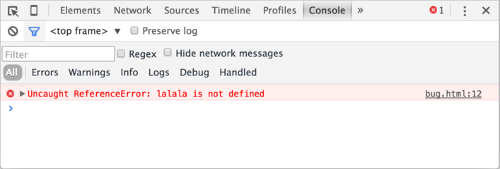

# Консоль разработчика

Код уязвим для ошибок. И вы, скорее всего, будете делать ошибки в коде... Впрочем, давайте будем откровенны: вы *точно* будете совершать ошибки в коде. В конце концов, вы человек, а не [робот](https://ru.wikipedia.org/wiki/%D0%91%D0%B5%D0%BD%D0%B4%D0%B5%D1%80_(%D0%A4%D1%83%D1%82%D1%83%D1%80%D0%B0%D0%BC%D0%B0)).

Но по умолчанию в браузере ошибки не видны. То есть, если что-то пойдёт не так, мы не увидим, что именно сломалось, и не сможем это починить.

Для решения задач такого рода в браузер встроены так называемые "Инструменты разработки" (Developer tools или сокращённо — devtools).

Chrome и Firefox снискали любовь подавляющего большинства программистов во многом благодаря своим отменным инструментам разработчика. Остальные браузеры, хотя и оснащены подобными инструментами, но все же зачастую находятся в роли догоняющих и по качеству, и по количеству свойств и особенностей. В общем, почти у всех программистов есть свой "любимый" браузер. Другие используются только для отлова и исправления специфичных "браузерозависимых" ошибок.

Для начала знакомства с этими мощными инструментами давайте выясним, как их открывать, смотреть ошибки и запускать команды JavaScript.

## Google Chrome

Откройте страницу [bug.html](bug.html).

В её JavaScript-код закралась ошибка. Она не видна обычному посетителю, поэтому давайте найдём её при помощи инструментов разработки.

Нажмите `key:F12` или, если вы используете Mac, `key:Cmd+Opt+J`.

По умолчанию в инструментах разработчика откроется вкладка Console (консоль).

Она выглядит приблизительно следующим образом:



Точный внешний вид инструментов разработки зависит от используемой версии Chrome. Время от времени некоторые детали изменяются, но в целом внешний вид остаётся примерно похожим на предыдущие версии.

- В консоли мы можем увидеть сообщение об ошибке, отрисованное красным цветом. В нашем случае скрипт содержит неизвестную команду "lalala".
- Справа присутствует ссылка на исходный код `bug.html:12` с номером строки кода, в которой эта ошибка и произошла.

Под сообщением об ошибке находится синий символ `>`. Он обозначает командную строку, в ней мы можем редактировать и запускать JavaScript-команды. Для их запуска нажмите `key:Enter`.

```smart header="Многострочный ввод"
Обычно при нажатии `key:Enter` введённая строка кода сразу выполняется.

Чтобы перенести строку, нажмите `key:Shift+Enter`. Так можно вводить более длинный JS-код.
```

Теперь мы явно видим ошибки, для начала этого вполне достаточно. Мы ещё вернёмся к инструментам разработчика позже и более подробно рассмотрим отладку кода в главе <info:debugging-chrome>.


## Firefox, Edge и другие

Инструменты разработчика в большинстве браузеров открываются при нажатии на `key:F12`.

Их внешний вид и принципы работы мало чем отличаются. Разобравшись с инструментами в одном браузере, вы без труда сможете работать с ними и в другом.

## Safari

Safari (браузер для Mac, не поддерживается в системах Windows/Linux) всё же имеет небольшое отличие. Для начала работы нам нужно включить "Меню разработки" ("Developer menu").

Откройте Настройки (Preferences) и перейдите к панели "Продвинутые" (Advanced). В самом низу вы найдёте чекбокс:


Теперь консоль можно активировать нажатием клавиш `key:Cmd+Opt+C`. Также обратите внимание на новый элемент меню "Разработка" ("Develop"). В нем содержится большое количество команд и настроек.

## Итого

- Инструменты разработчика позволяют нам смотреть ошибки, выполнять команды, проверять значение переменных и ещё много всего полезного.
- В большинстве браузеров, работающих под Windows, инструменты разработчика можно открыть, нажав `key:F12`. В Chrome для Mac используйте комбинацию `key:Cmd+Opt+J`, Safari: `key:Cmd+Opt+C` (необходимо предварительное включение "Меню разработчика").

Теперь наше окружение полностью настроено. В следующем разделе мы перейдём непосредственно к JavaScript.
