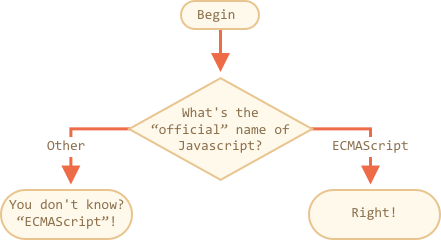

importance: 2

---

# Название JavaScript

Используя конструкцию `if..else`, напишите код, который будет спрашивать: 'Каково "официальное" название JavaScript?'

Если пользователь вводит "ECMAScript", то показать: "Верно!", в противном случае -- отобразить: "Не знаете? ECMAScript!"

[demo src="ifelse_task2"]
