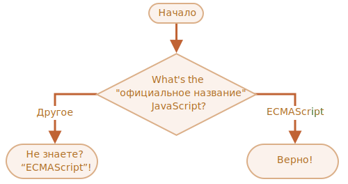

importance: 2

---

# Название JavaScript

Используя конструкцию `if..else`, напишите код, который будет спрашивать: 'Какое "официальное" название JavaScript?'

<<<<<<< HEAD
Если пользователь вводит "ECMAScript", то показать: "Верно!", в противном случае -- отобразить: "Не знаете? ECMAScript!"
=======
If the visitor enters "ECMAScript", then output "Right!", otherwise -- output: "You don't know? ECMAScript!"
>>>>>>> ff804bc19351b72bc5df7766f4b9eb8249a3cb11

[demo src="ifelse_task2"]
