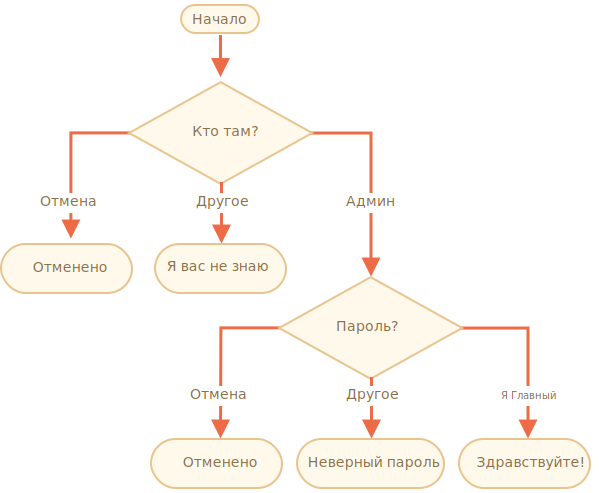

importance: 3

---

# Проверка логина

Напишите код, который будет спрашивать логин с помощью `prompt`.

Если посетитель вводит `"Админ"`, то `prompt` запрашивает пароль. Если ничего не введено или нажата клавиша `key:Esc` – показать "Отменено". В других случаях отобразить "Я вас не знаю".

Пароль проверять так:

- Если введён пароль "Я главный", то выводить "Здравствуйте!",
- Другая строка – "Неверный пароль",
- При пустой строке или отмене – "Отменено".

Блок-схема:

Для решения используйте вложенные блоки `if`. Обращайте внимание на стиль и читаемость кода.

Подсказка: передача пустого ввода в приглашение `prompt` возвращает пустую строку `''`. Нажатие клавиши `key:Esc` во время запроса возвращает `null`.

[demo]
