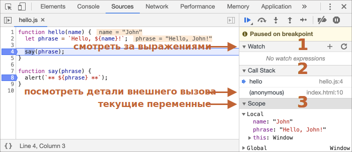

<<<<<<< HEAD
# Отладка в браузере
=======
# Debugging in the browser
>>>>>>> 1dce5b72b16288dad31b7b3febed4f38b7a5cd8a

Давайте отвлечёмся от написания кода и поговорим о его отладке.

[Отладка](https://ru.wikipedia.org/wiki/%D0%9E%D1%82%D0%BB%D0%B0%D0%B4%D0%BA%D0%B0_%D0%BF%D1%80%D0%BE%D0%B3%D1%80%D0%B0%D0%BC%D0%BC%D1%8B) - это процесс поиска и исправления ошибок в скрипте. Все современные браузеры и большинство других сред разработки поддерживают инструменты для отладки - специальный графический интерфейс, который сильно упрощает отладку. Он также позволяет по шагам отследить, что именно происходит в нашем коде.

<<<<<<< HEAD
Мы будем использовать браузер Chrome, так как у него достаточно возможностей, в большинстве других браузеров процесс будет схожим.
=======
We'll be using Chrome here, because it has enough features, most other browsers have a similar process.
>>>>>>> 1dce5b72b16288dad31b7b3febed4f38b7a5cd8a

## Панель "Исходный код" ("Sources")

Версия Chrome, установленная у вас, может выглядеть немного иначе, однако принципиальных отличий не будет.

- Работая в Chrome, откройте [тестовую страницу](debugging/index.html).
- Включите инструменты разработчика, нажав `key:F12` (Mac: `key:Cmd+Opt+I`).
- Щёлкните по панели `Sources` ("исходный код").

При первом запуске получаем следующее:


<<<<<<< HEAD
Кнопка-переключатель <span class="devtools" style="background-position:-172px -98px"></span> откроет вкладку со списком файлов.
=======
The toggler button <span class="devtools" style="background-position:-172px -98px"></span> opens the tab with files.
>>>>>>> 1dce5b72b16288dad31b7b3febed4f38b7a5cd8a

Кликните на неё и выберите `hello.js` в дереве файлов. Вот что появится:


<<<<<<< HEAD
Интерфейс состоит из трёх зон:

1. В зоне **File Navigator** (панель для навигации файлов) показаны файлы HTML, JavaScript, CSS, включая изображения, используемые на странице. Здесь также могут быть файлы различных расширений Chrome.
2. Зона **Code Editor** (редактор кода) показывает исходный код.
3. Наконец, зона **JavaScript Debugging** (панель отладки JavaScript) отведена для отладки, скоро мы к ней вернёмся.

Чтобы скрыть список ресурсов и освободить экранное место для исходного кода, щёлкните по тому же переключателю <span class="devtools" style="background-position:-172px -122px"></span>.
=======
The Sources panel has 3 parts:

1. The **File Navigator** pane lists HTML, JavaScript, CSS and other files, including images that are attached to the page. Chrome extensions may appear here too.
2. The **Code Editor** pane shows the source code.
3. The **JavaScript Debugging** pane is for debugging, we'll explore it soon.

Now you could click the same toggler <span class="devtools" style="background-position:-172px -122px"></span> again to hide the resources list and give the code some space.
>>>>>>> 1dce5b72b16288dad31b7b3febed4f38b7a5cd8a

## Консоль

При нажатии на клавишу `key:Esc` в нижней части экрана вызывается консоль, где можно вводить команды и выполнять их клавишей `key:Enter`.

Результат выполнения инструкций сразу же отображается в консоли.

<<<<<<< HEAD
Например, результатом `1+2` будет `3`, а вызов функции `hello("debugger")` ничего не возвращает, так что результатом будет `undefined`:
=======
For example, here `1+2` results in `3`, while the function call `hello("debugger")` returns nothing, so the result is `undefined`:
>>>>>>> 1dce5b72b16288dad31b7b3febed4f38b7a5cd8a


## Точки останова (breakpoints)

Давайте разберёмся, как работает код нашей [тестовой страницы](debugging/index.html). В файле `hello.js` щёлкните на номере строки `4`. Да-да, щёлкайте именно по самой цифре, не по коду.

Ура! Вы поставили точку останова. А теперь щёлкните по цифре `8` на восьмой линии.

Вот что в итоге должно получиться (синим это те места, по которым вы должны щёлкнуть):


*Точка останова* – это участок кода, где отладчик автоматически приостановит исполнение JavaScript.

Пока исполнение поставлено "на паузу", мы можем просмотреть текущие значения переменных, выполнить команды в консоли, другими словами, выполнить отладку кода.

В правой части графического интерфейса мы видим список точек останова. А когда таких точек выставлено много, да ещё и в разных файлах, этот список поможет эффективно ими управлять:
- Быстро перейдите к точке останова в коде (нажав на неё на правой панели).
- Временно отключите точку останова, сняв с неё галочку.
- Удалите точку останова, щёлкнув правой кнопкой мыши и выбрав Remove (Удалить).
- ...и так далее.

<<<<<<< HEAD
```smart header="Условные точки останова"
*Щелчок правой кнопкой мыши* по номеру строки позволяет создать *условную* точку останова. Она сработает только в тот момент, когда выражение, которое вы должны указать при создании такой точки, истинно.
=======
```smart header="Conditional breakpoints"
*Right click* on the line number allows to create a *conditional* breakpoint. It only triggers when the given expression, that you should provide when you create it, is truthy.
>>>>>>> 1dce5b72b16288dad31b7b3febed4f38b7a5cd8a

Это удобно, когда нам нужно остановиться только при определённом значении переменной или для определённых параметров функции.
```

<<<<<<< HEAD
## Команда debugger
=======
## The command "debugger"
>>>>>>> 1dce5b72b16288dad31b7b3febed4f38b7a5cd8a

Выполнение кода можно также приостановить с помощью команды `debugger` прямо изнутри самого кода:

```js
function hello(name) {
  let phrase = `Привет, ${name}!`;

*!*
  debugger;  // <-- тут отладчик остановится
*/!*

  say(phrase);
}
```

<<<<<<< HEAD
Такая команда сработает только если открыты инструменты разработки, иначе браузер ее проигнорирует.

## Остановимся и оглядимся
=======
Such command works only when the development tools are open, otherwise the browser ignores it.
>>>>>>> 1dce5b72b16288dad31b7b3febed4f38b7a5cd8a

В нашем примере функция `hello()` вызывается во время загрузки страницы, поэтому для начала отладки (после того, как мы поставили точки останова) проще всего её перезагрузить. Нажмите `key:F5` (Windows, Linux) или `key:Cmd+R` (Mac).

Выполнение прервётся на четвёртой строчке (где находится точка останова):



Чтобы понять, что происходит в коде, щёлкните по стрелочкам справа:

1. **`Watch`– показывает текущие значения для любых выражений.**

<<<<<<< HEAD
    Вы можете нажать на `+` и ввести выражение. Отладчик покажет его значение, автоматически пересчитывая его в процессе выполнения.
=======
    You can click the plus `+` and input an expression. The debugger will show its value, automatically recalculating it in the process of execution.
>>>>>>> 1dce5b72b16288dad31b7b3febed4f38b7a5cd8a

2. **`Call Stack` – показывает цепочку вложенных вызовов.**

    В текущий момент отладчик находится внутри вызова `hello()`, вызываемого скриптом в `index.html` (там нет функции, поэтому она называется “анонимной”).

    Если вы нажмёте на элемент стека (например, "anonymous"), отладчик перейдёт к соответствующему коду, и нам представляется возможность его проанализировать.

3. **`Scope` показывает текущие переменные.**

    `Local` показывает локальные переменные функций, а их значения подсвечены прямо в исходном коде.

    В `Global` перечисляются глобальные переменные (то есть вне каких-либо функций).

    Там также есть ключевое слово `this`, которое мы ещё не изучали, но скоро изучим.

## Пошаговое выполнение скрипта

<<<<<<< HEAD
А теперь давайте *пошагаем* по нашему скрипту.

Для этого есть кнопки в верхней части правой панели. Давайте рассмотрим их.
<!-- https://github.com/ChromeDevTools/devtools-frontend/blob/master/front_end/Images/src/largeIcons.svg -->
<span class="devtools" style="background-position:-146px -168px"></span> – "Resume": продолжить выполнение, быстрая клавиша `key:F8`.
: Возобновляет выполнение кода. Если больше нет точек останова, то выполнение просто продолжается, без контроля отладчиком.
=======
There are buttons for it at the top of the right panel. Let's engage them.
<!-- https://github.com/ChromeDevTools/devtools-frontend/blob/master/front_end/Images/src/largeIcons.svg -->
<span class="devtools" style="background-position:-146px -168px"></span> -- "Resume": continue the execution, hotkey `key:F8`.
: Resumes the execution. If there are no additional breakpoints, then the execution just continues and the debugger loses control.
>>>>>>> 1dce5b72b16288dad31b7b3febed4f38b7a5cd8a

    Вот, что мы увидим, кликнув на неё:

    

    Выполнение кода возобновилось, дошло до другой точки останова внутри `say()`, и отладчик снова приостановил выполнение. Обратите внимание на пункт "Call stack" справа: в списке появился ещё один вызов. Сейчас мы внутри `say()`.

<<<<<<< HEAD
<span class="devtools" style="background-position:-200px -190px"></span> – "Step": выполнить следующую команду, быстрая клавиша `key:F9`.
: Выполняет следующую инструкцию. Если мы нажмём на неё сейчас, появится `alert`.

    Нажатие на эту кнопку снова и снова приведёт к пошаговому выполнению всех инструкций скрипта одного за другим.

<span class="devtools" style="background-position:-62px -192px"></span> – "Step over": выполнить следующую команду, но *не заходя внутрь функции*, быстрая клавиша `key:F10`.
: Работает аналогично предыдущей команде "Step", но ведёт себя по-другому, если следующая инструкция является вызовом функции (имеется ввиду: не встроенная, как `alert`, а объявленная нами функция).

    Если сравнить, то команда "Step" переходит во вложенный вызов функцию и приостанавливает выполнение в первой строке, в то время как "Step over" выполняет вызов вложенной функции незаметно для нас, пропуская её внутренний код.

    Затем выполнение приостанавливается сразу после вызова функции.

    Это хорошо, если нам не интересно видеть, что происходит внутри вызова функции.

<span class="devtools" style="background-position:-4px -194px"></span> – "Step into", быстрая клавиша `key:F11`.
: Это похоже на "Step", но ведёт себя по-другому в случае асинхронных вызовов функций. Если вы только начинаете изучать JavaScript, то можете не обращать внимания на разницу, так как у нас ещё нет асинхронных вызовов.

    На будущее просто помните, что команда "Step" игнорирует асинхронные действия, такие как `setTimeout` (вызов функции по расписанию), которые выполняются позже. "Step into" входит в их код, ожидая их, если это необходимо. См. [DevTools manual](https://developers.google.com/web/updates/2018/01/devtools#async) для получения более подробной информации.

<span class="devtools" style="background-position:-32px -194px"></span> – "Step out": продолжить выполнение до завершения текущей функции, быстрая клавиша `key:Shift+F11`.
: Продолжает выполнение и останавливает его в самой последней строке текущей функции. Это удобно, когда мы случайно вошли во вложенный вызов, используя <span class="devtools" style="background-position:-200px -190px"></span>, но это нас не интересует, и мы хотим продолжить его до конца как можно скорее.

<span class="devtools" style="background-position:-61px -74px"></span> – активировать/деактивировать все точки останова(breakpoints).
: Эта кнопка не влияет на выполнение кода, она лишь позволяет массово включить/отключить точки останова.

<span class="devtools" style="background-position:-90px -146px"></span> – включить/отключить автоматическую паузу в случае ошибки.
: При включении, если открыты инструменты разработчика, ошибка при выполнении скрипта автоматически приостанавливает его. Затем мы можем проанализировать переменные в отладчике, чтобы понять, что пошло не так. Поэтому, если наш скрипт умирает с ошибкой, мы можем открыть отладчик, включить эту опцию и перезагрузить страницу, чтобы увидеть, где он умирает и каков контекст в этот момент.
=======
<span class="devtools" style="background-position:-200px -190px"></span> -- "Step": run the next command, hotkey `key:F9`.
: Run the next statement. If we click it now, `alert` will be shown.

    Clicking this again and again will step through all script statements one by one.

<span class="devtools" style="background-position:-62px -192px"></span> -- "Step over": run the next command, but *don't go into a function*, hotkey `key:F10`.
: Similar to the previous "Step" command, but behaves differently if the next statement is a function call (not a built-in, like `alert`, but a function of our own).

    If we compare them, the "Step" command goes into a nested function call and pauses the execution at its first line, while "Step over" executes the nested function call invisibly to us, skipping the function internals.

    The execution is then paused immediately after that function call.

    That's good if we're not interested to see what happens inside the function call.

<span class="devtools" style="background-position:-4px -194px"></span> -- "Step into", hotkey `key:F11`.
: That's similar to "Step", but behaves differently in case of asynchronous function calls. If you're only starting to learn JavaScript, then you can ignore the difference, as we don't have asynchronous calls yet.

    For the future, just note that "Step" command ignores async actions, such as `setTimeout` (scheduled function call), that execute later. The "Step into" goes into their code, waiting for them if necessary. See [DevTools manual](https://developers.google.com/web/updates/2018/01/devtools#async) for more details.

<span class="devtools" style="background-position:-32px -194px"></span> -- "Step out": continue the execution till the end of the current function, hotkey `key:Shift+F11`.
: Continue the execution and stop it at the very last line of the current function. That's handy when we accidentally entered a nested call using <span class="devtools" style="background-position:-200px -190px"></span>, but it does not interest us, and we want to continue to its end as soon as possible.

<span class="devtools" style="background-position:-61px -74px"></span> -- enable/disable all breakpoints.
: That button does not move the execution. Just a mass on/off for breakpoints.

<span class="devtools" style="background-position:-90px -146px"></span> -- enable/disable automatic pause in case of an error.
: When enabled, if the developer tools is open, an error during the script execution automatically pauses it. Then we can analyze variables in the debugger to see what went wrong. So if our script dies with an error, we can open debugger, enable this option and reload the page to see where it dies and what's the context at that moment.
>>>>>>> 1dce5b72b16288dad31b7b3febed4f38b7a5cd8a

```smart header="Continue to here"
Щелчок правой кнопкой мыши по строке кода открывает контекстное меню с отличной опцией под названием "Continue to here" ("продолжить до этого места").

Это удобно, когда мы хотим перейти на несколько шагов вперёд к строке, но лень устанавливать точку останова (breakpoint).
```

## Логирование

Чтобы вывести что-то на консоль из нашего кода, существует функция `console.log`.

Например, это выводит в консоль значения от `0` до `4`:

```js run
// чтобы увидеть результат, сначала откройте консоль
for (let i = 0; i < 5; i++) {
  console.log("value,", i);
}
```

Обычный пользователь сайта не увидит такой вывод, так как он в консоли. Чтобы увидеть его, либо откройте консольную панель инструментов разработчика, либо нажмите `key:Esc`, находясь в другой панели: это откроет консоль внизу.

Если правильно выстроить логирование в приложении, то можно и без отладчика разобраться, что происходит в коде.

## Итого

<<<<<<< HEAD
Приостановить выполнение скрипта можно тремя способами:

1. Точками останова (breakpoints).
2. Использованием в коде команд `debugger`.
3. При ошибке (если инструменты разработчика открыты и кнопка <span class="devtools" style="background-position:-90px -146px"></span> "включена").
=======
As we can see, there are three main ways to pause a script:
1. A breakpoint.
2. The `debugger` statements.
3. An error (if dev tools are open and the button <span class="devtools" style="background-position:-90px -146px"></span> is "on").

When paused, we can debug: examine variables and trace the code to see where the execution goes wrong.
>>>>>>> 1dce5b72b16288dad31b7b3febed4f38b7a5cd8a

При остановке мы можем отлаживать: анализировать переменные и пошагово пройти по процессу, чтобы отыскать проблему.

В инструментах разработчика гораздо больше опций, чем описано здесь. С полным руководством можно ознакомиться на <https://developers.google.com/web/tools/chrome-devtools>.

Информации из этой главы достаточно, чтобы начать отладку, но позже, особенно если вы много работаете с браузером, пожалуйста, перейдите туда и ознакомьтесь с расширенными возможностями инструментов разработчика.

И, конечно, вы можете просто кликать по различным местам инструментов разработки и  смотреть, что при этом появляется. Пожалуй, это наискорейший способ ими овладеть. Не забывайте про правый клик мыши и контекстные меню!
