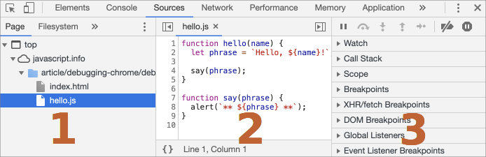
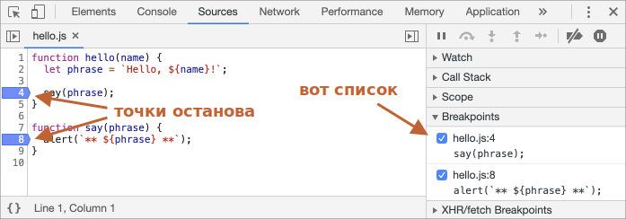
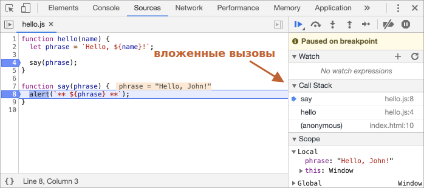

# Отладка в браузере Chrome

Давайте отвлечёмся от написания кода и поговорим о его отладке.

[Отладка](https://ru.wikipedia.org/wiki/%D0%9E%D1%82%D0%BB%D0%B0%D0%B4%D0%BA%D0%B0_%D0%BF%D1%80%D0%BE%D0%B3%D1%80%D0%B0%D0%BC%D0%BC%D1%8B) - это процесс поиска и исправления ошибок в скрипте. Все современные браузеры и большинство других сред разработки поддерживают инструменты для отладки - специальный графический интерфейс, который сильно упрощает отладку. Он также позволяет по шагам отследить, что именно происходит в нашем коде.

Мы будем использовать браузер Chrome, так как у него достаточно возможностей, в большинстве других браузеров процесс будет схожим.

## Панель "Исходный код" ("Sources")

Версия Chrome, установленная у вас, может выглядеть немного иначе, однако принципиальных отличий не будет.

- Работая в Chrome, откройте [тестовую страницу](debugging/index.html).
- Включите инструменты разработчика, нажав `key:F12` (Mac: `key:Cmd+Opt+I`).
- Щёлкните по панели `Sources` ("исходный код").

При первом запуске получаем следующее:


Кнопка-переключатель <span class="devtools" style="background-position:-168px -76px"></span> откроет вкладку со списком файлов.

Кликните на неё и выберите `hello.js`. Вот что появится:



Интерфейс состоит из трёх зон:

1. В зоне **File Navigator** pane (панель для навигации файлов) показаны файлы HTML, JavaScript, CSS, включая изображения, используемые на странице. Здесь также могут быть файлы различных расширений Chrome.
2. Зона **Code Editor** pane показывает исходный код.
3. Наконец, зона **JavaScript Debugging** pane (панель отладки JavaScript) отведена для отладки, скоро мы к ней вернёмся.

Чтобы скрыть список ресурсов и освободить экранное место для исходного кода, щёлкните по тому же переключателю <span class="devtools" style="background-position:-200px -76px"></span>.

## Консоль

При нажатии на клавишу `key:Esc` в нижней части экрана вызывается консоль, где можно вводить команды и выполнять их клавишей `key:Enter`.

Результат выполнения инструкций сразу же отображается в консоли.

Например, результатом `1+2` будет `3`, а инструкция `hello("debugger")` ничего не возвращает, так что получаем `undefined`:


## Точки останова (breakpoints)

Давайте разберёмся, как работает код нашей [тестовой страницы](debugging/index.html). В файле `hello.js` щёлкните по строчке номер `4`. Да, щёлкайте именно по самой цифре, не по коду.

Ура! Вы поставили точку останова. А теперь щёлкните по цифре `8` на восьмой линии.

Вот что в итоге должно получиться (синим это те места, по которым вы должны щелкнуть):



*Точка останова* – это участок кода, где отладчик автоматически приостановит исполнение JavaScript.

Пока исполнение поставлено "на паузу", мы можем просмотреть текущие значения переменных, выполнить команды в консоли, другими словами, выполнить отладку кода.

В правой части графического интерфейса мы видим список точек останова. А когда таких точек выставлено много, да ещё и в разных файлах, этот список поможет эффективно ими управлять:
- Быстро перейдите к точке останова в коде (нажав на нее на правой панели).
- Временно отключите точку останова, сняв с нее галочку.
- Удалите точку останова, щелкнув правой кнопкой мыши и выбрав Remove (Удалить).
- ...и так далее.

```smart header="Условные точки останова"
*Щелчок правой кнопкой мыши* по номеру строки позволяет создать *условную* точку останова. Она сработает только в тот момент, когда вы задали выражение, и если оно истинно, то выполнение кода будет приостановлено.

Это удобно, когда нам нужно остановиться только для определенного значения переменной или для определенных параметров функции.
```

## Команда Debugger

Выполнение кода можно также приостановить с помощью команды `debugger` прямо изнутри самого кода:

```js
function hello(name) {
  let phrase = `Привет, ${name}!`;

*!*
  debugger;  // <-- тут отладчик остановится
*/!*

  say(phrase);
}
```

Это очень удобно, когда мы находимся в редакторе кода и не хотим переключаться на браузер и просматривать скрипт в инструментах разработчика, чтобы установить точку останова.


## Остановимся и оглядимся

В нашем примере функция `hello()` вызывается во время загрузки страницы, поэтому для начала отладки (после того, как мы поставили точки останова) проще всего её перезагрузить. Нажмите `key:F5` (Windows, Linux) или `key:Cmd+R` (Mac).

Выполнение прервётся на четвёртой строчке:


Чтобы понять, что происходит в коде, щёлкните по стрелочкам справа:

1. **`Watch`– показывает текущие значения для любых выражений.**

    Вы можете нажать на `+` и ввести выражение. Отладчик покажет его значение в любой момент, автоматически пересчитав его в процессе выполнения.

2. **`Call Stack` – показывает цепочку вложенных вызовов.**
  
    В текущий момент отладчик находится внутри вызова `hello()`, вызываемого скриптом в `index.html` (там нет функции, поэтому она называется “анонимной”).

    Если вы нажмете на элемент стека (например, "anonymous"), отладчик перейдет к соответствующему коду, и нам представляется возможность его проанализировать.

3. **`Scope` показывает текущие переменные.**

    `Local` показывает локальные переменные функций, а их значения подсвечены прямо в исходном коде.

    В `Global` перечисляются глобальные переменные (то есть вне каких-либо функций).

    Там также есть ключевое слово `this`, которое мы еще не изучали, но скоро сделаем это.

## Пошаговое выполнение скрипта

А теперь давайте *пошагаем* по нашему скрипту.

Для этого есть кнопки в верхней части правой панели. Давайте рассмотрим их.
<!-- https://github.com/ChromeDevTools/devtools-frontend/blob/master/front_end/Images/src/largeIcons.svg -->
<span class="devtools" style="background-position:-7px -76px"></span> – "Resume": продолжить выполнение, быстрая клавиша `key:F8`.
: Возобновляет выполнение кода. Если больше нет точек останова, отладчик прекращает работу и выполнение просто продолжается.

    Вот, что мы увидим, кликнув на неё:

    

    Выполнение кода возобновилось, дошло до другой точки останова внутри `say()`, и отладчик снова приостановил выполнение. Обратите внимание на пункт "Call stack" справа: в списке появился ещё один вызов. Сейчас мы внутри `say()`.
    
<span class="devtools" style="background-position:-200px -190px"></span> – "Step": выполнить следующую команду, быстрая клавиша `key:F9`.
: Выполняет следующую инструкцию. Если мы нажмем на нее сейчас, появится `alert`.

    Нажатие на эту кнопку снова и снова приведет к пошаговому выполнению всех инструкций скрипта одного за другим.

<span class="devtools" style="background-position:-137px -76px"></span> – "Step over": выполнить следующую команду, но *не заходя в функцию*, быстрая клавиша `key:F10`.
: Подобно предыдущей команде "Step", но ведет себя по-другому, если следующая инкструкция является вызовом функции. То есть имеется ввиду: не встроенная, как `alert`, а наша собственная функция.

    Команда "Step" переходит в неё и приостанавливает выполнение в первой строке, в то время как "Step over" незаметно выполняет вызов вложенной функции, пропуская внутренности функции.

    Затем выполнение приостанавливается сразу после этой функции.

    Это хорошо, если у нас нет цели видеть, что происходит внутри вызова функции.

<span class="devtools" style="background-position:-72px -76px"></span> – "Step into", быстрая клавиша `key:F11`.
: Это похоже на "Step", но ведет себя по-другому в случае асинхронных вызовов функций. Если вы только начинаете изучать JavaScript, то можете не обращать внимания на разницу, так как у нас еще нет асинхронных вызовов.

    На будущее просто помните, что команда "Step" игнорирует асинхронные действия, такие как `setTimeout` (вызов функции по расписанию), которые выполняются позже. "Step into" входит в их код, ожидая их, если это необходимо. См. [DevTools manual](https://developers.google.com/web/updates/2018/01/devtools#async) для получения более подробной информации.

<span class="devtools" style="background-position:-104px -76px"></span> – "Step out": продолжить выполнение до завершения текущей функции, быстрая клавиша `key:Shift+F11`.
: Продолжает выполнение и останавливает его в самой последней строке текущей функции. Это удобно, когда мы случайно вошли во вложенный вызов, используя <span class="devtools" style="background-position:-200px -190px"></span>, но это нас не интересует, и мы хотим продолжить его до конца как можно скорее.

<span class="devtools" style="background-position:-7px -28px"></span> – активировать/деактивировать все точки останова(breakpoints).
: Эта кнопка не влияет на выполнение кода, она лишь позволяет массово включить/отключить точки останова.

<span class="devtools" style="background-position:-264px -4px"></span> – включить/отключить автоматическую паузу в случае ошибки.
: При включении и открытии инструментов разработчика ошибка скрипта автоматически приостанавливает выполнение. Затем мы можем проанализировать переменные, чтобы понять, что пошло не так. Поэтому, если наш скрипт умирает с ошибкой, мы можем открыть debugger, включить эту опцию и перезагрузить страницу, чтобы увидеть, где он умирает и каков контекст в этот момент.

```smart header="Continue to here"
Щелчок правой кнопкой мыши по строке кода открывает контекстное меню с отличной опцией под названием "Continue to here" ("продолжить до этого места").

Это удобно, когда мы хотим перейти на несколько шагов вперед к строке, но нам слишком лень устанавливать точку останова(breakpoint).
```

## Логирование

Чтобы вывести что-то на консоль из нашего кода, существует функция `console.log`.

Например, это выводит в консоль значения от `0` до `4`:

```js run
// чтобы увидеть результат, сначала откройте консоль
for (let i = 0; i < 5; i++) {
  console.log("value,", i);
}
```

Обычный пользователь сайта не увидит такой вывод, так как он в консоли. Чтобы увидеть это, либо откройте консольную панель инструментов разработчика, либо нажмите `key:Esc`, находясь в другой панели: это откроет консоль внизу.

Если правильно выстроить логирование в приложении, то можно и без отладчика разобраться, что происходит в коде.

## Итого

Приостановить выполнение скрипта можно тремя способами:

1. Точками останова (breakpoint).
2. Использованием в коде команд `debugger`.
3. При ошибке (если инструменты разработчика открыты и опция <span class="devtools" style="background-position:-264px -4px"></span> включена).

При остановке мы можем отлаживать - проанализировать переменные и пошагово пройти по процессу, что поможет отыскать проблему.

В инструментах разработчика гораздо больше опций, чем описано здесь. С полным руководством можно ознакомиться здесь: <https://developers.google.com/web/tools/chrome-devtools>.

Информации из этой главы достаточно, чтобы начать отладку, но позже, особенно если вы много работаете с браузером, пожалуйста, перейдите туда и ознакомьтесь с более расширенными возможностями инструментов разработчика.

И, конечно, вы можете щёлкнуть по различным местам инструментов разработки и просто посмотреть, что появляется. Пожалуй, это наискорейший способ ими овладеть. Не забывайте про правый клик мыши и контекстные меню!
