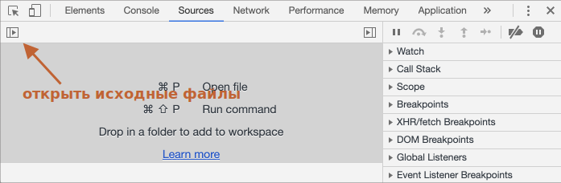

# Отладка в браузере Chrome

Давайте отвлечёмся от написания кода и поговорим о его отладке.

[Отладка](https://ru.wikipedia.org/wiki/%D0%9E%D1%82%D0%BB%D0%B0%D0%B4%D0%BA%D0%B0_%D0%BF%D1%80%D0%BE%D0%B3%D1%80%D0%B0%D0%BC%D0%BC%D1%8B) - это процесс поиска и исправления ошибок в скрипте. Все современные браузеры и большинство других сред разработки поддерживают инструменты для отладки - специальный графический интерфейс, который сильно упрощает отладку. Он также позволяет по шагам отследить, что именно происходит в нашем коде.

Мы будем использовать браузер Chrome, так как у него достаточно возможностей, в большинстве других браузеров процесс будет схожим.

## Панель "Исходный код" ("Sources")

Версия Chrome, установленная у вас, может выглядеть немного иначе, однако принципиальных отличий не будет.

- Работая в Chrome, откройте [тестовую страницу](debugging/index.html).
- Включите инструменты разработчика, нажав `key:F12` (Mac: `key:Cmd+Opt+I`).
- Щёлкните по панели `sources` ("исходный код").

При первом запуске получаем следующее:



Кнопка-переключатель <span class="devtools" style="background-position:-168px -76px"></span> откроет вкладку со списком файлов.

Кликните на неё и выберите `hello.js`. Вот что появится:


Интерфейс состоит из трёх зон:

1. В зоне **Resources** (Ресурсы) показаны файлы HTML, JavaScript, CSS, включая изображения, используемые на странице. Здесь также могут быть файлы различных расширений Chrome.
2. Зона **Source** показывает исходный код.
3. Наконец, зона **Information and control** (Сведения и контроль) отведена для отладки, вскоре мы к ней вернёмся.

Чтобы скрыть список ресурсов и освободить экранное место для исходного кода, щёлкните по тому же переключателю <span class="devtools" style="background-position:-200px -76px"></span>.

## Консоль

При нажатии на клавишу `key:Esc` в нижней части экрана вызывается консоль, где можно вводить команды и выполнять их клавишей `key:Enter`.

Результат выполнения инструкций сразу же отображается в консоли.

Например, результатом `1+2` будет `3`, а инструкция `hello("debugger")` ничего не возвращает, так что получаем `undefined`:


## Точки останова (breakpoints)

Давайте разберёмся, как работает код нашей [тестовой страницы](debugging/index.html). В файле `hello.js` щёлкните по строчке номер `4`. Да, щёлкайте именно по самой цифре, не по коду.

Ура! Вы поставили точку останова. А теперь щёлкните по цифре `8` на восьмой линии. Номер строки будет окрашен в синий цвет.

Вот что в итоге должно получиться:


*Точка останова* – это участок кода, где отладчик автоматически приостановит исполнение JavaScript.

Пока исполнение поставлено "на паузу", мы можем просмотреть текущие значения переменных, выполнить команды в консоли, одним словом, мы выполняем отладку кода.

В правой части графического интерфейса мы видим список точек останова. А когда таких точек выставлено много, да ещё и в разных файлах, этот список поможет эффективно ими управлять:
- Быстро переместиться к любой точке останова в коде – нужно щёлкнуть по точке в правой части экрана.
- Временно деактивировать точку – в общем списке снимите галочку напротив ненужной в данный момент точки.
- Удалить точку – щёлкните по ней правой кнопкой мыши и выберите Remove (Удалить).
- ...и так далее.

```smart header="Условные точки останова"
Можно задать и так называемую *условную* точку останова – щёлкните правой кнопкой мыши по номеру строки в коде. Если задать выражение, то именно при его истинности выполнение кода будет приостановлено.

Этот метод используется, когда выполнение кода нужно остановить при присвоении определённого выражения какой-либо переменной или при определённых параметрах функции.

```

## Команда Debugger

Выполнение кода можно также приостановить с помощью команды `debugger` прямо изнутри самого кода:

```js
function hello(name) {
  let phrase = `Привет, ${name}!`;

*!*
  debugger;  // <-- здесь выполнение прерывается
*/!*

  say(phrase);
}
```

Способ удобен тем, что можно продолжить работать в редакторе кода без необходимости переключения в браузер для выставления точки останова.


## Остановимся и оглядимся

В нашем примере функция `hello()` вызывается во время загрузки страницы, поэтому для начала отладки (после того, как мы поставили точки останова) проще всего её перезагрузить. Нажмите `key:F5` (Windows, Linux) или `key:Cmd+R` (Mac).

Выполнение прервётся на четвёртой строчке:


Чтобы понять, что происходит в коде, щёлкните по стрелочкам справа:

1. **`Watch` показывает текущие значения выражений.**

    Нажмите на `+` и введите выражение. В процессе выполнения отладчик автоматически пересчитывает и выводит его значение.

2. **`Call Stack` показывает последовательность вызовов функций.**

    В нашем примере отладчик работает с функцией `hello()`, вызванной скриптом из файла `index.html` (там нет функции, поэтому вызов "анонимный").

    При нажатии на элемент списка (например, на "anonymous") отладчик переходит к соответствующему коду, и нам представляется возможность его проанализировать.

3. **`Scope` показывает текущие переменные.**

    В `Local` отображаются локальные переменные функций, а их значения подсвечены в исходном коде.

    В `Global` перечисляются глобальные переменные (т.е. объявленные за пределами функций).

    Не обращайте пока внимание на ключевое слово `this` – его мы изучим чуть позже.

## Пошаговое выполнение скрипта

А теперь давайте *пошагаем* по нашему коду.

В правой части панели для этого есть несколько кнопок. Рассмотрим их.

<span class="devtools" style="background-position:-7px -76px"></span> – продолжить выполнение. Быстрая клавиша – `key:F8`.
: Возобновляет выполнение кода. Если больше нет точек останова, отладчик прекращает работу и позволяет приложению работать дальше.

    Вот, что мы увидим, кликнув на неё:

    

    Выполнение кода возобновилось, дошло до другой точки останова внутри `say()`, и отладчик снова приостановил выполнение. Обратите внимание на пункт "Call stack" справа: в списке появился ещё один вызов. Мы теперь внутри функции `say()`.

<span class="devtools" style="background-position:-137px -76px"></span> – сделать шаг (выполнить следующую команду), *не заходя в функцию*. Быстрая клавиша – `key:F10`.
: Если мы нажмём на неё - будет вызван `alert`. Важно: на месте `alert` может быть любая другая функция, выполнение просто *перешагнёт через неё*, полностью игнорируя её содержимое.

<span class="devtools" style="background-position:-72px -76px"></span> – сделать шаг. Быстрая клавиша – `key:F11`.
: В отличие от предыдущего примера, здесь мы "заходим" во вложенные функции и шаг за шагом проходим по скрипту.

<span class="devtools" style="background-position:-104px -76px"></span> – продолжить выполнение до завершения текущей функции. Быстрая клавиша – `key:Shift+F11`.
: Выполнение кода остановится на самой последней строчке текущей функции. Этот метод применяется, когда мы случайно нажали <span class="devtools" style="background-position:-72px -76px"></span> и зашли в функцию, но нам она неинтересна и мы как можно скорее хотим из неё выбраться.

<span class="devtools" style="background-position:-7px -28px"></span> – активировать/деактивировать все точки останова.
: Эта кнопка не влияет на выполнение кода, она лишь позволяет массово включить/отключить точки останова.

<span class="devtools" style="background-position:-264px -4px"></span> – разрешить/запретить остановку выполнения в случае возникновения ошибки.
: Если опция включена и инструменты разработчика открыты, любая ошибка в скрипте приостанавливает выполнение кода, что позволяет его проанализировать. Поэтому если скрипт завершается с ошибкой, открываем отладчик, включаем эту опцию, перезагружаем страницу и локализуем проблему.

```smart header="Continue to here"
Если щёлкнуть правой кнопкой мыши по строчке кода, в контекстном меню можно выбрать опцию "Continue to here" ("продолжить до этого места").

Этот метод используется, когда нам нужно продвинуться на несколько шагов вперёд до нужной строки, но лень выставлять точки останова.
```

## Логирование

Если нужно что-то вывести в консоль из кода, применяется функция `console.log`.

К примеру, выведем в консоль значения от нуля до четырёх:

```js run
// чтобы увидеть результат, сначала откройте консоль
for (let i = 0; i < 5; i++) {
  console.log("value,", i);
}
```

Обычный пользователь сайта не увидит такой вывод, так как он в консоли. Напомним, что консоль можно открыть через инструменты разработчика – выберите вкладку "Консоль" или нажмите `key:Esc`, находясь в другой вкладке – консоль откроется в нижней части интерфейса.

Если правильно выстроить логирование в приложении, то можно и без отладчика разобраться, что происходит в коде.

## Итого

Приостановить выполнение скрипта можно тремя способами:

1. Точками останова.
2. Использованием в коде команды `debugger`.
3. При ошибке (если инструменты разработчика открыты и опция <span class="devtools" style="background-position:-264px -4px"></span> включена).

При остановке мы можем отлаживать - проанализировать переменные и пошагово пройти по процессу, что поможет отыскать проблему.

Нами описаны далеко не все инструменты разработчика. С полным руководством можно ознакомиться здесь: <https://developers.google.com/web/tools/chrome-devtools>.

Для простой отладки вполне достаточно сведений из этой главы, но в дальнейшем рекомендуем вам изучить официальное руководство, если вы собираетесь разрабатывать для браузеров.

И, конечно, вы можете просто покликать в разных местах инструментов разработчика. Пожалуй, это наискорейший способ ими овладеть. Не забывайте про правый клик мыши и контекстные меню!
