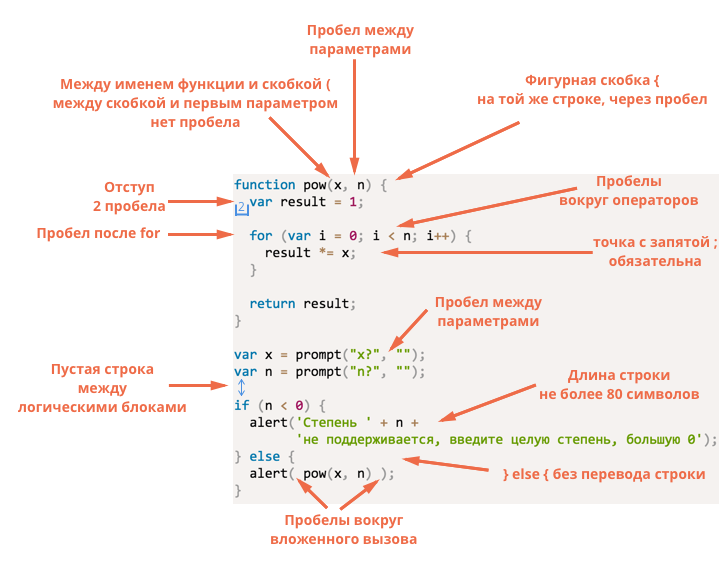
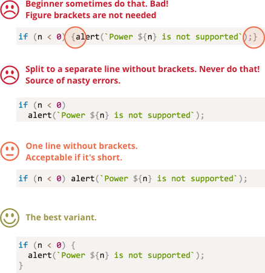

# Советы по стилю кода

Код должен быть максимально читаемым и понятным.

Это и есть искусство программирования - взять сложную задачу и написать ее так, чтобы она была правильной и удобочитаемой. Для этого нужен _хороший стиль_ написания кода. В этой главе мы рассмотрим компоненты такого стиля.

## Синтаксис

Шпаргалка с правилами синтаксиса (детально их варианты разобраны далее):


<!--
```js
function pow(x, n) {
  let result = 1;

  for (let i = 0; i < n; i++) {
    result *= x;
  }

  return result;
}

let x = prompt("x?", "");
let n = prompt("n?", "");

if (n < 0) {
  alert(`Степень ${n} не поддерживается,
   введите целую степень, большую 0`);
} else {
  alert( pow(x, n) );
}
```

-->

Не всё здесь однозначно, так что разберём эти правила подробнее.

```warn header="Ирония"
Здесь нет чего-либо высеченного на камне. Это стилевые предпочтения, а не религиозные догмы.
```

### Фигурные скобки

В большинстве JavaScript проектов фигурные скобки пишутся в так называемом "египетском" стиле с открывающей скобкой в той же строке, что и соответствующее ключевое слово - не в новой строке. Перед открывающей скобкой должен быть пробел, как здесь:

```js
if (condition) {
  // делай это
  // ...и это
  // ...и потом это
}
```

Однострочная конструкция - важный крайний случай. Должны ли мы использовать скобки вообще? Если да, то где?

Ниже приведены аннотированные варианты, чтобы вы могли оценить их читаемость самостоятельно:

<!--
```js no-beautify
if (n < 0) {alert(`Степень ${n} не поддерживается`);}

if (n < 0) alert(`Степень ${n} не поддерживается`);

if (n < 0)
  alert(`Степень ${n} не поддерживается`);

if (n < 0) {
  alert(`Степень ${n} не поддерживается`);
}
```
-->


В итоге:
- Для очень короткого кода допустима одна строка. Например: `if (cond) return null`.
- Но отдельная строка для каждого оператора в скобках обычно легче для восприятия.

### Длина строки

Никто не любит читать длинные горизонтальные строки кода. Лучше всего разбить их на части и ограничить длину строк.

Максимальную длину строки согласовывают в команде. Обычно это `80` или `120` символов.

### Отступы

Существует два типа отступов:

- **Горизонтальные отступы, при вложенности – два (или четыре) пробела.**

    Горизонтальный отступ выполняется с помощью 2 или 4 пробелов, или символа "Tab". Какой из них выбрать - это уже старый холивар. Пробелы более распространены в наши дни.

    Одним из преимуществ пробелов над тамбуляцией заключается в том, что пробелы допускают более гибкие конфигурации отступов, чем символ "Tab".

    Например, мы можем выровнять аргументы относительно открывающей скобки:

    ```js no-beautify
    show(parameters,
         aligned, // 5 пробелов слева  
         one,
         after,
         another
      ) {
      // ...
    }
    ```

- **Вертикальные отступы, для лучшей разбивки кода – перевод строки**

    Даже одну функцию часто можно разделить на логические блоки. В примере ниже разделены инициализация переменных, основной цикл и возвращаемый результат:

    ```js
    function pow(x, n) {
      let result = 1;
      //              <--
      for (let i = 0; i < n; i++) {
        result *= x;
      }
      //              <--
      return result;
    }
    ```

    Вставляйте дополнительный перевод строки туда, где это сделает код более читаемым. Не должно быть более 9 строк кода подряд без вертикального отступа.

### Точка с запятой

Точки с запятой должны присутствовать после каждого утверждения, даже если их, казалось бы, можно пропустить.

Есть языки, в которых точка с запятой необязательна и редко используется. Однако в JavaScript бывают случаи, когда перенос строки не интерпретируется как точка с запятой, что делает код уязвимым для ошибок.

Когда вы станете более зрелым программистом, вы можете выбрать стиль без точки с запятой, такой как в [StandardJS](https://standardjs.com/). До тех пор лучше использовать точку с запятой, чтобы избежать возможных подводных камней.

### Уровни вложенности

Уровней вложенности должно быть немного.

Иногда полезно использовать директиву ["continue"](info:while-for#continue) в цикле, чтобы избежать лишней вложенности.

Например, вместо добавления вложенного условия `if`, как это:

```js
for (let i = 0; i < 10; i++) {
  if (подходит) {
    ... // <- еще один уровень вложенности
  }
}
```

Используйте:

```js
for (let i = 0; i < 10; i++) {
  if (*!* !не*/!* подходит) *!*continue*/!*;
  ...  // <- нет лишнего уровня вложенности
}
```

A similar thing can be done with `if/else` and `return`.

For example, two constructs below are identical.

Option 1:

```js
function pow(x, n) {
  if (n < 0) {
    alert("Negative 'n' not supported");
  } else {
    let result = 1;

    for (let i = 0; i < n; i++) {
      result *= x;
    }

    return result;
  }  
}
```

Option 2:

```js
function pow(x, n) {
  if (n < 0) {
    alert("Negative 'n' not supported");
    return;
  }

  let result = 1;

  for (let i = 0; i < n; i++) {
    result *= x;
  }

  return result;
}
```

The second one is more readable because the "edge case" of `n < 0` is handled early on. Once the check is done we can move on to the "main" code flow without the need for additional nesting.

## Function Placement

If you are writing several "helper" functions and the code that uses them, there are three ways to organize the functions.

1. Functions declared above the code that uses them:

    ```js
    // *!*function declarations*/!*
    function createElement() {
      ...
    }

    function setHandler(elem) {
      ...
    }

    function walkAround() {
      ...
    }

    // *!*the code which uses them*/!*
    let elem = createElement();
    setHandler(elem);
    walkAround();
    ```
2. Code first, then functions

    ```js
    // *!*the code which uses the functions*/!*
    let elem = createElement();
    setHandler(elem);
    walkAround();

    // --- *!*helper functions*/!* ---
    function createElement() {
      ...
    }

    function setHandler(elem) {
      ...
    }

    function walkAround() {
      ...
    }
    ```
3. Mixed: a function is declared where it's first used.

Most of time, the second variant is preferred.

That's because when reading code, we first want to know *what it does*. If the code goes first, then it provides that information. Then, maybe we won't need to read the functions at all, especially if their names are descriptive of what they actually do.

## Руководства по стилю

A style guide contains general rules about "how to write" code, e.g. which quotes to use, how many spaces to indent, where to put line breaks, etc. A lot of minor things.

When all members of a team use the same style guide, the code looks uniform, regardless of which team member wrote it.

Of course, a team can always write their own style guide. Most of the time though, there's no need to. There are many existing tried and true options to choose from, so adopting one of these is usually your best bet.

Some popular choices:

- [Google JavaScript Style Guide](https://google.github.io/styleguide/javascriptguide.xml)
- [Airbnb JavaScript Style Guide](https://github.com/airbnb/javascript)
- [Idiomatic.JS](https://github.com/rwaldron/idiomatic.js)
- [StandardJS](https://standardjs.com/)
- (plus many more)

If you're a novice developer, start with the cheatsheet at the beginning of this chapter. Once you've mastered that you can browse other style guides to pick up common principles and decide which one you like best.

## Автоматизированные средства проверки (линтеры)

Linters are tools that can automatically check the style of your code and make suggestions for refactoring.

The great thing about them is that style-checking can also find some bugs, like typos in variable or function names. Because of this feature, installing a linter is recommended even if you don't want to stick to one particular "code style".

Here are the most well-known linting tools:

- [JSLint](http://www.jslint.com/) -- one of the first linters.
- [JSHint](http://www.jshint.com/) -- more settings than JSLint.
- [ESLint](http://eslint.org/) -- probably the newest one.

All of them can do the job. The author uses [ESLint](http://eslint.org/).

Most linters are integrated with many popular editors: just enable the plugin in the editor and configure the style.

For instance, for ESLint you should do the following:

1. Install [Node.JS](https://nodejs.org/).
2. Install ESLint with the command `npm install -g eslint` (npm is a JavaScript package installer).
3. Create a config file named `.eslintrc` in the root of your JavaScript project (in the folder that contains all your files).
4. Install/enable the plugin for your editor that integrates with ESLint. The majority of editors have one.

Here's an example of an `.eslintrc` file:

```js
{
  "extends": "eslint:recommended",
  "env": {
    "browser": true,
    "node": true,
    "es6": true
  },
  "rules": {
    "no-console": 0,
  },
  "indent": 2
}
```

Here the directive `"extends"` denotes that the configuration is based on the "eslint:recommended" set of settings. After that, we specify our own.

It is also possible to download style rule sets from the web and extend them instead. See <http://eslint.org/docs/user-guide/getting-started> for more details about installation.

Also certain IDEs have built-in linting, which is convenient but not as customizable as ESLint.

## Итого

All syntax rules described in this chapter (and in the style guides referenced) aim to increase the readability of your code, but all of them are debatable.

When we think about writing "better" code, the questions we should ask are, "What makes the code more readable and easier to understand?" and "What can help us avoid errors?" These are the main things to keep in mind when choosing and debating code styles.

Reading popular style guides will allow you to keep up to date with the latest ideas about code style trends and best practices.
