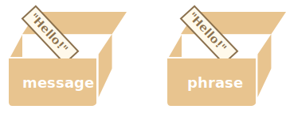

# Объекты

Как мы знаем из главы <info:types>, в JavaScript существует 8 типов данных. Семь из них называются "примитивными", так как содержат только одно значение (будь то строка, число или что-то другое).

Объекты же используются для хранения коллекций различных значений и более сложных сущностей. В JavaScript объекты используются очень часто, это одна из основ языка. Поэтому мы должны понять их, прежде чем углубляться куда-либо ещё.

Объект может быть создан с помощью фигурных скобок `{…}` с необязательным списком *свойств*. Свойство - это пара "ключ: значение", где `ключ` - это строка (также называемая "именем свойства"), а `значение` может быть чем угодно.

Мы можем представить объект в виде ящика с подписанными папками. Каждый элемент данных хранится в своей папке, на которой написан ключ. По ключу папку легко найти, удалить или добавить в неё что-либо.


Пустой объект ("пустой ящик") можно создать, используя один из двух вариантов синтаксиса:

```js
let user = new Object(); // синтаксис "конструктор объекта"
let user = {};  // синтаксис "литерал объекта"
```


Обычно используют вариант с фигурными скобками `{...}`. Такое объявление называют *литералом объекта* или *литеральной нотацией*.

## Литералы и свойства

При использовании литерального синтаксиса `{...}` мы сразу можем поместить в объект несколько свойств в виде пар "ключ: значение":

```js
let user = {     // объект
  name: "John",  // под ключом "name" хранится значение "John"
  age: 30        // под ключом "age" хранится значение 30
};
```

Свойства объекта также иногда называют *полями объекта*.

У каждого свойства есть ключ (также называемый "имя" или "идентификатор"). После имени свойства следует двоеточие `":"`, и затем указывается значение свойства. Если в объекте несколько свойств, то они перечисляются через запятую.

В объекте `user` сейчас находятся два свойства:

1. Первое свойство с именем `"name"` и значением `"John"`.
2. Второе свойство с именем `"age"` и значением `30`.

Можно сказать, что наш объект `user` - это ящик с двумя папками, подписанными "name" и "age".


Мы можем в любой момент добавить в него новые папки, удалить папки или прочитать содержимое любой папки.

Для обращения к свойствам используется запись "через точку":

```js
// получаем свойства объекта:
alert( user.name ); // John
alert( user.age ); // 30
```

Значение может быть любого типа. Давайте добавим свойство с логическим значением:

```js
user.isAdmin = true;
```


Для удаления свойства мы можем использовать оператор `delete`:

```js
delete user.age;
```


Имя свойства может состоять из нескольких слов, но тогда оно должно быть заключено в кавычки:

```js
let user = {
  name: "John",
  age: 30,
  "likes birds": true  // имя свойства из нескольких слов должно быть в кавычках
};
```


Последнее свойство объекта может заканчиваться запятой:

```js
let user = {
  name: "John",
  age: 30*!*,*/!*
}
```
Это называется "висячая запятая". Такой подход упрощает добавление, удаление и перемещение свойств, так как все строки объекта становятся одинаковыми.

## Квадратные скобки

Для свойств, имена которых состоят из нескольких слов, доступ к значению "через точку" не работает:

```js run
// это вызовет синтаксическую ошибку
user.likes birds = true
```

JavaScript видит, что мы обращаемся к свойству `user.likes`, а затем идёт непонятное слово `birds`. В итоге синтаксическая ошибка.

Точка требует, чтобы ключ был именован по правилам именования переменных. То есть не имел пробелов, не начинался с цифры и не содержал специальные символы, кроме `$` и `_`.

Для таких случаев существует альтернативный способ доступа к свойствам через квадратные скобки. Такой способ сработает с любым именем свойства:

```js run
let user = {};

// присваивание значения свойству
user["likes birds"] = true;

// получение значения свойства
alert(user["likes birds"]); // true

// удаление свойства
delete user["likes birds"];
```

Сейчас всё в порядке.

Обратите внимание, что строка в квадратных скобках закавычена (подойдёт любой тип кавычек).

Квадратные скобки также позволяют обратиться к свойству, имя которого может быть результатом выражения. Например, имя свойства может храниться в переменной:


```js
let key = "likes birds";

// то же самое, что и user["likes birds"] = true;
user[key] = true;
```

Здесь переменная `key` может быть вычислена во время выполнения кода или зависеть от пользовательского ввода. После этого мы используем её для доступа к свойству. Это даёт нам большую гибкость.

Пример:

```js run
let user = {
  name: "John",
  age: 30
};

let key = prompt("Что вы хотите узнать о пользователе?", "name");

// доступ к свойству через переменную
alert( user[key] ); // John (если ввели "name")
```

Запись "через точку" такого не позволяет:

```js run
let user = {
  name: "John",
  age: 30
};

let key = "name";
alert( user.key ); // undefined
```

### Вычисляемые свойства

Мы можем использовать квадратные скобки в литеральной нотации для создания *вычисляемого свойства*.

Пример:

```js run
let fruit = prompt("Какой фрукт купить?", "apple");

let bag = {
*!*
  [fruit]: 5, // имя свойства будет взято из переменной fruit
*/!*
};

alert( bag.apple ); // 5, если fruit="apple"
```

Смысл вычисляемого свойства прост: запись `[fruit]` означает, что имя свойства необходимо взять из переменной `fruit`.

И если посетитель введёт слово `"apple"`, то в объекте `bag` теперь будет лежать свойство `{apple: 5}`.

По сути, пример выше работает так же, как и следующий пример:
```js run
let fruit = prompt("Какой фрукт купить?", "apple");
let bag = {};

// имя свойства будет взято из переменной fruit
bag[fruit] = 5;
```

...Но первый пример выглядит лаконичнее.

Мы можем использовать и более сложные выражения в квадратных скобках:

```js
let fruit = 'apple';
let bag = {
  [fruit + 'Computers']: 5 // bag.appleComputers = 5
};
```

Квадратные скобки дают намного больше возможностей, чем запись через точку. Они позволяют использовать любые имена свойств и переменные, хотя и требуют более громоздких конструкций кода.

Подведём итог: в большинстве случаев, когда имена свойств известны и просты, используется запись через точку. Если же нам нужно что-то более сложное, то мы используем квадратные скобки.

## Свойство из переменной

В реальном коде часто нам необходимо использовать существующие переменные как значения для свойств с тем же именем.

Например:

```js run
function makeUser(name, age) {
  return {
    name: name,
    age: age
    // ...другие свойства
  };
}

let user = makeUser("John", 30);
alert(user.name); // John
```

В примере выше название свойств `name` и `age` совпадают с названиями переменных, которые мы подставляем в качестве значений этих свойств. Такой подход настолько распространён, что существуют специальные *короткие свойства* для упрощения этой записи.

Вместо `name:name` мы можем написать просто `name`:

```js
function makeUser(name, age) {
*!*
  return {
    name, // то же самое, что и name: name
    age   // то же самое, что и age: age
    // ...
  };
*/!*
}
```

Мы можем использовать как обычные свойства, так и короткие в одном и том же объекте:

```js
let user = {
  name,  // тоже самое, что и name:name
  age: 30
};
```

## Ограничения на имена свойств

Мы можем использовать только строки и символы в качестве ключей свойств. Все другие типы данных будут автоматически преобразованы к строке.

Например, если использовать как ключ число `0`, то оно превратится в строку `"0"`:

```js run
let obj = {
  0: "Тест" // то же самое что и "0": "Тест"
};

// обе функции alert выведут одно и то же свойство (число 0 преобразуется в строку "0")
alert( obj["0"] ); // Тест
alert( obj[0] ); // Тест (то же свойство)
```

**Зарезервированные слова разрешено использовать как имена свойств.**

Как мы уже знаем, имя переменной не может совпадать с зарезервированными словами, такими как "for", "let", "return" и т.д.

Но для свойств объекта такого ограничения нет:

```js run
let obj = {
  for: 1,
  let: 2,
  return: 3
};

alert( obj.for + obj.let + obj.return );  // 6
```

**В принципе, разрешены любые имена свойств, но есть специальное свойство `__proto__`, которое по историческим причинам имеет  особое поведение.**

Например, его значение всегда должно быть объектом:

```js run
let obj = {};
obj.__proto__ = 5;
alert(obj.__proto__); // [object Object], работает не так, как мы ожидали
```

Как мы видим, присвоение примитивного значения `5` игнорируется.

Мы более подробно исследуем происходящее свойство `__proto__` позже, в главе [](info:prototype-inheritance).

Сейчас важно знать, что такое поведение `__proto__` может стать источником ошибок и даже уязвимостей, если мы намереваемся хранить в объекте произвольные данные и позволяем посетителям указывать ключи.

Посетитель может указать `"__proto__"` в качестве ключа, и логика присваивания будет нарушена (как показано выше).

Позже мы изучим, как обойти эту проблему:
1. Можно заставить объект обрабатывать `__proto__` как обычное свойство, мы это увидим в главе [](info:prototype-methods).
2. Есть другая структура данных [Map](info:map-set), которую мы изучим в главе <info:map-set>, она поддерживает произвольные ключи.

## Проверка существования свойства, оператор "in"

Особенность объектов в том, что можно получить доступ к любому свойству. Даже если свойства не существует - ошибки не будет! При обращении к свойству, которого нет, возвращается `undefined`. Это позволяет просто проверить существование свойства - сравнением его с `undefined`:

```js run
let user = {};

alert( user.noSuchProperty === undefined ); // true означает "свойства нет"
```

Также существует специальный оператор `"in"` для проверки существования свойства в объекте.

Синтаксис оператора:
```js
"key" in object
```

Пример:

```js run
let user = { name: "John", age: 30 };

alert( "age" in user ); // true, user.age существует
alert( "blabla" in user ); // false, user.blabla не существует
```

Обратите внимание, что слева от оператора `in` должно быть *имя свойства*. Обычно это строка в кавычках.

Если мы опускаем кавычки, это значит, что мы указываем переменную, в которой находится имя свойства. Например:

```js run
let user = { age: 30 };

let key = "age";
alert( *!*key*/!* in user ); // true, имя свойства было взято из переменной key
```

````smart header="Оператор \"in\" для свойств со значением *'undefined'*"
Обычно строгого сравнения `"=== undefined"` достаточно для проверки наличия свойства. Но есть особый случай, когда оно не подходит, и нужно использовать `"in"`.

Это когда свойство существует, но содержит значение `undefined`:

```js run
let obj = {
  test: undefined
};

alert( obj.test ); // выведет undefined, значит свойство не существует?

alert( "test" in obj ); // true, свойство существует!
```


В примере выше свойство `obj.test` технически существует в объекте. Оператор `in` сработал правильно.

Подобные ситуации случаются очень редко, так как `undefined` обычно явно не присваивается. Для "неизвестных" или "пустых" свойств мы используем значение `null`. Таким образом, оператор `in` является экзотическим гостем в коде.

````


## Цикл "for..in"

Для перебора всех свойств объекта используется цикл `for..in`. Этот цикл отличается от изученного ранее цикла `for(;;)`.

Синтаксис:

```js
for (key in object) {
  // тело цикла выполняется для каждого свойства объекта
}
```

К примеру, давайте выведем все свойства объекта `user`:

```js run
let user = {
  name: "John",
  age: 30,
  isAdmin: true
};

for (let key in user) {
  // ключи
  alert( key );  // name, age, isAdmin
  // значения ключей
  alert( user[key] ); // John, 30, true
}
```


Обратите внимание, что все конструкции "for" позволяют нам объявлять переменную внутри цикла, как, например, `let key` здесь.

Кроме того, мы могли бы использовать другое имя переменной. Например, часто используется вариант `"for (let prop in obj)"`.


### Упорядочение свойств объекта

Упорядочены ли свойства объекта? Другими словами, если мы будем в цикле перебирать все свойства объекта, получим ли мы их в том же порядке, в котором мы их добавляли? Можем ли мы на это рассчитывать?

Короткий ответ: свойства упорядочены особым образом: свойства с целочисленными ключами сортируются по возрастанию, остальные располагаются в порядке создания. Разберёмся подробнее.

В качестве примера рассмотрим объект с телефонными кодами:

```js run
let codes = {
  "49": "Германия",
  "41": "Швейцария",
  "44": "Великобритания",
  // ..,
  "1": "США"
};

*!*
for (let code in codes) {
  alert(code); // 1, 41, 44, 49
}
*/!*
```

Если мы делаем сайт для немецкой аудитории, то, вероятно, мы хотим, чтобы код `49` был первым.

Но если мы запустим код, мы увидим совершенно другую картину:

- США (1) идёт первым
- затем Швейцария (41) и так далее.

Телефонные коды идут в порядке возрастания, потому что они являются целыми числами: `1, 41, 44, 49`.

````smart header="Целочисленные свойства? Это что?"
Термин "целочисленное свойство" означает строку, которая может быть преобразована в целое число и обратно без изменений.

То есть, `"49"` - это целочисленное имя свойства, потому что если его преобразовать в целое число, а затем обратно в строку, то оно не изменится. А вот свойства `"+49"` или `"1.2"` таковыми не являются:

```js run
// Math.trunc - встроенная функция, которая удаляет десятичную часть
alert( String(Math.trunc(Number("49"))) ); // "49", то же самое ⇒ свойство целочисленное
alert( String(Math.trunc(Number("+49"))) ); // "49", не то же самое, что "+49" ⇒ свойство не целочисленное
alert( String(Math.trunc(Number("1.2"))) ); // "1", не то же самое, что "1.2" ⇒ свойство не целочисленное
```
````

...С другой стороны, если ключи не целочисленные, то они перебираются в порядке создания, например:

```js run
let user = {
  name: "John",
  surname: "Smith"
};
user.age = 25; // добавим ещё одно свойство

*!*
// не целочисленные свойства перечислены в порядке создания
*/!*
for (let prop in user) {
  alert( prop ); // name, surname, age
}
```

Таким образом, чтобы решить нашу проблему с телефонными кодами, мы можем схитрить, сделав коды не целочисленными свойствами. Добавления знака `"+"` перед каждым кодом будет достаточно.

Пример:

```js run
let codes = {
  "+49": "Германия",
  "+41": "Швейцария",
  "+44": "Великобритания",
  // ..,
  "+1": "США"
};

for (let code in codes) {
  alert( +code ); // 49, 41, 44, 1
}
```

Теперь код работает так, как мы задумывали.

## Копирование по ссылке

Одним из фундаментальных отличий объектов от примитивных типов данных является то, что они хранятся и копируются "по ссылке".

Примитивные типы: строки, числа, логические значения - присваиваются и копируются "по значению".

Например:

```js
let message = "Hello!";
let phrase = message;
```

В результате мы имеем две независимые переменные, каждая из которых хранит строку `"Hello!"`.




Объекты ведут себя иначе.

**Переменная хранит не сам объект, а его "адрес в памяти", другими словами "ссылку" на него.**

Проиллюстрируем это:


```js
let user = {
  name: "John"
};
```


Сам объект хранится где-то в памяти. А в переменной `user` лежит "ссылка" на эту область памяти.

**Когда переменная объекта копируется - копируется ссылка, сам же объект не дублируется.**

Если мы представляем объект как ящик, то переменная – это ключ к нему. Копирование переменной дублирует ключ, но не сам ящик.

Например:


```js no-beautify
let user = { name: "John" };

let admin = user; // копируется ссылка
```

Теперь у нас есть две переменные, каждая из которых содержит ссылку на один и тот же объект:


Мы можем использовать любую из переменных для доступа к ящику и изменения его содержимого:

```js run
let user = { name: 'John' };

let admin = user;

*!*
admin.name = 'Pete'; // изменено по ссылке из переменной "admin"
*/!*

alert(*!*user.name*/!*); // 'Pete', изменения видны по ссылке из переменной "user"
```

Приведённый выше пример демонстрирует, что объект только один. Как если бы у нас был один ящик с двумя ключами и мы использовали один из них (`admin`), чтобы войти в него и что-то изменить, а затем, открыв ящик другим ключом (`user`), мы бы увидели эти изменения.

### Сравнение объектов

Операторы равенства `==` и строгого равенства `===` для объектов работают одинаково.

**Два объекта равны только в том случае, если это один и тот же объект.**

Например, две переменные ссылаются на один и тот же объект, они равны:

```js run
let a = {};
let b = a; // копирование по ссылке

alert( a == b ); // true, обе переменные ссылаются на один и тот же объект
alert( a === b ); // true
```

В примере ниже два разных объекта не равны, хотя и оба пусты:

```js run
let a = {};
let b = {}; // два независимых объекта

alert( a == b ); // false
```

Для сравнений типа `obj1 > obj2` или для сравнения с примитивом `obj == 5` объекты преобразуются в примитивы.

Мы скоро изучим, как работают такие преобразования объектов, но, по правде говоря, сравнения такого рода необходимы очень редко и обычно являются результатом ошибки программиста.

### Объекты-константы

Объект, объявленный через `const`, *может* быть изменён.

Пример:

```js run
const user = {
  name: "John"
};

*!*
user.age = 25; // (*)
*/!*

alert(user.age); // 25
```

Может показаться, что строка `(*)` должна вызвать ошибку, но нет, здесь всё в порядке. Дело в том, что объявление `const` защищает от изменений только само значение `user`. А в нашем случае значение `user` - это ссылка на объект, и это значение мы не меняем. В строке `(*)` мы действуем *внутри* объекта, мы не переназначаем `user`.

Если же мы попытаемся присвоить `user` другое значение, то `const` выдаст ошибку:

```js run
const user = {
  name: "John"
};

*!*
// Ошибка (нельзя переопределять константу user)
*/!*
user = {
  name: "Pete"
};
```

...Но что делать, если мы хотим сделать константами свойства объекта? Как сделать так, чтобы попытка изменить `user.age = 25` выдавала ошибку? Это тоже возможно. Мы рассмотрим эту тему в главе <info:property-descriptors>.

## Клонирование и объединение объектов, Object.assign

Как мы узнали ранее, при копировании переменной объекта создаётся ещё одна ссылка на тот же самый объект.

Но что, если нам всё же нужно дублировать объект? Создать независимую копию, клон?

Это выполнимо, но немного сложно, так как в JavaScript нет встроенного метода для этого. На самом деле, такая нужда возникает редко. В большинстве случаев нам достаточно копирования по ссылке.

Но если мы действительно этого хотим, то нам нужно создавать новый объект и повторять структуру дублируемого объекта, перебирая его свойства и копируя их.

Например так:

```js run
let user = {
  name: "John",
  age: 30
};

*!*
let clone = {}; // новый пустой объект

// скопируем все свойства user в него
for (let key in user) {
  clone[key] = user[key];
}
*/!*

// теперь в переменной clone находится абсолютно независимый клон объекта.
clone.name = "Pete"; // изменим в нём данные

alert( user.name ); // в оригинальном объекте значение свойства `name` осталось прежним – John.
```

Кроме того, для этих целей мы можем использовать метод [Object.assign](mdn:js/Object/assign).

Синтаксис:

```js
Object.assign(dest, [src1, src2, src3...])
```

- Аргументы `dest`, и `src1, ..., srcN` (может быть столько, сколько нужно) являются объектами.
- Метод копирует свойства всех объектов `src1, ..., srcN` в объект `dest`. То есть, свойства всех перечисленных объектов, начиная со второго, копируются в первый объект. После копирования метод возвращает объект `dest`.

Например, объединим несколько объектов в один:

```js
let user = { name: "John" };

let permissions1 = { canView: true };
let permissions2 = { canEdit: true };

*!*
// копируем все свойства из permissions1 и permissions2 в user
Object.assign(user, permissions1, permissions2);
*/!*

// now user = { name: "John", canView: true, canEdit: true }
```

Если принимающий объект (`user`) уже имеет свойство с таким именем, оно будет перезаписано:

```js
let user = { name: "John" };

// свойство name перезапишется, свойство isAdmin добавится
Object.assign(user, { name: "Pete", isAdmin: true });

// now user = { name: "Pete", isAdmin: true }
```

Мы также можем использовать `Object.assign` для простого клонирования:

```js
let user = {
  name: "John",
  age: 30
};

*!*
let clone = Object.assign({}, user);
*/!*
```

Все свойства объекта `user` будут скопированы в пустой объект, и ссылка на этот объект будет в переменной `clone`. На самом деле, такое клонирование работает так же, как и через цикл, но короче.

До сих пор мы предполагали, что все свойства пользователя примитивны. Но свойства могут быть ссылками на другие объекты. Что с ними делать?

Например, есть объект:

```js run
let user = {
  name: "John",
  sizes: {
    height: 182,
    width: 50
  }
};

alert( user.sizes.height ); // 182
```

Теперь при клонировании недостаточно просто скопировать `clone.sizes = user.sizes`, поскольку `user.sizes` - это объект, он будет скопирован по ссылке. А значит объекты `clone` и `user` в своих свойствах `sizes` будут ссылаться на один и тот же объект:

```js run
let user = {
  name: "John",
  sizes: {
    height: 182,
    width: 50
  }
};

let clone = Object.assign({}, user);

alert( user.sizes === clone.sizes ); // true, один и тот же объект

// user и clone обращаются к одному sizes
user.sizes.width++;       // меняем свойство в одном объекте
alert(clone.sizes.width); // 51, видим результат в другом объекте
```

Чтобы исправить это, мы должны в цикле клонирования делать проверку, не является ли значение `user[key]` объектом, и если это так - копируем и его структуру тоже. Это называется "глубокое клонирование".

Существует стандартный алгоритм глубокого клонирования, [Structured cloning algorithm](http://w3c.github.io/html/infrastructure.html#safe-passing-of-structured-data). Он решает описанную выше задачу, а также более сложные задачи.
Чтобы не изобретать велосипед, мы можем использовать реализацию этого алгоритма из JavaScript-библиотеки [lodash](https://lodash.com), метод [_.cloneDeep(obj)](https://lodash.com/docs#cloneDeep).


## Итого

Объекты - это ассоциативные массивы с рядом дополнительных возможностей.

Они хранят свойства (пары ключ-значение), где:
- Ключи свойств должны быть строками или символами (обычно строками).
- Значения могут быть любого типа.

Чтобы получить доступ к свойству, мы можем использовать:
- Запись через точку: `obj.property`.
- Квадратные скобки `obj["property"]`. Квадратные скобки позволяют взять ключ из переменной, например, `obj[varWithKey]`.

Дополнительные операторы:

- Удаление свойства: `delete obj.prop`.
- Проверка существования свойства: `"key" in obj`.
- Перебор свойств объекта: цикл for `for (let key in obj)`.

Объекты присваиваются и копируются по ссылке. Другими словами, переменная хранит не "значение объекта", а "ссылку" (адрес в памяти) на это значение. Поэтому копирование такой переменной или передача её в качестве аргумента функции приводит к копированию этой ссылки, а не самого объекта. Все операции с использованием скопированных ссылок (например, добавление или удаление свойств) выполняются с одним и тем же объектом.

Чтобы сделать "настоящую копию" (клон), мы можем использовать `Object.assign` или [_.cloneDeep(obj)](https://lodash.com/docs#cloneDeep).

То, что мы изучали в этой главе, называется "простым объектом" ("plain object") или просто `Object`.

В JavaScript есть много других типов объектов:

- `Array` для хранения упорядоченных коллекций данных,
- `Date` для хранения информации о дате и времени,
- `Error` для хранения информации об ошибке.
- ... и так далее.

У них есть свои особенности, которые мы изучим позже. Иногда люди говорят что-то вроде "тип данных Array" или "тип данных Date", но формально они не являются отдельными типами, а относятся к типу данных `Object`. Они лишь расширяют его различными способами.

Объекты в JavaScript очень мощные. Здесь мы только немного углубились в действительно огромную тему. Мы будем плотно работать с объектами и узнаем о них больше в следующих частях учебника.
