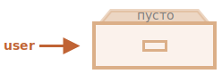

# Объекты

Как мы знаем из главы <info:types>, в JavaScript существует 8 типов данных. Семь из них называются "примитивными", так как содержат только одно значение (будь то строка, число или что-то другое).

Объекты же используются для хранения коллекций различных значений и более сложных сущностей. В JavaScript объекты используются очень часто, это одна из основ языка. Поэтому мы должны понять их, прежде чем углубляться куда-либо ещё.

Объект может быть создан с помощью фигурных скобок `{…}` с необязательным списком *свойств*. Свойство - это пара "ключ: значение", где `ключ` - это строка (также называемая "именем свойства"), а `значение` может быть чем угодно.

Мы можем представить объект в виде ящика с подписанными папками. Каждый элемент данных хранится в своей папке, на которой написан ключ. По ключу папку легко найти, удалить или добавить в неё что-либо.


Пустой объект ("пустой ящик") может быть создан с использованием одного из двух синтаксисов:

```js
let user = new Object(); // синтаксис "конструктор объекта"
let user = {};  // синтаксис "литерал объекта"
```



Обычно используются фигурные скобки `{...}`. Такое объявление называют *литералом объекта* или *литеральной нотацией*.

## Литералы и свойства

При использовании литерального синтаксиса `{...}` мы сразу можем поместить в объект несколько свойств в виде пар "ключ: значение":

```js
let user = {     // объект
  name: "John",  // под ключом "name" хранится значение "John"
  age: 30        // под ключом "age" хранится значение 30
};
```

У каждого свойства есть ключ (также называемый "имя" или "идентификатор"). После имени свойства следует двоеточие `":"`, и затем указывается значение свойства. Если в объекте несколько свойств, то они перечисляются через запятую.

В объекте `user` сейчас находятся два свойства:

1. Первое свойство с именем `"name"` и значением `"John"`.
2. Второе свойство с именем `"age"` и значением `30`.

Можно сказать, что наш объект `user` - это ящик с двумя папками, подписанными "name" и "age".


Мы можем в любой момент добавить в него новые папки, удалить папки или прочитать содержимое любой папки.

Для обращения к свойствам используется запись "через точку":

```js
// получаем свойства объекта:
alert( user.name ); // John
alert( user.age ); // 30
```

Значение может быть любого типа. Давайте добавим свойство с логическим значением:

```js
user.isAdmin = true;
```


Для удаления свойства мы можем использовать оператор `delete`:

```js
delete user.age;
```


Имя свойства может состоять из нескольких слов, но тогда оно должно быть заключено в кавычки:

```js
let user = {
  name: "John",
  age: 30,
  "likes birds": true  // имя свойства из нескольких слов должно быть в кавычках
};
```


Последнее свойство объекта может заканчиваться запятой:
```js
let user = {
  name: "John",
  age: 30*!*,*/!*
}
```
Это называется "завершающей" или "висящей" запятой. Упрощает добавление/удаление/перестановку свойств, так как все строки становятся одинаковыми.

## Квадратные скобки

Для свойств состоящих из нескольких слов, доступ к значению "через точку" не работает:

```js run
// это вызовет синтаксическую ошибку
user.likes birds = true
```

JavaScript этого не понимает. Он думает, что мы обращаемся к `user.likes`, а затем выдаёт синтаксическую ошибку, когда натыкается на неожиданных `birds`. 

Точка требует, чтобы ключ был именован по правилам именования переменных. То есть не имел пробелов, не начинался с цифры и не содержал специальные символы, кроме `$` и `_`.

Для таких случаев существует альтернативный способ доступа к свойствам через квадратные скобки. Такой способ сработает с любым именем свойства:

```js run
let user = {};

// присваивание значения свойству
user["likes birds"] = true;

// получение значения свойства
alert(user["likes birds"]); // true

// удаление свойства
delete user["likes birds"];
```

Сейчас всё в порядке. Обратите внимание, что строка в квадратных скобках заключена в кавычки (подойдёт любой тип кавычек).

Квадратные скобки также позволяют обратиться к свойству, имя которого может быть результатом выражения. Например, имя свойства может храниться в переменной:

```js
let key = "likes birds";

// то же самое, что и user["likes birds"] = true;
user[key] = true;
```

Здесь переменная `key` может быть вычислена во время выполнения кода или зависеть от пользовательского ввода. А затем мы используем её для доступа к свойству. Это даёт нам отличную гибкость.

Пример:

```js run
let user = {
  name: "John",
  age: 30
};

let key = prompt("Что вы хотите узнать о пользователе?", "name");

// доступ к свойству через переменную
alert( user[key] ); // John (если ввели "name")
```

Запись "через точку" такого не позволяет:

```js run
let user = {
  name: "John",
  age: 30
};

let key = "name";
alert( user.key ); // undefined
```

### Вычисляемые свойства

Мы можем использовать квадратные скобки в литеральной нотации для создания *вычисляемого свойства*.

Пример:

```js run
let fruit = prompt("Какой фрукт купить?", "apple");

let bag = {
*!*
  [fruit]: 5, // имя свойства будет взято из переменной fruit
*/!*
};

alert( bag.apple ); // 5, если fruit="apple"
```

Смысл вычисляемого свойства прост: запись `[fruit]` означает, что имя свойства необходимо взять из переменной `fruit`.

И если посетитель введёт слово `"apple"`, то в объекте `bag` теперь будет лежать свойство `{apple: 5}`.

По сути, это работает так же, как:
```js run
let fruit = prompt("Какой фрукт купить?", "apple");
let bag = {};

// имя свойства будет взято из переменной fruit
bag[fruit] = 5;
```

...Но выглядит лучше.

Мы можем использовать и более сложные выражения в квадратных скобках:

```js
let fruit = 'apple';
let bag = {
  [fruit + 'Computers']: 5 // bag.appleComputers = 5
};
```

Квадратные скобки дают намного больше возможностей, чем запись через точку. Они допускают любые имена свойств и переменных. Но они также более громоздки в написании.

Таким образом, в большинстве случаев, когда имена свойств известны и просты, используется точка. А если нам нужно что-то более сложное, то мы переходим на квадратные скобки.

## Свойство из переменной

В реальном коде мы часто используем существующие переменные в качестве значений для имён свойств.

Например:

```js run
function makeUser(name, age) {
  return {
    name: name,
    age: age
    // ...другие свойства
  };
}

let user = makeUser("John", 30);
alert(user.name); // John
```

В приведённом выше примере свойства имеют те же имена, что и переменные. Вариант использования создания свойства из переменной настолько распространён, что существует специальный способ *сокращённого значение свойства*, чтобы сделать его короче.

Вместо `name:name` мы можем написать просто `name`, вот так:

```js
function makeUser(name, age) {
*!*
  return {
    name, // то же самое, что и name: name
    age   // то же самое, что и age: age
    // ...
  };
*/!*
}
```

Мы можем использовать как обычные свойства, так и сокращеные в одном и том же объекте:

```js
let user = {
  name,  // тоже самое, что и name:name
  age: 30
};
```


## Ограничения на имена свойств

Как мы уже знаем, переменная не может иметь имя, равное одному из зарезервированных для языка слов, таких как "for", "let", "return" и т.д.

Но для свойств объекта такого ограничения нет:

```js run
// эти имена свойств допустимы
let obj = {
  for: 1,
  let: 2,
  return: 3
};

alert( obj.for + obj.let + obj.return );  // 6
```

Короче говоря, нет никаких ограничений на имена свойств. Они могут быть любыми строками или символами (специальный тип для идентификаторов, который будет рассмотрен позже).

Другие типы автоматически преобразуются в строки.

Например, если использовать число `0` в качестве ключа, то оно превратится в строку `"0"`:

```js run
let obj = {
  0: "Тест" // то же самое что и "0": "Тест"
};

// обе функции alert выведут одно и то же свойство (число 0 преобразуется в строку "0")
alert( obj["0"] ); // Тест
alert( obj[0] ); // Тест (то же свойство)
```

Есть небольшой подводный камень, связанный со специальным свойством `__proto__`. Мы не можем установить для него значение, не относящееся к объекту:

```js run
let obj = {};
obj.__proto__ = 5; // присвоим число
alert(obj.__proto__); // [object Object], значение - это объект, т.е. не то, что мы ожидали
```

Как мы видим, присвоение примитивного значения `5` игнорируется.

Мы более подробно исследуем особенности свойства `__proto__` в следующих главах [](info:prototype-inheritance), а также предложим [способы исправления](info:prototype-methods) такого поведения.

## Проверка существования свойства, оператор "in"

В отличие от многих других языков, особенность JavaScript-объектов в том, что можно получить доступ к любому свойству. Даже если свойства не существует - ошибки не будет!

При обращении к свойству, которого нет, возвращается `undefined`. Таким образом, мы можем легко проверить, существует ли это свойство:

```js run
let user = {};

alert( user.noSuchProperty === undefined ); // true означает "свойства нет"
```

Для этого также есть специальный оператор `"in"`.

Синтаксис оператора:
```js
"key" in object
```

Пример:

```js run
let user = { name: "John", age: 30 };

alert( "age" in user ); // true, user.age существует
alert( "blabla" in user ); // false, user.blabla не существует
```

Обратите внимание, что слева от оператора `in` должно быть *имя свойства*. Обычно это строка в кавычках.

Если мы опускаем кавычки, это означает, что переменная должна содержать фактическое имя, подлежащее проверке. Например:

```js run
let user = { age: 30 };

let key = "age";
alert( *!*key*/!* in user ); // true, свойство "age" существует
```

Для чего вообще нужен оператор `in`? Разве недостаточно сравнения с `undefined`?

Что ж, в большинстве случаев прекрасно сработает сравнение с `undefined`. Но есть особый случай, когда оно не подходит, и нужно использовать `"in"`.

Это когда свойство существует, но содержит значение `undefined`:

```js run
let obj = {
  test: undefined
};

alert( obj.test ); //  это undefined, значит такого свойства нет?

alert( "test" in obj ); // true, свойство существует!
```

В примере выше свойство `obj.test` технически существует в объекте. Оператор `in` сработал правильно.

Подобные ситуации случаются очень редко, так как `undefined` обычно явно не присваивается. В основном мы используем `null` для "неизвестных" или "пустых" значений. Таким образом, оператор `in` является экзотическим гостем в коде.

## Цикл "for..in"

Для перебора всех ключей объекта существует специальная форма цикла: `for..in`. Это совершенно отличается от конструкции `for(;;)`, которую мы изучали ранее.

Синтаксис:

```js
for (key in object) {
  // выполняет тело для каждого ключа среди свойств объекта
}
```

К примеру, давайте выведем все свойства объекта `user`:

```js run
let user = {
  name: "John",
  age: 30,
  isAdmin: true
};

for (let key in user) {
  // ключи
  alert( key );  // name, age, isAdmin
  // значения ключей
  alert( user[key] ); // John, 30, true
}
```

Обратите внимание, что все конструкции "for" позволяют нам объявлять переменную внутри цикла, как, например, `let key` здесь.

Кроме того, мы могли бы использовать здесь другое имя переменной вместо `key`. Например, часто используется вариант `"for (let prop in obj)"`.

### Упорядочение свойств объекта

Упорядочены ли объекты? Другими словами, если мы будем при помощи цикла перебирать все свойства объекта, получим ли мы их в том же порядке, в котором они были добавлены? Можем ли мы на это рассчитывать?

Короткий ответ таков: "упорядочены особым образом": целочисленные свойства сортируются, другие отображаются в порядке создания. Разберёмся подробнее.

В качестве примера давайте рассмотрим объект с телефонными кодами:

```js run
let codes = {
  "49": "Германия",
  "41": "Швейцария",
  "44": "Великобритания",
  // ..,
  "1": "США"
};

*!*
for (let code in codes) {
  alert(code); // 1, 41, 44, 49
}
*/!*
```

Объект может быть использован для того, чтобы предложить пользователю список опций. Если мы создаём сайт в основном для немецкой аудитории, то, вероятно, хотим, чтобы `49` был первым.

Но если мы запустим код, мы увидим совершенно другую картину:

- США (1) идёт первым
- затем Швейцария (41) и так далее.

Телефонные коды идут в порядке возрастания, потому что они являются целыми числами. Итак, мы видим `1, 41, 44, 49`.

````smart header="Целочисленные свойства? Это что?"
Термин "целочисленное свойство" означает строку, которая может быть преобразована в целое число и обратно без изменений.

То есть, `"49"` - это целочисленное имя свойства, потому что если его преобразовать в целое число, а затем обратно в строку, то оно не изменится. А вот свойства `"+49"` или `"1.2"` таковыми не являются:

```js run
// Math.trunc - встроенная функция, которая удаляет десятичную часть
alert( String(Math.trunc(Number("49"))) ); // "49", то же самое ⇒ свойство целочисленное
alert( String(Math.trunc(Number("+49"))) ); // "49", не то же самое, что "+49" ⇒ свойство не целочисленное
alert( String(Math.trunc(Number("1.2"))) ); // "1", не то же самое, что "1.2" ⇒ свойство не целочисленное
```
````

...С другой стороны, если ключи не являются целыми, то они перечисляются в порядке создания, например:

```js run
let user = {
  name: "John",
  surname: "Smith"
};
user.age = 25; // добавим ещё одно свойство

*!*
// не целочисленные свойства перечислены в порядке создания
*/!*
for (let prop in user) {
  alert( prop ); // name, surname, age
}
```

Таким образом, чтобы решить нашу проблему с телефонными кодами, мы можем схитрить, сделав коды не целочисленными свойствами. Достаточно добавить знак плюс `"+"` перед каждым кодом.

Вот так:

```js run
let codes = {
  "+49": "Германия",
  "+41": "Швейцария",
  "+44": "Великобритания",
  // ..,
  "+1": "США"
};

for (let code in codes) {
  alert( +code ); // 49, 41, 44, 1
}
```

Теперь всё работает так, как задумано.

## Итого

Объекты - это ассоциативные массивы с рядом дополнительных возможностей.

Они хранят свойства (пары ключ-значение), где:
- Ключи свойств должны быть строками или символами (обычно строками).
- Значения могут быть любого типа.

Чтобы получить доступ к свойству, мы можем использовать:
- Запись через точку: `obj.property`.
- Квадратные скобки `obj["property"]`. Квадратные скобки позволяют взять ключ из переменной, например, `obj[varWithKey]`.

Дополнительные операторы:

- Удаление свойства: `delete obj.prop`.
- Проверить, существует ли свойство с заданным ключом: `"key" in obj`.
- Проитерировать объект: цикл for `for (let key in obj)`.

То, что мы изучали в этой главе, называется "простым объектом" ("plain object") или просто `Object`.

В JavaScript есть много других типов объектов:

- `Array` для хранения упорядоченных коллекций данных,
- `Date` для хранения информации о дате и времени,
- `Error` для хранения информации об ошибке.
- ... и так далее.

У них есть свои особенности, которые мы изучим позже. Иногда люди говорят что-то вроде "тип Array" или "тип Date", но формально они не являются отдельными типами, а относятся к типу данных `Object`. И они лишь расширяют его различными способами.

Объекты в JavaScript очень мощные. Здесь мы только немного углубились в действительно огромную тему. Мы будем плотно работать с объектами и узнаем о них больше в следующих частях учебника.
