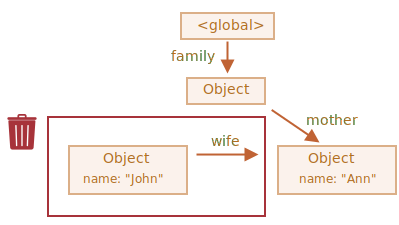
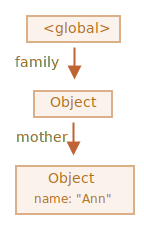

# Сборка мусора

Управление памятью в JavaScript выполняется автоматически и незаметно. Мы создаём примитивы, объекты, функции... Всё это занимает память.

Но что происходит, когда что-то больше не нужно? Как JavaScript понимает, что пора очищать память?

## Достижимость

Основной концепцией управления памятью в JavaScript является принцип *достижимости*.

Если упростить, то "достижимые" значения - это те, которые доступны или используются. Они гарантированно находятся в памяти.

1. Существует базовое множество достижимых значений, которые не могут быть удалены.

    Например:

    - Локальные переменные и параметры текущей функции.
    - Переменные и параметры других функций в текущей цепочке вложенных вызовов.
    - Глобальные переменные.
    - (некоторые другие внутренние значения)

    Эти значения мы будем называть *корнями*.

2. Любое другое значение считается достижимым, если оно доступно из корня по ссылке или по цепочке ссылок.

    Например, если в локальной переменной есть объект, и он имеет свойство, в котором хранится ссылка на другой объект, то этот объект считается достижимым. И те, на которые он ссылается, тоже достижимы. Далее вы познакомитесь с подробными примерами на эту тему.

В интерпретаторе JavaScript есть фоновый процесс, который называется [сборщик мусора](https://ru.wikipedia.org/wiki/Сборка_мусора). Он следит за всеми объектами и удаляет те, которые стали недостижимы.

## Простой пример

Вот самый простой пример:

```js
// в user находится ссылка на объект
let user = {
  name: "John"
};
```


Здесь стрелка обозначает ссылку на объект. Глобальная переменная `user` ссылается на объект `{name: "John"}` (мы будем называть его просто "John"). В свойстве `"name"` объекта John хранится примитив, поэтому оно нарисовано внутри объекта.

Если перезаписать значение `user`, то ссылка потеряется:

```js
user = null;
```


Теперь объект John становится недостижимым. К нему нет доступа, на него нет ссылок. Сборщик мусора удалит эти данные и освободит память.

## Две ссылки

Представим, что мы скопировали ссылку из `user` в `admin`:

```js
// в user находится ссылка на объект
let user = {
  name: "John"
};

*!*
let admin = user;
*/!*
```


Теперь, если мы сделаем то же самое:
```js
user = null;
```

...то объект John всё ещё достижим через глобальную переменную `admin`, поэтому он находится в памяти. Если бы мы также перезаписали `admin`, то John был бы удалён.

## Взаимосвязанные объекты

Теперь более сложный пример. Семья:

```js
function marry(man, woman) {
  woman.husband = man;
  man.wife = woman;

  return {
    father: man,
    mother: woman
  }
}

let family = marry({
  name: "John"
}, {
  name: "Ann"
});
```

Функция `marry` "женит" два объекта, давая им ссылки друг на друга, и возвращает новый объект, содержащий ссылки на два предыдущих.

В результате получаем такую структуру памяти:


На данный момент все объекты достижимы.

Теперь удалим две ссылки:

```js
delete family.father;
delete family.mother.husband;
```


Недостаточно удалить только одну из этих ссылок, потому что все объекты останутся достижимыми.

Но если мы удалим обе, то увидим, что у объекта John больше нет входящих ссылок:



Исходящие ссылки не имеют значения. Только входящие ссылки могут сделать объект достижимым. Объект John теперь недостижим и будет удалён из памяти со всеми своими данными, которые также стали недоступны.

После сборки мусора:



## Недостижимый "остров"

Вполне возможна ситуация, при которой целый "остров" связанных объектов может стать недостижимым и удалиться из памяти.

Возьмём объект `family` из примера выше. А затем:

```js
family = null;
```

Структура в памяти теперь станет такой:


Этот пример демонстрирует, насколько важна концепция достижимости.

Объекты John и Ann всё ещё связаны, оба имеют входящие ссылки, но этого недостаточно.

У объекта `family` больше нет ссылки от корня, поэтому весь "остров" становится недостижимым и будет удалён.

## Внутренние алгоритмы

Основной алгоритм сборки мусора - "алгоритм пометок" (англ. "mark-and-sweep").

Согласно этому алгоритму, сборщик мусора регулярно выполняет следующие шаги:

- Сборщик мусора "помечает" (запоминает) все корневые объекты.
- Затем он идёт по их ссылкам и помечает все найденные объекты.
- Затем он идёт по ссылкам помеченных объектов и помечает объекты, на которые есть ссылка от них. Все объекты запоминаются, чтобы в будущем не посещать один и тот же объект дважды.
- ...И так далее, пока не будут посещены все ссылки (достижимые от корней).
- Все непомеченные объекты удаляются.

Например, пусть наша структура объектов выглядит так:


Явно виден "недостижимый остров" справа. Теперь посмотрим, как будет работать "алгоритм пометок" сборщика мусора.

На первом шаге помечаются корни:


Затем помечаются объекты по их ссылкам:


...а затем объекты по их ссылкам и так далее, пока это вообще возможно:


Теперь объекты, до которых не удалось дойти от корней, считаются недостижимыми и будут удалены:


Это и есть принцип работы сборки мусора.

Интерпретаторы JavaScript применяют множество оптимизаций, чтобы сборка мусора работала быстрее и не влияла на производительность.

Вот некоторые из оптимизаций:

- **Сборка по поколениям (Generational collection)** - объекты делятся на "новые" и "старые". Многие объекты появляются, выполняют свою задачу и быстро умирают, их можно удалять более агрессивно. Те, которые живут достаточно долго, становятся "старыми" и проверяются реже.
- **Инкрементальная сборка (Incremental collection)** - если объектов много, то обход всех ссылок и пометка достижимых объектов может занять значительное время и привести к видимым задержкам выполнения скрипта. Поэтому интерпретатор пытается организовать сборку мусора поэтапно. Этапы выполняются по отдельности один за другим. Это требует дополнительного учёта для отслеживания изменений между этапами, но зато теперь у нас есть много крошечных задержек вместо одной большой.
- **Сборка в свободное время (Idle-time collection)** - чтобы уменьшить возможное влияние на производительность, сборщик мусора старается работать только во время простоя процессора.

Существуют и другие способы оптимизации и разновидности алгоритмов сборки мусора. Но как бы мне ни хотелось описать их здесь, я должен воздержаться от этого, потому что разные интерпретаторы JavaScript применяют разные приёмы и хитрости. И, что более важно, всё меняется по мере развития интерпретаторов, поэтому углубляться в эту тему заранее, без реальной необходимости, вероятно, не стоит. Если, конечно, это не вопрос чистого интереса, тогда для вас будут полезны некоторые ссылки ниже.

## Итого

Главное из того, что мы узнали:

- Сборка мусора выполняется автоматически. Мы не можем ускорить или предотвратить её.
- Объекты сохраняются в памяти, пока они достижимы.
- Наличие ссылки не гарантирует, что объект достижим (от корня): несколько взаимосвязанных объектов могут стать недостижимыми как единое целое.

Современные интерпретаторы реализуют передовые алгоритмы сборки мусора.

Некоторые из них освещены в книге "The Garbage Collection Handbook: The Art of Automatic Memory Management" (R. Jones и др.).

Если вы знакомы с низкоуровневым программированием, то более подробная информация о сборщике мусора интерпретатора V8 находится в статье [A tour of V8: Garbage Collection](http://jayconrod.com/posts/55/a-tour-of-v8-garbage-collection).

Также в [блоге интерпретатора V8](https://v8.dev/) время от времени публикуются статьи об изменениях в управлении памятью. Разумеется, чтобы изучить сборку мусора, вам необходимо понимать, как устроен внутри интерпретатор V8 в целом. Об этом вы можете почитать в блоге [Вячеслава Егорова](http://mrale.ph), одного из инженеров, разрабатывавших V8. Я говорю про "V8", потому что он лучше всего освещён статьями в интернете. В других интерпретаторах многие подходы схожи, но сборка мусора во многих аспектах отличается.

Глубокое понимание работы интерпретаторов необходимо, когда вам нужны низкоуровневые оптимизации. Было бы разумно запланировать их изучение как следующий шаг после освоения языка.
