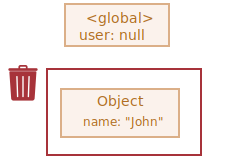
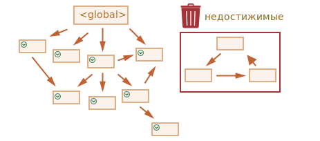

<<<<<<< HEAD
# Сборка мусора

Управление памятью в JavaScript выполняется автоматически и незаметно. Мы создаём примитивы, объекты, функции... Всё это занимает память.

Но что происходит, когда что-то больше не нужно? Как движок JavaScript обнаруживает, что пора очищать память?

## Достижимость

Основной концепцией управления памятью в JavaScript является принцип *достижимости*.

Если упростить, то "достижимые" значения - это те, которые доступны или используются. Они гарантированно находятся в памяти.

1. Существует базовое множество достижимых значений, которые не могут быть удалены.

    Например:

    - Выполняемая в данный момент функция, её локальные переменные и параметры.
    - Другие функции в текущей цепочке вложенных вызовов, их локальные переменные и параметры.
    - Глобальные переменные.
    - (некоторые другие внутренние значения)

    Эти значения мы будем называть *корнями*.

2. Любое другое значение считается достижимым, если оно доступно из корня по ссылке или по цепочке ссылок.

    Например, если в глобальной переменной есть объект, и он имеет свойство, в котором хранится ссылка на другой объект, то *этот* объект считается достижимым. И те, на которые он ссылается, тоже достижимы. Далее вы познакомитесь с подробными примерами на эту тему.

В движке JavaScript есть фоновый процесс, который называется [сборщиком мусора](https://ru.wikipedia.org/wiki/Сборка_мусора). Он отслеживает все объекты и удаляет те, которые стали недоступными.

## Простой пример

Вот самый простой пример:

```js
// в user находится ссылка на объект
=======
# Garbage collection

Memory management in JavaScript is performed automatically and invisibly to us. We create primitives, objects, functions... All that takes memory.

What happens when something is not needed any more? How does the JavaScript engine discover it and clean it up?

## Reachability

The main concept of memory management in JavaScript is *reachability*.

Simply put, "reachable" values are those that are accessible or usable somehow. They are guaranteed to be stored in memory.

1. There's a base set of inherently reachable values, that cannot be deleted for obvious reasons.

    For instance:

    - The currently executing function, its local variables and parameters.
    - Other functions on the current chain of nested calls, their local variables and parameters.
    - Global variables.
    - (there are some other, internal ones as well)

    These values are called *roots*.

2. Any other value is considered reachable if it's reachable from a root by a reference or by a chain of references.

    For instance, if there's an object in a global variable, and that object has a property referencing another object, *that* object is considered reachable. And those that it references are also reachable. Detailed examples to follow.

There's a background process in the JavaScript engine that is called [garbage collector](https://en.wikipedia.org/wiki/Garbage_collection_(computer_science)). It monitors all objects and removes those that have become unreachable.

## A simple example

Here's the simplest example:

```js
// user has a reference to the object
>>>>>>> d78b01e9833009fab534462e05c03cffc51bf0e3
let user = {
  name: "John"
};
```


<<<<<<< HEAD
Здесь стрелка обозначает ссылку на объект. Глобальная переменная `user` ссылается на объект `{name: "John"}` (мы будем называть его просто "John" для краткости). В свойстве `"name"` объекта John хранится примитив, поэтому оно нарисовано внутри объекта.

Если перезаписать значение `user`, то ссылка потеряется:
=======
Here the arrow depicts an object reference. The global variable `"user"` references the object `{name: "John"}` (we'll call it John for brevity). The `"name"` property of John stores a primitive, so it's painted inside the object.

If the value of `user` is overwritten, the reference is lost:
>>>>>>> d78b01e9833009fab534462e05c03cffc51bf0e3

```js
user = null;
```



<<<<<<< HEAD
Теперь объект John становится недостижимым. К нему нет доступа, на него нет ссылок. Сборщик мусора удалит эти данные и освободит память.

## Две ссылки

Представим, что мы скопировали ссылку из `user` в `admin`:

```js
// в user находится ссылка на объект
=======
Now John becomes unreachable. There's no way to access it, no references to it. Garbage collector will junk the data and free the memory.

## Two references

Now let's imagine we copied the reference from `user` to `admin`:

```js
// user has a reference to the object
>>>>>>> d78b01e9833009fab534462e05c03cffc51bf0e3
let user = {
  name: "John"
};

*!*
let admin = user;
*/!*
```


<<<<<<< HEAD
Теперь, если мы сделаем то же самое:
=======
Now if we do the same:
>>>>>>> d78b01e9833009fab534462e05c03cffc51bf0e3
```js
user = null;
```

<<<<<<< HEAD
...то объект John всё ещё достижим через глобальную переменную `admin`, поэтому он находится в памяти. Если бы мы также перезаписали `admin`, то John был бы удалён.

## Взаимосвязанные объекты

Теперь более сложный пример. Семья:
=======
...Then the object is still reachable via `admin` global variable, so it must stay in memory. If we overwrite `admin` too, then it can be removed.

## Interlinked objects

Now a more complex example. The family:
>>>>>>> d78b01e9833009fab534462e05c03cffc51bf0e3

```js
function marry(man, woman) {
  woman.husband = man;
  man.wife = woman;

  return {
    father: man,
    mother: woman
  }
}

let family = marry({
  name: "John"
}, {
  name: "Ann"
});
```

<<<<<<< HEAD
Функция `marry` "женит" два объекта, давая им ссылки друг на друга, и возвращает новый объект, содержащий ссылки на два предыдущих.

В результате получаем такую структуру памяти:


На данный момент все объекты достижимы.

Теперь удалим две ссылки:
=======
Function `marry` "marries" two objects by giving them references to each other and returns a new object that contains them both.

The resulting memory structure:


As of now, all objects are reachable.

Now let's remove two references:
>>>>>>> d78b01e9833009fab534462e05c03cffc51bf0e3

```js
delete family.father;
delete family.mother.husband;
```


<<<<<<< HEAD
Недостаточно удалить только одну из этих двух ссылок, потому что все объекты останутся достижимыми.

Но если мы удалим обе, то увидим, что у объекта John больше нет входящих ссылок:


Исходящие ссылки не имеют значения. Только входящие ссылки могут сделать объект достижимым. Объект John теперь недостижим и будет удалён из памяти со всеми своими данными, которые также стали недоступны.

После сборки мусора:


## Недостижимый "остров"

Вполне возможна ситуация, при которой целый "остров" взаимосвязанных объектов может стать недостижимым и удалиться из памяти.

Возьмём объект `family` из примера выше. А затем:
=======
It's not enough to delete only one of these two references, because all objects would still be reachable.

But if we delete both, then we can see that John has no incoming reference any more:


Outgoing references do not matter. Only incoming ones can make an object reachable. So, John is now unreachable and will be removed from the memory with all its data that also became unaccessible.

After garbage collection:


## Unreachable island

It is possible that the whole island of interlinked objects becomes unreachable and is removed from the memory.

The source object is the same as above. Then:
>>>>>>> d78b01e9833009fab534462e05c03cffc51bf0e3

```js
family = null;
```

<<<<<<< HEAD
Структура в памяти теперь станет такой:


Этот пример демонстрирует, насколько важна концепция достижимости.

Объекты John и Ann всё ещё связаны, оба имеют входящие ссылки, но этого недостаточно.

Бывший объект `family` был отсоединён от корня, на него больше нет ссылки, поэтому весь "остров" становится недостижимым и будет удалён.

## Внутренние алгоритмы

Основной алгоритм сборки мусора называется "алгоритм пометок" (от англ. "mark-and-sweep").

Согласно этому алгоритму, сборщик мусора регулярно выполняет следующие шаги:

- Сборщик мусора "помечает" (запоминает) все корневые объекты.
- Затем он идёт по ним и "помечает" все ссылки из них.
- Затем он идёт по отмеченным объектам и отмечает их ссылки. Все посещённые объекты запоминаются, чтобы в будущем не посещать один и тот же объект дважды.
- ...И так далее, пока не будут посещены все достижимые (из корней) ссылки.
- Все непомеченные объекты удаляются.

Например, пусть наша структура объектов выглядит так:


Мы ясно видим "недостижимый остров" справа. Теперь давайте посмотрим, как будет работать "алгоритм пометок" сборщика мусора.

На первом шаге помечаются корни:


Затем помечаются объекты по их ссылкам:


...А затем объекты по их ссылкам и так далее, пока это возможно:


Теперь объекты, которые не удалось посетить в процессе, считаются недостижимыми и будут удалены:



Мы также можем представить себе этот процесс как выливание огромного ведра краски из корней, которая течёт по всем ссылкам и отмечает все достижимые объекты. Затем непомеченные удаляются.

Это концепция того, как работает сборка мусора. Движки JavaScript применяют множество оптимизаций, чтобы она работала быстрее и не задерживала выполнение кода.

Вот некоторые из оптимизаций:

- **Сборка по поколениям (Generational collection)** – объекты делятся на два набора: "новые" и "старые". В типичном коде многие объекты имеют короткую жизнь: они появляются, выполняют свою работу и быстро умирают, так что имеет смысл отслеживать новые объекты и, если это так, быстро очищать от них память. Те, которые выживают достаточно долго, становятся "старыми" и проверяются реже.
- **Инкрементальная сборка (Incremental collection)** – если объектов много, и мы пытаемся обойти и пометить весь набор объектов сразу, это может занять некоторое время и привести к видимым задержкам в выполнении скрипта. Так что движок делит всё множество объектов на части, и далее очищает их одну за другой. Получается несколько небольших сборок мусора вместо одной всеобщей. Это требует дополнительного учёта для отслеживания изменений между частями, но зато получается много крошечных задержек вместо одной большой.
- **Сборка в свободное время (Idle-time collection)** - чтобы уменьшить возможное влияние на производительность, сборщик мусора старается работать только во время простоя процессора.

Существуют и другие способы оптимизации и разновидности алгоритмов сборки мусора. Но как бы мне ни хотелось описать их здесь, я должен воздержаться, потому что разные движки реализуют разные хитрости и методы. И, что ещё более важно, все меняется по мере развития движков, поэтому изучать тему глубоко "заранее", без реальной необходимости, вероятно, не стоит. Если, конечно, это не вопрос чистого интереса, тогда для вас будет несколько ссылок ниже.

## Итого

Главное, что нужно знать:

- Сборка мусора выполняется автоматически. Мы не можем ускорить или предотвратить её.
- Объекты сохраняются в памяти, пока они достижимы.
- Если на объект есть ссылка - вовсе не факт, что он является достижимым (из корня): набор взаимосвязанных объектов может стать недоступен в целом, как мы видели в примере выше.

Современные движки реализуют разные продвинутые алгоритмы сборки мусора.

О многих из них рассказано в прекрасной книге о сборке мусора "The Garbage Collection Handbook: The Art of Automatic Memory Management" (R. Jones и др.).

Если вы знакомы с низкоуровневым программированием, то более подробная информация о сборщике мусора V8 находится в статье [A tour of V8: Garbage Collection](https://jayconrod.com/posts/55/a-tour-of-v8-garbage-collection).

Также в [блоге V8](https://v8.dev/) время от времени публикуются статьи об изменениях в управлении памятью. Разумеется, чтобы изучить сборку мусора, вам лучше подготовиться, узнав о том как устроен движок V8 внутри в целом и почитав блог [Вячеслава Егорова](https://mrale.ph), одного из инженеров, разрабатывавших V8. Я говорю про "V8", потому что он лучше всего освещается в статьях в Интернете. Для других движков многие подходы схожи, но сборка мусора отличается во многих аспектах.

Глубокое понимание работы движков полезно, когда вам нужна низкоуровневая оптимизация. Было бы разумно запланировать их изучение как следующий шаг после того, как вы познакомитесь с языком.
=======
The in-memory picture becomes:


This example demonstrates how important the concept of reachability is.

It's obvious that John and Ann are still linked, both have incoming references. But that's not enough.

The former `"family"` object has been unlinked from the root, there's no reference to it any more, so the whole island becomes unreachable and will be removed.

## Internal algorithms

The basic garbage collection algorithm is called "mark-and-sweep".

The following "garbage collection" steps are regularly performed:

- The garbage collector takes roots and "marks" (remembers) them.
- Then it visits and "marks" all references from them.
- Then it visits marked objects and marks *their* references. All visited objects are remembered, so as not to visit the same object twice in the future.
- ...And so on until every reachable (from the roots) references are visited.
- All objects except marked ones are removed.

For instance, let our object structure look like this:


We can clearly see an "unreachable island" to the right side. Now let's see how "mark-and-sweep" garbage collector deals with it.

The first step marks the roots:


Then we follow their references and mark referenced objects:


...And continue to follow further references, while possible:


Now the objects that could not be visited in the process are considered unreachable and will be removed:


We can also imagine the process as spilling a huge bucket of paint from the roots, that flows through all references and marks all reachable objects. The unmarked ones are then removed.

That's the concept of how garbage collection works. JavaScript engines apply many optimizations to make it run faster and not introduce any delays into the code execution.

Some of the optimizations:

- **Generational collection** -- objects are split into two sets: "new ones" and "old ones". In typical code, many objects have a short life span: they appear, do their job and die fast, so it makes sense to track new objects and clear the memory from them if that's the case. Those that survive for long enough, become "old" and are examined less often.
- **Incremental collection** -- if there are many objects, and we try to walk and mark the whole object set at once, it may take some time and introduce visible delays in the execution. So the engine splits the whole set of existing objects into multiple parts. And then clear these parts one after another. There are many small garbage collections instead of a total one. That requires some extra bookkeeping between them to track changes, but we get many tiny delays instead of a big one.
- **Idle-time collection** -- the garbage collector tries to run only while the CPU is idle, to reduce the possible effect on the execution.

There exist other optimizations and flavours of garbage collection algorithms. As much as I'd like to describe them here, I have to hold off, because different engines implement different tweaks and techniques. And, what's even more important, things change as engines develop, so studying deeper "in advance", without a real need is probably not worth that. Unless, of course, it is a matter of pure interest, then there will be some links for you below.

## Summary

The main things to know:

- Garbage collection is performed automatically. We cannot force or prevent it.
- Objects are retained in memory while they are reachable.
- Being referenced is not the same as being reachable (from a root): a pack of interlinked objects can become unreachable as a whole, as we've seen in the example above.

Modern engines implement advanced algorithms of garbage collection.

A general book "The Garbage Collection Handbook: The Art of Automatic Memory Management" (R. Jones et al) covers some of them.

If you are familiar with low-level programming, more detailed information about V8's garbage collector is in the article [A tour of V8: Garbage Collection](https://jayconrod.com/posts/55/a-tour-of-v8-garbage-collection).

The [V8 blog](https://v8.dev/) also publishes articles about changes in memory management from time to time. Naturally, to learn more about garbage collection, you'd better prepare by learning about V8 internals in general and read the blog of [Vyacheslav Egorov](https://mrale.ph) who worked as one of the V8 engineers. I'm saying: "V8", because it is best covered by articles on the internet. For other engines, many approaches are similar, but garbage collection differs in many aspects.

In-depth knowledge of engines is good when you need low-level optimizations. It would be wise to plan that as the next step after you're familiar with the language.
>>>>>>> d78b01e9833009fab534462e05c03cffc51bf0e3
