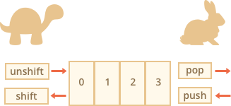
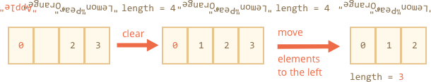
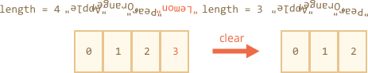

# Массивы

Массивы - объекты позволяющие хранить именованные коллекции значений. Это замечательно.

Но довольно часто мы понимаем, что нам необходима _упорядоченная коллекция_ данных, в которой присутствуют 1-й, 2-й, 3-й элементы и т.д. Например, она понадобится нам для хранения списка чего-либо: пользователей, товаров, элементов HTML и т.д.  

В этом случае использовать объект неудобно, так как он не предоставляет методов управления порядком элементов. Мы не можем вставить новое свойство "между" уже существующими. Объекты просто не предназначены для этих целей.

Для хранения упорядоченных коллекций существует особая структура данных, которая называется `Массив`.

## Объявление

Существует два варианта синтаксиса для создания пустого массива:

```js
let arr = new Array();
let arr = [];
```

Практически всегда используется второй вариант синтаксиса. В скобках мы можем указать начальные значения элементов:

```js
let fruits = ["Яблоко", "Апельсин", "Слива"];
```

Элементы массива нумеруются, начиная с нуля. 

Мы можем получить элемент, указав его номер в квадратных скобках: 

```js run
let fruits = ["Яблоко", "Апельсин", "Слива"];

alert( fruits[0] ); // Яблоко
alert( fruits[1] ); // Апельсин
alert( fruits[2] ); // Слива
```

Мы можем заменить элемент: 

```js
fruits[2] = 'Груша'; // теперь ["Яблоко", "Апельсин", "Груша"]
```

… Или добавить новый к существующему массиву: 

```js
fruits[3] = 'Лимон'; // теперь ["Яблоко", "Апельсин", "Груша", "Лимон"]
```

Общее число элементов массива содержится в его свойстве `length`: 

```js run
let fruits = ["Яблоко", "Апельсин", "Слива"];

alert( fruits.length ); // 3
```

Вывести массив целиком можно при помощи `alert`.

```js run
let fruits = ["Яблоко", "Апельсин", "Слива"];

alert( fruits ); // Яблоко, Апельсин, Слива
```

В массиве могут храниться элементы любого типа. 

Например:

```js run no-beautify
// разные типы значений
let arr = [ 'Яблоко', { name: 'Джон' }, true, function() { alert('привет'); } ];

// получить элемент с индексом 1(объект) и затем показать его свойство
alert( arr[1].name ); // Джон

// получить элемент с индексом 3(функция) и выполнить её
arr[3](); // привет
```

````smart header="Trailing comma"
Массив, так же, как и объект, может оканчиваться запятой:
```js 
let fruits = [
  "Яблоко", 
  "Апельсин", 
  "Слива"*!*,*/!*
];
```

«Замыкающая запятая» упрощает процесс добавления/удаления элементов, так как все строки становятся идентичными.
````

## Методы pop/push, shift/unshift


## Methods pop/push, shift/unshift

A [queue](https://en.wikipedia.org/wiki/Queue_(abstract_data_type)) is one of most common uses of an array. In computer science, this means an ordered collection of elements which supports two operations:

- `push` appends an element to the end.
- `shift` get an element from the beginning, advancing the queue, so that the 2nd element becomes the 1st.


Arrays support both operations.

In practice we need it very often. For example, a queue of messages that need to be shown on-screen.

There's another use case for arrays -- the data structure named [stack](https://en.wikipedia.org/wiki/Stack_(abstract_data_type)). 

It supports two operations:

- `push` adds an element to the end.
- `pop` takes an element from the end.

So new elements are added or taken always from the "end".

A stack is usually illustrated as a pack of cards: new cards are added to the top or taken from the top:


For stacks, the latest pushed item is received first, that's also called LIFO (Last-In-First-Out) principle. For queues, we have FIFO (First-In-First-Out).

Arrays in JavaScript can work both as a queue and as a stack. They allow you to add/remove elements both to/from the beginning or the end. 

In computer science the data structure that allows it is called [deque](https://en.wikipedia.org/wiki/Double-ended_queue).

**Methods that work with the end of the array:**

`pop`
: Extracts the last element of the array and returns it:

    ```js run
    let fruits = ["Apple", "Orange", "Pear"];

    alert( fruits.pop() ); // remove "Pear" and alert it

    alert( fruits ); // Apple, Orange
    ```

`push`
: Append the element to the end of the array:

    ```js run
    let fruits = ["Apple", "Orange"];

    fruits.push("Pear");

    alert( fruits ); // Apple, Orange, Pear
    ```

    The call `fruits.push(...)` is equal to `fruits[fruits.length] = ...`.

**Methods that work with the beginning of the array:**

`shift`
: Extracts the first element of the array and returns it:

    ```js
    let fruits = ["Apple", "Orange", "Pear"];

    alert( fruits.shift() ); // remove Apple and alert it

    alert( fruits ); // Orange, Pear
    ```

`unshift`
: Add the element to the beginning of the array:

    ```js
    let fruits = ["Orange", "Pear"];

    fruits.unshift('Apple');

    alert( fruits ); // Apple, Orange, Pear
    ```

Methods `push` and `unshift` can add multiple elements at once:

```js run
let fruits = ["Apple"];

fruits.push("Orange", "Peach");
fruits.unshift("Pineapple", "Lemon");

// ["Pineapple", "Lemon", "Apple", "Orange", "Peach"]
alert( fruits );
```

## Internals

An array is a special kind of object. The square brackets used to access a property `arr[0]` actually come from the object syntax. Numbers are used as keys. 

They extend objects providing special methods to work with ordered collections of data and also the `length` property. But at the core it's still an object.

Remember, there are only 7 basic types in JavaScript. Array is an object and thus behaves like an object. 

For instance, it is copied by reference:

```js run
let fruits = ["Banana"]

let arr = fruits; // copy by reference (two variables reference the same array)

alert( arr === fruits ); // true
 
arr.push("Pear"); // modify the array by reference

alert( fruits ); // Banana, Pear - 2 items now
```

...But what makes arrays really  special is their internal representation. The engine tries to store its elements in the contiguous memory area, one after another, just as depicted on the illustrations in this chapter, and there are other optimizations as well, to make arrays work really fast.

But they all break if we quit working with an array as with an "ordered collection" and start working with it as if it were a regular object.

For instance, technically we can do this:

```js
let fruits = []; // make an array

fruits[99999] = 5; // assign a property with the index far greater than its length

fruits.age = 25; // create a property with an arbitrary name
```

That's possible, because arrays are objects at their base. We can add any properties to them.

But the engine will see that we're working with the array as with a regular object. Array-specific optimizations are not suited for such cases and will be turned off, their benefits disappear.

The ways to misuse an array:

- Add a non-numeric property like `arr.test = 5`. 
- Make holes, like: add `arr[0]` and then `arr[1000]` (and nothing between them).
- Fill the array in the reverse order, like `arr[1000]`, `arr[999]` and so on.

Please think of arrays as special structures to work with the *ordered data*. They provide special methods for that. Arrays are carefully tuned inside JavaScript engines to work with contiguous ordered data, please use them this way. And if you need arbitrary keys, chances are high that you actually require a regular object `{}`.

## Performance

Methods `push/pop` run fast, while `shift/unshift` are slow.



Why is it faster to work with the end of an array than with its beginning? Let's see what happens during the execution:

```js
fruits.shift(); // take 1 element from the start
```

It's not enough to take and remove the element with the number `0`. Other elements need to be renumbered as well.

The `shift` operation must do 3 things:

1. Remove the element with the index `0`.
2. Move all elements to the left, renumber them from the index `1` to `0`, from `2` to `1` and so on.
3. Update the `length` property.



**The more elements in the array, the more time to move them, more in-memory operations.**

The similar thing happens with `unshift`: to add an element to the beginning of the array, we need first to move existing elements to the right, increasing their indexes.

And what's with `push/pop`? They do not need to move anything. To extract an element from the end, the `pop` method cleans the index and shortens `length`.

The actions for the `pop` operation:

```js
fruits.pop(); // take 1 element from the end
```



**The `pop` method does not need to move anything, because other elements keep their indexes. That's why it's blazingly fast.**

The similar thing with the `push` method.

## Loops

One of the oldest ways to cycle array items is the `for` loop over indexes:

```js run
let arr = ["Apple", "Orange", "Pear"];

*!*
for (let i = 0; i < arr.length; i++) {
*/!*
  alert( arr[i] );
}
```

But for arrays there is another form of loop, `for..of`:

```js run
let fruits = ["Apple", "Orange", "Plum"];

// iterates over array elements
for (let fruit of fruits) {
  alert( fruit ); 
}
```

The `for..of` doesn't give access to the number of the current element, just its value, but in most cases that's enough. And it's shorter.

Technically, because arrays are objects, it is also possible to use `for..in`:

```js run
let arr = ["Apple", "Orange", "Pear"];

*!*
for (let key in arr) {
*/!*
  alert( arr[key] ); // Apple, Orange, Pear
}
```

But that's actually a bad idea. There are potential problems with it:

1. The loop `for..in` iterates over *all properties*, not only the numeric ones.

    There are so-called "array-like" objects in the browser and in other environments, that *look like arrays*. That is, they have `length` and indexes properties, but they may also have other non-numeric properties and methods, which we usually don't need. The `for..in` loop will list them though. So if we need to work with array-like objects, then these "extra" properties can become a problem.

2. The `for..in` loop is optimized for generic objects, not arrays, and thus is 10-100 times slower. Of course, it's still very fast. The speedup may only matter in bottlenecks or seem irrelevant. But still we should be aware of the difference.

Generally, we shouldn't use `for..in` for arrays.


## A word about "length"

The `length` property automatically updates when we modify the array. To be precise, it is actually not the count of values in the array, but the greatest numeric index plus one.

For instance, a single element with a large index gives a big length:

```js run
let fruits = [];
fruits[123] = "Apple";

alert( fruits.length ); // 124
```

Note that we usually don't use arrays like that. 

Another interesting thing about the `length` property is that it's writable.

If we increase it manually, nothing interesting happens. But if we decrease it, the array is truncated. The process is irreversible, here's the example:

```js run
let arr = [1, 2, 3, 4, 5];

arr.length = 2; // truncate to 2 elements
alert( arr ); // [1, 2]

arr.length = 5; // return length back
alert( arr[3] ); // undefined: the values do not return
```

So, the simplest way to clear the array is: `arr.length = 0;`.


## new Array() [#new-array]

There is one more syntax to create an array:

```js
let arr = *!*new Array*/!*("Apple", "Pear", "etc");
```

It's rarely used, because square brackets `[]` are shorter. Also there's a tricky feature with it.

If `new Array` is called with a single argument which is a number, then it creates an array *without items, but with the given length*.

Let's see how one can shoot themself in the foot:

```js run
let arr = new Array(2); // will it create an array of [2] ?

alert( arr[0] ); // undefined! no elements.

alert( arr.length ); // length 2
```

In the code above, `new Array(number)` has all elements `undefined`.

To evade such surprises, we usually use square brackets, unless we really know what we're doing.

## Multidimensional arrays

Arrays can have items that are also arrays. We can use it for multidimensional arrays, to store matrices:

```js run
let matrix = [
  [1, 2, 3],
  [4, 5, 6],
  [7, 8, 9]
];

alert( matrix[1][1] ); // the central element
```

## toString

Arrays have their own implementation of `toString` method that returns a comma-separated list of elements.

For instance:


```js run
let arr = [1, 2, 3];

alert( arr ); // 1,2,3
alert( String(arr) === '1,2,3' ); // true
```

Also, let's try this:

```js run
alert( [] + 1 ); // "1"
alert( [1] + 1 ); // "11"
alert( [1,2] + 1 ); // "1,21"
```

Arrays do not have `Symbol.toPrimitive`, neither a viable `valueOf`, they implement only `toString` conversion, so here `[]` becomes an empty string, `[1]` becomes `"1"` and `[1,2]` becomes `"1,2"`.

When the binary plus `"+"` operator adds something to a string, it converts it to a string as well, so the next step looks like this:

```js run
alert( "" + 1 ); // "1"
alert( "1" + 1 ); // "11"
alert( "1,2" + 1 ); // "1,21"
```

## Summary

Array is a special kind of object, suited to storing and managing ordered data items.

- The declaration:

    ```js
    // square brackets (usual)
    let arr = [item1, item2...];

    // new Array (exceptionally rare)
    let arr = new Array(item1, item2...);
    ```

    The call to `new Array(number)` creates an array with the given length, but without elements.

- The `length` property is the array length or, to be precise, its last numeric index plus one. It is auto-adjusted by array methods. 
- If we shorten `length` manually, the array is truncated.

We can use an array as a deque with the following operations:

- `push(...items)` adds `items` to the end.
- `pop()` removes the element from the end and returns it.
- `shift()` removes the element from the beginning and returns it.
- `unshift(...items)` adds items to the beginning.

To loop over the elements of the array:
  - `for (let i=0; i<arr.length; i++)` -- works fastest, old-browser-compatible.
  - `for (let item of arr)` -- the modern syntax for items only,
  - `for (let i in arr)` -- never use.

We will return to arrays and study more methods to add, remove, extract elements and sort arrays in the chapter <info:array-methods>.

