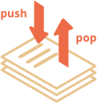
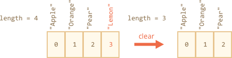

# Массивы

Массивы - объекты позволяющие хранить именованные коллекции значений. Это замечательно.

Но довольно часто мы понимаем, что нам необходима _упорядоченная коллекция_ данных, в которой присутствуют 1-й, 2-й, 3-й элементы и т.д. Например, она понадобится нам для хранения списка чего-либо: пользователей, товаров, элементов HTML и т.д.  

В этом случае использовать объект неудобно, так как он не предоставляет методов управления порядком элементов. Мы не можем вставить новое свойство "между" уже существующими. Объекты просто не предназначены для этих целей.

Для хранения упорядоченных коллекций существует особая структура данных, которая называется `Массив`.

## Объявление

Существует два варианта синтаксиса для создания пустого массива:

```js
let arr = new Array();
let arr = [];
```

Практически всегда используется второй вариант синтаксиса. В скобках мы можем указать начальные значения элементов:

```js
let fruits = ["Яблоко", "Апельсин", "Слива"];
```

Элементы массива нумеруются, начиная с нуля. 

Мы можем получить элемент, указав его номер в квадратных скобках: 

```js run
let fruits = ["Яблоко", "Апельсин", "Слива"];

alert( fruits[0] ); // Яблоко
alert( fruits[1] ); // Апельсин
alert( fruits[2] ); // Слива
```

Мы можем заменить элемент: 

```js
fruits[2] = 'Груша'; // теперь ["Яблоко", "Апельсин", "Груша"]
```

… Или добавить новый к существующему массиву: 

```js
fruits[3] = 'Лимон'; // теперь ["Яблоко", "Апельсин", "Груша", "Лимон"]
```

Общее число элементов массива содержится в его свойстве `length`: 

```js run
let fruits = ["Яблоко", "Апельсин", "Слива"];

alert( fruits.length ); // 3
```

Вывести массив целиком можно при помощи `alert`.

```js run
let fruits = ["Яблоко", "Апельсин", "Слива"];

alert( fruits ); // Яблоко, Апельсин, Слива
```

В массиве могут храниться элементы любого типа. 

Например:

```js run no-beautify
// разные типы значений
let arr = [ 'Яблоко', { name: 'Джон' }, true, function() { alert('привет'); } ];

// получить элемент с индексом 1(объект) и затем показать его свойство
alert( arr[1].name ); // Джон

// получить элемент с индексом 3(функция) и выполнить её
arr[3](); // привет
```

````smart header="Trailing comma"
Массив, так же, как и объект, может оканчиваться запятой:
```js 
let fruits = [
  "Яблоко", 
  "Апельсин", 
  "Слива"*!*,*/!*
];
```

«Замыкающая запятая» упрощает процесс добавления/удаления элементов, так как все строки становятся идентичными.
````

## Методы pop/push, shift/unshift

[Очередь](https://en.wikipedia.org/wiki/Queue_(abstract_data_type)) – один из самых распространенных вариантов применения массива. В области компьютерных наук так называется упорядоченная коллекция элементов, поддерживающая два вида операций:

- `push` добавляет элемент в конец.
- `shift` удаляет элемент в начале, сдвигая очередь вверх, так что второй элемент становится первым. 


Массивы поддерживают обе операции.

На практике необходимость в этом возникает очень часто. Например, очередь сообщений, которые надо показать на экране.

Существует и другой вариант применения для массивов – структура данных, называемая [стек](https://en.wikipedia.org/wiki/Stack_(abstract_data_type)).

Она поддерживает два вида операций: 

- `push` добавляет элемент в конец.
- `pop` удаляет последний элемент.

Таким образом, новые элементы всегда добавляются или удаляются из «конца».

Примером стека обычно служит колода карт: новые карты кладутся наверх и берутся тоже сверху:



При использовании стека, последний добавленный элемент получают первым, что является действием принципа LIFO (последним пришёл – первым ушёл). Для очереди - FIFO (первым пришёл – первым ушёл).

Массивы в JavaScript могут работать и как очередь, и как стек. Это позволяет вам добавлять/удалять элементы как в начале, так и в конце массива.

В компьютерных науках структура данных, делающая это возможным, называется двусторонняя [очередь](https://en.wikipedia.org/wiki/Double-ended_queue).

**Методы, работающие с концом массива:**

`pop` 
: Удаляет последний элемент из массива и возвращает его:

```js run
let fruits = ["Яблоко", "Апельсин", "Pear"];

alert( fruits.pop() ); // удаляем "Груша" и выводим его

alert( fruits ); // Яблоко, Апельсин
```
    
`push`
: Добавляет элемент в конец массива: 

```js run
let fruits = ["Яблоко", "Апельсин"];

fruits.push("Груша");

alert( fruits ); // Яблоко, Апельсин, Груша
```

Вызов `fruits.push(...)` равнозначен `fruits[fruits.length] = ...`.

**Методы, работающие с началом массива:**

`shift`
: Удаляет из массива первый элемент и возвращает его:

```js
let fruits = ["Яблоко", "Апельсин", "Груша"];

alert( fruits.shift() ); // удаляем Яблоко и выводим

alert( fruits ); // Апельсин, Груша
```
    
`unshift`
: Добавляет элемент в начало массива:

```js
let fruits = ["Апельсин", "Груша"];

fruits.unshift('Яблоко');

alert( fruits ); // Яблоко, Апельсин, Груша
```

Методы `push` и `unshift` могут добавлять сразу несколько элементов:  

```js run
let fruits = ["Яблоко"];

fruits.push("Апельсин", "Груша");
fruits.unshift("Ананас", "Лимон");

// ["Ананас", "Лимон", "Яблоко", "Апельсин", "Груша"]
alert( fruits );
```

## Внутреннее устройство массива

Массив – это объект особого вида. Квадратные скобки, используемые для того, чтобы получить доступ к свойству arr[0], фактически обусловлены синтаксисом объекта. В качестве ключей используются цифры.

Они (массивы) расширяют объекты, так как предусматривают специальные методы для работы с упорядоченными коллекциями данных, а также свойство length. Но в основе все равно лежит объект.

Следует помнить, что в JavaScript  существует всего 7 основных типов данных. Массив является объектом и, следовательно, ведет себя как объект.

Например, копируется по ссылке: 

```js run
let fruits = ["Банан"]

let arr = fruits; // копируется по ссылке (2 переменных ссылаются на один и тот же массив)

alert( arr === fruits ); // true
 
arr.push("Груша"); // массив меняется по ссылке

alert( fruits ); // Банан, Груша - теперь 2 элемента
```

...Но то, что действительно делает массивы особенными  - это их внутреннее представление. Программа старается хранить элементы массива в виде непрерывной области памяти, один за другим, так, как это показано на иллюстрациях к этой главе. Существуют и другие способы оптимизации, заставляющие массив работать действительно быстро.

Но все они утратят эффективность, если мы перестанем работать с массивом, как с «упорядоченной коллекцией данных», и начнем использовать его как обычный объект.

Например, технически, мы можем сделать следующее:

```js
let fruits = []; // создаём массив

fruits[99999] = 5; // создаём свойство с индексом намного превышающим длину массива

fruits.age = 25; // создаём свойство с произвольным именем
```

Это возможно, потому что в основе массива лежит объект. Мы можем присвоить ему любые свойства. 

Но программа поймет, что мы работаем с массивом, как с обычным объектом. Способы оптимизации, используемые для массивов, в этом случае не подходят и поэтому они будут отключены и никакой выгоды не принесут.

Варианты неправильного применения массива:

- Добавление нецифрового свойства, например:  `arr.test = 5`.
- Создание «дыр», например: добавление arr[0], затем arr[1000] (между ними ничего нет).
- Заполнение массива в обратном порядке, например: arr[1000], arr[999] и т.д.

Массив следует считать особой структурой, позволяющей работать с *упорядоченными данными*. Для этого массивы предоставляют специальные методы. Массивы прекрасно встраиваются в программы JavaScript, когда возникает необходимость работы с односвязными упорядоченными данными, поэтому, пожалуйста, используйте их в таких случаях. В случае если вам нужны произвольные ключи, скорее всего вам потребуется обычный объект `{}`.

## Performance

Methods `push/pop` run fast, while `shift/unshift` are slow.


Why is it faster to work with the end of an array than with its beginning? Let's see what happens during the execution:

```js
fruits.shift(); // take 1 element from the start
```

It's not enough to take and remove the element with the number `0`. Other elements need to be renumbered as well.

The `shift` operation must do 3 things:

1. Remove the element with the index `0`.
2. Move all elements to the left, renumber them from the index `1` to `0`, from `2` to `1` and so on.
3. Update the `length` property.


**The more elements in the array, the more time to move them, more in-memory operations.**

The similar thing happens with `unshift`: to add an element to the beginning of the array, we need first to move existing elements to the right, increasing their indexes.

And what's with `push/pop`? They do not need to move anything. To extract an element from the end, the `pop` method cleans the index and shortens `length`.

The actions for the `pop` operation:

```js
fruits.pop(); // take 1 element from the end
```



**The `pop` method does not need to move anything, because other elements keep their indexes. That's why it's blazingly fast.**

The similar thing with the `push` method.

## Loops

One of the oldest ways to cycle array items is the `for` loop over indexes:

```js run
let arr = ["Apple", "Orange", "Pear"];

*!*
for (let i = 0; i < arr.length; i++) {
*/!*
  alert( arr[i] );
}
```

But for arrays there is another form of loop, `for..of`:

```js run
let fruits = ["Apple", "Orange", "Plum"];

// iterates over array elements
for (let fruit of fruits) {
  alert( fruit ); 
}
```

The `for..of` doesn't give access to the number of the current element, just its value, but in most cases that's enough. And it's shorter.

Technically, because arrays are objects, it is also possible to use `for..in`:

```js run
let arr = ["Apple", "Orange", "Pear"];

*!*
for (let key in arr) {
*/!*
  alert( arr[key] ); // Apple, Orange, Pear
}
```

But that's actually a bad idea. There are potential problems with it:

1. The loop `for..in` iterates over *all properties*, not only the numeric ones.

    There are so-called "array-like" objects in the browser and in other environments, that *look like arrays*. That is, they have `length` and indexes properties, but they may also have other non-numeric properties and methods, which we usually don't need. The `for..in` loop will list them though. So if we need to work with array-like objects, then these "extra" properties can become a problem.

2. The `for..in` loop is optimized for generic objects, not arrays, and thus is 10-100 times slower. Of course, it's still very fast. The speedup may only matter in bottlenecks or seem irrelevant. But still we should be aware of the difference.

Generally, we shouldn't use `for..in` for arrays.


## A word about "length"

The `length` property automatically updates when we modify the array. To be precise, it is actually not the count of values in the array, but the greatest numeric index plus one.

For instance, a single element with a large index gives a big length:

```js run
let fruits = [];
fruits[123] = "Apple";

alert( fruits.length ); // 124
```

Note that we usually don't use arrays like that. 

Another interesting thing about the `length` property is that it's writable.

If we increase it manually, nothing interesting happens. But if we decrease it, the array is truncated. The process is irreversible, here's the example:

```js run
let arr = [1, 2, 3, 4, 5];

arr.length = 2; // truncate to 2 elements
alert( arr ); // [1, 2]

arr.length = 5; // return length back
alert( arr[3] ); // undefined: the values do not return
```

So, the simplest way to clear the array is: `arr.length = 0;`.


## new Array() [#new-array]

There is one more syntax to create an array:

```js
let arr = *!*new Array*/!*("Apple", "Pear", "etc");
```

It's rarely used, because square brackets `[]` are shorter. Also there's a tricky feature with it.

If `new Array` is called with a single argument which is a number, then it creates an array *without items, but with the given length*.

Let's see how one can shoot themself in the foot:

```js run
let arr = new Array(2); // will it create an array of [2] ?

alert( arr[0] ); // undefined! no elements.

alert( arr.length ); // length 2
```

In the code above, `new Array(number)` has all elements `undefined`.

To evade such surprises, we usually use square brackets, unless we really know what we're doing.

## Multidimensional arrays

Arrays can have items that are also arrays. We can use it for multidimensional arrays, to store matrices:

```js run
let matrix = [
  [1, 2, 3],
  [4, 5, 6],
  [7, 8, 9]
];

alert( matrix[1][1] ); // the central element
```

## toString

Arrays have their own implementation of `toString` method that returns a comma-separated list of elements.

For instance:


```js run
let arr = [1, 2, 3];

alert( arr ); // 1,2,3
alert( String(arr) === '1,2,3' ); // true
```

Also, let's try this:

```js run
alert( [] + 1 ); // "1"
alert( [1] + 1 ); // "11"
alert( [1,2] + 1 ); // "1,21"
```

Arrays do not have `Symbol.toPrimitive`, neither a viable `valueOf`, they implement only `toString` conversion, so here `[]` becomes an empty string, `[1]` becomes `"1"` and `[1,2]` becomes `"1,2"`.

When the binary plus `"+"` operator adds something to a string, it converts it to a string as well, so the next step looks like this:

```js run
alert( "" + 1 ); // "1"
alert( "1" + 1 ); // "11"
alert( "1,2" + 1 ); // "1,21"
```

## Summary

Array is a special kind of object, suited to storing and managing ordered data items.

- The declaration:

    ```js
    // square brackets (usual)
    let arr = [item1, item2...];

    // new Array (exceptionally rare)
    let arr = new Array(item1, item2...);
    ```

    The call to `new Array(number)` creates an array with the given length, but without elements.

- The `length` property is the array length or, to be precise, its last numeric index plus one. It is auto-adjusted by array methods. 
- If we shorten `length` manually, the array is truncated.

We can use an array as a deque with the following operations:

- `push(...items)` adds `items` to the end.
- `pop()` removes the element from the end and returns it.
- `shift()` removes the element from the beginning and returns it.
- `unshift(...items)` adds items to the beginning.

To loop over the elements of the array:
  - `for (let i=0; i<arr.length; i++)` -- works fastest, old-browser-compatible.
  - `for (let item of arr)` -- the modern syntax for items only,
  - `for (let i in arr)` -- never use.

We will return to arrays and study more methods to add, remove, extract elements and sort arrays in the chapter <info:array-methods>.

