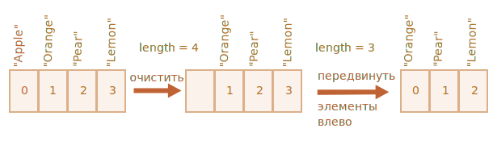
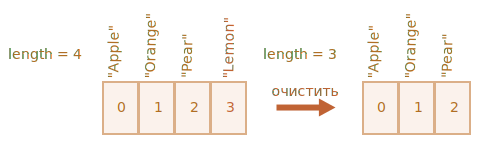

# Массивы

Объекты позволяют хранить данные со строковыми ключами. Это замечательно.

Но довольно часто мы понимаем, что нам необходима *упорядоченная коллекция* данных, в которой присутствуют 1-й, 2-й, 3-й элементы и т.д. Например, она понадобится нам для хранения списка чего-либо: пользователей, товаров, элементов HTML и т.д.  

В этом случае использовать объект неудобно, так как он не предоставляет методов управления порядком элементов. Мы не можем вставить новое свойство "между" уже существующими. Объекты просто не предназначены для этих целей.

Для хранения упорядоченных коллекций существует особая структура данных, которая называется массив, `Array`.

## Объявление

Существует два варианта синтаксиса для создания пустого массива:

```js
let arr = new Array();
let arr = [];
```

Практически всегда используется второй вариант синтаксиса. В скобках мы можем указать начальные значения элементов:

```js
let fruits = ["Яблоко", "Апельсин", "Слива"];
```

Элементы массива нумеруются, начиная с нуля.

Мы можем получить элемент, указав его номер в квадратных скобках:

```js run
let fruits = ["Яблоко", "Апельсин", "Слива"];

alert( fruits[0] ); // Яблоко
alert( fruits[1] ); // Апельсин
alert( fruits[2] ); // Слива
```

Мы можем заменить элемент:

```js
fruits[2] = 'Груша'; // теперь ["Яблоко", "Апельсин", "Груша"]
```

…Или добавить новый к существующему массиву:

```js
fruits[3] = 'Лимон'; // теперь ["Яблоко", "Апельсин", "Груша", "Лимон"]
```

Общее число элементов массива содержится в его свойстве `length`:

```js run
let fruits = ["Яблоко", "Апельсин", "Слива"];

alert( fruits.length ); // 3
```

Вывести массив целиком можно при помощи `alert`.

```js run
let fruits = ["Яблоко", "Апельсин", "Слива"];

alert( fruits ); // Яблоко, Апельсин, Слива
```

В массиве могут храниться элементы любого типа.

Например:

```js run no-beautify
// разные типы значений
let arr = [ 'Яблоко', { name: 'Джон' }, true, function() { alert('привет'); } ];

// получить элемент с индексом 1 (объект) и затем показать его свойство
alert( arr[1].name ); // Джон

// получить элемент с индексом 3 (функция) и выполнить её
arr[3](); // привет
```

````smart header="Висячая запятая"
Список элементов массива, как и список свойств объекта, может оканчиваться запятой:
```js
let fruits = [
  "Яблоко",
  "Апельсин",
  "Слива"*!*,*/!*
];
```

"Висячая запятая" упрощает процесс добавления/удаления элементов, так как все строки становятся идентичными.
````

## Методы pop/push, shift/unshift

[Очередь](https://ru.wikipedia.org/wiki/Очередь_(программирование)) – один из самых распространённых вариантов применения массива. В области компьютерных наук так называется упорядоченная коллекция элементов, поддерживающая два вида операций:

- `push` добавляет элемент в конец.
- `shift` удаляет элемент в начале, сдвигая очередь, так что второй элемент становится первым.


Массивы поддерживают обе операции.

На практике необходимость в этом возникает очень часто. Например, очередь сообщений, которые надо показать на экране.

Существует и другой вариант применения для массивов – структура данных, называемая [стек](https://ru.wikipedia.org/wiki/Стек).

Она поддерживает два вида операций:

- `push` добавляет элемент в конец.
- `pop` удаляет последний элемент.

Таким образом, новые элементы всегда добавляются или удаляются из "конца".

Примером стека обычно служит колода карт: новые карты кладутся наверх и берутся тоже сверху:


Массивы в JavaScript могут работать и как очередь, и как стек. Мы можем добавлять/удалять элементы как в начало, так и в конец массива.

В компьютерных науках структура данных, делающая это возможным, называется [двусторонняя очередь](https://ru.wikipedia.org/wiki/Двухсторонняя_очередь).

**Методы, работающие с концом массива:**

`pop`
: Удаляет последний элемент из массива и возвращает его:

    ```js run
    let fruits = ["Яблоко", "Апельсин", "Груша"];

    alert( fruits.pop() ); // удаляем "Груша" и выводим его

    alert( fruits ); // Яблоко, Апельсин
    ```

`push`
: Добавляет элемент в конец массива:

    ```js run
    let fruits = ["Яблоко", "Апельсин"];

    fruits.push("Груша");

    alert( fruits ); // Яблоко, Апельсин, Груша
    ```

    Вызов `fruits.push(...)` равнозначен `fruits[fruits.length] = ...`.

**Методы, работающие с началом массива:**

`shift`
: Удаляет из массива первый элемент и возвращает его:

    ```js
    let fruits = ["Яблоко", "Апельсин", "Груша"];

    alert( fruits.shift() ); // удаляем Яблоко и выводим его

    alert( fruits ); // Апельсин, Груша
    ```

`unshift`
: Добавляет элемент в начало массива:

    ```js
    let fruits = ["Апельсин", "Груша"];

    fruits.unshift('Яблоко');

    alert( fruits ); // Яблоко, Апельсин, Груша
    ```

Методы `push` и `unshift` могут добавлять сразу несколько элементов:  

```js run
let fruits = ["Яблоко"];

fruits.push("Апельсин", "Груша");
fruits.unshift("Ананас", "Лимон");

// ["Ананас", "Лимон", "Яблоко", "Апельсин", "Груша"]
alert( fruits );
```

## Внутреннее устройство массива

Массив – это особый подвид объектов. Квадратные скобки, используемые для того, чтобы получить доступ к свойству ```arr[0]``` - это по сути обычный синтаксис доступа по ключу, как ```obj[key]```, где в роли ```obj``` у нас ```arr```, а в качестве ключа - числовой индекс.

Массивы расширяют объекты, так как предусматривают специальные методы для работы с упорядоченными коллекциями данных, а также свойство `length`. Но в основе всё равно лежит объект.

Следует помнить, что в JavaScript существует 8 основных типов данных. Массив является объектом и, следовательно, ведёт себя как объект.

Например, копируется по ссылке:

```js run
let fruits = ["Банан"]

let arr = fruits; // копируется по ссылке (две переменные ссылаются на один и тот же массив)

alert( arr === fruits ); // true

arr.push("Груша"); // массив меняется по ссылке

alert( fruits ); // Банан, Груша - теперь два элемента
```

...Но то, что действительно делает массивы особенными - это их внутреннее представление. Движок JavaScript старается хранить элементы массива в непрерывной области памяти, один за другим, так, как это показано на иллюстрациях к этой главе. Существуют и другие способы оптимизации, благодаря которым массивы работают очень быстро.

Но все они утратят эффективность, если мы перестанем работать с массивом как с "упорядоченной коллекцией данных" и начнём использовать его как обычный объект.

Например, технически мы можем сделать следующее:

```js
let fruits = []; // создаём массив

fruits[99999] = 5; // создаём свойство с индексом, намного превышающим длину массива

fruits.age = 25; // создаём свойство с произвольным именем
```

Это возможно, потому что в основе массива лежит объект. Мы можем присвоить ему любые свойства.

Но движок поймёт, что мы работаем с массивом, как с обычным объектом. Способы оптимизации, используемые для массивов, в этом случае не подходят, поэтому они будут отключены и никакой выгоды не принесут.

Варианты неправильного применения массива:

- Добавление нечислового свойства, например:  `arr.test = 5`.
- Создание "дыр", например: добавление `arr[0]`, затем `arr[1000]` (между ними ничего нет).
- Заполнение массива в обратном порядке, например: `arr[1000]`, `arr[999]` и т.д.

Массив следует считать особой структурой, позволяющей работать с *упорядоченными данными*. Для этого массивы предоставляют специальные методы. Массивы тщательно настроены в движках JavaScript для работы с однотипными упорядоченными данными, поэтому, пожалуйста, используйте их именно в таких случаях. Если вам нужны произвольные ключи, вполне возможно, лучше подойдёт обычный объект `{}`.

## Эффективность

Методы `push/pop` выполняются быстро, а методы `shift/unshift` – медленно.


Почему работать с концом массива быстрее, чем с его началом? Давайте посмотрим, что происходит во время выполнения:

```js
fruits.shift(); // удаляем первый элемент с начала
```

Просто взять и удалить элемент с номером `0` недостаточно. Нужно также заново пронумеровать остальные элементы.

Операция `shift` должна выполнить 3 действия:

1. Удалить элемент с индексом `0`.
2. Сдвинуть все элементы влево, заново пронумеровать их, заменив `1` на `0`, `2` на `1` и т.д.
3. Обновить свойство `length` .



**Чем больше элементов содержит массив, тем больше времени потребуется для того, чтобы их переместить, больше операций с памятью.**

То же самое происходит с `unshift`: чтобы добавить элемент в начало массива, нам нужно сначала сдвинуть существующие элементы вправо, увеличивая их индексы.

А что же с `push/pop`? Им не нужно ничего перемещать. Чтобы удалить элемент в конце массива, метод `pop` очищает индекс и уменьшает значение `length`.

Действия при операции `pop`:

```js
fruits.pop(); // удаляем один элемент с конца
```



**Метод `pop` не требует перемещения, потому что остальные элементы остаются с теми же индексами. Именно поэтому он выполняется очень быстро.**

Аналогично работает метод `push`.

## Перебор элементов

Одним из самых старых способов перебора элементов массива является цикл for по цифровым индексам:

```js run
let arr = ["Яблоко", "Апельсин", "Груша"];

*!*
for (let i = 0; i < arr.length; i++) {
*/!*
  alert( arr[i] );
}
```

Но для массивов возможен и другой вариант цикла, `for..of`:

```js run
let fruits = ["Яблоко", "Апельсин", "Слива"];

// проходит по значениям
for (let fruit of fruits) {
  alert( fruit );
}
```

Цикл `for..of` не предоставляет доступа к номеру текущего элемента, только к его значению, но в большинстве случаев этого достаточно. А также это короче.

Технически, так как массив является объектом, можно использовать и вариант `for..in`:

```js run
let arr = ["Яблоко", "Апельсин", "Груша"];

*!*
for (let key in arr) {
*/!*
  alert( arr[key] ); // Яблоко, Апельсин, Груша
}
```

Но на самом деле это - плохая идея. Существуют скрытые недостатки этого способа:

1. Цикл `for..in` выполняет перебор *всех свойств* объекта, а не только цифровых.

    В браузере и других программных средах также существуют так называемые "псевдомассивы" - объекты, которые *выглядят, как массив*. То есть, у них есть свойство `length` и индексы, но они также могут иметь дополнительные нечисловые свойства и методы, которые нам обычно не нужны. Тем не менее, цикл `for..in` выведет и их. Поэтому, если нам приходится иметь дело с объектами, похожими на массив, такие "лишние" свойства могут стать проблемой.

2. Цикл `for..in` оптимизирован под произвольные объекты, не массивы, и поэтому в 10-100 раз медленнее. Увеличение скорости выполнения может иметь значение только при возникновении узких мест. Но мы всё же должны представлять разницу.

В общем, не следует использовать цикл `for..in` для массивов.   

## Немного о "length"

Свойство `length` автоматически обновляется при изменении массива. Если быть точными, это не количество элементов массива, а наибольший цифровой индекс плюс один.

Например, единственный элемент, имеющий большой индекс, даёт большую длину:

```js run
let fruits = [];
fruits[123] = "Яблоко";

alert( fruits.length ); // 124
```

Обратите внимание, что обычно мы не используем массивы таким образом.

Ещё один интересный факт о свойстве `length` – его можно перезаписать.

Если мы вручную увеличим его, ничего интересного не произойдёт. Зато, если мы уменьшим его, массив станет короче. Этот процесс необратим, как мы можем понять из примера:

```js run
let arr = [1, 2, 3, 4, 5];

arr.length = 2; // укорачиваем до двух элементов
alert( arr ); // [1, 2]

arr.length = 5; // возвращаем length как было
alert( arr[3] ); // undefined: значения не восстановились
```

Таким образом, самый простой способ очистить массив – это `arr.length = 0;`.


## new Array() [#new-array]

Существует ещё один вариант синтаксиса для создания массива:

```js
let arr = *!*new Array*/!*("Яблоко", "Груша", "и тд");
```

Он редко применяется, так как квадратные скобки `[]` короче. Кроме того, у него есть хитрая особенность.

Если `new Array` вызывается с одним аргументом, который представляет собой число, он создаёт массив *без элементов, но с заданной длиной*.

Давайте посмотрим, как можно оказать себе медвежью услугу:

```js run
let arr = new Array(2); // создастся ли массив [2]?

alert( arr[0] ); // undefined! нет элементов.

alert( arr.length ); // length 2
```

Как мы видим, в коде, представленном выше, в `new Array(number)` все элементы равны `undefined`.

Чтобы избежать появления таких неожиданных ситуаций, мы обычно используем квадратные скобки, если, конечно, не знаем точно, что по какой-то причине нужен именно `Array`.

## Многомерные массивы

Массивы могут содержать элементы, которые тоже являются массивами. Это можно использовать для создания многомерных массивов, например, для хранения матриц:

```js run
let matrix = [
  [1, 2, 3],
  [4, 5, 6],
  [7, 8, 9]
];

alert( matrix[1][1] ); // 5, центральный элемент
```

## toString

Массивы по-своему реализуют метод `toString`, который возвращает список элементов, разделённых запятыми.

Например:


```js run
let arr = [1, 2, 3];

alert( arr ); // 1,2,3
alert( String(arr) === '1,2,3' ); // true
```

Давайте теперь попробуем следующее:

```js run
alert( [] + 1 ); // "1"
alert( [1] + 1 ); // "11"
alert( [1,2] + 1 ); // "1,21"
```

Массивы не имеют ни `Symbol.toPrimitive`, ни функционирующего `valueOf`, они реализуют только преобразование `toString`, таким образом, здесь `[]` становится пустой строкой, `[1]` становится `"1"`, а `[1,2]` становится `"1,2"`.

Когда бинарный оператор плюс `"+"` добавляет что-либо к строке, он тоже преобразует это в строку, таким образом:

```js run
alert( "" + 1 ); // "1"
alert( "1" + 1 ); // "11"
alert( "1,2" + 1 ); // "1,21"
```

## Итого

Массив – это особый тип объекта, предназначенный для работы с упорядоченным набором элементов.

- Объявление:

    ```js
    // квадратные скобки (обычно)
    let arr = [item1, item2...];

    // new Array (очень редко)
    let arr = new Array(item1, item2...);
    ```

    Вызов `new Array(number)` создаёт массив с заданной длиной, но без элементов.

- Свойство `length` отражает длину массива или, если точнее, его последний цифровой индекс плюс один. Длина корректируется автоматически методами массива.
- Если мы уменьшаем `length` вручную, массив укорачивается.

Мы можем использовать массив как двустороннюю очередь, используя следующие операции:  

- `push(...items)`добавляет `items` в конец массива.
- `pop()` удаляет элемент в конце массива и возвращает его.
- `shift()` удаляет элемент в начале массива и возвращает его.
- `unshift(...items)` добавляет `items` в начало массива.   

Чтобы пройтись по элементам массива:
 - `for (let i=0; i<arr.length; i++)` -- работает быстрее всего, совместим со старыми браузерами.
 - `for (let item of arr)` -- современный синтаксис только для значений элементов (к индексам нет доступа).
 - `for (let i in arr)` -- никогда не используйте для массивов!

Мы вернёмся к массивам и изучим другие методы добавления, удаления, выделения элементов и сортировки массивов в главе: <info:array-methods>.
