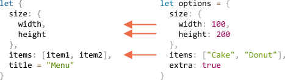

# Деструктурирующее присваивание

В JavaScript есть две чаще всего используемые структуры данных - это `Object` и `Array`.

<<<<<<< HEAD
Объекты позволяют нам создавать одну сущность, которая хранит элементы данных по ключам, а массивы - хранить упорядоченные коллекции данных.

Но когда мы передаём их в функцию, то ей может понадобится не объект/массив целиком, а элементы по отдельности.
=======
Objects allow us to create a single entity that stores data items by key, and arrays allow us to gather data items into an ordered collection.

But when we pass those to a function, it may need not an object/array as a whole, but rather individual pieces.

*Destructuring assignment* is a special syntax that allows us to "unpack" arrays or objects into a bunch of variables, as sometimes that's more convenient. Destructuring also works great with complex functions that have a lot of parameters, default values, and so on.
>>>>>>> 6bbe0b4313a7845303be835d632ef8e5bc7715cd

*Деструктурирующее присваивание* -- это специальный синтаксис, который позволяет нам "распаковать" массивы или объекты в кучу переменных, так как иногда они более удобны. Деструктуризация также прекрасно работает со сложными функциями, которые имеют много параметров, значений по умолчанию, и так далее.

## Деструктуризация массива

Пример деструктуризации массива:

```js
// у нас есть массив с именем и фамилией
let arr = ["Ilya", "Kantor"]

*!*
<<<<<<< HEAD
// деструктурирующее присваивание
// записывает firstName=arr[0], surname=arr[1]
=======
// destructuring assignment
// sets firstName = arr[0]
// and surname = arr[1]
>>>>>>> 6bbe0b4313a7845303be835d632ef8e5bc7715cd
let [firstName, surname] = arr;
*/!*

alert(firstName); // Ilya
alert(surname);  // Kantor
```

Теперь мы можем использовать переменные вместо элементов массива.

Отлично смотрится в сочетании со `split` или другими методами, возвращающими массив:

```js
let [firstName, surname] = "Ilya Kantor".split(' ');
```

````smart header="\"Деструктуризация\" не означает \"разрушение\"."
"Деструктурирующее присваивание" не уничтожает массив. Оно вообще ничего не делает с правой частью присваивания, его задача - только скопировать нужные значения в переменные.

Это просто короткий вариант записи:
```js
// let [firstName, surname] = arr;
let firstName = arr[0];
let surname = arr[1];
```
````

````smart header="Пропускайте элементы, используя запятые"
Ненужные элементы массива также могут быть отброшены через запятую:

```js run
*!*
// второй элемент не нужен
let [firstName, , title] = ["Julius", "Caesar", "Consul", "of the Roman Republic"];
*/!*

alert( title ); // Consul
```

<<<<<<< HEAD
В примере выше второй элемент массива пропускается, а третий присваивается переменной `title`, оставшиеся элементы массива также пропускаются (так как для них нет переменных).
=======
In the code above, the second element of the array is skipped, the third one is assigned to `title`, and the rest of the array items is also skipped (as there are no variables for them).
>>>>>>> 6bbe0b4313a7845303be835d632ef8e5bc7715cd
````

````smart header="Работает с любым перебираемым объектом с правой стороны"

...На самом деле, мы можем использовать любой перебираемый объект, не только массивы:

```js
let [a, b, c] = "abc"; // ["a", "b", "c"]
let [one, two, three] = new Set([1, 2, 3]);
```

````


````smart header="Присваивайте чему угодно с левой стороны"

Мы можем использовать что угодно "присваиваемое" с левой стороны.

Например, можно присвоить свойству объекта:
```js run
let user = {};
[user.name, user.surname] = "Ilya Kantor".split(' ');

alert(user.name); // Ilya
```

````

````smart header="Цикл с .entries()"

В предыдущей главе мы видели метод [Object.entries(obj)](mdn:js/Object/entries).

Мы можем использовать его с деструктуризацией для цикличного перебора ключей и значений объекта:

```js run
let user = {
  name: "John",
  age: 30
};

// цикл по ключам и значениям
*!*
for (let [key, value] of Object.entries(user)) {
*/!*
  alert(`${key}:${value}`); // name:John, then age:30
}
```

...то же самое для map:

```js run
let user = new Map();
user.set("name", "John");
user.set("age", "30");

*!*
for (let [key, value] of user) {
*/!*
  alert(`${key}:${value}`); // name:John, then age:30
}
```
````
### Остальные значения '...'

Если мы хотим не просто получить первые значения, но и собрать все остальные -- мы можем добавить ещё один параметр, который получает "остальные значения", используя троеточие `"..."`:

```js run
let [name1, name2, *!*...rest*/!*] = ["Julius", "Caesar", *!*"Consul", "of the Roman Republic"*/!*];

alert(name1); // Julius
alert(name2); // Caesar

*!*
// Обратите внимание, что `rest` является массивом.
alert(rest[0]); // Consul
alert(rest[1]); // of the Roman Republic
alert(rest.length); // 2
*/!*
```

Переменная `rest` является массивом из оставшихся элементов. Вместо `rest` можно использовать любое другое название переменной, просто убедитесь, что перед переменной есть три точки и она стоит на последнем месте в деструктурирующем присваивании.

### Значения по умолчанию

Если в массиве меньше значений, чем в присваивании, то ошибки не будет. Отсутствующие значения считаются неопределёнными:

```js run
*!*
let [firstName, surname] = [];
*/!*

alert(firstName); // undefined
alert(surname); // undefined
```

Если нам необходимо указать значения по умолчанию, то мы можем использовать `=`:

```js run
*!*
// значения по умолчанию
let [name = "Guest", surname = "Anonymous"] = ["Julius"];
*/!*

alert(name);    // Julius (из массива)
alert(surname); // Anonymous (значение по умолчанию)
```

Значения по умолчанию могут быть гораздо более сложными выражениями или даже функциями. Они выполняются, только если значения отсутствуют.

Например, здесь мы используем функцию `prompt` для указания двух значений по умолчанию. Но она будет запущена только для отсутствующего значения:

```js run
// prompt запустится только для surname
let [name = prompt('name?'), surname = prompt('surname?')] = ["Julius"];

alert(name);    // Julius (из массива)
alert(surname); // результат prompt
```


## Деструктуризация объекта

Деструктурирующее присваивание также работает с объектами.

Синтаксис:

```js
let {var1, var2} = {var1:…, var2:…}
```

У нас есть существующий объект с правой стороны, который мы хотим разделить на переменные. Левая сторона содержит "шаблон" для соответствующих свойств. В простом случае это список названий переменных в `{...}`.

Например:

```js run
let options = {
  title: "Menu",
  width: 100,
  height: 200
};

*!*
let {title, width, height} = options;
*/!*

alert(title);  // Menu
alert(width);  // 100
alert(height); // 200
```

Свойства `options.title`, `options.width` и `options.height` присваиваются соответствующим переменным. Порядок не имеет значения. Вот так - тоже работает:

```js
<<<<<<< HEAD
// изменён порядок в let {...}
=======
// changed the order in let {...}
>>>>>>> 6bbe0b4313a7845303be835d632ef8e5bc7715cd
let {height, width, title} = { title: "Menu", height: 200, width: 100 }
```

Шаблон с левой стороны может быть более сложным и определять соответствие между свойствами и переменными.

Если мы хотим присвоить свойство объекта переменной с другим названием, например, свойство `options.width` присвоить переменной `w`, то мы можем использовать двоеточие:

```js run
let options = {
  title: "Menu",
  width: 100,
  height: 200
};

*!*
// { sourceProperty: targetVariable }
let {width: w, height: h, title} = options;
*/!*

// width -> w
// height -> h
// title -> title

alert(title);  // Menu
alert(w);      // 100
alert(h);      // 200
```

Двоеточие показывает "что : куда идёт". В примере выше свойство `width` сохраняется в переменную `w`, свойство `height` сохраняется в `h`, а `title` присваивается одноимённой переменной.

Для потенциально отсутствующих свойств мы можем установить значения по умолчанию, используя `"="`, как здесь:

```js run
let options = {
  title: "Menu"
};

*!*
let {width = 100, height = 200, title} = options;
*/!*

alert(title);  // Menu
alert(width);  // 100
alert(height); // 200
```

Как и в случае с массивами, значениями по умолчанию могут быть любые выражения или даже функции. Они выполнятся, если значения отсутствуют.

В коде ниже мы запрашиваем width, но не title.

```js run
let options = {
  title: "Menu"
};

*!*
let {width = prompt("width?"), title = prompt("title?")} = options;
*/!*

alert(title);  // Menu
<<<<<<< HEAD
alert(width);  // (результат prompt)
=======
alert(width);  // (whatever the result of prompt is)
>>>>>>> 6bbe0b4313a7845303be835d632ef8e5bc7715cd
```

Мы также можем совмещать `:` и `=`:

```js run
let options = {
  title: "Menu"
};

*!*
let {width: w = 100, height: h = 200, title} = options;
*/!*

alert(title);  // Menu
alert(w);      // 100
alert(h);      // 200
```

<<<<<<< HEAD
### Остаток (rest) "..."
=======
### The rest pattern "..."
>>>>>>> 6bbe0b4313a7845303be835d632ef8e5bc7715cd

Что если в объекте больше свойств, чем у нас переменных? Можем ли мы взять необходимые нам, а остальные присвоить куда-нибудь?

<<<<<<< HEAD
Можно использовать троеточие, так же как для массивов. В некоторых старых браузерах (IE) это не поддерживается, используйте Babel для полифила.
=======
We can use the rest pattern, just like we did with arrays. It's not supported by some older browsers (IE, use Babel to polyfill it), but works in modern ones.
>>>>>>> 6bbe0b4313a7845303be835d632ef8e5bc7715cd

Выглядит примерно так:

```js run
let options = {
  title: "Menu",
  height: 200,
  width: 100
};

*!*
// title = property named title
// rest = object with the rest of properties
let {title, ...rest} = options;
*/!*

// now title="Menu", rest={height: 200, width: 100}
alert(rest.height);  // 200
alert(rest.width);   // 100
```


<<<<<<< HEAD
````smart header="Подводный камень, если не указывать `let`"
В примерах выше переменные были объявлены в присваивании: `let {…} = {…}`. Конечно, мы могли бы использовать существующие переменные и не указывать `let`, но тут есть подвох.
=======
````smart header="Gotcha if there's no `let`"
In the examples above variables were declared right in the assignment: `let {…} = {…}`. Of course, we could use existing variables too, without `let`. But there's a catch.
>>>>>>> 6bbe0b4313a7845303be835d632ef8e5bc7715cd

Это не будет работать:
```js run
let title, width, height;

// ошибка будет в этой строке
{title, width, height} = {title: "Menu", width: 200, height: 100};
```

Проблема в том, что JavaScript обрабатывает `{...}` в основном потоке кода (не внутри другого выражения) как блок кода. Такие блоки кода могут быть использованы для группировки операторов, например:

```js run
{
  // блок кода
  let message = "Hello";
  // ...
  alert( message );
}
```

<<<<<<< HEAD
Чтобы показать JavaScript, что это не блок кода, мы можем сделать его частью выражения, заключив в скобки `(...)`:
=======
To show JavaScript that it's not a code block, we can make it a part of an expression by wrapping in parentheses `(...)`:
>>>>>>> 6bbe0b4313a7845303be835d632ef8e5bc7715cd

```js run
let title, width, height;

<<<<<<< HEAD
// сейчас всё работает
=======
// okay now
>>>>>>> 6bbe0b4313a7845303be835d632ef8e5bc7715cd
*!*(*/!*{title, width, height}*!*)*/!* = {title: "Menu", width: 200, height: 100};

alert( title ); // Menu
```

````

## Вложенная деструктуризация

Если объект или массив содержит другие объекты или массивы, то мы можем использовать более сложные шаблоны с левой стороны, чтобы извлечь более глубокие свойства.

В приведённом ниже коде `options` хранит другой объект в свойстве `size` и массив в свойстве `items`. Шаблон в левой части присваивания имеет такую же структуру:

```js run
let options = {
  size: {
    width: 100,
    height: 200
  },
  items: ["Cake", "Donut"],
  extra: true    // дополнительное свойство, которое мы не будем извлекать
};

<<<<<<< HEAD
// деструктуризация разбита на несколько строк для ясности
=======
// destructuring assignment split in multiple lines for clarity
>>>>>>> 6bbe0b4313a7845303be835d632ef8e5bc7715cd
let {
  size: { // положим size сюда
    width,
    height
  },
  items: [item1, item2], // добавим элементы к items
  title = "Menu" // отсутствует в объекте (используется значение по умолчанию)
} = options;

alert(title);  // Menu
alert(width);  // 100
alert(height); // 200
alert(item1);  // Cake
alert(item2);  // Donut
```

Весь объект `options`, кроме свойства  `extra`, о котором не было упомянуто, присваивается в соответствующие переменные.

Обратите внимание, что `size` и `items` не деструктурированы.



В итоге у нас есть `width`, `height`, `item1`, `item2` и `title` со значением по умолчанию.

<<<<<<< HEAD
Если у нас есть большой объект с множеством свойств, можно взять только то, что нужно:
=======
If we have a complex object with many properties, we can extract only what we need:
>>>>>>> 6bbe0b4313a7845303be835d632ef8e5bc7715cd

```js
// взять только size, игнорировать остальное
let { size } = options;
```

## Умные параметры функций

<<<<<<< HEAD
Есть ситуации, когда функция имеет много параметров, большинство из которых не обязательны. Это особенно верно для пользовательских интерфейсов. Представьте себе функцию, которая создаёт меню. Она может иметь ширину, высоту, заголовок, список элементов и так далее.
=======
There are times when a function has many parameters, most of which are optional. That's especially true for user interfaces. Imagine a function that creates a menu. It may have a width, a height, a title, items list and so on.
>>>>>>> 6bbe0b4313a7845303be835d632ef8e5bc7715cd

Это плохой способ писать такие функции:

```js
function showMenu(title = "Untitled", width = 200, height = 100, items = []) {
  // ...
}
```

В реальной жизни проблема заключается в том, как запомнить порядок всех аргументов. Обычно IDE пытаются помочь нам, особенно если код хорошо документирован, но всё же... Другая проблема заключается в том, как вызвать функцию, когда большинство параметров передавать не надо, и значения по умолчанию вполне подходят.

Как здесь?

```js
showMenu("My Menu", undefined, undefined, ["Item1", "Item2"])
```

Это выглядит ужасно. И становится нечитаемым, когда мы имеем дело с большим количеством параметров.

На помощь приходит деструктуризация!

Мы можем передать параметры как объект, и функция немедленно деструктурирует его в переменные:

```js run
// мы передаём объект в функцию
let options = {
  title: "My menu",
  items: ["Item1", "Item2"]
};

// ...и она немедленно извлекает свойства в переменные
function showMenu(*!*{title = "Untitled", width = 200, height = 100, items = []}*/!*) {
  // title, items – взято из options,
  // width, height – используется по умолчанию
  alert( `${title} ${width} ${height}` ); // My Menu 200 100
  alert( items ); // Item1, Item2
}

showMenu(options);
```

Мы также можем использовать более сложное деструктурирование с вложенными объектами и двоеточием:

```js run
let options = {
  title: "My menu",
  items: ["Item1", "Item2"]
};

*!*
function showMenu({
  title = "Untitled",
  width: w = 100,  // width присваиваем в w
  height: h = 200, // height присваиваем в h
  items: [item1, item2] // первый элемент items присваивается в item1, второй в item2
}) {
*/!*
  alert( `${title} ${w} ${h}` ); // My Menu 100 200
  alert( item1 ); // Item1
  alert( item2 ); // Item2
}

showMenu(options);
```

Синтаксис такой же, как для деструктурирующего присваивания:
```js
function({
  incomingProperty: parameterName = defaultValue
  ...
})
```

Пожалуйста, обратите внимание, что такое деструктурирование подразумевает, что в `showMenu()` будет обязательно передан аргумент. Если нам нужны все значения по умолчанию, то нам следует определить пустой объект:

```js
showMenu({});


showMenu(); // так была бы ошибка
```

Мы можем исправить это, сделав `{}` значением по умолчанию для всего объекта:


```js run
// упрощённый список параметров для ясности
function showMenu(*!*{ title = "Menu", width = 100, height = 200 } = {}*/!*) {
  alert( `${title} ${width} ${height}` );
}

showMenu(); // Menu 100 200
```

В приведённом коде выше весь объект аргументов по умолчанию равен `{}`, поэтому всегда есть что-то, что можно деструктурировать.

## Итого

- Деструктуризация позволяет разбивать объект или массив на переменные при присвоении.
- Синтаксис для объекта:
    ```js
    let {prop : varName = default, ...rest} = object
    ```

    Свойства, которые не были упомянуты, копируются в объект `rest`.

<<<<<<< HEAD
- Синтаксис для массива:
=======
    Object properties that have no mapping are copied to the `rest` object.

- The array syntax:
>>>>>>> 6bbe0b4313a7845303be835d632ef8e5bc7715cd

    ```js
    let [item1 = default, item2, ...rest] = array
    ```

    Первый элемент отправляется в `item1`; второй отправляется в `item2`, все остальные элементы попадают в массив `rest`.

- Для более сложных случаев левая сторона должна иметь ту же структуру, что и правая.
