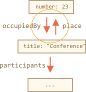

# Формат JSON, метод toJSON

Допустим, у нас есть сложный объект, и мы хотели бы преобразовать его в строку, отправить по сети или просто вывести для логирования.

Естественно, такая строка должна включать в себя все важные свойства.

Мы могли бы реализовать преобразование следующим образом:

```js run
let user = {
  name: "John",
  age: 30,

*!*
  toString() {
    return `{name: "${this.name}", age: ${this.age}}`;
  }
*/!*
};

alert(user); // {name: "John", age: 30}
```

...Но в процессе разработки добавляются новые свойства, старые свойства переименовываются и удаляются. Обновление такого `toString` каждый раз может стать проблемой. Мы могли бы попытаться зациклить свойства в нем, но что, если объект является сложным и имеет вложенные объекты в свойствах? Мы должны были бы также осуществить их преобразование. И, если мы отправляем объект по сети, нам также нужно предоставить код для «чтения» нашего объекта на принимающей стороне.

К счастью, нет необходимости писать код для обработки всего этого. У задачи есть простое решение.

## JSON.stringify

The [JSON](https://ru.wikipedia.org/wiki/JSON) (JavaScript Object Notation) это общий формат для представления значений и объектов. Его описание задокументированно в стандарте [RFC 4627](http://tools.ietf.org/html/rfc4627). Первоначально он был создан для JavaScript, но многие другие языки также имеют библиотеки, которые также могут работать с ним. Таким образом, JSON легко использовать для обмена данными, когда клиент использует JavaScript а сервер написан на Ruby/PHP/Java/любой другой язык.

JavaScript предоставляет методы:

- `JSON.stringify` для преобразования объектов в JSON.
- `JSON.parse` для преобразования JSON обратно в объект.

Например, здесь мы преобразуем через `JSON.stringify` карточку студента:
```js run
let student = {
  name: 'John',
  age: 30,
  isAdmin: false,
  courses: ['html', 'css', 'js'],
  wife: null
};

*!*
let json = JSON.stringify(student);
*/!*

alert(typeof json); // мы получим строку!

alert(json);
*!*
/* выведет записанный в JSON объект:
{
  "name": "John",
  "age": 30,
  "isAdmin": false,
  "courses": ["html", "css", "js"],
  "wife": null
}
*/
*/!*
```

Метод `JSON.stringify(student)` берет объект и преобразует его в строку.

Полученная `json` строка называется *JSON-кодированным* или *сериализованным*, *строковым* или *структурированным* объектом. Мы готовы отправить его по проводам или поместить в обычное хранилище данных.


Обратите внимание, что JSON-кодированный объект имеет несколько важных отличий от объектного литерала:

- Строки используют двойные кавычки. Никаких одинарных кавычек или обратных кавычек в JSON. Так `'John'` становится `"John"`.
- Имена свойств объекта также заключаются в двойные кавычки. Это обязательно. Так `age:30` становится `"age":30`.

`JSON.stringify` может быть применен и к примитивам.

Внутренне поддерживаются типы JSON:

- Объекты `{ ... }`
- Массивы `[ ... ]`
- Примитивы:
    - строки,
    - числа,
    - логические значения `true/false`,
    - `null`.

Например:

```js run
// число в JSON - всего лишь числовое значение
alert( JSON.stringify(1) ) // 1

// строка в JSON по-прежнему является строкой, но имеет двойные кавычки
alert( JSON.stringify('test') ) // "test"

alert( JSON.stringify(true) ); // true

alert( JSON.stringify([1, 2, 3]) ); // [1,2,3]
```

JSON является кросс-языковой спецификацией только для данных, поэтому некоторые специфичные для JavaScript свойства объекта в `JSON.stringify` пропускаются.

А именно:

- Свойства функции (методы).
- Символические свойства.
- Свойства, которые хранят `undefined`.

```js run
let user = {
  sayHi() { // будет пропущено
    alert("Hello");
  },
  [Symbol("id")]: 123, // так-же будет пропущено
  something: undefined // как и это - пропущено
};

alert( JSON.stringify(user) ); // {} (пустой объект)
```

Обычно это нормально. Если это не то, что мы хотим, то скоро мы увидим, как настроить процесс.

Самое замечательное, что вложенные объекты поддерживаются и конвертируются автоматически.

Например:

```js run
let meetup = {
  title: "Conference",
*!*
  room: {
    number: 23,
    participants: ["john", "ann"]
  }
*/!*
};

alert( JSON.stringify(meetup) );
/* вся структура преобразована:
{
  "title":"Conference",
  "room":{"number":23,"participants":["john","ann"]},
}
*/
```

Важное ограничение: не должно быть циклических ссылок.

Например:

```js run
let room = {
  number: 23
};

let meetup = {
  title: "Conference",
  participants: ["john", "ann"]
};

meetup.place = room;       // meetup ссылается на room
room.occupiedBy = meetup; // room ссылается на meetup

*!*
JSON.stringify(meetup); // Ошибка: Преобразование цикличной структуры в JSON
*/!*
```

Здесь преобразование завершается неудачно из-за циклической ссылки: `room.occupiedBy` ссылается на `meetup`, и `meetup.place` ссылается на `room`:




## Исключение и преобразование: заменитель

Полный синтаксис `JSON.stringify` таков:

```js
let json = JSON.stringify(value[, replacer, space])
```

value
: Значение для кодирования.

replacer
: Массив свойств для кодирования или функции отображения `function(key, value)`.

space
: Дополнительные Объем пространства, используемого для форматирования

В большинстве случаев `JSON.stringify` используется только с первым аргументом. Но если нам нужно отфильтровать процесс замены, например, отфильтровать циклические ссылки, то можно использовать второй аргумент `JSON.stringify`.

Если мы передадим ему массив свойств, будут закодированы только эти свойства.

Например:

```js run
let room = {
  number: 23
};

let meetup = {
  title: "Conference",
  participants: [{name: "John"}, {name: "Alice"}],
  place: room // meetup ссылается на room
};

room.occupiedBy = meetup; // room ссылается на meetup

alert( JSON.stringify(meetup, *!*['title', 'participants']*/!*) );
// {"title":"Conference","participants":[{},{}]}
```

Здесь мы, наверное, слишком строги. Список свойств применяется ко всей структуре объекта. Так что участники пусты, потому что `name` нет в списке.

Давайте включим все свойства, кроме `room.occupiedBy`, что вызовет цикличную ссылку:

```js run
let room = {
  number: 23
};

let meetup = {
  title: "Conference",
  participants: [{name: "John"}, {name: "Alice"}],
  place: room // meetup ссылается на room
};

room.occupiedBy = meetup; // room ссылается на meetup

alert( JSON.stringify(meetup, *!*['title', 'participants', 'place', 'name', 'number']*/!*) );
/*
{
  "title":"Conference",
  "participants":[{"name":"John"},{"name":"Alice"}],
  "place":{"number":23}
}
*/
```

Теперь все, кроме `occupiedBy`, сериализовано. Но список свойств довольно длинный.

К счастью,в качестве `replacer` мы можем использовать функцию, а не массив.

Функция будет вызываться для каждой пары `(key, value)` и должна возвращать «замененное» значение, которое будет использоваться вместо исходного.

В нашем случае мы можем вернуть `value` «как есть» для всего, кроме `occupiedBy`. Чтобы игнорировать  `occupiedBy`, код ниже возвращает `undefined`:

```js run
let room = {
  number: 23
};

let meetup = {
  title: "Conference",
  participants: [{name: "John"}, {name: "Alice"}],
  place: room // meetup ссылается на room
};

room.occupiedBy = meetup; // room ссылается на meetup

alert( JSON.stringify(meetup, function replacer(key, value) {
  alert(`${key}: ${value}`); // чтобы посмотреть, что получит заменитель
  return (key == 'occupiedBy') ? undefined : value;
}));

/* пары ключ:значение, которые приходят на замену:
:             [object Object]
title:        Conference
participants: [object Object],[object Object]
0:            [object Object]
name:         John
1:            [object Object]
name:         Alice
place:        [object Object]
number:       23
*/
```

Please note that `replacer` function gets every key/value pair including nested objects and array items. It is applied recursively. The value of `this` inside `replacer` is the object that contains the current property.

The first call is special. It is made using a special "wrapper object": `{"": meetup}`. In other words, the first `(key, value)` pair has an empty key, and the value is the target object as a whole. That's why the first line is `":[object Object]"` in the example above.

The idea is to provide as much power for `replacer` as possible: it has a chance to analyze and replace/skip the whole object if necessary.


## Formatting: spacer

The third argument of `JSON.stringify(value, replacer, spaces)` is the number of spaces to use for pretty formatting.

Previously, all stringified objects had no indents and extra spaces. That's fine if we want to send an object over a network. The `spacer` argument is used exclusively for a nice output.

Here `spacer = 2` tells JavaScript to show nested objects on multiple lines, with indentation of 2 spaces inside an object:

```js run
let user = {
  name: "John",
  age: 25,
  roles: {
    isAdmin: false,
    isEditor: true
  }
};

alert(JSON.stringify(user, null, 2));
/* two-space indents:
{
  "name": "John",
  "age": 25,
  "roles": {
    "isAdmin": false,
    "isEditor": true
  }
}
*/

/* for JSON.stringify(user, null, 4) the result would be more indented:
{
    "name": "John",
    "age": 25,
    "roles": {
        "isAdmin": false,
        "isEditor": true
    }
}
*/
```

The `spaces` parameter is used solely for logging and nice-output purposes.

## Custom "toJSON"

Like `toString` for string conversion, an object may provide method `toJSON` for to-JSON conversion. `JSON.stringify` automatically calls it if available.

Например:

```js run
let room = {
  number: 23
};

let meetup = {
  title: "Conference",
  date: new Date(Date.UTC(2017, 0, 1)),
  room
};

alert( JSON.stringify(meetup) );
/*
  {
    "title":"Conference",
*!*
    "date":"2017-01-01T00:00:00.000Z",  // (1)
*/!*
    "room": {"number":23}               // (2)
  }
*/
```

Here we can see that `date` `(1)` became a string. That's because all dates have a built-in `toJSON` method which returns such kind of string.

Now let's add a custom `toJSON` for our object `room` `(2)`:

```js run
let room = {
  number: 23,
*!*
  toJSON() {
    return this.number;
  }
*/!*
};

let meetup = {
  title: "Conference",
  room
};

*!*
alert( JSON.stringify(room) ); // 23
*/!*

alert( JSON.stringify(meetup) );
/*
  {
    "title":"Conference",
*!*
    "room": 23
*/!*
  }
*/
```

As we can see, `toJSON` is used both for the direct call `JSON.stringify(room)` and for the nested object.


## JSON.parse

To decode a JSON-string, we need another method named [JSON.parse](mdn:js/JSON/parse).

The syntax:
```js
let value = JSON.parse(str[, reviver]);
```

str
: JSON-string to parse.

reviver
: Optional function(key,value) that will be called for each `(key, value)` pair and can transform the value.

Например:

```js run
// строковый массив
let numbers = "[0, 1, 2, 3]";

numbers = JSON.parse(numbers);

alert( numbers[1] ); // 1
```

Or for nested objects:

```js run
let user = '{ "name": "John", "age": 35, "isAdmin": false, "friends": [0,1,2,3] }';

user = JSON.parse(user);

alert( user.friends[1] ); // 1
```

The JSON may be as complex as necessary, objects and arrays can include other objects and arrays. But they must obey the format.

Here are typical mistakes in hand-written JSON (sometimes we have to write it for debugging purposes):

```js
let json = `{
  *!*name*/!*: "John",                     // mistake: property name without quotes
  "surname": *!*'Smith'*/!*,               // mistake: single quotes in value (must be double)
  *!*'isAdmin'*/!*: false                  // mistake: single quotes in key (must be double)
  "birthday": *!*new Date(2000, 2, 3)*/!*, // mistake: no "new" is allowed, only bare values
  "friends": [0,1,2,3]              // here all fine
}`;
```

Besides, JSON does not support comments. Adding a comment to JSON makes it invalid.

There's another format named [JSON5](http://json5.org/), which allows unquoted keys, comments etc. But this is a standalone library, not in the specification of the language.

The regular JSON is that strict not because its developers are lazy, but to allow easy, reliable and very fast implementations of the parsing algorithm.

## Using reviver

Imagine, we got a stringified `meetup` object from the server.

It looks like this:

```js
// title: (meetup title), date: (meetup date)
let str = '{"title":"Conference","date":"2017-11-30T12:00:00.000Z"}';
```

...And now we need to *deserialize* it, to turn back into JavaScript object.

Let's do it by calling `JSON.parse`:

```js run
let str = '{"title":"Conference","date":"2017-11-30T12:00:00.000Z"}';

let meetup = JSON.parse(str);

*!*
alert( meetup.date.getDate() ); // Error!
*/!*
```

Whoops! An error!

The value of `meetup.date` is a string, not a `Date` object. How could `JSON.parse` know that it should transform that string into a `Date`?

Let's pass to `JSON.parse` the reviving function that returns all values "as is", but `date` will become a `Date`:

```js run
let str = '{"title":"Conference","date":"2017-11-30T12:00:00.000Z"}';

*!*
let meetup = JSON.parse(str, function(key, value) {
  if (key == 'date') return new Date(value);
  return value;
});
*/!*

alert( meetup.date.getDate() ); // now works!
```

By the way, that works for nested objects as well:

```js run
let schedule = `{
  "meetups": [
    {"title":"Conference","date":"2017-11-30T12:00:00.000Z"},
    {"title":"Birthday","date":"2017-04-18T12:00:00.000Z"}
  ]
}`;

schedule = JSON.parse(schedule, function(key, value) {
  if (key == 'date') return new Date(value);
  return value;
});

*!*
alert( schedule.meetups[1].date.getDate() ); // works!
*/!*
```


## Summary

- JSON is a data format that has its own independent standard and libraries for most programming languages.
- JSON supports plain objects, arrays, strings, numbers, booleans, and `null`.
- JavaScript provides methods [JSON.stringify](mdn:js/JSON/stringify) to serialize into JSON and [JSON.parse](mdn:js/JSON/parse) to read from JSON.
- Both methods support transformer functions for smart reading/writing.
- If an object has `toJSON`, then it is called by `JSON.stringify`.
