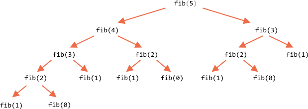

Вычисление рекурсией (медленное)

Решение по формуле, используя рекурсию:

```js run
function fib(n) {
  return n <= 1 ? n : fib(n - 1) + fib(n - 2);
}

alert( fib(3) ); // 2
alert( fib(7) ); // 13
// fib(77); // не запускаем, подвесит браузер
```

При больших значениях `n` оно будет работать очень медленно. Например, `fib(77)` уже будет вычисляться очень долго.

Это потому, что функция порождает обширное дерево вложенных вызовов. При этом ряд значений вычисляется много раз. Например, посмотрим на отрывок вычислений:


```js no-beautify
...
fib(5) = fib(4) + fib(3)
fib(4) = fib(3) + fib(2)
...
```

Здесь видно, что значение  `fib(3)` нужно одновременно и для  `fib(5)` и для  `fib(4)`. В коде оно будет вычислено два раза, совершенно независимо.

Полное дерево рекурсии:



Можно заметить, что `fib(3)` вычисляется дважды, а `fib(2)` - трижды. Общее количество вычислений растёт намного быстрее, чем `n`, что делает его огромным даже для `n=77`.

Можно это оптимизировать, запоминая уже вычисленные значения: если значение, скажем, `fib(3)` вычислено однажны, затем мы просто переиспользуем это значение для последующих вычислений.

Другим вариантом было бы отказаться от рекурсии и использовать совершенно другой алгоритм на основе цикла.

Можно написать цикл, который начнёт с первый значение `1` и `2`, затем из них получит `fib(3)` как их сумму, затем `fib(4)`как сумму предыдущих значений, затем `fib(5)` и так далее, до нужного значения. На каждом шаге нам нужно помнить только значения двух предыдущих.

Рассмотрим детали нового алгоритма.

Начало:

```js
// a = fib(1), b = fib(2), начальные значения
let a = 1, b = 1;

// получим c = fib(3) как их сумму
let c = a + b;

/* теперь у нас есть fib(1), fib(2), fib(3)
a  b  c
1, 1, 2
*/
```

Теперь мы хотим получить `fib(4) = fib(2) + fib(3)`.

Переставим переменные: `a,b`, получим `fib(2),fib(3)`, и `c` получится как их сумма:

```js no-beautify
a = b; // теперь a = fib(2)
b = c; // теперь b = fib(3)
c = a + b; // c = fib(4)

/* имеем последовательность:
   a  b  c
1, 1, 2, 3
*/
```

Следующий шаг даёт слудущее число последовательности:

```js no-beautify
a = b; // now a = fib(3)
b = c; // now b = fib(4)
c = a + b; // c = fib(5)

/* последовательность теперь (на одно число больше):
      a  b  c
1, 1, 2, 3, 5
*/
```

...И так далее, пока не получим искомое значение. Это намного быстрее рекурсии и не требует дублирующих вычислений.

Полный код:

```js run
function fib(n) {
  let a = 1;
  let b = 1;
  for (let i = 3; i <= n; i++) {
    let c = a + b;
    a = b;
    b = c;
  }
  return b;
}

alert( fib(3) ); // 2
alert( fib(7) ); // 13
alert( fib(77) ); // 5527939700884757
```

Цикл начинается с `i=3`, потому что первое и второе значения последовательности заданы `a=1`, `b=1`.

Способ называется [динамическое программирование снизу вверх](https://ru.wikipedia.org/wiki/Динамическое_программирование).
