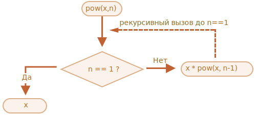

# Рекурсия и стек

Вернёмся к функциям и изучим их более подробно.

Нашей первой темой будет *рекурсия*.

Если вы не новичок в программировании, то, возможно, уже знакомы с рекурсией и можете пропустить эту главу.

Рекурсия - это приём программирования, полезный в ситуациях, когда задача может быть естественно разделена на несколько аналогичных, но более простых задач. Или когда задача может быть упрощена до несложных действий плюс простой вариант той же задачи. Или, как мы скоро увидим, для работы с определёнными структурами данных.

В процессе выполнения задачи в теле функции могут быть вызваны другие функции для выполнения подзадач. Частный случай подвызова – когда функция вызывает *сама себя*. Это как раз и называется *рекурсией*.

## Два способа мышления

В качестве первого примера напишем функцию `pow(x, n)`, которая возводит `x` в натуральную степень `n`. Иначе говоря, умножает `x` на само себя `n` раз.

```js
pow(2, 2) = 4
pow(2, 3) = 8
pow(2, 4) = 16
```

Рассмотрим два способа её реализации.

1. Итеративный способ: цикл `for`:

    ```js run
    function pow(x, n) {
      let result = 1;

      // умножаем result на x n раз в цикле
      for (let i = 0; i < n; i++) {
        result *= x;
      }

      return result;
    }

    alert( pow(2, 3) ); // 8
    ```

2. Рекурсивный способ: упрощение задачи и вызов функцией самой себя:

    ```js run
    function pow(x, n) {
      if (n == 1) {
        return x;
      } else {
        return x * pow(x, n - 1);
      }
    }

    alert( pow(2, 3) ); // 8
    ```

Обратите внимание, что рекурсивный вариант отличается принципиально.

Когда функция `pow(x, n)` вызывается, исполнение делится на две ветви:

```js
              if n==1  = x
             /
pow(x, n) =
             \
              else     = x * pow(x, n - 1)
```

1. Если `n == 1`, тогда всё просто. Эта ветвь называется *базой* рекурсии, потому что сразу же приводит к очевидному результату: `pow(x, 1)` равно `x`.
2. Мы можем представить `pow(x, n)` в виде: `x * pow(x, n - 1)`. Что в математике записывается как: <code>x<sup>n</sup> = x * x<sup>n-1</sup></code>. Эта ветвь -  *шаг рекурсии*: мы сводим задачу к более простому действию (умножение на `x`) и более простой аналогичной задаче (`pow` с меньшим `n`). Последующие шаги упрощают задачу всё больше и больше, пока `n` не достигает `1`.

Говорят, что функция `pow` *рекурсивно вызывает саму себя* до `n == 1`.



Например, рекурсивный вариант вычисления `pow(2, 4)` состоит из шагов:

1. `pow(2, 4) = 2 * pow(2, 3)`
2. `pow(2, 3) = 2 * pow(2, 2)`
3. `pow(2, 2) = 2 * pow(2, 1)`
4. `pow(2, 1) = 2`

Итак, рекурсию используют, когда вычисление функции можно свести к её более простому вызову, а его – к ещё более простому и так далее, пока значение не станет очевидно.

````smart header="Рекурсивное решение обычно короче"
Рекурсивное решение задачи обычно короче, чем итеративное.

Используя условный оператор `?` вместо `if`, мы можем переписать `pow(x, n)`, делая код функции более лаконичным, но всё ещё легко читаемым:

```js run
function pow(x, n) {
  return (n == 1) ? x : (x * pow(x, n - 1));
}
```
````

Общее количество вложенных вызовов (включая первый) называют *глубиной рекурсии*. В нашем случае она будет равна `n`.

Максимальная глубина рекурсии ограничена движком JavaScript. Точно можно рассчитывать на 10000 вложенных вызовов, некоторые интерпретаторы допускают и больше, но для большинства из них 100000 вызовов -- за пределами возможностей. Существуют автоматические оптимизации, помогающие избежать переполнения стека вызовов ("оптимизация хвостовой рекурсии"), но они ещё не поддерживаются везде и работают только для простых случаев.

Это ограничивает применение рекурсии, но она всё равно широко распространена: для решения большого числа задач рекурсивный способ решения даёт более простой код, который легче поддерживать.

## Контекст выполнения, стек

Теперь мы посмотрим, как работают рекурсивные вызовы. Для этого заглянем "под капот" функций.

Информация о процессе выполнения запущенной функции хранится в её *контексте выполнения* (execution context).

[Контекст выполнения](https://tc39.github.io/ecma262/#sec-execution-contexts) - специальная внутренняя структура данных, которая содержит информацию о вызове функции. Она включает в себя конкретное место в коде, на котором находится интерпретатор, локальные переменные функции, значение `this` (мы не используем его в данном примере) и прочую служебную информацию.

Один вызов функции имеет ровно один контекст выполнения, связанный с ним.

Когда функция производит вложенный вызов, происходит следующее:

- Выполнение текущей функции приостанавливается.
- Контекст выполнения, связанный с ней, запоминается в специальной структуре данных - *стеке контекстов выполнения*.
- Выполняются вложенные вызовы, для каждого из которых создаётся свой контекст выполнения.
- После их завершения старый контекст достаётся из стека, и выполнение внешней функции возобновляется с того места, где она была остановлена.

Разберёмся с контекстами более подробно на примере вызова функции `pow(2, 3)`.

### pow(2, 3)

В начале вызова `pow(2, 3)` контекст выполнения будет хранить переменные: `x = 2, n = 3`, выполнение находится на первой строке функции.

Можно схематически изобразить это так:

<ul class="function-execution-context-list">
  <li>
    <span class="function-execution-context">Контекст: { x: 2, n: 3, строка 1 }</span>
    <span class="function-execution-context-call">pow(2, 3)</span>
  </li>
</ul>

Это только начало выполнения функции. Условие `n == 1` ложно, поэтому выполнение идёт во вторую ветку `if`:

```js run
function pow(x, n) {
  if (n == 1) {
    return x;
  } else {
*!*
    return x * pow(x, n - 1);
*/!*
  }
}

alert( pow(2, 3) );
```


Значения переменных те же самые, но выполнение функции перешло к другой строке, актуальный контекст:

<ul class="function-execution-context-list">
  <li>
    <span class="function-execution-context">Контекст: { x: 2, n: 3, строка 5 }</span>
    <span class="function-execution-context-call">pow(2, 3)</span>
  </li>
</ul>

Чтобы вычислить выражение `x * pow(x, n - 1)`, требуется произвести запуск `pow` с новыми аргументами `pow(2, 2)`.

### pow(2, 2)

Для выполнения вложенного вызова JavaScript запоминает текущий контекст выполнения в *стеке контекстов выполнения*.

Здесь мы вызываем ту же функцию `pow`, однако это абсолютно неважно. Для любых функций процесс одинаков:

1. Текущий контекст "запоминается" на вершине стека.
2. Создаётся новый контекст для вложенного вызова.
3. Когда выполнение вложенного вызова заканчивается -- контекст предыдущего вызова восстанавливается, и выполнение соответствующей функции продолжается.

Вид контекста в начале выполнения вложенного вызова `pow(2, 2)`:

<ul class="function-execution-context-list">
  <li>
    <span class="function-execution-context">Контекст: { x: 2, n: 2, строка 1 }</span>
    <span class="function-execution-context-call">pow(2, 2)</span>
  </li>
  <li>
    <span class="function-execution-context">Контекст: { x: 2, n: 3, строка 5 }</span>
    <span class="function-execution-context-call">pow(2, 3)</span>
  </li>
</ul>

Новый контекст выполнения находится на вершине стека (и выделен жирным), а предыдущие запомненные контексты -- под ним.

Когда выполнение подвызова закончится, можно будет легко вернуться назад, потому что контекст сохраняет как переменные, так и точное место кода, в котором он остановился. Слово "строка" на рисунках условно, на самом деле запоминается более точное место в цепочке команд.

### pow(2, 1)

Процесс повторяется: производится новый вызов в строке `5`, теперь с аргументами `x=2`, `n=1`.

Создаётся новый контекст выполнения, предыдущий контекст добавляется в стек:

<ul class="function-execution-context-list">
  <li>
    <span class="function-execution-context">Контекст: { x: 2, n: 1, строка 1 }</span>
    <span class="function-execution-context-call">pow(2, 1)</span>
  </li>
  <li>
    <span class="function-execution-context">Контекст: { x: 2, n: 2, строка 5 }</span>
    <span class="function-execution-context-call">pow(2, 2)</span>
  </li>
  <li>
    <span class="function-execution-context">Контекст: { x: 2, n: 3, строка 5 }</span>
    <span class="function-execution-context-call">pow(2, 3)</span>
  </li>
</ul>

Теперь в стеке два старых контекста и один текущий для `pow(2, 1)`.

### Выход

При выполнении `pow(2, 1)`, в отличие от предыдущих запусков, условие `n == 1` истинно, поэтому выполняется первая ветка условия `if`:

```js
function pow(x, n) {
  if (n == 1) {
*!*
    return x;
*/!*
  } else {
    return x * pow(x, n - 1);
  }
}
```

Вложенных вызовов больше нет, поэтому функция завершается, возвращая `2`.

Когда функция заканчивается, контекст её выполнения больше не нужен, поэтому он удаляется из памяти, а из стека восстанавливается предыдущий:


<ul class="function-execution-context-list">
  <li>
    <span class="function-execution-context">Контекст: { x: 2, n: 2, строка 5 }</span>
    <span class="function-execution-context-call">pow(2, 2)</span>
  </li>
  <li>
    <span class="function-execution-context">Контекст: { x: 2, n: 3, строка 5 }</span>
    <span class="function-execution-context-call">pow(2, 3)</span>
  </li>
</ul>

Возобновляется обработка вызова `pow(2, 2)`. Имея результат `pow(2, 1)`, он может закончить свою работу `x * pow(x, n - 1)`, вернув `4`.

Восстанавливается контекст предыдущего вызова:

<ul class="function-execution-context-list">
  <li>
    <span class="function-execution-context">Контекст: { x: 2, n: 3, строка 5 }</span>
    <span class="function-execution-context-call">pow(2, 3)</span>
  </li>
</ul>

Самый внешний вызов заканчивает свою работу, его результат: `pow(2, 3) = 8`.

Глубина рекурсии в данном случае составила **3**.

Как видно из иллюстраций выше, глубина рекурсии равна максимальному числу контекстов, одновременно хранимых в стеке.

Обратим внимание на требования к памяти. Рекурсия приводит к хранению всех данных для неоконченных внешних вызовов в стеке, и в данном случае это приводит к тому, что возведение в степень `n` хранит в памяти `n` различных контекстов.

Реализация возведения в степень через цикл гораздо более экономна:

```js
function pow(x, n) {
  let result = 1;

  for (let i = 0; i < n; i++) {
    result *= x;
  }

  return result;
}
```

Итеративный вариант функции `pow` использует один контекст, в котором будут последовательно меняться значения `i` и `result`. При этом объём затрачиваемой памяти небольшой, фиксированный и не зависит от `n`.

**Любая рекурсия может быть переделана в цикл. Как правило, вариант с циклом будет эффективнее.**

Но переделка рекурсии в цикл может быть нетривиальной, особенно когда в функции в зависимости от условий используются различные рекурсивные подвызовы, результаты которых объединяются, или когда ветвление более сложное. Оптимизация может быть ненужной и совершенно нестоящей усилий.

Часто код с использованием рекурсии более короткий, лёгкий для понимания и поддержки. Оптимизация требуется не везде, как правило, нам важен хороший код, поэтому она и используется.

## Рекурсивные обходы

Другим отличным применением рекурсии является рекурсивный обход.

Представьте, у нас есть компания. Структура персонала может быть представлена как объект:

```js
let company = {
  sales: [{
    name: 'John',
    salary: 1000
  }, {
    name: 'Alice',
    salary: 600
  }],

  development: {
    sites: [{
      name: 'Peter',
      salary: 2000
    }, {
      name: 'Alex',
      salary: 1800
    }],

    internals: [{
      name: 'Jack',
      salary: 1300
    }]
  }
};
```

Другими словами, в компании есть отделы.

- Отдел может состоять из массива работников. Например, в отделе `sales`  работают 2 сотрудника: Джон и Алиса.
- Или отдел может быть разделён на подотделы, например, отдел `development` состоит из подотделов: `sites` и `internals`. В каждом подотделе есть свой персонал.
- Также возможно, что при росте подотдела он делится на подразделения (или команды).

    Например, подотдел `sites` в будущем может быть разделён на команды `siteA` и `siteB`. И потенциально они могут быть разделены ещё. Этого нет на картинке, просто нужно иметь это в виду.

Теперь, допустим, нам нужна функция для получения суммы всех зарплат. Как мы можем это сделать?

Итеративный подход не прост, потому что структура довольно сложная. Первая идея заключается в том, чтобы сделать цикл `for` поверх объекта `company` с вложенным циклом над отделами 1-го уровня вложенности. Но затем нам нужно больше вложенных циклов для итераций над сотрудниками отделов второго уровня, таких как `sites`... А затем ещё один цикл по отделам 3-го уровня, которые могут появиться в будущем? Если мы поместим в код 3-4 вложенных цикла для обхода одного объекта, то это будет довольно некрасиво.

Давайте попробуем рекурсию.

Как мы видим, когда наша функция получает отдел для подсчёта суммы зарплат, есть два возможных случая:

1. Либо это "простой" отдел с *массивом* -- тогда мы сможем суммировать зарплаты в простом цикле.
2. Или это *объект* с `N` подотделами -- тогда мы можем сделать `N` рекурсивных вызовов, чтобы получить сумму для каждого из подотделов, и объединить результаты.

Случай (1), когда мы получили массив, является базой рекурсии, тривиальным случаем.

Случай (2), при получении объекта, является шагом рекурсии. Сложная задача разделяется на подзадачи для подотделов. Они могут, в свою очередь, снова разделиться на подотделы, но рано или поздно это разделение закончится, и решение сведётся к случаю (1).

Алгоритм даже проще читается в виде кода:


```js run
let company = { // тот же самый объект, сжатый для краткости
  sales: [{name: 'John', salary: 1000}, {name: 'Alice', salary: 600 }],
  development: {
    sites: [{name: 'Peter', salary: 2000}, {name: 'Alex', salary: 1800 }],
    internals: [{name: 'Jack', salary: 1300}]
  }
};

// Функция для подсчёта суммы зарплат
*!*
function sumSalaries(department) {
  if (Array.isArray(department)) { // случай (1)
    return department.reduce((prev, current) => prev + current.salary, 0); // сумма элементов массива
  } else { // случай (2)
    let sum = 0;
    for (let subdep of Object.values(department)) {
      sum += sumSalaries(subdep); // рекурсивно вызывается для подотделов, суммируя результаты
    }
    return sum;
  }
}
*/!*

alert(sumSalaries(company)); // 6700
```

Код краток и прост для понимания (надеюсь?). В этом сила рекурсии. Она работает на любом уровне вложенности отделов.

Схема вызовов:


Принцип прост: для объекта `{...}` используются рекурсивные вызовы, а массивы `[...]` являются "листьями" дерева рекурсии, они сразу дают результат.

Обратите внимание, что в коде используются возможности, о которых мы говорили ранее:

- Метод `arr.reduce` из главы <info:array-methods> для получения суммы элементов массива.
- Цикл `for(val of Object.values(obj))` для итерации по значениям объекта: `Object.values` возвращает массив значений.


## Рекурсивные структуры

Рекурсивная (рекурсивно определяемая) структура данных - это структура, которая повторяет саму себя в своих частях.

Мы только что видели это на примере структуры компании выше.

*Отдел* компании - это:
- Либо массив людей.
- Либо объект с *отделами*.

Для веб-разработчиков существуют гораздо более известные примеры: HTML- и XML-документы.

В HTML-документе *HTML-тег* может содержать:
- Фрагменты текста.
- HTML-комментарии.
- Другие *HTML-теги* (которые, в свою очередь, могут содержать фрагменты текста/комментарии или другие теги и т.д.).

Это снова рекурсивное определение.

Для лучшего понимания мы рассмотрим ещё одну рекурсивную структуру под названием "связанный список", которая в некоторых случаях может использоваться в качестве альтернативы массиву.

### Связанный список

Представьте себе, что мы хотим хранить упорядоченный список объектов.

Естественным выбором будет массив:

```js
let arr = [obj1, obj2, obj3];
```

...Но у массивов есть недостатки. Операции "удалить элемент" и "вставить элемент" являются дорогостоящими. Например, операция `arr.unshift(obj)` должна переиндексировать все элементы, чтобы освободить место для нового `obj`, и, если массив большой, на это потребуется время. То же самое с `arr.shift()`.

Единственные структурные изменения, не требующие массовой переиндексации - это изменения, которые выполняются с конца массива: `arr.push/pop`. Таким образом, массив может быть довольно медленным для больших очередей, когда нам приходится работать с его началом.

Или же, если нам действительно нужны быстрые вставка/удаление, мы можем выбрать другую структуру данных, называемую [связанный список](https://ru.wikipedia.org/wiki/Связный_список).

Элемент *связанного списка* определяется рекурсивно как объект с:
- `value`,
- `next` - свойство, ссылающееся на следующий *элемент связанного списка* или `null`, если это последний элемент.

Пример:

```js
let list = {
  value: 1,
  next: {
    value: 2,
    next: {
      value: 3,
      next: {
        value: 4,
        next: null
      }
    }
  }
};
```

Графическое представление списка:


Альтернативный код для создания:

```js no-beautify
let list = { value: 1 };
list.next = { value: 2 };
list.next.next = { value: 3 };
list.next.next.next = { value: 4 };
list.next.next.next.next = null;
```

Здесь мы можем ещё лучше увидеть, что есть несколько объектов, каждый из которых имеет `value` и `next`, указывающий на соседа. Переменная `list` является первым объектом в цепочке, поэтому, следуя по указателям `next` из неё, мы можем попасть в любой элемент.

Список можно легко разделить на несколько частей и впоследствии объединить обратно:

```js
let secondList = list.next.next;
list.next.next = null;
```


Для объединения:

```js
list.next.next = secondList;
```

И, конечно, мы можем вставить или удалить элементы из любого места.

Например, для добавления нового элемента нам нужно обновить первый элемент списка:

```js
let list = { value: 1 };
list.next = { value: 2 };
list.next.next = { value: 3 };
list.next.next.next = { value: 4 };
list.next.next.next.next = null;

*!*
// добавление нового элемента в список
list = { value: "new item", next: list };
*/!*
```


Чтобы удалить элемент из середины списка, нужно изменить значение `next` предыдущего элемента:

```js
list.next = list.next.next;
```


`list.next` перепрыгнуло с `1` на значение `2`. Значение `1` теперь исключено из цепочки. Если оно не хранится где-нибудь ещё, оно будет автоматически удалено из памяти.

В отличие от массивов, нет перенумерации, элементы легко переставляются.

Естественно, списки не всегда лучше массивов. В противном случае все пользовались бы только списками.

Главным недостатком является то, что мы не можем легко получить доступ к элементу по его индексу. В простом массиве: `arr[n]` является прямой ссылкой. Но в списке мы должны начать с первого элемента и перейти в `next` N раз, чтобы получить N-й элемент.

...Но нам не всегда нужны такие операции. Например, нам может быть нужна очередь или даже [двухсторонняя очередь](https://ru.wikipedia.org/wiki/Двухсторонняя_очередь) -- это упорядоченная структура, которая позволяет очень быстро добавлять/удалять элементы с обоих концов, но там не нужен доступ в середину.

Списки могут быть улучшены:
- Можно добавить свойство `prev` в дополнение к `next` для ссылки на предыдущий элемент, чтобы легко двигаться по списку назад.
- Можно также добавить переменную `tail`, которая будет ссылаться на последний элемент списка (и обновлять её при добавлении/удалении элементов с конца).
- ...Возможны другие изменения: главное, чтобы структура данных соответствовала нашим задачам с точки зрения производительности и удобства.

## Итого

Термины:

- *Рекурсия*  - это термин в программировании, означающий вызов функцией самой себя. Рекурсивные функции могут быть использованы для элегантного решения определённых задач.

    Когда функция вызывает саму себя, это называется *шагом рекурсии*. *База* рекурсии - это такие аргументы функции, которые делают задачу настолько простой, что решение не требует дальнейших вложенных вызовов.

- [Рекурсивно определяемая](https://en.wikipedia.org/wiki/Recursive_data_type) структура данных - это структура данных, которая может быть определена с использованием самой себя.

    Например, связанный список может быть определён как структура данных, состоящая из объекта, содержащего ссылку на список (или null).

    ```js
    list = { value, next -> list }
    ```

    Деревья, такие как дерево HTML-элементов или дерево отделов из этой главы, также являются рекурсивными: у них есть ветви, и каждая ветвь может содержать другие ветви.

    Как мы видели в примере `sumSalary`, рекурсивные функции могут быть использованы для прохода по ним.

Любая рекурсивная функция может быть переписана в итеративную. И это иногда требуется для оптимизации работы. Но для многих задач рекурсивное решение достаточно быстрое и простое в написании и поддержке.
