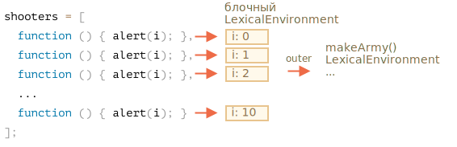

Давайте посмотрим, что происходит внутри `makeArmy`, и решение станет очевидным.

1. Она создаёт пустой массив `shooters`:

    ```js
    let shooters = [];
    ```
2. В цикле заполняет его `shooters.push(function...)`.

    Каждый элемент -- это функция, так что получится такой массив:

    ```js no-beautify
    shooters = [
      function () { alert(i); },
      function () { alert(i); },
      function () { alert(i); },
      function () { alert(i); },
      function () { alert(i); },
      function () { alert(i); },
      function () { alert(i); },
      function () { alert(i); },
      function () { alert(i); },
      function () { alert(i); }
    ];
    ```

3. Функция возвращает массив.

Позже вызов `army[5]()` получит элемент `army[5]` из массива (это будет функция) и вызовет её.

Теперь, почему все эти функции показывают одно и то же?

Всё потому, что внутри функций  `shooter` нет локальной переменной `i`. Когда вызывается такая функция, она берёт `i` из своего внешнего лексического окружения.

Какое будет значение у `i`?

Если мы посмотрим в исходный код:

```js
function makeArmy() {
  ...
  let i = 0;
  while (i < 10) {
    let shooter = function() { // функция shooter
      alert( i ); // должна выводить порядковый номер
    };
    ...
  }
  ...
}
```

...Мы увидим, что оно живёт в лексическом окружении, связанном с текущим вызовом `makeArmy()`. Но, когда вызывается `army[5]()`, `makeArmy` уже завершила свою работу, и последнее значение `i`: 10 (конец цикла `while`).

Как результат, все функции `shooter` получат одно и то же из внешнего окружения: последнее значение `i=10`.

Мы можем это исправить, переместив определение переменной в цикл:

```js run demo
function makeArmy() {

  let shooters = [];

*!*
  for(let i = 0; i < 10; i++) {
*/!*
    let shooter = function() { // функция shooter
      alert( i ); // должна выводить порядковый номер
    };
    shooters.push(shooter);


  }

  return shooters;
}

let army = makeArmy();

army[0](); // 0
army[5](); // 5
```

Теперь она работает правильно, потому что каждый раз, когда выполняется блок кода `for (let i=0...) {...}`, для него создаётся новое лексическое окружение с соответствующей переменной `i`.

Так что значение `i` теперь живёт немного ближе. Не в лексическом окружении `makeArmy()`, а в лексическом окружении, которое соответствует текущей итерации цикла. Вот почему теперь она работает.



Здесь мы переписали `while` в `for`.

Можно использовать другой трюк, давайте рассмотрим его для лучшего понимания предмета: 

```js run
function makeArmy() {
  let shooters = [];

  let i = 0;
  while (i < 10) {
*!*
    let j = i;
*/!*
    let shooter = function() { // функция shooter
      alert( *!*j*/!* ); // должна выводить порядковый номер
    };
    shooters.push(shooter);
    i++;
  }

  return shooters;
}

let army = makeArmy();

army[0](); // 0
army[5](); // 5
```

Цикл `while` так же, как и `for`, создаёт новое лексическое окружение для каждой итерации. Так что тут мы хотим убедиться, что он получит правильное значение для `shooter`.

Мы копируем `let j = i`. Это создаёт локальную для итерации переменную `j` и копирует в неё `i`. Примитивы копируются "по значению", поэтому мы получаем совершенно независимую копию `i`, принадлежащую текущей итерации цикла.
