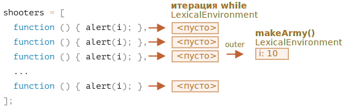
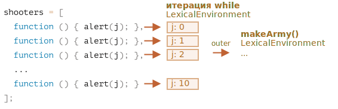
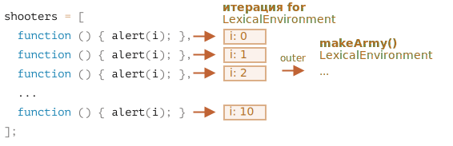

Давайте посмотрим, что происходит внутри `makeArmy`, и решение станет очевидным.

1. Она создаёт пустой массив `shooters`:

    ```js
    let shooters = [];
    ```
2. В цикле заполняет его `shooters.push(function...)`.

    Каждый элемент -- это функция, так что получится такой массив:

    ```js no-beautify
    shooters = [
      function () { alert(i); },
      function () { alert(i); },
      function () { alert(i); },
      function () { alert(i); },
      function () { alert(i); },
      function () { alert(i); },
      function () { alert(i); },
      function () { alert(i); },
      function () { alert(i); },
      function () { alert(i); }
    ];
    ```

3. Функция возвращает массив.

    Позже вызов `army[5]()` получит элемент `army[5]` из массива (это будет функция) и вызовет её.

    Теперь, почему все эти функции показывают одно и то же?

    Всё потому, что внутри функций  `shooter` нет локальной переменной `i`. Когда вызывается такая функция, она берёт `i` из своего внешнего лексического окружения.

    Какое будет значение у `i`?

    Если мы посмотрим в исходный код:

    ```js
    function makeArmy() {
      ...
      let i = 0;
      while (i < 10) {
        let shooter = function() { // функция shooter
          alert( i ); // должна выводить порядковый номер
        };
        shooters.push(shooter); // и добавлять стрелка в массив
        i++;
      }
      ...
    }
    ```

    ...Мы увидим, что оно живёт в лексическом окружении, связанном с текущим вызовом `makeArmy()`. Но, когда вызывается `army[5]()`, `makeArmy` уже завершила свою работу, и последнее значение `i`: `10` (конец цикла `while`).

    Как результат, все функции `shooter` получат одно и то же значение из внешнего лексического окружения: последнее значение `i=10`.

    

    Как вы можете видеть выше, на каждой итерации блока `while {...}` создается новое лексическое окружение. Чтобы исправить это, мы можем скопировать значение `i` в переменную внутри блока `while {...}`, например, так:

    ```js run
    function makeArmy() {
      let shooters = [];
    
      let i = 0;
      while (i < 10) {
        *!*
          let j = i;
        */!*
          let shooter = function() { // функция shooter
            alert( *!*j*/!* ); // должна выводить порядковый номер
          };
        shooters.push(shooter);
        i++;
      }
    
      return shooters;
    }
    
    let army = makeArmy();
    
    // теперь код работает правильно
    army[0](); // 0
    army[5](); // 5
    ```

    Здесь `let j = i` объявляет "итерационно-локальную" переменную `j` и копирует в нее `i`. Примитивы копируются "по значению", поэтому фактически мы получаем независимую копию `i`, принадлежащую текущей итерации цикла.

    Функции `shooter` работают правильно, потому что значение `i` теперь живет чуть ближе. Не в лексическом окружении `makeArmy()`, а в лексическом окружении, соответствующем текущей итерации цикла:

    

    Этой проблемы также можно было бы избежать, если бы мы использовали `for` в начале, например, так:

    ```js run demo
    function makeArmy() {
    
      let shooters = [];
    
    *!*
      for (let i = 0; i < 10; i++) {
    */!*
        let shooter = function() { // функция shooter
          alert( i ); // должна выводить порядковый номер
        };
        shooters.push(shooter);
      }
    
      return shooters;
    }
    
    let army = makeArmy();
    
    army[0](); // 0
    army[5](); // 5
    ```

    По сути, это то же самое, поскольку `for` на каждой итерации создает новое лексическое окружение со своей переменной `i`. Поэтому функция `shooter`, создаваемая на каждой итерации, ссылается на свою собственную переменную `i`, причем именно с этой итерации.

   

Теперь, когда вы приложили столько усилий, чтобы прочитать это объяснение, а конечный вариант оказался так прост - использовать `for`, вы можете задаться вопросом -- стоило ли оно того?

Что ж, если бы вы могли легко ответить на вопрос из задачи, вы бы не стали читать решение. Так что, должно быть, эта задача помогла вам лучше понять суть дела. 

Кроме того, действительно встречаются случаи, когда человек предпочитает `while`, а не `for`, и другие сценарии, где такие проблемы реальны.
