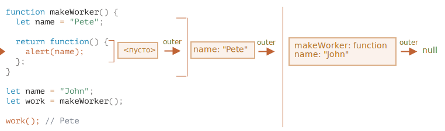

Ответ: **Pete**.

Функция `work()` в приведенном ниже коде получает `name` из места его происхождения через ссылку на внешнее лексическое окружение:

Таким образом, в результате мы получаем `"Pete"`.

Но если бы в `makeWorker()` не было `let name`, то поиск шел бы снаружи и брал глобальную переменную, что мы видим из приведенной выше цепочки. В этом случае результатом было бы `"John"`.
