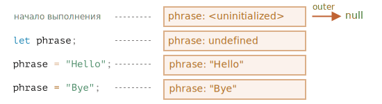
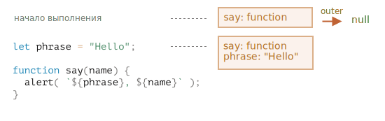
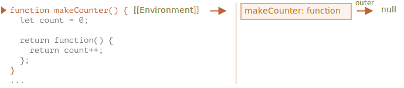

<<<<<<< HEAD
# Замыкание

JavaScript - язык с сильным функционально-ориентированным уклоном. Он даёт нам много свободы. Функция может быть динамически создана, скопирована в другую переменную или передана как аргумент другой функции и позже вызвана из совершенно другого места.

Мы знаем, что функция может получить доступ к переменным из внешнего окружения, эта возможность используется очень часто.

Но что произойдёт, когда внешние переменные изменятся? Функция получит последнее значение или то, которое существовало на момент создания функции?

И что произойдёт, когда функция переместится в другое место в коде и будет вызвана оттуда -- получит ли она доступ к внешним переменным своего нового местоположения?

Разные языки ведут себя по-разному в таких случаях, и в этой главе мы рассмотрим поведение JavaScript.

## Пара вопросов

Для начала давайте рассмотрим две ситуации, а затем изучим внутренние механизмы шаг за шагом, чтобы вы смогли ответить на эти и более сложные вопросы в будущем.

1. Функция `sayHi` использует внешнюю переменную `name`. Какое значение будет использовать функция при выполнении?

    ```js
    let name = "John";

    function sayHi() {
      alert("Hi, " + name);
    }

    name = "Pete";

    *!*
    sayHi(); // что будет показано: "John" или "Pete"?
    */!*
    ```

    Такие ситуации распространены и в браузерной и в серверной разработке. Выполнение функции может быть запланировано позже, чем она была создана, например, после какого-нибудь пользовательского действия или сетевого запроса.

    Итак, вопрос в том, получит ли она доступ к последним изменениям?


2. Функция `makeWorker` создаёт другую функцию и возвращает её. Новая функция может быть вызвана откуда-то ещё. Получит ли она доступ к внешним переменным из места своего создания или места выполнения или из обоих?

    ```js
    function makeWorker() {
      let name = "Pete";

      return function() {
        alert(name);
      };
    }

    let name = "John";

    // create a function
    let work = makeWorker();

    // call it
    *!*
    work(); // что будет показано? "Pete" (из места создания) или "John" (из места выполнения)
    */!*
    ```


## Лексическое Окружение

Чтобы понять, что происходит, давайте для начала обсудим, что такое "переменная" на самом деле.

В JavaScript у каждой выполняемой функции, блока кода и скрипта есть связанный с ними внутренний (скрытый) объект, называемый *лексическим окружением* `LexicalEnvironment`.

Объект лексического окружения состоит из двух частей:

1. *Environment Record* -- объект, в котором как свойства хранятся все локальные переменные (а также некоторая другая информация, такая как значение `this`).

2. Ссылка на *внешнее лексическое окружение* - то есть то, которое соответствует коду снаружи (снаружи от текущих фигурных скобок).

**"Переменная" -- это просто свойство специального внутреннего объекта: Environment Record. "Получить или изменить переменную", означает, "получить или изменить свойство этого объекта".**

Например, в этом простом коде только одно лексическое окружение:


Это, так называемое, глобальное лексическое окружение, связанное со всем скриптом.

На картинке выше прямоугольник означает Environment Record (хранилище переменных), а стрелка означает ссылку на внешнее окружение. У глобального лексического окружения нет внешнего окружения, так что она указывает на `null`.

А вот как оно изменяется при объявлении и присваивании переменной:



Прямоугольники с правой стороны демонстрируют, как глобальное лексическое окружение изменяется в процессе выполнения кода:

1. В начале скрипта лексическое окружение пустое.
2. Появляется определение переменной `let phrase`. У неё нет присвоенного значения, поэтому присваивается `undefined`.
3. Переменной `phrase` присваивается значение.
4. Переменная `phrase` меняет значение.

Пока что всё выглядит просто, правда?

Итого:

- Переменная -- это свойство специального внутреннего объекта, связанного с текущим выполняющимся блоком/функцией/скриптом.
- Работа с переменными -- это на самом деле работа со свойствами этого объекта.

### Function Declaration

До сих пор мы рассматривали только переменные. Теперь рассмотрим Function Declaration.

**В отличие от переменных, объявленных с помощью `let`, они полностью инициализируются не тогда, когда выполнение доходит до них, а раньше, когда создаётся лексическое окружение.**

Для верхнеуровневых функций это означает момент, когда скрипт начинает выполнение.

Вот почему мы можем вызвать функцию, объявленную через Function Declaration, до того, как она определена.

Следующий код демонстрирует, что уже с самого начала в лексическом окружении что-то есть. Там есть `say`, потому что это Function Declaration. И позже там появится `phrase`, объявленное через `let`:




### Внутреннее и внешнее лексическое окружение

Теперь давайте продолжим и посмотрим, что происходит, когда функция получает доступ к внешней переменной.

В течение вызова `say()` использует внешнюю переменную `phrase`. Давайте разберёмся подробно, что происходит.

При запуске функции для неё автоматически создаётся новое лексическое окружение, для хранения локальных переменных и параметров вызова.

Например, для `say("John")` это выглядит так (выполнение находится на строке, отмеченной стрелкой):

<!--
    ```js
    let phrase = "Hello";

    function say(name) {
     alert( `${phrase}, ${name}` );
    }

    say("John"); // Hello, John
    ```-->


Итак, в процессе вызова функции у нас есть два лексических окружения: внутреннее (для вызываемой функции) и внешнее (глобальное):

- внутреннее лексическое окружение соответствует текущему выполнению `say`.

  В нём находится одна переменная `name`, аргумент функции. Мы вызываем `say("John")`, так что значение переменной `name` равно `"John"`.
- Внешнее лексическое окружение -- это глобальное лексическое окружение.

  В нём находятся переменная `phrase` и сама функция.

У внутреннего лексического окружения есть ссылка `outer` на внешнее.

**Когда код хочет получить доступ к переменной -- сначала происходит поиск во внутреннем лексическом окружении, затем во внешнем, затем в следующем и так далее, до глобального.**

Если переменная не была найдена, это будет ошибкой в `strict mode`. Без `strict mode`, для обратной совместимости, присваивание несуществующей переменной создаёт новую глобальную переменную с таким именем.

Давайте посмотрим, как происходит поиск в нашем примере:

- Когда `alert` внутри `say` хочет получить доступ к `name`, он немедленно находит переменную в лексическом окружении функции.
- Когда он хочет получить доступ к `phrase`, которой нет локально, он следует дальше по ссылке к внешнему лексическому окружению и находит переменную там.


Теперь у нас есть ответ на первый вопрос из начала главы.

**Функция получает текущее значение внешних переменных, то есть, их последнее значение**

Старые значения переменных нигде не сохраняются. Когда функция хочет получить доступ к переменной, она берёт её текущее значение из своего или внешнего лексического окружения.

Так что, ответ на первый вопрос: `Pete`:
=======
# Variable scope

JavaScript is a very function-oriented language. It gives us a lot of freedom. A function can be created dynamically, passed as an argument to another function and called from a totally different place of code later.

We already know that a function can access variables outside of it.

Now let's expand our knowledge to include more complex scenarios.

```smart header="We'll talk about `let/const` variables here"
In JavaScript, there are 3 ways to declare a variable: `let`, `const` (the modern ones), and `var` (the remnant of the past).

- In this article we'll use `let` variables in examples.
- Variables, declared with `const`, behave the same, so this article is about `const` too.
- The old `var` has some notable differences, they will be covered in the article <info:var>.
```

## Code blocks

If a variable is declared inside a code block `{...}`, it's only visible inside that block.

For example:

```js run
{
  // do some job with local variables that should not be seen outside

  let message = "Hello"; // only visible in this block

  alert(message); // Hello
}

alert(message); // Error: message is not defined
```

We can use this to isolate a piece of code that does its own task, with variables that only belong to it:

```js run
{
  // show message
  let message = "Hello";
  alert(message);
}

{
  // show another message
  let message = "Goodbye";
  alert(message);
}
```

````smart header="There'd be an error without blocks"
Please note, without separate blocks there would be an error, if we use `let` with the existing variable name:

```js run
// show message
let message = "Hello";
alert(message);

// show another message
*!*
let message = "Goodbye"; // Error: variable already declared
*/!*
alert(message);
```
````

For `if`, `for`, `while` and so on, variables declared in `{...}` are also only visible inside:
>>>>>>> a4a84083a7656f2b25de8b766b2457d3aae17874

```js run
if (true) {
  let phrase = "Hello!";

  alert(phrase); // Hello!
}

alert(phrase); // Error, no such variable!
```

Here, after `if` finishes, the `alert` below won't see the `phrase`, hence the error.

<<<<<<< HEAD
Порядок выполнения кода, приведённого выше:

1. В глобальном лексическом окружении есть `name: "John"`.
2. На строке `(*)` глобальная переменная изменяется, теперь `name: "Pete"`.
3. Момент, когда выполняется функция `sayHi()` и берёт переменную `name` извне. Теперь из глобального лексического окружения, где переменная уже равна `"Pete"`.
=======
That's great, as it allows us to create block-local variables, specific to an `if` branch.

The similar thing holds true for `for` and `while` loops:
>>>>>>> a4a84083a7656f2b25de8b766b2457d3aae17874

```js run
for (let i = 0; i < 3; i++) {
  // the variable i is only visible inside this for
  alert(i); // 0, then 1, then 2
}

<<<<<<< HEAD
```smart header="Один вызов -- одно лексическое окружение"
Пожалуйста, обратите внимание, что новое лексическое окружение функции создаётся каждый раз, когда функция выполняется.

И, если функция вызывается несколько раз, то для каждого вызова будет своё лексическое окружение, со своими, специфичными для этого вызова, локальными переменными и параметрами.
```

```smart header="Лексическое окружение -- это специальный внутренний объект"
"Лексическое окружение" -- это специальный внутренний объект. Мы не можем получить его в нашем коде и изменять напрямую. Сам движок JavaScript может оптимизировать его, уничтожать неиспользуемые переменные для освобождения памяти и выполнять другие внутренние уловки, но видимое поведение объекта должно оставаться таким, как было описано.
=======
alert(i); // Error, no such variable
>>>>>>> a4a84083a7656f2b25de8b766b2457d3aae17874
```

Visually, `let i` is outside of `{...}`. But the `for` construct is special here: the variable, declared inside it, is considered a part of the block.

## Вложенные функции

Функция называется "вложенной", когда она создаётся внутри другой функции.

Это очень легко сделать в JavaScript.

Мы можем использовать это для упорядочивания нашего кода, например, как здесь:

```js
function sayHiBye(firstName, lastName) {

  // функция-помощник, которую мы используем ниже
  function getFullName() {
    return firstName + " " + lastName;
  }

  alert( "Hello, " + getFullName() );
  alert( "Bye, " + getFullName() );

}
```

Здесь *вложенная* функция `getFullName()` создана для удобства. Она может получить доступ к внешним переменным и, значит, вывести полное имя. В JavaScript вложенные функции используются очень часто.

<<<<<<< HEAD
Что ещё интереснее, вложенная функция может быть возвращена: либо в качестве свойства нового объекта (если внешняя функция создаёт объект с методами), либо сама по себе. И затем может быть использована в любом месте. Не важно где, она всё так же будет иметь доступ к тем же внешним переменным.

Например, здесь, вложенная функция присваивается новому объекту в [конструкторе](info:constructor-new):

```js run
// функция-конструктор возвращает новый объект
function User(name) {

  // методом объекта становится вложенная функция
  this.sayHi = function() {
    alert(name);
  };
}

let user = new User("John");
user.sayHi(); // у кода метода "sayHi" есть доступ к внешней переменной "name"
```

А здесь мы просто создаём и возвращаем функцию "счётчик":
=======
What's much more interesting, a nested function can be returned: either as a property of a new object or as a result by itself. It can then be used somewhere else. No matter where, it still has access to the same outer variables.

Below, `makeCounter` creates the "counter" function that returns the next number on each invocation:
>>>>>>> a4a84083a7656f2b25de8b766b2457d3aae17874

```js run
function makeCounter() {
  let count = 0;

  return function() {
<<<<<<< HEAD
    return count++; // есть доступ к внешней переменной "count"
=======
    return count++;
>>>>>>> a4a84083a7656f2b25de8b766b2457d3aae17874
  };
}

let counter = makeCounter();

alert( counter() ); // 0
alert( counter() ); // 1
alert( counter() ); // 2
```

<<<<<<< HEAD
Давайте продолжим с примером `makeCounter`. Он создаёт функцию "counter", которая возвращает следующее число при каждом вызове. Несмотря на простоту, немного модифицированные варианты этого кода применяются на практике, например, в [генераторе псевдослучайных чисел](https://ru.wikipedia.org/wiki/Генератор_псевдослучайных_чисел) и во многих других случаях.

Как же это работает изнутри?

Когда внутренняя функция начинает выполняться, начинается поиск переменной `count++` изнутри-наружу. Для примера выше порядок будет такой:
=======
Despite being simple, slightly modified variants of that code have practical uses, for instance, as a [random number generator](https://en.wikipedia.org/wiki/Pseudorandom_number_generator) to generate random values for automated tests.

How does this work? If we create multiple counters, will they be independent? What's going on with the variables here?
>>>>>>> a4a84083a7656f2b25de8b766b2457d3aae17874

Undestanding such things is great for the overall knowledge of JavaScript and beneficial for more complex scenarios. So let's go a bit in-depth.

<<<<<<< HEAD
1. Локальные переменные вложенной функции...
2. Переменные внешней функции...
3. И так далее, пока не будут достигнуты глобальные переменные.

В этом примере `count` будет найден на шаге `2`. Когда внешняя переменная модифицируется, она изменится там, где была найдена. Значит, `count++` найдёт внешнюю переменную и увеличит её значение в лексическом окружении, которому она принадлежит. Как если бы у нас было `let count = 1`.

Теперь рассмотрим два вопроса:

1. Можем ли мы каким-нибудь образом сбросить счётчик `count` из кода, который не принадлежит `makeCounter`? Например, после вызова `alert` в коде выше.
2. Если мы вызываем `makeCounter` несколько раз -- нам возвращается много функций `counter`. Они независимы или разделяют одну и ту же переменную `count`?

Попробуйте ответить на эти вопросы перед тем, как продолжить чтение.

...

Готовы?

Хорошо, давайте ответим на вопросы.

1. Такой возможности нет: `count` -- локальная переменная функции, мы не можем получить к ней доступ извне.
2. Для каждого вызова `makeCounter()` создаётся новое лексическое окружение функции, со своим собственным `count`. Так что, получившиеся функции `counter` -- независимы.

Вот демо:

```js run
function makeCounter() {
  let count = 0;
  return function() {
    return count++;
  };
}

let counter1 = makeCounter();
let counter2 = makeCounter();
=======
## Lexical Environment
>>>>>>> a4a84083a7656f2b25de8b766b2457d3aae17874

```warn header="Here be dragons!"
The in-depth technical explanation lies ahead.

<<<<<<< HEAD
alert( counter2() ); // 0 (независимо)
=======
As far as I'd like to avoid low-level language details, any understanding without them would be lacking and incomplete, so get ready.
>>>>>>> a4a84083a7656f2b25de8b766b2457d3aae17874
```
Надеюсь, ситуация с внешними переменными теперь ясна. Для большинства ситуаций такого понимания вполне достаточно, но в спецификации есть ряд деталей, которые мы, для простоты, опустили. Далее мы разберём происходящее ещё более подробно.

<<<<<<< HEAD
## Окружение в деталях

Вот что происходит в примере с `makeCounter` шаг за шагом. Пройдите их, чтобы убедиться, что вы разобрались с каждой деталью.

Пожалуйста, обратите внимание на дополнительное свойство `[[Environment]]`, про которое здесь рассказано. Мы не упоминали о нём раньше для простоты.

1. Когда скрипт только начинает выполняться, есть только глобальное лексическое окружение:

    

    В этот начальный момент есть только функция `makeCounter`, потому что это Function Declaration. Она ещё не выполняется.

    **Все функции "при рождении" получают скрытое свойство `[[Environment]]`, которое ссылается на лексическое окружение места, где они были созданы.**

    Мы ещё не говорили об этом, это то, каким образом функции знают, где они были созданы.

    В данном случае, `makeCounter` создан в глобальном лексическом окружении, так что `[[Environment]]` содержит ссылку на него.

    Другими словами, функция навсегда запоминает ссылку на лексическое окружение, где она была создана. И `[[Environment]]` -- скрытое свойство функции, которое содержит эту ссылку.

2. Код продолжает выполняться, объявляется новая глобальная переменная `counter`, которой присваивается результат вызова `makeCounter`. Вот снимок момента, когда интерпретатор находится на первой строке внутри `makeCounter()`:

    

    В момент вызова `makeCounter()` создаётся лексическое окружение, для хранения его переменных и аргументов.

    Как и все лексические окружения, оно содержит две вещи:
    1. Environment Record с локальными переменными. В нашем случае `count` -- единственная локальная переменная (появляющаяся, когда выполняется строчка с `let count`).
    2. Ссылка на внешнее окружение, которая устанавливается в значение `[[Environment]]` функции. В данном случае, `[[Environment]]` функции `makeCounter` ссылается на глобальное лексическое окружение.

    Итак, теперь у нас есть два лексических окружения: первое -- глобальное, второе -- для текущего вызова `makeCounter`, с внешней ссылкой на глобальный объект.

3. В процессе выполнения `makeCounter()` создаётся небольшая вложенная функция.

    Не имеет значения, какой способ объявления функции используется: Function Declaration или Function Expression. Все функции получают свойство `[[Environment]]`, которое ссылается на лексическое окружение, в котором они были созданы. То же самое происходит и с нашей новой маленькой функцией.

    Для нашей новой вложенной функции значением `[[Environment]]` будет текущее лексическое окружение `makeCounter()` (где она была создана):
=======
For clarity, the explanation is split into multiple steps.

### Step 1. Variables

In JavaScript, every running function, code block `{...}`, and the script as a whole have an internal (hidden) associated object known as the *Lexical Environment*.
>>>>>>> a4a84083a7656f2b25de8b766b2457d3aae17874

The Lexical Environment object consists of two parts:

<<<<<<< HEAD
    Пожалуйста, обратите внимание, что на этом шаге внутренняя функция была создана, но ещё не вызвана. Код внутри `function() { return count++ }` не выполняется.

4.  Выполнение продолжается, вызов `makeCounter()` завершается, и результат (небольшая вложенная функция) присваивается глобальной переменной `counter`:
=======
1. *Environment Record* -- an object that stores all local variables as its properties (and some other information like the value of `this`).
2. A reference to the *outer lexical environment*, the one associated with the outer code.

**A "variable" is just a property of the special internal object, `Environment Record`. "To get or change a variable" means "to get or change a property of that object".**
>>>>>>> a4a84083a7656f2b25de8b766b2457d3aae17874

In this simple code without functions, there is only one Lexical Environment:

<<<<<<< HEAD
    В этой функции есть только одна строчка: `return count++`, которая будет выполнена, когда мы вызовем функцию.

6. При вызове `counter()` для этого вызова создаётся новое лексическое окружение. Оно пустое, так как в самом `counter` локальных переменных нет. Но `[[Environment]]` `counter` используется, как ссылка на внешнее лексическое окружение `outer`, которое даёт доступ к переменным предшествующего вызова `makeCounter`, где `counter` был создан.
=======


This is the so-called *global* Lexical Environment, associated with the whole script.
>>>>>>> a4a84083a7656f2b25de8b766b2457d3aae17874

On the picture above, the rectangle means Environment Record (variable store) and the arrow means the outer reference. The global Lexical Environment has no outer reference, that's why the arrow points to `null`.

<<<<<<< HEAD
    Теперь, когда вызов ищет переменную `count`, он сначала ищет в собственном лексическом окружении (пустое), а затем в лексическом окружении предшествующего вызова `makeCounter()`, где и находит её.

    Пожалуйста, обратите внимание, как здесь работает управление памятью. Хотя `makeCounter()` закончил выполнение некоторое время назад, его лексическое окружение остаётся в памяти, потому что есть вложенная функция с `[[Environment]]`, который ссылается на него.

    В большинстве случаев, объект лексического окружения существует до того момента, пока есть функция, которая может его использовать. И только тогда, когда таких не остаётся, окружение уничтожается.

6. Вызов `counter()` не только возвращает значение `count`, но также увеличивает его. Обратите внимание, что модификация происходит "на месте". Значение `count` изменяется конкретно в том окружении, где оно было найдено.
=======
As the code starts executing and goes on, the Lexical Environment changes.

Here's a little bit longer code:


Rectangles on the right-hand side demonstrate how the global Lexical Environment changes during the execution:
>>>>>>> a4a84083a7656f2b25de8b766b2457d3aae17874

1. When the script starts, the Lexical Environment is pre-populated with all declared variables.
    - Initially, they are in the "Uninitialized" state. That's a special internal state, it means that the engine knows about the variable, but won't allow to use it before `let`. It's almost the same as if the variable didn't exist.
2. Then `let phrase` definition appears. There's no assignment yet, so its value is `undefined`. We can use the variable since this moment.
3. `phrase` is assigned a value.
4. `phrase` changes the value.

<<<<<<< HEAD
7. Следующие вызовы `counter()` сделают то же самое.

Теперь ответ на второй вопрос из начала главы должен быть очевиден.

Функция `work()` в коде ниже получает `name` из того места, где была создана, через ссылку на внешнее лексическое окружение:
=======
Everything looks simple for now, right?

- A variable is a property of a special internal object, associated with the currently executing block/function/script.
- Working with variables is actually working with the properties of that object.

```smart header="Lexical Environment is a specification object"
"Lexical Environment" is a specification object: it only exists "theoretically" in the [language specification](https://tc39.es/ecma262/#sec-lexical-environments) to describe how things work. We can't get this object in our code and manipulate it directly.
>>>>>>> a4a84083a7656f2b25de8b766b2457d3aae17874

JavaScript engines also may optimize it, discard variables that are unused to save memory and perform other internal tricks, as long as the visible behavior remains as described.
```

<<<<<<< HEAD
Так что, результатом будет `"Pete"`.

Но, если бы в `makeWorker()` не было `let name`, тогда бы поиск продолжился дальше и была бы взята глобальная переменная, как мы видим из приведённой выше цепочки. В таком случае, результатом было бы `"John"`.

```smart header="Замыкания"
В программировании есть общий термин: "замыкание", -- которое должен знать каждый разработчик.

[Замыкание](https://ru.wikipedia.org/wiki/Замыкание_(программирование)) -- это функция, которая запоминает свои внешние переменные и может получить к ним доступ. В некоторых языках это невозможно, или функция должна быть написана специальным образом, чтобы получилось замыкание. Но, как было описано выше, в JavaScript, все функции изначально являются замыканиями (есть только одно исключение, про которое будет рассказано в <info:new-function>).

То есть, они автоматически запоминают, где были созданы, с помощью скрытого свойства `[[Environment]]` и все они могут получить доступ к внешним переменным.

Когда на собеседовании фронтенд-разработчик получает вопрос: "что такое замыкание?", -- правильным ответом будет определение замыкания и объяснения того факта, что все функции в JavaScript являются замыканиями, и, может быть, несколько слов о технических деталях: свойстве `[[Environment]]` и о том, как работает лексическое окружение.
```

## Блоки кода и циклы, IIFE

Предыдущие примеры сосредоточены на функциях. Но лексическое окружение существует для любых блоков кода `{...}`.

Лексическое окружение создаётся при выполнении блока кода и содержит локальные переменные для этого блока. Вот пара примеров.
=======
### Step 2. Function Declarations

A function is also a value, like a variable.

**The difference is that a Function Declaration is instantly fully initialized.**

When a Lexical Environment is created, a Function Declaration immediately becomes a ready-to-use function (unlike `let`, that is unusable till the declaration).

That's why we can use a function, declared as Function Declaration, even before the declaration itself.

For example, here's the initial state of the global Lexical Environment when we add a function:


Naturally, this behavior only applies to Function Declarations, not Function Expressions where we assign a function to a variable, such as `let say = function(name)...`.

### Step 3. Inner and outer Lexical Environment
>>>>>>> a4a84083a7656f2b25de8b766b2457d3aae17874

When a function runs, at the beginning of the call, a new Lexical Environment is created automatically to store local variables and parameters of the call.

<<<<<<< HEAD
В следующем примере переменная `user` существует только в блоке `if`:
=======
For instance, for `say("John")`, it looks like this (the execution is at the line, labelled with an arrow):
>>>>>>> a4a84083a7656f2b25de8b766b2457d3aae17874

<!--
    ```js
    let phrase = "Hello";

    function say(name) {
     alert( `${phrase}, ${name}` );
    }

<<<<<<< HEAD
    alert(user); // Ошибка, этой переменной не видно
    ```-->


Когда выполнение попадает в блок `if`, для этого блока создаётся новое лексическое окружение.

У него есть ссылка на внешнее окружение, так что `phrase` может быть найдена. Но все переменные и Function Expression, объявленные внутри `if`, остаются в его лексическом окружении и не видны снаружи.

Например, после завершения `if` следующий `alert` не увидит `user`, что вызовет ошибку.
=======
    say("John"); // Hello, John
    ```-->


During the function call we have two Lexical Environments: the inner one (for the function call) and the outer one (global):
>>>>>>> a4a84083a7656f2b25de8b766b2457d3aae17874

- The inner Lexical Environment corresponds to the current execution of `say`. It has a single property: `name`, the function argument. We called `say("John")`, so the value of the `name` is `"John"`.
- The outer Lexical Environment is the global Lexical Environment. It has the `phrase` variable and the function itself.

<<<<<<< HEAD
Для цикла у каждой итерации своё отдельное лексическое окружение. Если переменная объявлена в `for(let ...)`, то она также в нём:

```js run
for (let i = 0; i < 10; i++) {
  // У каждого цикла своё собственное лексическое окружение
  // {i: value}
}

alert(i); // Ошибка, нет такой переменной
```

Обратите внимание: `let i` визуально находится снаружи `{...}`. Но конструкция `for` -- особенная в этом смысле, у каждой итерации цикла своё собственное лексическое окружение с текущим `i` в нём.

И так же, как и в `if`, ниже цикла `i` невидима.

### Блоки кода

Мы также можем использовать "простые" блоки кода `{...}`, чтобы изолировать переменные в "локальной области видимости".

Например, в браузере все скрипты (кроме `type="module"`) разделяют одну общую глобальную область. Так что, если мы создадим глобальную переменную в одном скрипте, она станет доступна и в других. Но это становится источником конфликтов, если два скрипта используют одно и тоже имя переменной и перезаписывают друга друга.

Это может произойти, если название переменной -- широко распространённое слово, а авторы скрипта не знают друг о друге.

Если мы хотим этого избежать, мы можем использовать блок кода для изоляции всего скрипта или какой-то его части:

```js run
{
  // сделать какую-нибудь работу с локальными переменными, которые не должны быть видны снаружи
=======
The inner Lexical Environment has a reference to the `outer` one.

**When the code wants to access a variable -- the inner Lexical Environment is searched first, then the outer one, then the more outer one and so on until the global one.**

If a variable is not found anywhere, that's an error in strict mode (without `use strict`, an assignment to a non-existing variable creates a new global variable, for compatibility with old code).

In this example the search proceeds as follows:

- For the `name` variable, the `alert` inside `say` finds it immediately in the inner Lexical Environment.
- When it wants to access `phrase`, then there is no `phrase` locally, so it follows the reference to the outer Lexical Environment and finds it there.


### Step 4. Returning a function

Let's return to the `makeCounter` example.
>>>>>>> a4a84083a7656f2b25de8b766b2457d3aae17874

```js
function makeCounter() {
  let count = 0;

  return function() {
    return count++;
  };
}

<<<<<<< HEAD
alert(message); // Ошибка: переменная message не определена
```

Из-за того, что у блока есть собственное лексическое окружение, код снаружи него (или в другом скрипте) не видит переменные этого блока.
=======
let counter = makeCounter();
```

At the beginning of each `makeCounter()` call, a new Lexical Environment object is created, to store variables for this `makeCounter` run.
>>>>>>> a4a84083a7656f2b25de8b766b2457d3aae17874

So we have two nested Lexical Environments, just like in the example above:

<<<<<<< HEAD
В прошлом в JavaScript не было лексического окружения на уровне блоков кода.

Так что программистам пришлось что-то придумать. И то, что они сделали, называется "immediately-invoked function expressions" (аббревиатура IIFE), что означает функцию, запускаемую сразу после объявления.

Это не то, что мы должны использовать сегодня, но, так как вы можете встретить это в старых скриптах, полезно понимать принцип работы.

IIFE выглядит так:
=======


What's different is that, during the execution of `makeCounter()`, a tiny nested function is created of only one line: `return count++`. We don't run it yet, only create.

All functions remember the Lexical Environment in which they were made. Technically, there's no magic here: all functions have the hidden property named `[[Environment]]`, that keeps the reference to the Lexical Environment where the function was created:


>>>>>>> a4a84083a7656f2b25de8b766b2457d3aae17874

So, `counter.[[Environment]]` has the reference to `{count: 0}` Lexical Environment. That's how the function remembers where it was created, no matter where it's called. The `[[Environment]]` reference is set once and forever at function creation time.

Later, when `counter()` is called, a new Lexical Environment is created for the call, and its outer Lexical Environment reference is taken from `counter.[[Environment]]`:


Now when the code inside `counter()` looks for `count` variable, it first searches its own Lexical Environment (empty, as there are no local variables there), then the Lexical Environment of the outer `makeCounter()` call, where finds it and changes.

<<<<<<< HEAD
Здесь создаётся и немедленно вызывается Function Expression. Так что код выполняется сразу же и у него есть свои локальные переменные.

Function Expression обёрнуто в скобки `(function {...})`, потому что, когда JavaScript встречает `"function"` в основном потоке кода, он воспринимает это как начало Function Declaration. Но у Function Declaration должно быть имя, так что такой код вызовет ошибку:

```js run
// Попробуйте объявить и сразу же вызвать функцию
function() { // <-- Error: Unexpected token (
=======
**A variable is updated in the Lexical Environment where it lives.**

Here's the state after the execution:


>>>>>>> a4a84083a7656f2b25de8b766b2457d3aae17874

If we call `counter()` multiple times, the `count` variable will be increased to `2`, `3` and so on, at the same place.

<<<<<<< HEAD
}();
```

Даже если мы скажем: "хорошо, давайте добавим имя", -- это не сработает, потому что JavaScript не позволяет вызывать Function Declaration немедленно.

```js run
// ошибка синтаксиса из-за скобок ниже
function go() {

}(); // <-- не можете вызывать Function Declaration немедленно
```
Так что, скобки вокруг функции -- это трюк, который позволяет показать JavaScript, что функция была создана в контексте другого выражения, и, таким образом, это функциональное выражение: ей не нужно имя и её можно вызвать немедленно.

Кроме скобок, существуют и другие пути показать JavaScript, что мы имеем в виду Function Expression:

```js run
// Пути создания IIFE

(function() {
  alert("Скобки вокруг функции");
}*!*)*/!*();

(function() {
  alert("Скобки вокруг всего");
}()*!*)*/!*;

*!*!*/!*function() {
  alert("Выражение начинается с побитового оператора NOT");
}();

*!*+*/!*function() {
  alert("Выражение начинается с унарного плюса");
}();
```

Во всех перечисленных случаях мы объявляем Function Expression и немедленно выполняем его. Ещё раз заметим, что в настоящий момент нет необходимости писать подобный код.

## Сборка мусора

Обычно лексическое окружение очищается и удаляется после того, как функция выполнилась. Например:
=======
```smart header="Closure"
There is a general programming term "closure", that developers generally should know.

A [closure](https://en.wikipedia.org/wiki/Closure_(computer_programming)) is a function that remembers its outer variables and can access them. In some languages, that's not possible, or a function should be written in a special way to make it happen. But as explained above, in JavaScript, all functions are naturally closures (there is only one exception, to be covered in <info:new-function>).

That is: they automatically remember where they were created using a hidden `[[Environment]]` property, and then their code can access outer variables.

When on an interview, a frontend developer gets a question about "what's a closure?", a valid answer would be a definition of the closure and an explanation that all functions in JavaScript are closures, and maybe a few more words about technical details: the `[[Environment]]` property and how Lexical Environments work.
```

## Garbage collection

Usually, a Lexical Environment is removed from memory with all the variables after the function call finishes. That's because there are no references to it. As any JavaScript object, it's only kept in memory while it's reachable.
>>>>>>> a4a84083a7656f2b25de8b766b2457d3aae17874

...But if there's a nested function that is still reachable after the end of a function, then it has `[[Environment]]` property that references the lexical environment.

<<<<<<< HEAD
Здесь два значения, которые технически являются свойствами лексического окружения. Но после того, как `f()` завершится, это лексическое окружение станет недоступно, поэтому оно удалится из памяти.

...Но, если есть вложенная функция, которая всё ещё доступна после выполнения `f`, то у неё есть свойство `[[Environment]]`, которое ссылается на внешнее лексическое окружение, тем самым оставляя его достижимым, "живым":
=======
In that case the Lexical Environment is still reachable even after the completion of the function, so it stays alive.

For example:
>>>>>>> a4a84083a7656f2b25de8b766b2457d3aae17874

```js
function f() {
  let value = 123;

  return function() {
    alert(value);
  }
}

<<<<<<< HEAD
let g = f(); // g доступно и продолжает держать внешнее лексическое окружение в памяти
=======
let g = f(); // g.[[Environment]] stores a reference to the Lexical Environment
// of the corresponding f() call
>>>>>>> a4a84083a7656f2b25de8b766b2457d3aae17874
```

Обратите внимание, если `f()` вызывается несколько раз и возвращаемые функции сохраняются, тогда все соответствующие объекты лексического окружения продолжат держаться в памяти. Вот три такие функции в коде ниже:

```js
function f() {
  let value = Math.random();

  return function() { alert(value); };
}

// три функции в массиве, каждая из них ссылается на лексическое окружение
// из соответствующего вызова f()
let arr = [f(), f(), f()];
```

Объект лексического окружения умирает, когда становится недоступным (как и любой другой объект). Другими словами, он существует только до того момента, пока есть хотя бы одна вложенная функция, которая ссылается на него.

<<<<<<< HEAD
В следующем коде, после того как `g` станет недоступным, лексическое окружение функции (и, соответственно, `value`) будет удалено из памяти;
=======
In the code below, after the nested function is removed, its enclosing Lexical Environment (and hence the `value`) is cleaned from memory;
>>>>>>> a4a84083a7656f2b25de8b766b2457d3aae17874

```js
function f() {
  let value = 123;

  return function() {
    alert(value);
  }
}

<<<<<<< HEAD
let g = f(); // пока g существует,
// соответствующее лексическое окружение существует
=======
let g = f(); // while g function exists, the value stays in memory
>>>>>>> a4a84083a7656f2b25de8b766b2457d3aae17874

g = null; // ...а теперь память очищается
```

### Оптимизация на практике

Как мы видели, в теории, пока функция жива, все внешние переменные тоже сохраняются.

Но на практике движки JavaScript пытаются это оптимизировать. Они анализируют использование переменных и, если легко по коду понять, что внешняя переменная не используется -- она удаляется.

**Одним из важных побочных эффектов в V8 (Chrome, Opera) является то, что такая переменная становится недоступной при отладке.**

Попробуйте запустить следующий пример в Chrome с открытой Developer Tools.

Когда код будет поставлен на паузу, напишите в консоли `alert(value)`.

```js run
function f() {
  let value = Math.random();

  function g() {
    debugger; // в консоли: напишите alert(value); Такой переменной нет!
  }

  return g;
}

let g = f();
g();
```

Как вы можете видеть -- такой переменной не существует! В теории, она должна быть доступна, но попала под оптимизацию движка.

Это может приводить к забавным (если удаётся решить быстро) проблемам при отладке. Одна из них -- мы можем увидеть не ту внешнюю переменную при совпадающих названиях:

```js run global
let value = "Сюрприз!";

function f() {
  let value = "ближайшее значение";

  function g() {
    debugger; // в консоли: напишите alert(value); Сюрприз!
  }

  return g;
}

let g = f();
g();
```

<<<<<<< HEAD
```warn header="До встречи!"
Эту особенность V8 полезно знать. Если вы занимаетесь отладкой в Chrome/Opera, рано или поздно вы с ней встретитесь.

Это не баг в отладчике, а скорее особенность V8. Возможно со временем это изменится.
Вы всегда можете проверить это, запустив пример на этой странице.
```
=======
This feature of V8 is good to know. If you are debugging with Chrome/Opera, sooner or later you will meet it.

That is not a bug in the debugger, but rather a special feature of V8. Perhaps it will be changed sometime. You always can check for it by running the examples on this page.
>>>>>>> a4a84083a7656f2b25de8b766b2457d3aae17874
