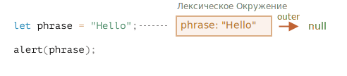
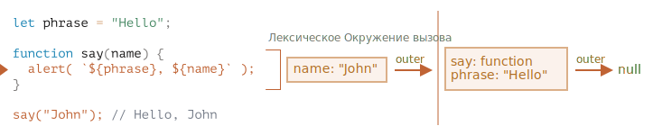

# Область видимости переменных, замыкание

JavaScript - язык с сильным функционально-ориентированным уклоном. Он даёт нам много свободы. Функция может быть динамически создана, скопирована в другую переменную или передана как аргумент другой функции и позже вызвана из совершенно другого места.

Мы знаем, что функция может получить доступ к переменным из внешнего окружения, эта возможность используется очень часто.

Но что произойдёт, когда внешние переменные изменятся? Функция получит последнее значение или то, которое существовало на момент создания функции?

И что произойдёт, когда функция переместится в другое место в коде и будет вызвана оттуда -- получит ли она доступ к внешним переменным своего нового местоположения?

Разные языки ведут себя по-разному в таких случаях, и в этой главе мы рассмотрим поведение JavaScript.

```smart header="Мы будем говорить о переменных `let/const` здесь"
В JavaScript существует три способа объявить переменную: `let`, `const` (современные), и `var` (пережиток прошлого).

- В этой статье мы будем использовать переменные `let` в примерах.
- Переменные, объявленные с помощью `const`, ведут себя так же, так что эта статья и о них.
- Старые переменные `var` имеют несколько характерных отличий, они будут рассмотрены в главе <info:var>.
```

## Блоки кода

Если переменная объявлена внутри блока кода `{...}`, то она видна только внутри этого блока.

Например:

```js run
{
  // выполняем некоторые действия с локальной переменной, которые не должны быть видны снаружи

  let message = "Hello"; // переменная видна только в этом блоке

  alert(message); // Hello
}

alert(message); // ReferenceError: message is not defined
```

С помощью блоков `{...}` мы можем изолировать часть кода, выполняющую свою собственную задачу, с переменными, принадлежащими только ей:

```js run
{
  // показать сообщение
  let message = "Hello";
  alert(message);
}

{
  // показать другое сообщение
  let message = "Goodbye";
  alert(message);
}
```

````smart header="Без блоков была бы ошибка"
Обратите внимание, что без отдельных блоков возникнет ошибка, если мы используем let с существующим именем переменной:

```js run
// показать сообщение
let message = "Hello";
alert(message);

// показать другое сообщение
let message = "Goodbye"; // SyntaxError: Identifier 'message' has already been declared
alert(message);
```
````

Для `if`, `for`, `while` и т.д. переменные, объявленные в блоке кода `{...}`, также видны только внутри:

```js run
if (true) {
  let phrase = "Hello";

  alert(phrase); // Hello
}

alert(phrase); // Ошибка, нет такой переменной!
```

В этом случае после завершения работы `if` нижний `alert` не увидит `phrase`, что и приведет к ошибке.

И это замечательно, поскольку это позволяет нам создавать блочно-локальные переменные, относящиеся только к ветви `if`.

То же самое можно сказать и про циклы `for` и `while`:

```js run
for (let i = 0; i < 3; i++) {
  // переменная i видна только внутри for
  alert(i); // 0, потом 1, потом 2
}

alert(i); // Ошибка, нет такой переменной!
```

Визуально `let i = 0;` находится вне блока кода `{...}`, однако здесь в случае с `for` есть особенность: переменная, объявленная внутри `(...)`, считается частью блока.

## Вложенные функции

Функция называется "вложенной", когда она создаётся внутри другой функции.

Это очень легко сделать в JavaScript.

Мы можем использовать это для упорядочивания нашего кода, например, как здесь:

```js
function sayHiBye(firstName, lastName) {

  // функция-помощник, которую мы используем ниже
  function getFullName() {
    return firstName + " " + lastName;
  }

  alert( "Hello, " + getFullName() );
  alert( "Bye, " + getFullName() );

}
```

Здесь *вложенная* функция `getFullName()` создана для удобства. Она может получить доступ к внешним переменным и, значит, вывести полное имя. В JavaScript вложенные функции используются очень часто.

Что ещё интереснее, вложенная функция может быть возвращена: либо в качестве свойства нового объекта (если внешняя функция создаёт объект с методами), либо сама по себе. И затем может быть использована в любом месте. Не важно где, она всё так же будет иметь доступ к тем же внешним переменным.

Ниже, `makeCounter` создает функцию «счётчик», которая при каждом вызове возвращает следующее число:

```js run
function makeCounter() {
  let count = 0;

  return function() {
    return count++; // есть доступ к внешней переменной "count"
  };
}

let counter = makeCounter();

alert( counter() ); // 0
alert( counter() ); // 1
alert( counter() ); // 2
```

Несмотря на простоту этого примера, немного модифицированные его варианты применяются на практике, например, в [генераторе псевдослучайных чисел](https://ru.wikipedia.org/wiki/Генератор_псевдослучайных_чисел) и во многих других случаях.

Как это работает? Если мы создадим несколько таких счётчиков, будут ли они независимыми друг от друга? Что происходит с переменными?

Понимание таких вещей полезно для повышения общего уровня владения JavaScript и для более сложных сценариев. Так что давайте немного углубимся.

## Лексическое окружение

```warn header="Здесь водятся драконы!"
Глубокое техническое описание - впереди.

Как бы мне ни хотелось избежать низкоуровневых деталей языка, любое представление о JavaScript без них будет недостаточным и неполным, так что приготовьтесь.
```

Для большей наглядности объяснение разбито на несколько шагов.

### Шаг 1. Переменные

В JavaScript у каждой выполняемой функции, блока кода `{...}` и скрипта есть связанный с ними внутренний (скрытый) объект, называемый *лексическим окружением* `LexicalEnvironment`.

Объект лексического окружения состоит из двух частей:

1. *Environment Record* -- объект, в котором как свойства хранятся все локальные переменные (а также некоторая другая информация, такая как значение `this`).

2. Ссылка на *внешнее лексическое окружение* - то есть то, которое соответствует коду снаружи (снаружи от текущих фигурных скобок).

**"Переменная" -- это просто свойство специального внутреннего объекта: `Environment Record`. "Получить или изменить переменную", означает, "получить или изменить свойство этого объекта".**

Например, в этом простом коде только одно лексическое окружение:



Это, так называемое, глобальное лексическое окружение, связанное со всем скриптом.

На картинке выше прямоугольник означает Environment Record (хранилище переменных), а стрелка означает ссылку на внешнее окружение. У глобального лексического окружения нет внешнего окружения, так что она указывает на `null`.

По мере выполнения кода лексическое окружение меняется.

Вот более длинный код:


Прямоугольники с правой стороны демонстрируют, как глобальное лексическое окружение изменяется в процессе выполнения кода:

1. При запуске скрипта лексическое окружение предварительно заполняется всеми объявленными переменными.
   - Изначально они находятся в состоянии "Uninitialized". Это особое внутреннее состояние, которое означает, что движок знает о переменной, но на нее нельзя ссылаться, пока она не будет объявлена с помощью `let`. Это почти то же самое, как если бы переменная не существовала.
2. Появляется определение переменной `let phrase`. У неё ещё нет присвоенного значения, поэтому присваивается `undefined`. С этого момента мы можем использовать переменную.
3. Переменной `phrase` присваивается значение.
4. Переменная `phrase` меняет значение.

Пока что всё выглядит просто, правда?

- Переменная -- это свойство специального внутреннего объекта, связанного с текущим выполняющимся блоком/функцией/скриптом.
- Работа с переменными -- это на самом деле работа со свойствами этого объекта.

```smart header="Лексическое окружение - объект спецификации"
"Лексическое окружение" - это объект спецификации: он существует только "теоретически" в спецификации языка для описания того, как все работает. Мы не можем получить этот объект в нашем коде и манипулировать им напрямую.

JavaScript-движки также могут оптимизировать его, отбрасывать неиспользуемые переменные для экономии памяти и выполнять другие внутренние действия, но при этом видимое поведение остается таким, как описано.
```

### Шаг 2. Function Declaration

Функция - это тоже значение, как и переменная.

**Разница заключается в том, что Function Declaration мгновенно инициализируется полностью.**

Когда создается лексическое окружение, Function Declaration сразу же становится функцией, готовой к использованию (в отличие от `let`, который до момента объявления не может быть использован).

Именно поэтому мы можем вызвать функцию, объявленную как Function Declaration, до самого её объявления.

Вот, к примеру, начальное состояние глобального лексического окружения при добавлении функции:


Конечно, такое поведение касается только Function Declaration, а не Function Expression, в которых мы присваиваем функцию переменной, например, `let say = function(name) {...}`.

### Шаг 3. Внутреннее и внешнее лексическое окружение

Когда запускается функция, в начале ее вызова автоматически создается новое лексическое окружение для хранения локальных переменных и параметров вызова.

Например, для `say("John")` это выглядит так (выполнение находится на строке, отмеченной стрелкой):



В процессе вызова функции у нас есть два лексических окружения: внутреннее (для вызываемой функции) и внешнее (глобальное):

- Внутреннее лексическое окружение соответствует текущему выполнению `say`.

  В нём находится одна переменная `name`, аргумент функции. Мы вызываем `say("John")`, так что значение переменной `name` равно `"John"`.
- Внешнее лексическое окружение -- это глобальное лексическое окружение.

  В нём находятся переменная `phrase` и сама функция.

У внутреннего лексического окружения есть ссылка на внешнее `outer`.

**Когда код хочет получить доступ к переменной – сначала происходит поиск во внутреннем лексическом окружении, затем во внешнем, затем в следующем и так далее, до глобального.**

Если переменная не была найдена, это будет ошибкой в строгом режиме (`use strict`). Без строгого режима, для обратной совместимости, присваивание несуществующей переменной создаёт новую глобальную переменную с таким же именем.

Давайте посмотрим, как происходит поиск в нашем примере:

- Для переменной `name`, `alert` внутри `say` сразу же находит ее во внутреннем лексическом окружении.
- Когда `alert` хочет получить доступ к `phrase`, он не находит её локально, поэтому вынужден обратиться к внешнему лексическому окружению и находит `phrase` там.


### Шаг 4. Возврат функции

Давайте вернёмся к примеру с `makeCounter`:

```js
function makeCounter() {
  let count = 0;

  return function() {
    return count++;
  };
}

let counter = makeCounter();
```

В начале каждого вызова `makeCounter()` создается новый объект лексического окружения, в котором хранятся переменные для конкретного запуска `makeCounter`.

Таким образом, мы имеем два вложенных лексических окружения, как в примере выше:


Отличие заключается в том, что во время выполнения `makeCounter()` создается крошечная вложенная функция, состоящая всего из одной строки: `return count++`. Мы ее еще не запускаем, а только создаем.

Все функции помнят лексическое окружение, в котором они были созданы. Технически здесь нет никакой магии: все функции имеют скрытое свойство `[[Environment]]`, которое хранит ссылку на лексическое окружение, в котором была создана функция:


Таким образом, `counter.[[Environment]]` имеет ссылку на `{count: 0}` лексического окружения. Так функция запоминает, где она была создана, независимо от того, где она вызывается. Ссылка на `[[Environment]]` устанавливается один раз и навсегда при создании функции.

Впоследствии, при вызове `counter()`, для этого вызова создается новое лексическое окружение, а его внешняя ссылка на лексическое окружение берется из `counter.[[Environment]]`:


Теперь, когда код внутри `counter()` ищет переменную `count`, он сначала ищет ее в собственном лексическом окружении (пустом, так как там нет локальных переменных), а затем в лексическом окружении внешнего вызова `makeCounter()`, где находит `count` и изменяет ее.

**Переменная обновляется в том лексическом окружении, в котором она существует.**

Вот состояние после выполнения:


Если мы вызовем `counter()` несколько раз, то в одном и том же месте переменная `count` будет увеличена до `2`, `3` и т.д.

```smart header="Замыкания"
В программировании есть общий термин: «замыкание», – который должен знать каждый разработчик.

[Замыкание](https://ru.wikipedia.org/wiki/Замыкание_(программирование)) -- это функция, которая запоминает свои внешние переменные и может получить к ним доступ. В некоторых языках это невозможно, или функция должна быть написана специальным образом, чтобы получилось замыкание. Но, как было описано выше, в JavaScript, все функции изначально являются замыканиями (есть только одно исключение, про которое будет рассказано в <info:new-function>).

То есть они автоматически запоминают, где были созданы, с помощью скрытого свойства `[[Environment]]`, и все они могут получить доступ к внешним переменным.

Когда на собеседовании фронтенд-разработчику задают вопрос: «что такое замыкание?», – правильным ответом будет определение замыкания и объяснения того факта, что все функции в JavaScript являются замыканиями, и, может быть, несколько слов о технических деталях: свойстве `[[Environment]]` и о том, как работает лексическое окружение.
```

## Сборка мусора

Обычно лексическое окружение удаляется из памяти вместе со всеми переменными после завершения вызова функции. Это связано с тем, что на него нет ссылок. Как и любой объект JavaScript, оно хранится в памяти только до тех пор, пока к нему можно обратиться.

Однако если существует вложенная функция, которая все еще доступна после завершения функции, то она имеет свойство `[[Environment]]`, ссылающееся на лексическое окружение.

В этом случае лексическое окружение остается доступным даже после завершения работы функции.

Например:

```js
function f() {
  let value = 123;

  return function() {
    alert(value);
  }
}

let g = f(); // g.[[Environment]] хранит ссылку на лексическое окружение
// из соответствующего вызова f()
```

Обратите внимание, что если `f()` вызывается много раз и результирующие функции сохраняются, то все соответствующие объекты лексического окружения также будут сохранены в памяти. В приведенном ниже коде -- все три:

```js
function f() {
  let value = Math.random();

  return function() { alert(value); };
}

// 3 функции в массиве, каждая из которых ссылается на лексическое окружение
// из соответствующего вызова f()
let arr = [f(), f(), f()];
```

Объект лексического окружения исчезает, когда становится недоступным (как и любой другой объект). Другими словами, он существует только до тех пор, пока на него ссылается хотя бы одна вложенная функция.

В приведенном ниже коде после удаления вложенной функции ее окружающее лексическое окружение (а значит, и `value`) очищается из памяти:

```js
function f() {
  let value = 123;

  return function() {
    alert(value);
  }
}

let g = f(); // пока существует функция g, value остается в памяти

g = null; // ...и теперь память очищена.
```

### Оптимизация на практике

Как мы видели, в теории, пока функция жива, все внешние переменные тоже сохраняются.

Но на практике движки JavaScript пытаются это оптимизировать. Они анализируют использование переменных и, если легко по коду понять, что внешняя переменная не используется – она удаляется.

**Одним из важных побочных эффектов в V8 (Chrome, Edge, Opera) является то, что такая переменная становится недоступной при отладке.**

Попробуйте запустить следующий пример в Chrome с открытой Developer Tools.

Когда код будет поставлен на паузу, напишите в консоли `alert(value)`.

```js run
function f() {
  let value = Math.random();

  function g() {
    debugger; // в консоли: напишите alert(value); Такой переменной нет!
  }

  return g;
}

let g = f();
g();
```

Как вы можете видеть – такой переменной не существует! В теории, она должна быть доступна, но попала под оптимизацию движка.

Это может приводить к забавным (если удаётся решить быстро) проблемам при отладке. Одна из них – мы можем увидеть не ту внешнюю переменную при совпадающих названиях:

```js run
let value = "Сюрприз!";

function f() {
  let value = "ближайшее значение";

  function g() {
    debugger; // в консоли: напишите alert(value); Сюрприз!
  }

  return g;
}

let g = f();
g();
```

Эту особенность V8 полезно знать. Если вы занимаетесь отладкой в Chrome/Edge/Opera, рано или поздно вы с ней столкнётесь.

Это не баг в отладчике, а скорее особенность V8. Возможно со временем это изменится. Вы всегда можете проверить это, запустив примеры на этой странице.
