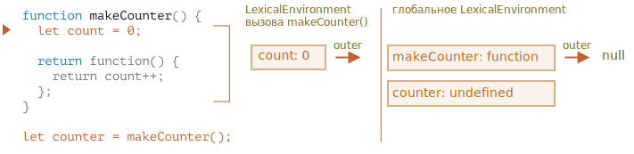

<<<<<<< HEAD
# Область видимости переменных, замыкание

JavaScript - язык с сильным функционально-ориентированным уклоном. Он даёт нам много свободы. Функция может быть динамически создана, скопирована в другую переменную или передана как аргумент другой функции и позже вызвана из совершенно другого места.

Мы знаем, что функция может получить доступ к переменным из внешнего окружения, эта возможность используется очень часто.

Но что произойдёт, когда внешние переменные изменятся? Функция получит последнее значение или то, которое существовало на момент создания функции?

И что произойдёт, когда функция переместится в другое место в коде и будет вызвана оттуда -- получит ли она доступ к внешним переменным своего нового местоположения?

Разные языки ведут себя по-разному в таких случаях, и в этой главе мы рассмотрим поведение JavaScript.

```smart header="Мы будем говорить о переменных `let/const` здесь"
В JavaScript существует три способа объявить переменную: `let`, `const` (современные), и `var` (пережиток прошлого).

- В этой статье мы будем использовать переменные `let` в примерах.
- Переменные, объявленные с помощью `const`, ведут себя так же, так что эта статья и о них.
- Старые переменные `var` имеют несколько характерных отличий, они будут рассмотрены в главе <info:var>.
```

## Блоки кода

Если переменная объявлена внутри блока кода `{...}`, то она видна только внутри этого блока.

Например:

```js run
{
  // выполняем некоторые действия с локальной переменной, которые не должны быть видны снаружи

  let message = "Hello"; // переменная видна только в этом блоке
=======
# Variable scope, closure

JavaScript is a very function-oriented language. It gives us a lot of freedom. A function can be created at any moment, passed as an argument to another function, and then called from a totally different place of code later.

We already know that a function can access variables outside of it ("outer" variables).

But what happens if outer variables change since a function is created? Will the function get newer values or the old ones?

And what if a function is passed along as an argument and called from another place of code, will it get access to outer variables at the new place?

Let's expand our knowledge to understand these scenarios and more complex ones.

```smart header="We'll talk about `let/const` variables here"
In JavaScript, there are 3 ways to declare a variable: `let`, `const` (the modern ones), and `var` (the remnant of the past).

- In this article we'll use `let` variables in examples.
- Variables, declared with `const`, behave the same, so this article is about `const` too.
- The old `var` has some notable differences, they will be covered in the article <info:var>.
```

## Code blocks

If a variable is declared inside a code block `{...}`, it's only visible inside that block.

For example:

```js run
{
  // do some job with local variables that should not be seen outside

  let message = "Hello"; // only visible in this block
>>>>>>> 3d7abb9cc8fa553963025547717f06f126c449b6

  alert(message); // Hello
}

<<<<<<< HEAD
alert(message); // ReferenceError: message is not defined
```

С помощью блоков `{...}` мы можем изолировать часть кода, выполняющую свою собственную задачу, с переменными, принадлежащими только ей:

```js run
{
  // показать сообщение
  let message = "Hello";
  alert(message);
}

{
  // показать другое сообщение
  let message = "Goodbye";
  alert(message);
}
```

````smart header="Без блоков была бы ошибка"
Обратите внимание, что без отдельных блоков возникнет ошибка, если мы используем let с существующим именем переменной:

```js run
// показать сообщение
let message = "Hello";
alert(message);

// показать другое сообщение
let message = "Goodbye"; // SyntaxError: Identifier 'message' has already been declared
alert(message);
```
````

Для `if`, `for`, `while` и т.д. переменные, объявленные в блоке кода `{...}`, также видны только внутри:

```js run
if (true) {
  let phrase = "Hello";

  alert(phrase); // Hello
}

alert(phrase); // Ошибка, нет такой переменной!
```

В этом случае после завершения работы `if` нижний `alert` не увидит `phrase`, что и приведет к ошибке.
=======
alert(message); // Error: message is not defined
```

We can use this to isolate a piece of code that does its own task, with variables that only belong to it:

```js run
{
  // show message
  let message = "Hello";
  alert(message);
}

{
  // show another message
  let message = "Goodbye";
  alert(message);
}
```

````smart header="There'd be an error without blocks"
Please note, without separate blocks there would be an error, if we use `let` with the existing variable name:

```js run
// show message
let message = "Hello";
alert(message);

// show another message
*!*
let message = "Goodbye"; // Error: variable already declared
*/!*
alert(message);
```
````

For `if`, `for`, `while` and so on, variables declared in `{...}` are also only visible inside:

```js run
if (true) {
  let phrase = "Hello!";

  alert(phrase); // Hello!
}

alert(phrase); // Error, no such variable!
```

Here, after `if` finishes, the `alert` below won't see the `phrase`, hence the error.

That's great, as it allows us to create block-local variables, specific to an `if` branch.

The similar thing holds true for `for` and `while` loops:

```js run
for (let i = 0; i < 3; i++) {
  // the variable i is only visible inside this for
  alert(i); // 0, then 1, then 2
}

alert(i); // Error, no such variable
```

Visually, `let i` is outside of `{...}`. But the `for` construct is special here: the variable, declared inside it, is considered a part of the block.
>>>>>>> 3d7abb9cc8fa553963025547717f06f126c449b6

И это замечательно, поскольку это позволяет нам создавать блочно-локальные переменные, относящиеся только к ветви `if`.

То же самое можно сказать и про циклы `for` и `while`:

```js run
for (let i = 0; i < 3; i++) {
  // переменная i видна только внутри for
  alert(i); // 0, потом 1, потом 2
}

alert(i); // Ошибка, нет такой переменной!
```

Визуально `let i = 0;` находится вне блока кода `{...}`, однако здесь в случае с `for` есть особенность: переменная, объявленная внутри `(...)`, считается частью блока.

## Вложенные функции

Функция называется "вложенной", когда она создаётся внутри другой функции.

Это очень легко сделать в JavaScript.

Мы можем использовать это для упорядочивания нашего кода, например, как здесь:

```js
function sayHiBye(firstName, lastName) {

  // функция-помощник, которую мы используем ниже
  function getFullName() {
    return firstName + " " + lastName;
  }

  alert( "Hello, " + getFullName() );
  alert( "Bye, " + getFullName() );

}
```

Здесь *вложенная* функция `getFullName()` создана для удобства. Она может получить доступ к внешним переменным и, значит, вывести полное имя. В JavaScript вложенные функции используются очень часто.

<<<<<<< HEAD
Что ещё интереснее, вложенная функция может быть возвращена: либо в качестве свойства нового объекта (если внешняя функция создаёт объект с методами), либо сама по себе. И затем может быть использована в любом месте. Не важно где, она всё так же будет иметь доступ к тем же внешним переменным.

Ниже, `makeCounter` создает функцию «счётчик», которая при каждом вызове возвращает следующее число:
=======
What's much more interesting, a nested function can be returned: either as a property of a new object or as a result by itself. It can then be used somewhere else. No matter where, it still has access to the same outer variables.

Below, `makeCounter` creates the "counter" function that returns the next number on each invocation:
>>>>>>> 3d7abb9cc8fa553963025547717f06f126c449b6

```js run
function makeCounter() {
  let count = 0;

  return function() {
<<<<<<< HEAD
    return count++; // есть доступ к внешней переменной "count"
=======
    return count++;
>>>>>>> 3d7abb9cc8fa553963025547717f06f126c449b6
  };
}

let counter = makeCounter();

alert( counter() ); // 0
alert( counter() ); // 1
alert( counter() ); // 2
```

<<<<<<< HEAD
Несмотря на простоту этого примера, немного модифицированные его варианты применяются на практике, например, в [генераторе псевдослучайных чисел](https://ru.wikipedia.org/wiki/Генератор_псевдослучайных_чисел) и во многих других случаях.

Как это работает? Если мы создадим несколько таких счётчиков, будут ли они независимыми друг от друга? Что происходит с переменными?

Понимание таких вещей полезно для повышения общего уровня владения JavaScript и для более сложных сценариев. Так что давайте немного углубимся.

## Лексическое окружение

```warn header="Здесь водятся драконы!"
Глубокое техническое описание - впереди.

Как бы мне ни хотелось избежать низкоуровневых деталей языка, любое представление о JavaScript без них будет недостаточным и неполным, так что приготовьтесь.
```

Для большей наглядности объяснение разбито на несколько шагов.

### Шаг 1. Переменные

В JavaScript у каждой выполняемой функции, блока кода `{...}` и скрипта есть связанный с ними внутренний (скрытый) объект, называемый *лексическим окружением* `LexicalEnvironment`.

Объект лексического окружения состоит из двух частей:

1. *Environment Record* -- объект, в котором как свойства хранятся все локальные переменные (а также некоторая другая информация, такая как значение `this`).

2. Ссылка на *внешнее лексическое окружение* - то есть то, которое соответствует коду снаружи (снаружи от текущих фигурных скобок).

**"Переменная" -- это просто свойство специального внутреннего объекта: `Environment Record`. "Получить или изменить переменную", означает, "получить или изменить свойство этого объекта".**

Например, в этом простом коде только одно лексическое окружение:


Это, так называемое, глобальное лексическое окружение, связанное со всем скриптом.

На картинке выше прямоугольник означает Environment Record (хранилище переменных), а стрелка означает ссылку на внешнее окружение. У глобального лексического окружения нет внешнего окружения, так что она указывает на `null`.

По мере выполнения кода лексическое окружение меняется.

Вот более длинный код:


Прямоугольники с правой стороны демонстрируют, как глобальное лексическое окружение изменяется в процессе выполнения кода:

1. При запуске скрипта лексическое окружение предварительно заполняется всеми объявленными переменными.
   - Изначально они находятся в состоянии "Uninitialized". Это особое внутреннее состояние, которое означает, что движок знает о переменной, но на нее нельзя ссылаться, пока она не будет объявлена с помощью `let`. Это почти то же самое, как если бы переменная не существовала.
2. Появляется определение переменной `let phrase`. У неё ещё нет присвоенного значения, поэтому присваивается `undefined`. С этого момента мы можем использовать переменную.
3. Переменной `phrase` присваивается значение.
4. Переменная `phrase` меняет значение.

Пока что всё выглядит просто, правда?

- Переменная -- это свойство специального внутреннего объекта, связанного с текущим выполняющимся блоком/функцией/скриптом.
- Работа с переменными -- это на самом деле работа со свойствами этого объекта.

```smart header="Лексическое окружение - объект спецификации"
"Лексическое окружение" - это объект спецификации: он существует только "теоретически" в спецификации языка для описания того, как все работает. Мы не можем получить этот объект в нашем коде и манипулировать им напрямую.

JavaScript-движки также могут оптимизировать его, отбрасывать неиспользуемые переменные для экономии памяти и выполнять другие внутренние действия, но при этом видимое поведение остается таким, как описано.
```

### Шаг 2. Function Declaration

Функция - это тоже значение, как и переменная.

**Разница заключается в том, что Function Declaration мгновенно инициализируется полностью.**

Когда создается лексическое окружение, Function Declaration сразу же становится функцией, готовой к использованию (в отличие от `let`, который до момента объявления не может быть использован).

Именно поэтому мы можем вызвать функцию, объявленную как Function Declaration, до самого её объявления.

Вот, к примеру, начальное состояние глобального лексического окружения при добавлении функции:


Конечно, такое поведение касается только Function Declaration, а не Function Expression, в которых мы присваиваем функцию переменной, например, `let say = function(name) {...}`.

### Шаг 3. Внутреннее и внешнее лексическое окружение

Когда запускается функция, в начале ее вызова автоматически создается новое лексическое окружение для хранения локальных переменных и параметров вызова.

Например, для `say("John")` это выглядит так (выполнение находится на строке, отмеченной стрелкой):


В процессе вызова функции у нас есть два лексических окружения: внутреннее (для вызываемой функции) и внешнее (глобальное):

- Внутреннее лексическое окружение соответствует текущему выполнению `say`.

  В нём находится одна переменная `name`, параметр функции. Мы вызываем `say("John")`, так что значение переменной `name` равно `"John"`.
- Внешнее лексическое окружение -- это глобальное лексическое окружение.

  В нём находятся переменная `phrase` и сама функция.

У внутреннего лексического окружения есть ссылка на внешнее `outer`.

**Когда код хочет получить доступ к переменной – сначала происходит поиск во внутреннем лексическом окружении, затем во внешнем, затем в следующем и так далее, до глобального.**

Если переменная не была найдена, это будет ошибкой в строгом режиме (`use strict`). Без строгого режима, для обратной совместимости, присваивание несуществующей переменной создаёт новую глобальную переменную с таким же именем.

Давайте посмотрим, как происходит поиск в нашем примере:

- Для переменной `name`, `alert` внутри `say` сразу же находит ее во внутреннем лексическом окружении.
- Когда `alert` хочет получить доступ к `phrase`, он не находит её локально, поэтому вынужден обратиться к внешнему лексическому окружению и находит `phrase` там.


### Шаг 4. Возврат функции

Давайте вернёмся к примеру с `makeCounter`:
=======
Despite being simple, slightly modified variants of that code have practical uses, for instance, as a [random number generator](https://en.wikipedia.org/wiki/Pseudorandom_number_generator) to generate random values for automated tests.

How does this work? If we create multiple counters, will they be independent? What's going on with the variables here?

Understanding such things is great for the overall knowledge of JavaScript and beneficial for more complex scenarios. So let's go a bit in-depth.

## Lexical Environment

```warn header="Here be dragons!"
The in-depth technical explanation lies ahead.

As far as I'd like to avoid low-level language details, any understanding without them would be lacking and incomplete, so get ready.
```

For clarity, the explanation is split into multiple steps.

### Step 1. Variables

In JavaScript, every running function, code block `{...}`, and the script as a whole have an internal (hidden) associated object known as the *Lexical Environment*.

The Lexical Environment object consists of two parts:

1. *Environment Record* -- an object that stores all local variables as its properties (and some other information like the value of `this`).
2. A reference to the *outer lexical environment*, the one associated with the outer code.

**A "variable" is just a property of the special internal object, `Environment Record`. "To get or change a variable" means "to get or change a property of that object".**

In this simple code without functions, there is only one Lexical Environment:


This is the so-called *global* Lexical Environment, associated with the whole script.

On the picture above, the rectangle means Environment Record (variable store) and the arrow means the outer reference. The global Lexical Environment has no outer reference, that's why the arrow points to `null`.

As the code starts executing and goes on, the Lexical Environment changes.

Here's a little bit longer code:


Rectangles on the right-hand side demonstrate how the global Lexical Environment changes during the execution:

1. When the script starts, the Lexical Environment is pre-populated with all declared variables.
    - Initially, they are in the "Uninitialized" state. That's a special internal state, it means that the engine knows about the variable, but it cannot be referenced until it has been declared with `let`. It's almost the same as if the variable didn't exist.
2. Then `let phrase` definition appears. There's no assignment yet, so its value is `undefined`. We can use the variable from this point forward.
3. `phrase` is assigned a value.
4. `phrase` changes the value.

Everything looks simple for now, right?

- A variable is a property of a special internal object, associated with the currently executing block/function/script.
- Working with variables is actually working with the properties of that object.

```smart header="Lexical Environment is a specification object"
"Lexical Environment" is a specification object: it only exists "theoretically" in the [language specification](https://tc39.es/ecma262/#sec-lexical-environments) to describe how things work. We can't get this object in our code and manipulate it directly.

JavaScript engines also may optimize it, discard variables that are unused to save memory and perform other internal tricks, as long as the visible behavior remains as described.
```

### Step 2. Function Declarations

A function is also a value, like a variable.

**The difference is that a Function Declaration is instantly fully initialized.**

When a Lexical Environment is created, a Function Declaration immediately becomes a ready-to-use function (unlike `let`, that is unusable till the declaration).

That's why we can use a function, declared as Function Declaration, even before the declaration itself.

For example, here's the initial state of the global Lexical Environment when we add a function:


Naturally, this behavior only applies to Function Declarations, not Function Expressions where we assign a function to a variable, such as `let say = function(name)...`.

### Step 3. Inner and outer Lexical Environment

When a function runs, at the beginning of the call, a new Lexical Environment is created automatically to store local variables and parameters of the call.

For instance, for `say("John")`, it looks like this (the execution is at the line, labelled with an arrow):

<!--
    ```js
    let phrase = "Hello";

    function say(name) {
     alert( `${phrase}, ${name}` );
    }

    say("John"); // Hello, John
    ```-->


During the function call we have two Lexical Environments: the inner one (for the function call) and the outer one (global):

- The inner Lexical Environment corresponds to the current execution of `say`. It has a single property: `name`, the function argument. We called `say("John")`, so the value of the `name` is `"John"`.
- The outer Lexical Environment is the global Lexical Environment. It has the `phrase` variable and the function itself.

The inner Lexical Environment has a reference to the `outer` one.

**When the code wants to access a variable -- the inner Lexical Environment is searched first, then the outer one, then the more outer one and so on until the global one.**

If a variable is not found anywhere, that's an error in strict mode (without `use strict`, an assignment to a non-existing variable creates a new global variable, for compatibility with old code).

In this example the search proceeds as follows:

- For the `name` variable, the `alert` inside `say` finds it immediately in the inner Lexical Environment.
- When it wants to access `phrase`, then there is no `phrase` locally, so it follows the reference to the outer Lexical Environment and finds it there.


### Step 4. Returning a function

Let's return to the `makeCounter` example.
>>>>>>> 3d7abb9cc8fa553963025547717f06f126c449b6

```js
function makeCounter() {
  let count = 0;

  return function() {
    return count++;
  };
}

let counter = makeCounter();
```

<<<<<<< HEAD
В начале каждого вызова `makeCounter()` создается новый объект лексического окружения, в котором хранятся переменные для конкретного запуска `makeCounter`.

Таким образом, мы имеем два вложенных лексических окружения, как в примере выше:



Отличие заключается в том, что во время выполнения `makeCounter()` создается крошечная вложенная функция, состоящая всего из одной строки: `return count++`. Мы ее еще не запускаем, а только создаем.

Все функции помнят лексическое окружение, в котором они были созданы. Технически здесь нет никакой магии: все функции имеют скрытое свойство `[[Environment]]`, которое хранит ссылку на лексическое окружение, в котором была создана функция:


Таким образом, `counter.[[Environment]]` имеет ссылку на `{count: 0}` лексического окружения. Так функция запоминает, где она была создана, независимо от того, где она вызывается. Ссылка на `[[Environment]]` устанавливается один раз и навсегда при создании функции.

Впоследствии, при вызове `counter()`, для этого вызова создается новое лексическое окружение, а его внешняя ссылка на лексическое окружение берется из `counter.[[Environment]]`:


Теперь, когда код внутри `counter()` ищет переменную `count`, он сначала ищет ее в собственном лексическом окружении (пустом, так как там нет локальных переменных), а затем в лексическом окружении внешнего вызова `makeCounter()`, где находит `count` и изменяет ее.

**Переменная обновляется в том лексическом окружении, в котором она существует.**

Вот состояние после выполнения:


Если мы вызовем `counter()` несколько раз, то в одном и том же месте переменная `count` будет увеличена до `2`, `3` и т.д.

```smart header="Замыкания"
В программировании есть общий термин: «замыкание», – который должен знать каждый разработчик.

[Замыкание](https://ru.wikipedia.org/wiki/Замыкание_(программирование)) -- это функция, которая запоминает свои внешние переменные и может получить к ним доступ. В некоторых языках это невозможно, или функция должна быть написана специальным образом, чтобы получилось замыкание. Но, как было описано выше, в JavaScript, все функции изначально являются замыканиями (есть только одно исключение, про которое будет рассказано в <info:new-function>).

То есть они автоматически запоминают, где были созданы, с помощью скрытого свойства `[[Environment]]`, и все они могут получить доступ к внешним переменным.

Когда на собеседовании фронтенд-разработчику задают вопрос: «что такое замыкание?», – правильным ответом будет определение замыкания и объяснения того факта, что все функции в JavaScript являются замыканиями, и, может быть, несколько слов о технических деталях: свойстве `[[Environment]]` и о том, как работает лексическое окружение.
```

## Сборка мусора

Обычно лексическое окружение удаляется из памяти вместе со всеми переменными после завершения вызова функции. Это связано с тем, что на него нет ссылок. Как и любой объект JavaScript, оно хранится в памяти только до тех пор, пока к нему можно обратиться.

Однако если существует вложенная функция, которая все еще доступна после завершения функции, то она имеет свойство `[[Environment]]`, ссылающееся на лексическое окружение.

В этом случае лексическое окружение остается доступным даже после завершения работы функции.

Например:
=======
At the beginning of each `makeCounter()` call, a new Lexical Environment object is created, to store variables for this `makeCounter` run.

So we have two nested Lexical Environments, just like in the example above:


What's different is that, during the execution of `makeCounter()`, a tiny nested function is created of only one line: `return count++`. We don't run it yet, only create.

All functions remember the Lexical Environment in which they were made. Technically, there's no magic here: all functions have the hidden property named `[[Environment]]`, that keeps the reference to the Lexical Environment where the function was created:


So, `counter.[[Environment]]` has the reference to `{count: 0}` Lexical Environment. That's how the function remembers where it was created, no matter where it's called. The `[[Environment]]` reference is set once and forever at function creation time.

Later, when `counter()` is called, a new Lexical Environment is created for the call, and its outer Lexical Environment reference is taken from `counter.[[Environment]]`:


Now when the code inside `counter()` looks for `count` variable, it first searches its own Lexical Environment (empty, as there are no local variables there), then the Lexical Environment of the outer `makeCounter()` call, where it finds and changes it.

**A variable is updated in the Lexical Environment where it lives.**

Here's the state after the execution:


If we call `counter()` multiple times, the `count` variable will be increased to `2`, `3` and so on, at the same place.

```smart header="Closure"
There is a general programming term "closure", that developers generally should know.

A [closure](https://en.wikipedia.org/wiki/Closure_(computer_programming)) is a function that remembers its outer variables and can access them. In some languages, that's not possible, or a function should be written in a special way to make it happen. But as explained above, in JavaScript, all functions are naturally closures (there is only one exception, to be covered in <info:new-function>).

That is: they automatically remember where they were created using a hidden `[[Environment]]` property, and then their code can access outer variables.

When on an interview, a frontend developer gets a question about "what's a closure?", a valid answer would be a definition of the closure and an explanation that all functions in JavaScript are closures, and maybe a few more words about technical details: the `[[Environment]]` property and how Lexical Environments work.
```

## Garbage collection

Usually, a Lexical Environment is removed from memory with all the variables after the function call finishes. That's because there are no references to it. As any JavaScript object, it's only kept in memory while it's reachable.

However, if there's a nested function that is still reachable after the end of a function, then it has `[[Environment]]` property that references the lexical environment.

In that case the Lexical Environment is still reachable even after the completion of the function, so it stays alive.

For example:
>>>>>>> 3d7abb9cc8fa553963025547717f06f126c449b6

```js
function f() {
  let value = 123;

  return function() {
    alert(value);
  }
}

<<<<<<< HEAD
let g = f(); // g.[[Environment]] хранит ссылку на лексическое окружение
// из соответствующего вызова f()
```

Обратите внимание, что если `f()` вызывается много раз и результирующие функции сохраняются, то все соответствующие объекты лексического окружения также будут сохранены в памяти. В приведенном ниже коде -- все три:
=======
let g = f(); // g.[[Environment]] stores a reference to the Lexical Environment
// of the corresponding f() call
```

Please note that if `f()` is called many times, and resulting functions are saved, then all corresponding Lexical Environment objects will also be retained in memory. In the code below, all 3 of them:
>>>>>>> 3d7abb9cc8fa553963025547717f06f126c449b6

```js
function f() {
  let value = Math.random();

  return function() { alert(value); };
}

// 3 функции в массиве, каждая из которых ссылается на лексическое окружение
// из соответствующего вызова f()
let arr = [f(), f(), f()];
```

Объект лексического окружения исчезает, когда становится недоступным (как и любой другой объект). Другими словами, он существует только до тех пор, пока на него ссылается хотя бы одна вложенная функция.

<<<<<<< HEAD
В приведенном ниже коде после удаления вложенной функции ее окружающее лексическое окружение (а значит, и `value`) очищается из памяти:
=======
In the code below, after the nested function is removed, its enclosing Lexical Environment (and hence the `value`) is cleaned from memory:
>>>>>>> 3d7abb9cc8fa553963025547717f06f126c449b6

```js
function f() {
  let value = 123;

  return function() {
    alert(value);
  }
}

<<<<<<< HEAD
let g = f(); // пока существует функция g, value остается в памяти
=======
let g = f(); // while g function exists, the value stays in memory
>>>>>>> 3d7abb9cc8fa553963025547717f06f126c449b6

g = null; // ...и теперь память очищена.
```

### Оптимизация на практике

Как мы видели, в теории, пока функция жива, все внешние переменные тоже сохраняются.

Но на практике движки JavaScript пытаются это оптимизировать. Они анализируют использование переменных и, если легко по коду понять, что внешняя переменная не используется – она удаляется.

<<<<<<< HEAD
**Одним из важных побочных эффектов в V8 (Chrome, Edge, Opera) является то, что такая переменная становится недоступной при отладке.**
=======
**An important side effect in V8 (Chrome, Edge, Opera) is that such variable will become unavailable in debugging.**
>>>>>>> 3d7abb9cc8fa553963025547717f06f126c449b6

Попробуйте запустить следующий пример в Chrome с открытой Developer Tools.

Когда код будет поставлен на паузу, напишите в консоли `alert(value)`.

```js run
function f() {
  let value = Math.random();

  function g() {
    debugger; // в консоли: напишите alert(value); Такой переменной нет!
  }

  return g;
}

let g = f();
g();
```

Как вы можете видеть – такой переменной не существует! В теории, она должна быть доступна, но попала под оптимизацию движка.

Это может приводить к забавным (если удаётся решить быстро) проблемам при отладке. Одна из них – мы можем увидеть не ту внешнюю переменную при совпадающих названиях:

```js run
let value = "Сюрприз!";

function f() {
  let value = "ближайшее значение";

  function g() {
    debugger; // в консоли: напишите alert(value); Сюрприз!
  }

  return g;
}

let g = f();
g();
```

<<<<<<< HEAD
Эту особенность V8 полезно знать. Если вы занимаетесь отладкой в Chrome/Edge/Opera, рано или поздно вы с ней столкнётесь.

Это не баг в отладчике, а скорее особенность V8. Возможно со временем это изменится. Вы всегда можете проверить это, запустив примеры на этой странице.
=======
This feature of V8 is good to know. If you are debugging with Chrome/Edge/Opera, sooner or later you will meet it.

That is not a bug in the debugger, but rather a special feature of V8. Perhaps it will be changed sometime. You can always check for it by running the examples on this page.
>>>>>>> 3d7abb9cc8fa553963025547717f06f126c449b6
