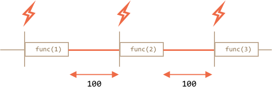

# Планирование: setTimeout and setInterval

Мы можем вызвать функцию не в данный момент, а позже, через заданный интервал времени. Это называется "планирование вызова".

Для этого существует два метода:

- `setTimeout` позволяет вызвать функцию **один раз** через определенный интервал времени.
- `setInterval` позволяет вызывать функцию **регулярно**, повторяя вызов через определенный интервал времени.

Эти методы не являются частью спецификации JavaScript. Но большинство сред выполнения JS-кода имеют внутренний планировщик и предоставляют доступ к этим методам. В частности, они поддерживаются во всех браузерах и Node.js.


## setTimeout

Синтаксис:

```js
let timerId = setTimeout(func|code, [delay], [arg1], [arg2], ...)
```

Параметры:

`func|code`
: Функция или строка кода для выполнения.
Обычно, это функция. По историческим причинам, можно передать и строку кода, но это не рекомендуется.

`delay`
: Задержка перед запуском в миллисекундах (1000 мс = 1 с). Значение по умолчанию - 0.

`arg1`, `arg2`...
: Аргументы, передаваемые в функцию (не поддерживается в IE9-)

Например, данный код вызывает `sayHi()` спустя одну секунду:

```js run
function sayHi() {
  alert('Привет');
}

*!*
setTimeout(sayHi, 1000);
*/!*
```

С аргументами:

```js run
function sayHi(phrase, who) {
  alert( phrase + ', ' + who );
}

*!*
setTimeout(sayHi, 1000, "Привет", "Джон"); // Привет, Джон
*/!*
```

Если первый аргумент является строкой, то JavaScript создаст из нее функцию.

Это также будет работать:

```js run no-beautify
setTimeout("alert('Привет')", 1000);
```

Но использование строк не рекомендуется. Вместо этого используйте функции. Например, так:

```js run no-beautify
setTimeout(() => alert('Привет'), 1000);
```

````smart header="Передавайте функцию, но не запускайте её"
Начинающие разработчики иногда ошибаются, добавляя скобки `()` после функции:

```js
// не правильно!
setTimeout(sayHi(), 1000);
```
Это не работает, потому что `setTimeout` ожидает ссылку на функцию. Здесь `sayHi()` запускает выполнение функции и *результат выполнения* отправляется в `setTimeout`. В нашем случае результатом выполнения `sayHi()` является `undefined` (так как функция ничего не возвращает), поэтому ничего не планируется.
````

### Отмена через clearTimeout

Вызов `setTimeout` возвращает "идентификатор таймера" `timerId`, который можно использовать для отмены дальнейшего выполнения.

Синтаксис для отмены:

```js
let timerId = setTimeout(...);
clearTimeout(timerId);
```

В коде ниже планируем вызов функции и затем отменяем его (просто передумали). В результате ничего не происходит:

```js run no-beautify
let timerId = setTimeout(() => alert("ничего не происходит"), 1000);
alert(timerId); // идентификатор таймера

clearTimeout(timerId);
alert(timerId); // тот же идентификатор (не принимает значение null после отмены)
```

Как мы видим из вывода `alert`, в браузере идентификатором таймера является число. В других средах это может быть что-то еще. Например, Node.js возвращает объект таймера с дополнительными методами.

Повторюсь, что нет единой спецификации на эти методы, поэтому такое поведение является нормальным.

Для браузеров таймеры описаны в [разделе таймеров](https://www.w3.org/TR/html5/webappapis.html#timers) стандарта HTML5.

## setInterval

Метод `setInterval` имеет какой же синтаксис как `setTimeout`:

```js
let timerId = setInterval(func|code, [delay], [arg1], [arg2], ...)
```

Все аргументы имеют такое же значение. Но отличие этого метода от `setTimeout` в том, что функция запускается не один раз, а периодически через указанный интервал времени.

Чтобы остановить дальнейшее выполнение функции, необходимо вызвать `clearInterval(timerId)`.

Следующий пример выводит сообщение каждые 2 секунды. Через 5 секунд вывод прекращается:

```js run
// повторить с интервалом 2 секунды
let timerId = setInterval(() => alert('tick'), 2000);

// остановить вывод через 5 секунд
setTimeout(() => { clearInterval(timerId); alert('stop'); }, 5000);
```

```smart header="Во время показа `alert` время тоже идёт"
В большинстве браузеров, включая Chrome и Firefox внутренний счетчик продолжает тикать во время показа `alert/confirm/prompt`.

Так что если вы запустите код выше и подождёте с закрытием `alert` несколько секунд, то следующий `alert` будет показан сразу, как вы его закроете. Интервал времени между сообщениями `alert` будет короче, чем 5 секунд.
```

## Рекурсивный setTimeout

Есть два способа запускать что-то регулярно.

Один из них `setInterval`. Другим является рекурсивный `setTimeout`. Например:

```js
/** вместо:
let timerId = setInterval(() => alert('tick'), 2000);
*/

let timerId = setTimeout(function tick() {
  alert('tick');
*!*
  timerId = setTimeout(tick, 2000); // (*)
*/!*
}, 2000);
```

Метод `setTimeout` выше планирует следующий вызов прямо после окончания текущего `(*)`.

Рекурсивный `setTimeout` - более гибкий метод, чем `setInterval`. С его помощью, последующий вызов может быть задан по-разному, в зависимости от результатов предыдущего.

Например, необходимо написать сервис, который отправляет запрос для получения данных на сервер каждые 5 секунд, но если сервер перегружен, то необходимо увеличить интервал запросов до 10, 20, 40 секунд...
Вот псевдокод:
```js
let delay = 5000;

let timerId = setTimeout(function request() {
  ...отправить запрос...

  if (ошибка запроса из-за перегрузки сервера) {
    // увеличить интервал для следующего запроса
    delay *= 2;
  }

  timerId = setTimeout(request, delay);

}, delay);
```


А если функции, которые мы планируем, ресурсоёмкие и требуют времени, то можем измерить время, затраченное на выполнение, и спланировать следующий вызов раньше или позже.

**Рекурсивный `setTimeout` гарантирует задержку между выполнениями, `setInterval` -- нет.**

Сравним два фрагмента кода. Первый использует `setInterval`:

```js
let i = 1;
setInterval(function() {
  func(i);
}, 100);
```

Второй использует рекурсивный `setTimeout`:

```js
let i = 1;
setTimeout(function run() {
  func(i);
  setTimeout(run, 100);
}, 100);
```

Для `setInterval` внутренний планировщик выполнит `func(i)` каждые 100 мс:


Обратили внимание?

**Реальная задержка между `func` для `setInterval` меньше, чем видно из кода!**

Это нормально, потому что время, затраченное на выполнение `func`, "потребляет" часть заданного интервала времени.

Вполне возможно, что выполнение `func` будет дольше, чем мы ожидали, и займет более 100 мс.

В данном случае движок ждет окончания выполнения `func` и затем проверяет планировщик и, если время истекло, *немедленно* запускает его снова.

В крайнем случае, если функция всегда выполняется дольше, чем задержка `delay`, то вызовы будут выполняться без задержек вовсе.

Ниже представлено изображение, показывающее процесс работы рекурсивного `setTimeout`:



**Рекурсивный`setTimeout` гарантирует фиксированную задержку (здесь 100 мс).**

Это потому, что новый вызов планируется в конце предыдущего.

````smart header="Сборка мусора"
Когда функция передается в `setInterval/setTimeout`, на нее создается внутренняя ссылка и сохраняется в планировщике. Это предотвращает попадание функции в сборщик муссора, даже если на нее нет других ссылок.

```js
// функция остается в памяти до тех пор, пока планировщик обращается к ней
setTimeout(function() {...}, 100);
```

Для `setInterval` функция остается в памяти до тех, пока не будет вызван `clearInterval`.

Есть и побочный эффект. Функция ссылается на внешнее лексическое окружение, поэтому пока она существует, внешние переменные существуют тоже. Они могут занимать больше памяти, чем сама функция. Поэтому, если нет регулярный вызов функции больше не нужен, то лучше отменить его, даже если функция очень маленькая.
````

## setTimeout(...,0)

Особый вариант использования: `setTimeout(func, 0)` или просто `setTimeout(func)`.

Это планирует вызов `func` настолько быстро, насколько это возможно. Но планировщик будет вызывать функцию только после завершения выполнения текущего кода.

Так вызов функции будет запланирован сразу после выполнения текущего кода. Другими словами, *асинхронно*.

Например, этот код выводит "Привет" и затем сразу "Мир":

```js run
setTimeout(() => alert("Мир"));

alert("Привет");
```

Первая строка "помещает вызов в календарь через 0 мс". Но планировщик "проверит календарь" после того, как текущий код завершится. Поэтому `"Привет"` выводится первым, а `"Мир"` после него.

### Разделение ресурсоемких задач

Рассмотрим вариант разделения ресурсоемких задача при помощи `setTimeout`.

Например, скрипт подсветки синтаксиса (используется для изменения цвета текста в примерах на данной страницы) довольно прожорлив. Для подсветки кода он выполняет анализ, создает много цветных элементов, добавляет их в документ -- для большого текста это требует значительных ресурсов. Это может даже привести к "зависанию" браузера, что недопустимо.

Но мы можем разделить длинный текст на части. Обрабатываем первые 100 строк, далее планируем следующие 100 строк кода с помощью `setTimeout(..., 0)` и т.д.

Для ясности рассмотрим более простой пример. Имеем функцию, которая ведет счет от `1` до `1000000000`.

Если запустить ее, то процессор на время зависнет. Это хорошо заметно на серверном JS. Если запустить код в браузере и попробовать кликнуть на другие кнопки на странице, то вы увидите, что весь JavaScript фактически приостановлен и никакие другие действия не работают, пока он не завершился.

```js run
let i = 0;

let start = Date.now();

function count() {

  // выполнить тяжелую задачу
  for (let j = 0; j < 1e9; j++) {
    i++;
  }

  alert("Выполнено за " + (Date.now() - start) + ' мс');
}

count();
```

Браузер даже может показать предупреждение, что "скрипт выполняется слишком долго" (надеюсь этого не произойдет, потому что число не очень большое).

Разделим задание при помощи вложенного `setTimeout`:

```js run
let i = 0;

let start = Date.now();

function count() {

  // выполнить кусок тяжелой задачи (*)
  do {
    i++;
  } while (i % 1e6 != 0);

  if (i == 1e9) {
    alert("Выполнено за " + (Date.now() - start) + ' мс');
  } else {
    setTimeout(count); // планируем новый вызов (**)
  }

}

count();
```

Теперь интерфейс в браузере полностью доступен в течение всего процесса "подсчета".

Выполняем часть задачи `(*)`:

1. Первый запуск: `i=1...1000000`.
2. Второй: `i=1000001..2000000`.
3. ... и т.д., пока `while` проверяет делится ли `i` ровно на `1000000`.

Затем следующий вызов планируется в `(**)` если мы еще не закончили.

Задержки между выполнениями `count` обеспечивают достаточно "воздуха" для движка JavaScript, чтобы делать что-то еще и реагировать на другие действия пользователей.

Примечательно, что оба варианта -- с разделением задачи с помощью `setTimeout`и без -- сопоставимы по скорости. Нет существенной разницы в общем затраченном времени.

Чтобы сделать их ближе, введем улучшение.

Перенесем планирование в начало `count()`:

```js run
let i = 0;

let start = Date.now();

function count() {

  // перенесли планирование в начало
  if (i < 1e9 - 1e6) {
    setTimeout(count); // планируем новый вызов
  }

  do {
    i++;
  } while (i % 1e6 != 0);

  if (i == 1e9) {
    alert("Выполнено в " + (Date.now() - start) + 'ms');
  }

}

count();
```

Теперь когда в процессе рабоыт `count()` мы видим, что нам будет нужен ещё вызов `count()`, мы планируем это сразу перед выполнением задачи.

Если запустите этот код, то легко заметите, что он занимает существенно меньше времени.

````smart header="Минимальная задержка вложенных таймеров в браузере"
В браузере есть ограничение, как часто внутренние счетчики могут выполняться. В [стандарте HTML5](https://www.w3.org/TR/html5/webappapis.html#timers) говорится: "после пяти вложенных таймеров интервал должен составлять не менее четырех миллисекунд.".

Продемонстрируем в примере ниже, что это означает. Вызов `setTimeout` повторно вызывает себя через 0 мс. Каждый вызов запоминает реальное время от предыдущего вызова в массиве `times. Какова реальная задержка? Посмотрим:

```js run
let start = Date.now();
let times = [];

setTimeout(function run() {
  times.push(Date.now() - start); // запоминаем задержку от предыдущего вызова

  if (start + 100 < Date.now()) alert(times); // показываем задержку через 100 мс
  else setTimeout(run); // если нужно ещё запланировать
});

// пример вывода:
// 1,1,1,1,9,15,20,24,30,35,40,45,50,55,59,64,70,75,80,85,90,95,100
```

Первый таймер запускается сразу (как и указано в спецификации) и затем задержка вступает в игру и мы видим `9, 15, 20, 24...`.

Это ограничение существует давно, многие скрипты полагаются на него, поэтому оно сохраняется по историческим причинам.

Этого ограничения нет в серверном JavaScript. Там есть и другие способы планирования асинхронных задач. Например, [process.nextTick](https://nodejs.org/api/process.html) и [setImmediate](https://nodejs.org/api/timers.html) для Node.js. Так что это ограничение относится только к браузерам.
````

### Даем возможность отрисовки браузеру

Другим преимуществом разбития тяжёлых задач на части является возможность показать процесс выполнения в браузере.

Обычно браузер отрисовывает изменения после завершения выполнения текущего кода. Так что если функция меняет много элементов -- всё это мы увидим, когда текущий код будет завершён.

Поэтому, если мы делаем одну огромную функцию, то даже если она что-то меняет, изменения не отразятся в документе до ее завершения.

Демо:
```html run
<div id="progress"></div>

<script>
  let i = 0;

  function count() {
    for (let j = 0; j < 1e6; j++) {
      i++;
      // вставляем текущее значение i в <div>
      // (об innerHTML поговорим в соответствующей главе, здесь мы просто вставляем номер в элемент)
      progress.innerHTML = i;
    }
  }

  count();
</script>
```

Если запустить код, то изменение `i` будет показано только после того, как весь подсчет закончится.

Но если использовать `setTimeout` для разделения его на куски, то изменения будут применены между запусками. Это выглядит гораздо лучше:

```html run
<div id="progress"></div>

<script>
  let i = 0;

  function count() {

    // сделать часть тяжелой задачи (*)
    do {
      i++;
      progress.innerHTML = i;
    } while (i % 1e3 != 0);

    if (i < 1e9) {
      setTimeout(count);
    }

  }

  count();
</script>
```

Теперь `<div>` показывает увеличивающиеся значения `i`.

## Итого

- Методы `setInterval(func, delay, ...args)` и `setTimeout(func, delay, ...args)` позволяют выполнять `func` регулярно или только один раз после задержки `delay`, заданной в мс.
- Для отмены выполнения необходимо вызвать `clearInterval/clearTimeout` со значением, которое возвращают методы `setInterval/setTimeout`.
- Вложенный вызов `setTimeout` является более гибкой альтернативой `setInterval`. Также он может гарантировать минимальное время *между* выполнениями.
- Планирование с нулевой задержкой `setTimeout(func,0)` или, что тоже самое, `setTimeout(func)`, используется для вызовов, которые должны быть исполнены "как можно скорее, после завершения исполнения текущего кода".

Некоторые случаи использования `setTimeout(func)`:
- разделить ресурсоемкие задачи на части, чтобы скрипт не "зависал",
- позволить браузеру сделать что-то еще, пока идет процесс (рисовать полосу прогресса).

Обратим внимание, что все методы планирования *не гарантируют* точную задержку. Не стоит полагаться на это в коде.

Например, таймер в браузере может замедляться по многим причинам:
- Перегружен процессор.
- Вкладка браузера в фоновом режиме.
- Работа ноутбука от аккумулятора.

Все это может увеличивать минимальное временное разрешение (минимальная задержка) до 300 или даже 1000 мс в зависимости от браузера и настроек.
