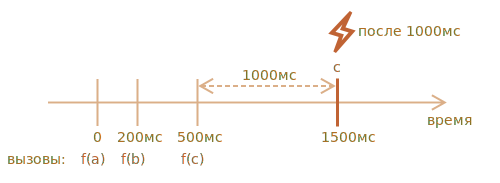

importance: 5

---

# Декоратор debounce

Результат декоратора `debounce(f, ms)` – это обёртка, которая откладывает вызовы `f`, пока не пройдёт `ms` миллисекунд бездействия (без вызовов, «cooldown period»), а затем вызывает `f` один раз с последними аргументами.

Другими словами, `debounce` – это так называемый секретарь, который принимает «телефонные звонки», и ждёт, пока не пройдет `ms` миллисекунд тишины. И только после этого передает «начальнику» информацию о последнем звонке (вызывает непосредственно `f`).

Например, у нас была функция `f` и мы заменили её на `f = debounce(f, 1000)`.

Затем, если обёрнутая функция вызывается в 0, 200 и 500 мс, а потом вызовов нет, то фактическая `f` будет вызвана только один раз, в 1500 мс. То есть: по истечению 1000 мс от последнего вызова.



...И она получит аргументы самого последнего вызова, остальные вызовы игнорируются.

Ниже код этого примера (используется декоратор debounce из библиотеки [Lodash](https://lodash.com/docs/4.17.15#debounce)):

```js no-beautify
let f = _.debounce(alert, 1000);

f("a");
setTimeout( () => f("b"), 200);
setTimeout( () => f("c"), 500);

// Обёрнутая в debounce функция ждёт 1000 мс после последнего вызова, а затем запускает: alert("c")
```

Теперь практический пример. Предположим, пользователь набирает какой-то текст, и мы хотим отправить запрос на сервер, когда ввод этого текста будет завершён.

Нет смысла отправлять запрос для каждого набранного символа. Вместо этого мы хотели бы подождать, а затем обработать весь результат.

В браузере мы можем настроить обработчик событий – функцию, которая вызывается при каждом изменении поля для ввода. Обычно обработчик событий вызывается очень часто, для каждого набранного символа. Но если мы воспользуемся `debounce` на 1000мс, то он будет вызван только один раз, через 1000мс после последнего ввода символа.

```online

В этом живом примере обработчик помещает результат в поле ниже, попробуйте:

[iframe border=1 src="debounce" height=200]

Видите? На втором поле вызывается функция, обёрнутая в `debounce`, поэтому его содержимое обрабатывается через 1000мс с момента последнего ввода.
```

Таким образом, `debounce` – это отличный способ обработать последовательность событий: будь то последовательность нажатий клавиш, движений мыши или ещё что-либо.

Он ждёт заданное время после последнего вызова, а затем запускает свою функцию, которая может обработать результат.

Задача — реализовать декоратор `debounce`.

Подсказка: это всего лишь несколько строк, если вдуматься :)