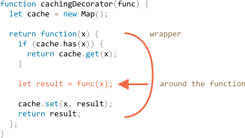

# Декораторы и переадресация вызова, `сall`/`apply`

JavaScript предоставляет исключительно гибкие возможности по работе с функциями: они могут быть переданы в другие функции, использованы как объекты, и сейчас мы рассмотрим как *перенаправлять* вызовы между ними и как их декорировать.

## Прозрачное кеширование

Представим, что у нас есть функция `slow(x)`, выполняющая ресурсоёмкие вычисления, но возвращающая стабильные результаты. Другими словами, для одного и того же `x` она всегда возвращает один и тот же результат.

Если функция вызывается часто, то, вероятно, мы захотим кешировать (запомнить) возвращаемые ею результаты для соответствующих `x`, чтобы сэкономить время на повторных вычислениях. 

Вместо того, чтобы усложнять `slow(x)` дополнительной функциональностью мы заключим её в функцию-обёртку - 'wrapper' (от англ. 'wrap' - обёртывать). Далее мы увидим, что в таком подходе масса преимуществ.

Вот код с объяснениями:

```js run
function slow(x) {
  // здесь могут быть CPU ресурсоёмкие вычисления
  alert(`Called with ${x}`);
  return x;
}

function cachingDecorator(func) {
  let cache = new Map();

  return function(x) {
    if (cache.has(x)) { // если map содержит результат
      return cache.get(x); // возвращаем его
    }

    let result = func(x); // иначе, вызываем функцию

    cache.set(x, result); // и кешируем (запоминаем) результат
    return result;
  };
}

slow = cachingDecorator(slow);

alert( slow(1) ); // slow(1) кешируем
alert( "Again: " + slow(1) ); // возвращаем кеш

alert( slow(2) ); // slow(2) кешируем
alert( "Again: " + slow(2) ); // возвращаем кеш
```

В коде выше `cachingDecorator` -- это *декоратор*, специальная функция, которая принимает другую функцию и изменяет её поведение.

Идея состоит в том, что мы можем вызвать `cachingDecorator` с любой функцией, в результате чего мы получим кеширующую обёртку. Это здорово, т.к. у нас может быть множество функций, использующих такой функционал, и все, что нам нужно сделать - это применить к ним `cachingDecorator`.

Отделяя кеширующий код от основного кода, мы также сохраняем чистоту и простоту последнего.

Давайте погрузимся в детали того, как это работает.

Результат вызова `cachingDecorator(func)` является "обёрткой", т.е. `function(x)` "оборачивает" вызов `func(x)` в кеширующую логику:



Как мы видим обертка возвращает результат выполнения `func(x)` "как есть". Из внешнего кода обернутая функция `slow` по-прежнему делает то же самое. Обертка всего добавляет к её поведению аспект кеширования.

Подводя итог, можно выделить несколько преимуществ использования отдельной `cachingDecorator` вместо изменения кода самой `slow`:

- Функцию `cachingDecorator` можно использовать повторно. Мы можем применить её к другой функции.
- Логика кеширования является отдельной, она не увеличивает сложность самой `slow` (если таковая была).
- При необходимости мы можем объединить несколько декораторов (речь о них пойдет позже).


## Применение "func.call" для передачи контекста.

Упомянутый выше кеширующий декоратор не подходит для работы с методами объектов.

Например, в приведённом ниже коде `worker.slow()` перестает работать после применения декоратора:

```js run
// зделаем worker.slow кеширующим
let worker = {
  someMethod() {
    return 1;
  },

  slow(x) {
    // здесь может быть страшно тяжелая задача для процессора  
    alert("Called with " + x);
    return x * this.someMethod(); // (*)
  }
};

// тот же код, что и выше
function cachingDecorator(func) {
  let cache = new Map();
  return function(x) {
    if (cache.has(x)) {
      return cache.get(x);
    }
*!*
    let result = func(x); // (**)
*/!*
    cache.set(x, result);
    return result;
  };
}

alert( worker.slow(1) ); // оригинальный метод работает

worker.slow = cachingDecorator(worker.slow); // теперь сделаем его кеширующим

*!*
alert( worker.slow(2) ); // Ой! Ошибка: не удается прочитать свойство 'someMethod' из 'undefined'
*/!*
```

Ошибка возникает в строке `(*)`. Функция пытается получить доступ к `this.someMethod` и завершается с ошибкой. Видите почему?

Причина в том, что в строке `(**)` декоратор вызывает оригинальную функцию как `func(x)`, а в этом случае функция получает `this = undefined`.

Мы бы наблюдали похожий симптом, если бы попытались запустить:

```js
let func = worker.slow;
func(2);
```

Т.е. декоратор передаёт вызов оригинальному методу, но без контекста. Следовательно -- ошибка.

Давайте это исправим.

Существует специальный встроенный метод функции [func.call(context, ...args)](mdn:js/Function/call), который позволяет вызывать функцию, явно устанавливая `this`. 

Синтаксис:

```js
func.call(context, arg1, arg2, ...)
```

Он запускает функцию `func`, предоставляя первый аргумент как `this`, а последующие как её аргументы.

Проще говоря, эти два вызова делают почти то же самое:

```js
func(1, 2, 3);
func.call(obj, 1, 2, 3)
```

Они оба вызывают `func` с аргументами `1`, `2` и `3`. Единственное отличие состоит в том, что `func.call` также устанавливает `this` в `obj`.

Например, в приведённом ниже коде мы вызываем `sayHi` в контексте различных объектов: `sayHi.call(user)` запускает `sayHi`, передавая `this=user`, а следующая строка устанавливает `this=admin`:
                                                                                                                                           
```js run
function sayHi() {
  alert(this.name);
}

let user = { name: "John" };
let admin = { name: "Admin" };

// используем 'call' для передачи различных объектов как 'this'
sayHi.call( user ); // this = John
sayHi.call( admin ); // this = Admin
```

Здесь мы используем `call` для вызова `say` с заданным контекстом и фразой:


```js run
function say(phrase) {
  alert(this.name + ': ' + phrase);
}

let user = { name: "John" };

// 'user' становится 'this', и "Hello" становится первым аргументом
say.call( user, "Hello" ); // John: Hello
```


В нашем случае мы можем использовать `call` в обёртке для передачи контекста в исходную функцию:


```js run
let worker = {
  someMethod() {
    return 1;
  },

  slow(x) {
    alert("Called with " + x);
    return x * this.someMethod(); // (*)
  }
};

function cachingDecorator(func) {
  let cache = new Map();
  return function(x) {
    if (cache.has(x)) {
      return cache.get(x);
    }
*!*
    let result = func.call(this, x); // теперь 'this' передается правильно
*/!*
    cache.set(x, result);
    return result;
  };
}

worker.slow = cachingDecorator(worker.slow); // теперь сделаем её кеширующей

alert( worker.slow(2) ); // работает
alert( worker.slow(2) ); // работает, не вызывая первоначальную функцию (кешируется)
```

Теперь всё в порядке.

Чтобы всё было понятно, давайте посмотрим глубже, как передаётся `this`:

1. После *декорации* `worker.slow` становится обёрткой `function (x) { ... }`.
2. Так что при выполнении `worker.slow(2)` обёртка получает `2` в качестве аргумента, и `this=worker` (так как это объект перед точкой).
3. Внутри обёртки, если результат еще не кеширован, `func.call(this, x)` передаёт текущий `this` (`=worker`) и текущий аргумент (`=2`) в оригинальную функцию.

## Переходим к нескольким аргументам с "func.apply"

Теперь давайте сделаем `cachingDecorator` еще более универсальным. До сих пор он работал только с функциями с одним аргументом.

Как же кешировать метод с несколькими аргументами `worker.slow`?

```js
let worker = {
  slow(min, max) {
    return min + max; // здесь может быть тяжёлая задача
  }
};

// should remember same-argument calls
worker.slow = cachingDecorator(worker.slow);
```

Здесь у нас есть две задачи для решения.

Во-первых, - как использовать оба аргумента `min` и `max` для ключа в коллекции `cache`? Ранее для одного аргумента `x` мы могли просто сохранить результат `cache.set(x, result)` и вызвать `cache.get(x)` чтобы получить его. Но теперь нам нужно запомнить результат для *комбинации аргументов* `(min,max)`. Встроенный `Map` принимает только одно значение как ключ.

Есть много возможных решений:

1. Реализовать новую (или использовать стороннюю) структуру данных для коллекции, которая которая более универсальна чем встроенный `Map`, и поддерживает множественные ключи.
2. Использовать вложенные коллекции: `cache.set(min)` будет `Map` которая хранит пару `(max, result)`. Тогда получить `result` мы можем вызвав `cache.get(min).get(max)`.
3. Соединить два значения в одно. В нашем конкретном случае мы можем просто использовать строку `"min,max"` как ключ к `Map`. Для гибкости, мы можем позволить передавать *функцию кеширования* в декоратор, которая знает, как сделать одно значение из многих.


Для многих практических применений третий вариант достаточно хорош, поэтому мы будем придерживаться его.

Вторая задача, которую нужно решить, - как передать множество аргументов в `func`? Пока что обёртка `function (x)` принимает один аргумент, и `func.call (this, x)` передает его.

Здесь мы можем использовать другой встроенный метод [func.apply](mdn:js/Function/apply).

Синтаксис:

```js
func.apply(context, args)
```

Он выполняет `func`, устанавливая`this=context`, и принимая в качестве списка аргументов объект-псевдомассив `args`.

Например, эти два вызова почти одинаковые:

```js
func(1, 2, 3);
func.apply(context, [1, 2, 3])
```

Оба запускают `func`, передавая аргументы `1,2,3`. Но `apply` также устанавливает `this=context`.

Например, здесь `say` вызывается с `this=user` и `messageData` в качестве списка аргументов:

```js run
function say(time, phrase) {
  alert(`[${time}] ${this.name}: ${phrase}`);
}

let user = { name: "John" };

let messageData = ['10:00', 'Hello']; // становится time и phrase

*!*
// this принимает значение user, messageData передаётся как список аргументов (time, phrase)
say.apply(user, messageData); // [10:00] John: Hello (this=user)
*/!*
```

Единственная разница в синтаксисе между `call` и `apply` состоит в том, что `call` ожидает список аргументов, в то время как `apply` принимает псевдомассив.
Мы уже знаем оператор  расширения `...` из главы <info: rest-parameters-spread-operator>, который может передавать массив (или любой перебираемый объект) в виде списка аргументов. Поэтому, если мы используем его с `call`, мы можем достичь почти того же, что и `apply`.
Эти два вызова почти эквивалентны:

```js
let args = [1, 2, 3];

*!*
func.call(context, ...args); // передаёт массив как список с оператором расширения
func.apply(context, args);   // тот же эффект
*/!*
```

Если мы посмотрим более внимательно, то между такими использованиями `call` и` apply` есть небольшая разница.

- Оператор расширения `...` позволяет передавать *перебираемый* объект `args` в виде списка в `call`.
- В свою очередь `Apply` принимает только *псевдомассив* `args`.

Итак, эти вызовы дополняют друг друга. Там, где мы ожидаем итеративность, работает `call`, где мы ожидаем псевдомассив, работает `apply`.

И если `args` является перебираемый и похожим на реальный массив, то технически мы могли бы использовать любой из них, но `apply`, вероятно, будет быстрее, потому что это одна операция. Большинство движков JavaScript внутренне оптимизируют его лучше, чем пара `call + spread`.

Одним из наиболее важных применений `apply` является передача вызова другой функции, например так:

```js
let wrapper = function() {
  return anotherFunction.apply(this, arguments);
};
```

Это называется *переадресация вызова*. Обертка передаёт все, что получает: контекст `this` и аргументы для `anotherFunction` и возвращает её результат.

Когда внешний код вызывает такую 'обёртку', он неотличим от вызова исходной функции.

Теперь давайте заправим все это в более мощный `cachingDecorator`:

```js run
let worker = {
  slow(min, max) {
    alert(`Called with ${min},${max}`);
    return min + max;
  }
};

function cachingDecorator(func, hash) {
  let cache = new Map();
  return function() {
*!*
    let key = hash(arguments); // (*)
*/!*
    if (cache.has(key)) {
      return cache.get(key);
    }

*!*
    let result = func.apply(this, arguments); // (**)
*/!*

    cache.set(key, result);
    return result;
  };
}

function hash(args) {
  return args[0] + ',' + args[1];
}

worker.slow = cachingDecorator(worker.slow, hash);

alert( worker.slow(3, 5) ); // работает
alert( "Again " + worker.slow(3, 5) ); // аналогично (из кеша)
```

Теперь обёртка оперирует любым количеством аргументов.

Есть два изменения:

- В строке `(*)` вызываем `hash` для создания одного ключа из `arguments`. Здесь мы используем простую функцию "объединения", которая превращает аргументы `(3, 5)` в ключ `" 3,5 "`. В более сложных случаях могут потребоваться другие функции хеширования.
- Затем `(**)` используем `func.apply` для передачи как контекста, так и всех аргументов, полученных обёрткой (независимо от их количества), в исходную функцию.


## Заимствование метода [#method-borrowing]

Теперь давайте сделаем еще одно небольшое улучшение функции хеширования:

```js
function hash(args) {
  return args[0] + ',' + args[1];
}
```

На данный момент он работает только для двух аргументов. Было бы лучше, если бы она могла склеить любое количество `args`.

Естественным решением было бы использовать метод [arr.join](https://developer.mozilla.org/ru/docs/Web/JavaScript/Reference/Global_Objects/Array/join):

```js
function hash(args) {
  return args.join();
}
```

...К сожалению, это не сработает. Потому что мы вызываем `hash(arguments)`, а объект `arguments` является перебираемым и псевдомассивом, но не реальным массивом.

Таким образом, вызов `join` для него потерпит неудачу, что мы и можем видеть ниже:

```js run
function hash() {
*!*
  alert( arguments.join() ); // Ошибка: arguments.join не является функцией
*/!*
}

hash(1, 2);
```

Тем не менее, есть простой способ использовать соединение массива:

```js run
function hash() {
*!*
  alert( [].join.call(arguments) ); // 1,2
*/!*
}

hash(1, 2);
```

Этот трюк называется *заимствование метода*.

Мы берем (заимствуем) метод join из обычного массива `[].join`. И используем `[].join.call`, чтобы выполнить его в контексте `arguments`.

Почему это работает?

Это связано с тем, что внутренний алгоритм встроенного метода arr.join(glue) очень прост.
Взято из спецификации практически "как есть":

1. Пускай первым аргументом будет `glue` или, в случае отсутствия аргументов, им будет запятая `","`
2. Пускай `result` будет пустой строкой `""`.
3. Добавить `this[0]` к `result`.
4. Добавить `this[1]` к `glue`.
5. Добавить `this[2]` к `glue`.
6. ...выполнять до тех пор, пока `this.length` элементов не будет склеено.
7. Вернуть `result`.

Таким образом, технически он принимает `this` и объединяет `this[0]`, `this[1]`... и т.д. вместе. Он намеренно написан так, что допускает любое подобное массиву `this` (не случайно, многие методы следуют этой практике). Вот почему он также работает с `this=arguments`.

## Итого

*Декоратор* - это обертка вокруг функции, которая изменяет поведение последней. Основная работа по-прежнему выполняется функцией.

Обычно безопасно заменить функцию или метод декорированным, за исключением одной мелочи. Если исходная функция предоставляет свойства, такие как `func.calledCount` или типа того, то декорированная функция их не предоставит. Потому что это обертка. Так что нужно быть осторожным в их использовании. Некоторые декораторы предоставляют свои собственные свойства.

Декораторы можно рассматривать как "функционал" или "аспекты", которые можно добавить в функцию. Мы можем добавить один или несколько. И все это без изменения её кода!

Для реализации `cachingDecorator` мы изучили методы:

- [func.call(context, arg1, arg2...)](mdn:js/Function/call) -- вызывает `func` с данным контекстом и аргументами.
- [func.apply(context, args)](mdn:js/Function/apply) -- вызывает `func` передавая `context` как `this` и псевдомассив `args` как список аргументов.

В основном *переадресация вызова* выполняется с помощью `apply`:

```js
let wrapper = function(original, arguments) {
  return original.apply(this, arguments);
}
```

Мы также рассмотрели пример *заимствования метода*, когда мы вызываем метод у объекта в контексте другого объекта. Весьма распространено заимствовать методы массива и применять их к аргументам. В качестве альтернативы можно использовать объект с остаточными параметрами `...args`, который является реальным массивом.


В реальной практике очень много декораторов. Проверьте, насколько хорошо вы их освоили, решая задачи этой главы.
