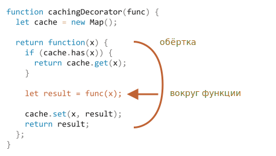

# Декораторы и переадресация вызова, call/apply

JavaScript предоставляет исключительно гибкие возможности по работе с функциями: они могут быть переданы в другие функции, использованы как объекты, и сейчас мы рассмотрим, как *перенаправлять* вызовы между ними и как их декорировать.

## Прозрачное кеширование

Представим, что у нас есть функция `slow(x)`, выполняющая ресурсоёмкие вычисления, но возвращающая стабильные результаты. Другими словами, для одного и того же `x` она всегда возвращает один и тот же результат.

Если функция вызывается часто, то, вероятно, мы захотим кешировать (запоминать) возвращаемые ею результаты, чтобы сэкономить время на повторных вычислениях.

Вместо того, чтобы усложнять `slow(x)` дополнительной функциональностью, мы заключим её в функцию-обёртку - "wrapper" (от англ. "wrap" - обёртывать), которая добавит кеширование. Далее мы увидим, что в таком подходе масса преимуществ.

Вот код с объяснениями:

```js run
function slow(x) {
  // здесь могут быть ресурсоёмкие вычисления
  alert(`Called with ${x}`);
  return x;
}

function cachingDecorator(func) {
  let cache = new Map();

  return function(x) {
    if (cache.has(x)) {    // если кеш содержит такой x,
      return cache.get(x); // читаем из него результат
    }

    let result = func(x); // иначе, вызываем функцию

    cache.set(x, result); // и кешируем (запоминаем) результат
    return result;
  };
}

slow = cachingDecorator(slow);

alert( slow(1) ); // slow(1) кешируем
alert( "Again: " + slow(1) ); // возвращаем из кеша

alert( slow(2) ); // slow(2) кешируем
alert( "Again: " + slow(2) ); // возвращаем из кеша
```

В коде выше `cachingDecorator` -- это *декоратор*, специальная функция, которая принимает другую функцию и изменяет её поведение.

Идея состоит в том, что мы можем вызвать `cachingDecorator` с любой функцией, в результате чего мы получим кеширующую обёртку. Это здорово, т.к. у нас может быть множество функций, использующих такую функциональность, и всё, что нам нужно сделать - это применить к ним `cachingDecorator`.

Отделяя кеширующий код от основного кода, мы также сохраняем чистоту и простоту последнего.

Результат вызова `cachingDecorator(func)` является "обёрткой", т.е. `function(x)` "оборачивает" вызов `func(x)` в кеширующую логику:



С точки зрения внешнего кода, обёрнутая функция `slow` по-прежнему делает то же самое. Обёртка всего лишь добавляет к её поведению аспект кеширования.

Подводя итог, можно выделить несколько преимуществ использования отдельной `cachingDecorator` вместо изменения кода самой `slow`:

- Функцию `cachingDecorator` можно использовать повторно. Мы можем применить её к другой функции.
- Логика кеширования является отдельной, она не увеличивает сложность самой `slow` (если таковая была).
- При необходимости мы можем объединить несколько декораторов (речь об этом пойдёт позже).


## Применение "func.call" для передачи контекста

Упомянутый выше кеширующий декоратор не подходит для работы с методами объектов.

Например, в приведённом ниже коде `worker.slow()` перестаёт работать после применения декоратора:

```js run
// сделаем worker.slow кеширующим
let worker = {
  someMethod() {
    return 1;
  },

  slow(x) {
    // здесь может быть страшно тяжёлая задача для процессора  
    alert("Called with " + x);
    return x * this.someMethod(); // (*)
  }
};

// тот же код, что и выше
function cachingDecorator(func) {
  let cache = new Map();
  return function(x) {
    if (cache.has(x)) {
      return cache.get(x);
    }
*!*
    let result = func(x); // (**)
*/!*
    cache.set(x, result);
    return result;
  };
}

alert( worker.slow(1) ); // оригинальный метод работает

worker.slow = cachingDecorator(worker.slow); // теперь сделаем его кеширующим

*!*
alert( worker.slow(2) ); // Ой! Ошибка: не удаётся прочитать свойство 'someMethod' из 'undefined'
*/!*
```

Ошибка возникает в строке `(*)`. Функция пытается получить доступ к `this.someMethod` и завершается с ошибкой. Видите почему?

Причина в том, что в строке `(**)` декоратор вызывает оригинальную функцию как `func(x)`, и она в данном случае получает `this = undefined`.

Мы бы наблюдали похожую ситуацию, если бы попытались запустить:

```js
let func = worker.slow;
func(2);
```

Т.е. декоратор передаёт вызов оригинальному методу, но без контекста. Следовательно -- ошибка.

Давайте это исправим.

Существует специальный встроенный метод функции [func.call(context, ...args)](mdn:js/Function/call), который позволяет вызывать функцию, явно устанавливая `this`.

Синтаксис:

```js
func.call(context, arg1, arg2, ...)
```

Он запускает функцию `func`, используя первый аргумент как её контекст `this`, а последующие -- как её аргументы.

Проще говоря, эти два вызова делают почти то же самое:

```js
func(1, 2, 3);
func.call(obj, 1, 2, 3)
```

Они оба вызывают `func` с аргументами `1`, `2` и `3`. Единственное отличие состоит в том, что `func.call` ещё и устанавливает `this` равным `obj`.

Например, в приведённом ниже коде мы вызываем `sayHi` в контексте различных объектов: `sayHi.call(user)` запускает `sayHi`, передавая `this=user`, а следующая строка устанавливает `this=admin`:

```js run
function sayHi() {
  alert(this.name);
}

let user = { name: "John" };
let admin = { name: "Admin" };

// используем 'call' для передачи различных объектов в качестве 'this'
sayHi.call( user ); // John
sayHi.call( admin ); // Admin
```

Здесь мы используем `call` для вызова `say` с заданным контекстом и фразой:


```js run
function say(phrase) {
  alert(this.name + ': ' + phrase);
}

let user = { name: "John" };

// 'user' становится 'this', и "Hello" становится первым аргументом
say.call( user, "Hello" ); // John: Hello
```


В нашем случае мы можем использовать `call` в обёртке для передачи контекста в исходную функцию:


```js run
let worker = {
  someMethod() {
    return 1;
  },

  slow(x) {
    alert("Called with " + x);
    return x * this.someMethod(); // (*)
  }
};

function cachingDecorator(func) {
  let cache = new Map();
  return function(x) {
    if (cache.has(x)) {
      return cache.get(x);
    }
*!*
    let result = func.call(this, x); // теперь 'this' передаётся правильно
*/!*
    cache.set(x, result);
    return result;
  };
}

worker.slow = cachingDecorator(worker.slow); // теперь сделаем её кеширующей

alert( worker.slow(2) ); // работает
alert( worker.slow(2) ); // работает, не вызывая первоначальную функцию (кешируется)
```

Теперь всё в порядке.

Чтобы всё было понятно, давайте посмотрим глубже, как передаётся `this`:

1. После *декорации* `worker.slow` становится обёрткой `function (x) { ... }`.
2. Так что при выполнении `worker.slow(2)` обёртка получает `2` в качестве аргумента и `this=worker` (так как это объект перед точкой).
3. Внутри обёртки, если результат ещё не кеширован, `func.call(this, x)` передаёт текущий `this` (`=worker`) и текущий аргумент (`=2`) в оригинальную функцию.

## Переходим к нескольким аргументам с "func.apply"

Теперь давайте сделаем `cachingDecorator` ещё более универсальным. До сих пор он работал только с функциями с одним аргументом.

Как же кешировать метод с несколькими аргументами `worker.slow`?

```js
let worker = {
  slow(min, max) {
    return min + max; // здесь может быть тяжёлая задача
  }
};

// будет кешировать вызовы с одинаковыми аргументами
worker.slow = cachingDecorator(worker.slow);
```

Здесь у нас есть две задачи для решения.

Во-первых, как использовать оба аргумента `min` и `max` для ключа в коллекции `cache`? Ранее для одного аргумента `x` мы могли просто сохранить результат `cache.set(x, result)` и вызвать `cache.get(x)`, чтобы получить его позже. Но теперь нам нужно запомнить результат для *комбинации аргументов* `(min,max)`. Встроенный `Map` принимает только одно значение как ключ.

Есть много возможных решений:

1. Реализовать новую (или использовать стороннюю) структуру данных для коллекции, которая более универсальна, чем встроенный `Map`, и поддерживает множественные ключи.
2. Использовать вложенные коллекции: `cache.set(min)` будет `Map`, которая хранит пару `(max, result)`. Тогда получить `result` мы сможем, вызвав `cache.get(min).get(max)`.
3. Соединить два значения в одно. В нашем конкретном случае мы можем просто использовать строку `"min,max"` как ключ к `Map`. Для гибкости, мы можем позволить передавать *хеширующую функцию* в декоратор, которая знает, как сделать одно значение из многих.

Для многих практических применений третий вариант достаточно хорош, поэтому мы будем придерживаться его.

Также нам понадобится заменить `func.call(this, x)` на `func.call(this, ...arguments)`, чтобы передавать все аргументы обёрнутой функции, а не только первый.

Вот более мощный `cachingDecorator`:

```js run
let worker = {
  slow(min, max) {
    alert(`Called with ${min},${max}`);
    return min + max;
  }
};

function cachingDecorator(func, hash) {
  let cache = new Map();
  return function() {
*!*
    let key = hash(arguments); // (*)
*/!*
    if (cache.has(key)) {
      return cache.get(key);
    }

*!*
    let result = func.call(this, ...arguments); // (**)
*/!*

    cache.set(key, result);
    return result;
  };
}

function hash(args) {
  return args[0] + ',' + args[1];
}

worker.slow = cachingDecorator(worker.slow, hash);

alert( worker.slow(3, 5) ); // работает
alert( "Again " + worker.slow(3, 5) ); // аналогично (из кеша)
```

Теперь он работает с любым количеством аргументов.

Есть два изменения:

- В строке `(*)` вызываем `hash` для создания одного ключа из `arguments`. Здесь мы используем простую функцию "объединения", которая превращает аргументы `(3, 5)` в ключ `"3,5"`. В более сложных случаях могут потребоваться другие функции хеширования.
- Затем в строке `(**)` используем `func.call(this, ...arguments)` для передачи как контекста, так и всех аргументов, полученных обёрткой (независимо от их количества), в исходную функцию.

Вместо `func.call(this, ...arguments)` мы могли бы написать `func.apply(this, arguments)`.

Синтаксис встроенного метода  [func.apply](mdn:js/Function/apply):

```js
func.apply(context, args)
```

Он выполняет `func`, устанавливая `this=context` и принимая в качестве списка аргументов псевдомассив `args`.

Единственная разница в синтаксисе между `call` и `apply` состоит в том, что `call` ожидает список аргументов, в то время как `apply` принимает псевдомассив.

Эти два вызова почти эквивалентны:

```js
func.call(context, ...args); // передаёт массив как список с оператором расширения
func.apply(context, args);   // тот же эффект
```

Есть только одна небольшая разница:

- Оператор расширения `...` позволяет передавать *перебираемый* объект `args` в виде списка в `call`.
- А `apply` принимает только *псевдомассив* `args`.

Так что эти вызовы дополняют друг друга. Для перебираемых объектов сработает `call`, а где мы ожидаем псевдомассив - `apply`.

А если у нас объект, который и то, и другое, например, реальный массив, то технически мы могли бы использовать любой метод, но `apply`, вероятно, будет быстрее, потому что большинство движков JavaScript внутренне оптимизируют его лучше.

Передача всех аргументов вместе с контекстом другой функции называется "перенаправлением вызова" (call forwarding).

Простейший вид такого перенаправления:

```js
let wrapper = function() {
  return func.apply(this, arguments);
};
```

При вызове `wrapper` из внешнего кода его не отличить от вызова исходной функции.

## Заимствование метода [#method-borrowing]

Теперь давайте сделаем ещё одно небольшое улучшение функции хеширования:

```js
function hash(args) {
  return args[0] + ',' + args[1];
}
```

На данный момент она работает только для двух аргументов. Было бы лучше, если бы она могла склеить любое количество `args`.

Естественным решением было бы использовать метод [arr.join](https://developer.mozilla.org/ru/docs/Web/JavaScript/Reference/Global_Objects/Array/join):

```js
function hash(args) {
  return args.join();
}
```

...К сожалению, это не сработает, потому что мы вызываем `hash(arguments)`, а объект `arguments` является перебираемым и псевдомассивом, но не реальным массивом.

Таким образом, вызов `join` для него потерпит неудачу, что мы и можем видеть ниже:

```js run
function hash() {
*!*
  alert( arguments.join() ); // Ошибка: arguments.join не является функцией
*/!*
}

hash(1, 2);
```

Тем не менее, есть простой способ использовать соединение массива:

```js run
function hash() {
*!*
  alert( [].join.call(arguments) ); // 1,2
*/!*
}

hash(1, 2);
```

Этот трюк называется *заимствование метода*.

Мы берём (заимствуем) метод `join` из обычного массива `[].join`. И используем `[].join.call`, чтобы выполнить его в контексте `arguments`.

Почему это работает?

Это связано с тем, что внутренний алгоритм встроенного метода `arr.join(glue)` очень прост.
Взято из спецификации практически "как есть":

1. Пускай первым аргументом будет `glue` или, в случае отсутствия аргументов, им будет запятая `","`
2. Пускай `result` будет пустой строкой `""`.
3. Добавить `this[0]` к `result`.
4. Добавить `glue` и `this[1]`.
5. Добавить `glue` и `this[2]`.
6. ...выполнять до тех пор, пока `this.length` элементов не будет склеено.
7. Вернуть `result`.

Таким образом, технически он принимает `this` и объединяет `this[0]`, `this[1]`... и т.д. вместе. Он намеренно написан так, что допускает любой псевдомассив `this` (не случайно, многие методы следуют этой практике). Вот почему он также работает с `this=arguments`.

## Итого

*Декоратор* - это обёртка вокруг функции, которая изменяет поведение последней. Основная работа по-прежнему выполняется функцией.

Обычно безопасно заменить функцию или метод декорированным, за исключением одной мелочи. Если исходная функция предоставляет свойства, такие как `func.calledCount` или типа того, то декорированная функция их не предоставит. Потому что это обёртка. Так что нужно быть осторожным в их использовании. Некоторые декораторы предоставляют свои собственные свойства.

Декораторы можно рассматривать как "дополнительные возможности" или "аспекты", которые можно добавить в функцию. Мы можем добавить один или несколько декораторов. И всё это без изменения кода оригинальной функции!

Для реализации `cachingDecorator` мы изучили методы:

- [func.call(context, arg1, arg2...)](mdn:js/Function/call) -- вызывает `func` с данным контекстом и аргументами.
- [func.apply(context, args)](mdn:js/Function/apply) -- вызывает `func`, передавая `context` как `this` и псевдомассив `args` как список аргументов.

В основном *переадресация вызова* выполняется с помощью `apply`:

```js
let wrapper = function(original, arguments) {
  return original.apply(this, arguments);
};
```

Мы также рассмотрели пример *заимствования метода*, когда мы вызываем метод у объекта в контексте другого объекта. Весьма распространено заимствовать методы массива и применять их к `arguments`. В качестве альтернативы можно использовать объект с остаточными параметрами `...args`, который является реальным массивом.


На практике декораторы используются для самых разных задач. Проверьте, насколько хорошо вы их освоили, решая задачи этой главы.
