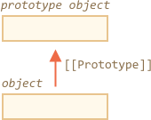
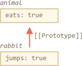
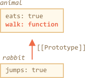
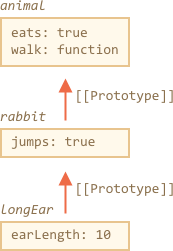
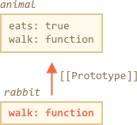
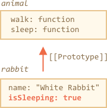

# Прототипное наследование

В программировании мы часто хотим взять что-то и расширить.

Например, у нас есть объект `user` со своими свойствами и методами, и мы хотим создать объекты `admin` и `guest` как его слегка измененные варианты. Мы хотели бы повторно использовать то, что есть у объекта `user`, не копировать/переопределять его методы, а просто создать новый объект на его основе.

*Прототипное наследование* — это возможность языка, которая помогает в этом.

## [[Prototype]]

В JavaScript объекты имеют специальное скрытое свойство `[[Prototype]]` (так оно названо в спецификации), которое либо равно `null`, либо ссылается на другой объект. Этот объект называется "прототип":



Этот `[[Prototype]]` дает нам немного "магии". Когда мы хотим прочитать свойство из `объекта`, а оно отсутствует, JavaScript автоматически берет его из прототипа. В программировании такой механизм называется "прототипным наследованием". Многие интересные возможности языка и техники программирования основываются на нем.

Свойство `[[Prototype]]` является внутренним и скрытым, но есть много способов задать его самостоятельно.

Одним из них является использование `__proto__`, например так:

```js run
let animal = {
  eats: true
};
let rabbit = {
  jumps: true
};

*!*
rabbit.__proto__ = animal;
*/!*
```

```smart header="Свойство `__proto__` — исторически обусловленный геттер/сеттер для `[[Prototype]]`"
Обратите внимание, что `__proto__` — *не то же самое*, что `[[Prototype]]`. Это геттер/сеттер для него.

Он существует по историческим причинам, в современном языке его заменяют функции `Object.getPrototypeOf/Object.setPrototypeOf`, которые также получают/устанавливают прототип. Мы рассмотрим причины этого и эти функции позже.

По спецификации `__proto__` должен поддерживаться только браузерами, но на самом деле все среды, включая серверную, поддерживают его. На данный момент, поскольку нотация `__proto__` немного более понятна, мы будем использовать ее в примерах.
```

Если мы ищем свойство в `rabbit`, а оно отсутствует, JavaScript автоматически берет его из `animal`.

Например:

```js run
let animal = {
  eats: true
};
let rabbit = {
  jumps: true
};

*!*
rabbit.__proto__ = animal; // (*)
*/!*

// теперь мы можем найти оба свойства в rabbit:
*!*
alert( rabbit.eats ); // true (**)
*/!*
alert( rabbit.jumps ); // true
```

Здесь строка `(*)` устанавливает `animal` как прототип для `rabbit`.

Затем, когда `alert` пытается прочитать свойство `rabbit.eats` `(**)`, его нет в `rabbit`, поэтому JavaScript следует по ссылке `[[Prototype]]` и находит ее в `animal` (смотрите снизу вверх):



Здесь мы можем сказать, что "`animal` является прототипом `rabbit`" или "`rabbit` прототипно наследуется от `animal`".

Так что если у `animal` много полезных свойств и методов, то они автоматически становятся доступными у `rabbit`. Такие свойства называются "унаследованными".

Если у нас есть метод в `animal`, он может быть вызван на `rabbit`:

```js run
let animal = {
  eats: true,
*!*
  walk() {
    alert("Animal walk");
  }
*/!*
};

let rabbit = {
  jumps: true,
  __proto__: animal
};

// walk взят из прототипа
*!*
rabbit.walk(); // Animal walk
*/!*
```

Метод автоматически берется из прототипа:



Цепочка прототипов может быть длиннее:


```js run
let animal = {
  eats: true,
  walk() {
    alert("Animal walk");
  }
};

let rabbit = {
  jumps: true,
*!*
  __proto__: animal
*/!*
};

let longEar = {
  earLength: 10,
*!*
  __proto__: rabbit
*/!*
};

// walk взят из цепочки прототипов
longEar.walk(); // Animal walk
alert(longEar.jumps); // true (для rabbit)
```



На самом деле есть только два ограничения:

1. Ссылки не могут идти по кругу. JavaScript выдаст ошибку, если мы попытаемся назначить `__proto__` по кругу.
2. Значение `__proto__` может быть как объектом, так и `null`, другие типы (например, примитивы) игнорируются.

Это вполне очевидно, но все же: может быть только один `[[Prototype]]`. Объект не может наследоваться от двух других.

## Запись не использует прототип

Прототип используется только для чтения свойств.

Операции записи/удаления работают напрямую с объектом.

В приведенном ниже примере мы присваиваем `rabbit` собственный метод `walk`:

```js run
let animal = {
  eats: true,
  walk() {
    /* этот метод не будет использоваться в rabbit */  
  }
};

let rabbit = {
  __proto__: animal
};

*!*
rabbit.walk = function() {
  alert("Rabbit! Bounce-bounce!");
};
*/!*

rabbit.walk(); // Rabbit! Bounce-bounce!
```

Теперь вызов `rabbit.walk()` находит метод непосредственно в объекте и выполняет его, не используя прототип:



Это справедливо только для свойств данных, но не для аксессоров. Если свойство является геттером/сеттером, то оно ведет себя как функция: геттеры/сеттеры ищутся в прототипе.

По этой причине `admin.fullName` работает корректно в приведенном ниже коде:

```js run
let user = {
  name: "John",
  surname: "Smith",

  set fullName(value) {
    [this.name, this.surname] = value.split(" ");
  },

  get fullName() {
    return `${this.name} ${this.surname}`;
  }
};

let admin = {
  __proto__: user,
  isAdmin: true
};

alert(admin.fullName); // John Smith (*)

// срабатывает сеттер!
admin.fullName = "Alice Cooper"; // (**)
```

Здесь в строке `(*)` свойство `admin.fullName` имеет геттер в прототипе `user`, поэтому вызывается он. В строке `(**)` свойство также имеет сеттер в прототипе, который и будет вызван.

## Значение "this"

В приведенном выше примере может возникнуть интересный вопрос: каково значение `this` внутри `set fullName(value)`? Куда записаны свойства `this.name` и `this.surname`: в `user` или `admin`?

Ответ прост: прототипы никак не влияют на `this`.

**Неважно, где находится метод: в объекте или его прототипе. В вызове метода, `this` — всегда объект перед точкой.**

Таким образом, вызов сеттера `admin.fullName=` в качестве `this` использует `admin`, а не `user`.

Это на самом деле очень важная деталь, потому что у нас может быть большой объект со множеством методов, от которого можно унаследоваться. Затем наследуемые объекты могут выполнять его методы, и они будут изменять состояние этих объектов, а не большого.

Например, здесь `animal` представляет собой "хранилище метода", и `rabbit` использует его.

Вызов `rabbit.sleep()` устанавливает `this.isSleeping` для объекта `rabbit`:

```js run
// animal has methods
let animal = {
  walk() {
    if (!this.isSleeping) {
      alert(`I walk`);
    }
  },
  sleep() {
    this.isSleeping = true;
  }
};

let rabbit = {
  name: "White Rabbit",
  __proto__: animal
};

// модифицирует rabbit.isSleeping
rabbit.sleep();

alert(rabbit.isSleeping); // true
alert(animal.isSleeping); // undefined (нет такого свойства в прототипе)
```

Картинка с результатом:



Если бы у нас были другие объекты, такие как `bird`, `snake` и т.д., унаследованные от `animal`, они также получили бы доступ к методам `animal`. Но `this` в каждом методе будет соответствовать объекту, на котором происходит вызов (до точки), а не `animal`. Поэтому, когда мы записываем данные в `this`, они сохраняются в этих объектах.

В результате методы являются общими, а состояние объекта — нет.

## Итого

- В JavaScript все объекты имеют скрытое свойство `[[Prototype]]`, которое является либо другим объектом, либо `null`.
- Мы можем использовать `obj.__ proto__` для доступа к нему (исторически обусловленный геттер/сеттер, есть другие способы, которые скоро будут рассмотрены).
- Объект, на который ссылается `[[Prototype]]`, называется "прототипом".
- Если мы хотим прочитать свойство `obj` или вызвать метод, которого не существует, тогда JavaScript попытается найти его в прототипе. Операции записи/удаления работают непосредственно с объектом, они не используют прототип (если свойство фактически не является сеттером).
- Если мы вызываем `obj.method()`, а метод взят из прототипа, то `this` все равно ссылается на `obj`. Таким образом, методы всегда работают с текущим объектом, даже если они наследуются.
