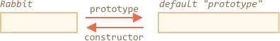

# F.prototype

Мы помним, что новые объекты могут быть созданы с помощью функции-конструктора, например `new F()`.

Если в `F.prototype` содержится объект, оператор `new` устанавливает его в качестве `[[Prototype]]` для нового объекта.

```smart
JavaScript использовал прототипное наследование изначально. Это одна из основных особенностей языка.

Раньше прямого доступа к прототипу объекта не было. Надежно работало только свойство ` "prototype" ` функции-конструктора, описанное в этой главе. Поэтому вы часто будете встречать такую конструкцию в коде.
```

Обратите внимание, что `F.prototype` означает обычное свойство с именем `"prototype"` для `F`. `"prototype"` **не является** прототипом для `"F"`

Приведем пример:

```js run
let animal = {
  eats: true
};

function Rabbit(name) {
  this.name = name;
}

*!*
Rabbit.prototype = animal;
*/!*

let rabbit = new Rabbit("White Rabbit"); //  rabbit.__proto__ == animal

alert( rabbit.eats ); // true
```

Установка `Rabbit.prototype = animal` буквально говорит интерпретатору следующее: "При создании объекта через `new Rabbit()` запиши ему `__proto__ = animal`".`".

Результат будет выглядеть так:


На изображении, `"prototype"` - горизонтальная стрелка, обозначающая обычное свойство для `"F"`, а `[[Prototype]]` вертикальная, обозначающая наследование `rabbit` от `animal`.

```smart header="`F.prototype` используется только в момент вызова `new F()`"
`F.prototype` используется только при вызове `new F()` и присваивается в качестве свойства `[[Prototype]]` нового объекта. После этого `F.prototype` и новый объект ничего не связывает. Следует понимать это как единоразовое присвоение значения `F.prototype` к свойству `__proto__` нового объекта.

После создания, `F.prototype` может измениться и новые объекты, созданные с помощью `new F()`, будут иметь другой `[[Prototype]]`, но уже существующие объекты сохранят старый.

## F.prototype по умолчанию, свойство constructor

У каждой функции по умолчанию уже есть свойство prototype.

`[[Prototype]]` по умолчанию является объектом с единственным свойством `constructor`, которое ссылается на функцию-конструктор.

Пример:

```js
function Rabbit() {}

/* прототип по умолчанию
Rabbit.prototype = { constructor: Rabbit };
*/
```



Проверим это:

```js run
function Rabbit() {}
// по умолчанию:
// Rabbit.prototype = { constructor: Rabbit }

alert( Rabbit.prototype.constructor == Rabbit ); // true
```

Соответственно, если мы ничего не меняем, свойство `constructor` будет доступно всем кроликам через `[[Prototype]]`:

```js run
function Rabbit() {}
// по умолчанию:
// Rabbit.prototype = { constructor: Rabbit }

let rabbit = new Rabbit(); // наследует от {constructor: Rabbit}

alert(rabbit.constructor == Rabbit); // true (свойство получено из прототипа)
```


Мы можем использовать свойство `constructor` существующего объекта для создания нового.
Пример:

```js run
function Rabbit(name) {
  this.name = name;
  alert(name);
}

let rabbit = new Rabbit("White Rabbit");

*!*
let rabbit2 = new rabbit.constructor("Black Rabbit");
*/!*
```

Это удобно, когда у нас есть объект, но мы не знаем какой конструктор использовался для его создания (например, он был взят из сторонней библиотеки), а нам необходимо создать еще один такой объект.

Но, пожалуй, самое важное о свойстве `"constructor"` это...

**...JavaScript самостоятельно не обеспечивает правильное значение свойства `"constructor"`.**

Да, он является свойством по умолчанию в `prototype` у функций, но что случится с ним позже зависит от нас.

В частности, если мы заменим прототип по умолчанию на другой объект, свойства `"constructor"` в нем не будет.

Например:

```js run
function Rabbit() {}
Rabbit.prototype = {
  jumps: true
};

let rabbit = new Rabbit();
*!*
alert(rabbit.constructor === Rabbit); // false
*/!*
```

Таким образом, чтобы сохранить свойство `constructor` мы должны добавлять/удалять/изменять свойства у прототипа по умолчанию вместо того, чтобы перезаписывать его целиком:
```js
function Rabbit() {}

// Не перезаписываем Rabbit.prototype полностью
// А добавляем к нему свойство
Rabbit.prototype.jumps = true
// Прототип по умолчанию сохраняется и мы всё еще имеем доступ к Rabbit.prototype.constructor
```

Или мы можем заново создать свойство `constructor`:

```js
Rabbit.prototype = {
  jumps: true,
*!*
  constructor: Rabbit
*/!*
};

// В данном случае мы тоже имеем доступ к ` constructor `, так как переопределили его.
```


## Итого

В этой главе мы кратко описали способ определения свойства `[[Prototype]]` для объектов, созданных с помощью функции-конструктора. Позже мы рассмотрим продвинутые практики использования этой возможности.

Все достаточно просто. Выделим основные моменты:

- Свойство `F.prototype` отличается от`[[Prototype]]`. Единственное, что делает `F.prototype`: он устанавливает`[[Prototype]]` для новых объектов при вызове`new F ()`.
- Значение `F.prototype` должно быть либо объектом, либо null. Другие значения не будут работать.
- Свойство `prototype` необходимо только в качестве свойства функции-конструктора и отрабатывает с помощью `new F() `

В обычных объектах `prototype` отсутствует:
```js
let user = {
  name: "John",
  prototype: "Bla-bla" // никакой магии нет
};
```

По умолчанию все функции имеют `F.prototype = { constructor: F }`, поэтому мы можем получить конструктор объекта через свойство `"constructor"`.
