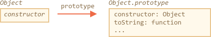
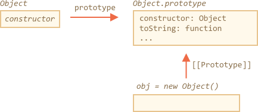
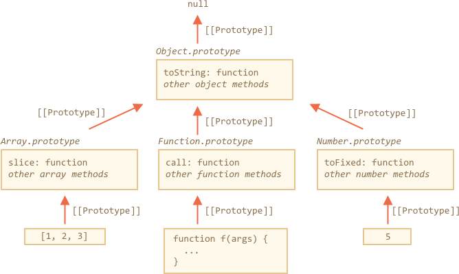
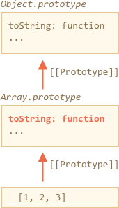

# Встроенные прототипы

Свойство `"prototype"` широко используется в самом ядре JavaScript. Все встроенные функции-конструкторы используют его.

Сначала мы посмотрим как это работает для простых объектов, а затем и для более сложных.

## Object.prototype

Давайте выведем пустой объект:

```js run
let obj = {};
alert( obj ); // "[object Object]" ?
```

Где код, который генерирует строку `"[object Object]"`? Это встроенный метод `toString`, но где он? `obj` ведь пуст!

...Но краткая нотация `obj = {}` это то же самое, что и `obj = new Object()`, где `Object` - встроенная функция-конструктор для объектов с собственным свойством `prototype`, который ссылается на огромный объект с методом `toString` и другими.

Вот что происходит:



Когда вызывается `new Object()` (или создается объект с помощью литерала `{...}`), свойство `[[Prototype]]` этого объекта устанавливается как `Object.prototype` по правилам, который мы обсуждали в предыдущей статье:



Таким образом, когда вызывается `obj.toString()` метод берется из `Object.prototype`.

Мы можем проверить это так:

```js run
let obj = {};

alert(obj.__proto__ === Object.prototype); // true
// obj.toString === obj.__proto__.toString == Object.prototype.toString
```

Стоит обратить внимание, что выше `Object.prototype` по цепочке прототипов нет дополнительного свойства `[[Prototype]]`:

```js run
alert(Object.prototype.__proto__); // null
```

## Другие встроенные прототипы

Другие встроенные объекты, такие как `Array`, `Date`, `Function` и другие, также хранят свои методы в прототипах.

Например, когда создается массив `[1, 2, 3]`, скрыто используется конструктор по-умолчанию `new Array()`. Так данные массива записываются в новый объект, и прототипом этого объекта становится `Array.prototype`, предоставляя ему свои методы. Это позволяет эффективно использовать память.

Согласно спецификации, наверху иерархии встроенных прототипов находится `Object.prototype`. Иногда говорят, что "все наследуется от объектов".

Вот более полная картина (для 3 встроенных объектов):



Давайте проверим прототипы:

```js run
let arr = [1, 2, 3];

// наследует от Array.prototype?
alert( arr.__proto__ === Array.prototype ); // true

// затем от Object.prototype?
alert( arr.__proto__.__proto__ === Object.prototype ); // true

// и null на вершине иерархии
alert( arr.__proto__.__proto__.__proto__ ); // null
```

Некоторые методы в прототипах могу пересекаться, например, у `Array.prototype` есть свой метод `toString`, который выводит элементы массива через запятую:

```js run
let arr = [1, 2, 3]
alert(arr); // 1,2,3 <-- результат Array.prototype.toString
```

Как мы видели раньше, у `Object.prototype` есть свой `toString`, но так как `Array.prototype` ближе в цепочке прототипов, то берётся именно вариант для массивов:





В браузерных инструментах, таких как консоль разработчик в Chrome, можно посмотреть цепочку наследования (возможно, потребуется использовать `console.dir` для встроенных объектов):


Другие встроенные объекты работают таким же способом. Даже функции -- все они объекты встроенного конструктора `Function`, и все их методы (`call`/`apply` и другие) берутся из `Function.prototype`. Также у функций есть свой метод `toString`.

```js run
function f() {}

alert(f.__proto__ == Function.prototype); // true
alert(f.__proto__.__proto__ == Object.prototype); // true, наследует от Object
```

## Примитивы

Самое сложное происходит со строкам, числами и булевым типом.

Как мы помним, они не объекты. Но если мы попытаемся получить доступ к их свойствам, тогда будет создан временный объект-обертка с использованием встроенных конструкторов `String`, `Number`, `Boolean`, которые предоставят методы и после чего исчезнут.

Эти объекты создаются невидимо для нас, и большая часть движков оптимизирует этот процесс, но спецификация описывает это именно таким образом. Методы этих объектов также находятся в прототипах, доступных как `String.prototype`, `Number.prototype` и `Boolean.prototype`. 

```warn header="Значения `null` и `undefined` имеют объектов-оберток"
Специальные значения `null` и `undefined` стоят особняком. У них нет, объектов-оберток, так что методы и свойства им недоступны. Также у них нет соответствующих прототипов.
```

## Изменение встроенных прототипов [#native-prototype-change]

Встроенные прототипы можно изменять. Например, если добавить метод к `String.prototype`, метод становится доступен для все строк:

```js run
String.prototype.show = function() {
  alert(this);
};

"BOOM!".show(); // BOOM!
```

В течение процесса разработки, у нас могут быть идеи о новых встроенных методах, которые нам хотелось бы иметь, и можем испытать искушение добавить их во встроенные прототипы. Но в целом, это плохая идея.

```warn
Прототипы глобальны, и очень легко получить конфликты. Если две библиотеки добавляют методы `String.prototype.show`, то одна из них перепишет другой.

Так что, в целом, изменение встроенных прототипов считается плохой идей.
```

**В современном программировании есть только один случай, в котором одобряется изменение встроенных прототипов. Это создание полифилов.

Полифил - это термин, который означает замену метода, существуего в спецификации JavaScript, но еще не поддерживается текущим движком JavaScript.

Тогда мы можем реализовать его сами и добавить его во встроенный прототип.

Например:

```js run
if (!String.prototype.repeat) { // Если такого метода нет
  // добавляем его в прототип

  String.prototype.repeat = function(n) {
    // повторить строку n раз

    // на самом деле код должен быть немного более сложным
    // (полный алгоритм можно найти в спецификации)
    // но даже неполный полифил часто считается достаточно хорошим
    return new Array(n + 1).join(this);
  };
}

alert( "La".repeat(3) ); // LaLaLa
```


## Borrowing from prototypes

In the chapter <info:call-apply-decorators#method-borrowing> we talked about method borrowing.

That's when we take a method from one object and copy it into another.

Some methods of native prototypes are often borrowed.

For instance, if we're making an array-like object, we may want to copy some array methods to it.

E.g.

```js run
let obj = {
  0: "Hello",
  1: "world!",
  length: 2,
};

*!*
obj.join = Array.prototype.join;
*/!*

alert( obj.join(',') ); // Hello,world!
```

It works, because the internal algorithm of the built-in `join` method only cares about the correct indexes and the `length` property, it doesn't check that the object is indeed the array. And many built-in methods are like that.

Another possibility is to inherit by setting `obj.__proto__` to `Array.prototype`, so all `Array` methods are automatically available in `obj`.

But that's impossible if `obj` already inherits from another object. Remember, we only can inherit from one object at a time.

Borrowing methods is flexible, it allows to mix functionality from different objects if needed.

## Summary

- All built-in objects follow the same pattern:
    - The methods are stored in the prototype (`Array.prototype`, `Object.prototype`, `Date.prototype` etc).
    - The object itself stores only the data (array items, object properties, the date).
- Primitives also store methods in prototypes of wrapper objects: `Number.prototype`, `String.prototype`, `Boolean.prototype`. Only `undefined` and `null` do not have wrapper objects.
- Built-in prototypes can be modified or populated with new methods. But it's not recommended to change them. Probably the only allowable cause is when we add-in a new standard, but not yet supported by the engine JavaScript method.
