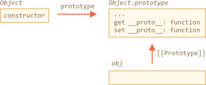
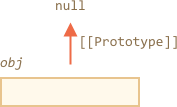

# Методы прототипов, объекты без свойства __proto__

В первой главе этого раздела мы упоминали, что существуют современные методы работы с прототипами.

Свойство `__proto__` считается устаревшим и в некотором роде нежелательным (только в браузерной части стандарта JavaScript).

Современные методы это:

- [Object.create(proto[, descriptors])](mdn:js/Object/create) -- создаёт пустой объект со свойством `[[Prototype]]`, указанным как `proto`, и необязательными дескрипторами свойств.
- [Object.getPrototypeOf(obj)](mdn:js/Object/getPrototypeOf) -- возвращает свойство `[[Prototype]]` объекта `obj`.
- [Object.setPrototypeOf(obj, proto)](mdn:js/Object/setPrototypeOf) -- устанавливает свойство `[[Prototype]]` объекта `obj` как `proto`.

Эти методы нужно использовать вместо `__proto__`.

Например:

```js run
let animal = {
  eats: true
};

// создаём новый объект с прототипом animal
*!*
let rabbit = Object.create(animal);
*/!*

alert(rabbit.eats); // true
*!*
alert(Object.getPrototypeOf(rabbit) === animal); // получаем прототип объекта rabbit
*/!*

*!*
Object.setPrototypeOf(rabbit, {}); // заменяем прототип объект rabbit на {}
*/!*
```

У `Object.create` есть необязательный второй аргумент: дескрипторы свойств. Мы можем добавить дополнительное свойство новому объекту таким образом:

```js run
let animal = {
  eats: true
};

let rabbit = Object.create(animal, {
  jumps: {
    value: true
  }
});

alert(rabbit.jumps); // true
```

У дескрипторов такой же формат как описано в главе <info:property-descriptors>.

Мы можем использовать `Object.create` для клонирования объектов как более мощный способ чем копирование свойств с помощью цикла `for..in`:

```js
// полностью идентичный поверхностный клон obj
let clone = Object.create(Object.getPrototypeOf(obj), Object.getOwnPropertyDescriptors(obj));
```

Такой вызов создаёт точную копию объекта `obj`, включая все свойства: перечисляемые и не перечисляемые, свойства, геттеры/сеттеры для свойств -- и все это с правильным свойством `[[Prototype]]`.

## Краткая история

Если пересчитать все способы управления свойством `[[Prototype]]`, то их будет много! И многие из них делают одно и тоже!

Почему так?

В силу исторических причин.

- Свойство `"prototype"` функции-конструктора существует ещё с очень давних времён.
- Позднее в 2012 году: `Object.create` появился в стандарте. Это давало возможность создавать объекты с указанным прототипом, но не позволяло устанавливать/получать его. Тогда браузеры реализовали нестандартный аксессор `__proto__`, который позволил устанавливать/получать прототип в любой время.
- Позднее в 2015 году: в стандарт были добавлены `Object.setPrototypeOf` и `Object.getPrototypeOf`. Фактически свойство `__proto__` было реализовано везде, так что оно попало Приложение Б стандарта, которое было опционально для не браузерных окружений.

Теперь мы знаем, что у нас есть все эти способы в нашем распоряжении.

Почему же `__proto__` был заменён на функции? Вопрос интересный, требующий от нас понимания, почему `__proto__` плох. Читайте далее, чтобы узнать ответ.

```warn header="Не переопределяйте `[[Prototype]]`, кроме случаев, когда скорость не важна"
Технически, мы можем установить/получить `[[Prototype]]` в любое время. Но обычно мы устанавливаем прототип только раз во время создания объекта, а после не меняем: `rabbit` наследует от `animal`, и это не изменится.

И JavaScript движки хорошо оптимизированы для этого. Изменение прототипа "на лету" с помощью `Object.setPrototypeOf` или `obj.__proto__=` очень медленная операция, которая ломает внутренние оптимизации для операций доступа к свойствам объекта. Так что лучше избегать этого, кроме, тех ситуаций, когда вы знаете, что делаете, или скорость JavaScript для вас полностью не важна.
```

## "Очень пустой" объект

Как мы знаем, объекты можно использовать как ассоциативные массивы для хранения пар ключ/значение.

...Но если попробуем хранить *созданные пользователями* ключи (например, словари с пользовательским вводом), мы можем заметить интересный сбой: все ключи работают как ожидается, за исключением `"__proto__"`.

Посмотрите на пример:

```js run
let obj = {};

let key = prompt("What's the key?", "__proto__");
obj[key] = "some value";

alert(obj[key]); // [object Object], не "some value"!
```

Если пользователь введёт `__proto__`, присвоение проигнорируется!

И это не должно удивлять нас. Свойство `__proto__` особенное: оно должно быть либо объектом, либо `null`, а строка не может стать прототипом.

Но мы не *намеревались* реализовывать такое поведение, не так ли? Мы хотим хранить пары ключ/значение, и ключ с именем `"__proto__"` не был сохранён надлежащим образом. Так что это ошибка!

В примере последствия не так ужасны. Но в других случаях прототип может быть изменён, и код может выполниться совершенно неожиданным неправильным способом.

Что хуже всего -- разработчики не задумываются о такой возможности совсем. Это делает такие ошибки сложным для отлавливания или даже превращает их в уязвимости, особенно когда JavaScript используется на сервере.

Неожиданные вещи могут случаться также при получении доступа к свойству `toString`, которое по умолчанию функция, и к другим встроенным свойствам.

Как же избежать проблемы?

Во-первых, мы можем переключиться на использование коллекции `Map`, и тогда все будет в порядке.

Но и `Object` может также хорошо подойти, потому что создатели языка уже давно продумали решение проблемы.

Свойство `__proto__` это не свойство объекта, а свойство-аксессор для `Object.prototype`:



Так что при чтении или установке `obj.__proto__`, вызывается соответствующий геттер/сеттер из прототипа `obj`, и именно он устанавливает/получает свойство `[[Prototype]]`.

Как было сказано в начале этой обучающей секции: `__proto__` это способ доступа к свойству `[[Prototype]]`, это не само свойство `[[Prototype]]`.

Теперь, если мы хотим использовать объект как ассоциативный массив, мы можем сделать это с помощью небольшого трюка:

```js run
*!*
let obj = Object.create(null);
*/!*

let key = prompt("What's the key?", "__proto__");
obj[key] = "some value";

alert(obj[key]); // "some value"
```

`Object.create(null)` создаёт пустой объект без прототипа (свойство `[[Prototype]]` это `null`):



Таким образом не будет унаследованного геттера/сеттера для `__proto__`. Теперь это свойство обрабатывается как обычное свойство, и пример приведённый выше работает правильно.

Мы можем назвать такой объект "очень пустым" или "чистым словарным объектом", потому что они ещё проще чем обычные объекты `{...}`.

Недостаток в том, что у таких объектов не будет встроенных методов объекта, таких как `toString`:

```js run
*!*
let obj = Object.create(null);
*/!*

alert(obj); // Error (no toString)
```

...Но обычно этого достаточно для ассоциативных массивов.

Пожалуйста, обратите внимание, что большая часть методов `Object.something(...)` связанных с объектами, таких как `Object.keys(obj)`, не находятся в прототипе, так что они продолжат работать для таких объектов:


```js run
let chineseDictionary = Object.create(null);
chineseDictionary.hello = "你好";
chineseDictionary.bye = "再见";

alert(Object.keys(chineseDictionary)); // hello,bye
```

## Итого

Современные способы установки и прямого доступа к прототипу это:

- [Object.create(proto[, descriptors])](mdn:js/Object/create) -- создаёт пустой объект со свойством `[[Prototype]]`, указанным как `proto` (может быть `null`), и необязательными дескрипторами свойств.
- [Object.getPrototypeOf(obj)](mdn:js/Object.getPrototypeOf) -- возвращает свойство `[[Prototype]]` объекта `obj` (то же самое что и геттер `__proto__`).
- [Object.setPrototypeOf(obj, proto)](mdn:js/Object.setPrototypeOf) -- устанавливает свойство `[[Prototype]]` объекта `obj` как `proto` (то же самое что и сеттер `__proto__`).

Встроенный геттер/сеттер __proto__ не безопасен, если мы хотим использовать *созданные пользователями* ключи в объекте. Как минимум потому, что пользователь может ввести "proto" как ключ, от чего может возникнуть ошибка. Если повезёт - последствия будут лёгкими, но обычно они непредсказуемы.

Тогда мы можем использовать либо `Object.create(null)` для создания "очень пустого" объекта, либо использовать коллекцию `Map`.

Также, `Object.create` даёт нам лёгкий способ создать поверхностную копию объекты со всеми дескрипторами:

```js
let clone = Object.create(Object.getPrototypeOf(obj), Object.getOwnPropertyDescriptors(obj));
```


- [Object.keys(obj)](mdn:js/Object/keys) / [Object.values(obj)](mdn:js/Object/values) / [Object.entries(obj)](mdn:js/Object/entries) -- возвращают массив всех перечисляемых собственных строковых имён/значений/пар ключ-значение.
- [Object.getOwnPropertySymbols(obj)](mdn:js/Object/getOwnPropertySymbols) -- возвращает массив всех собственных символьных имён свойств.
- [Object.getOwnPropertyNames(obj)](mdn:js/Object/getOwnPropertyNames) -- возвращает массив всех собственных строковых имён свойств.
- [Reflect.ownKeys(obj)](mdn:js/Reflect/ownKeys) -- возвращает массив всех собственных имён свойств.
- [obj.hasOwnProperty(key)](mdn:js/Object/hasOwnProperty): возвращает `true`, если у `obj` есть собственное (не унаследованное) свойство с именем `key`.

Мы также ясно указали, что  `__proto__` -- это геттер/сеттер для свойства `[[Prototype]]` и находится он в `Object.prototype`, как и другие методы.

Мы можем создавать объекты без прототипов с помощью `Object.create(null)`. Такие объекты можно использовать как "чистые словари", у них нет проблем с использованием строки `"__proto__"` как ключ.

Все методы, которые возвращают свойства объектов (такие как `Object.keys` и другие), возвращают "собственные" свойства. Если мы хотим получить унаследованные, тогда мы можем использовать цикл `for..in`.
