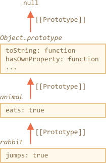

# Получение всех свойств

Существует множество способов получить пару ключ/значение из объекта.

Большинство из них производят операции над самим объектом, исключая его прототип, давайте их перечислим:

- [Object.keys(obj)](mdn:js/Object/keys) / [Object.values(obj)](mdn:js/Object/values) / [Object.entries(obj)](mdn:js/Object/entries) -- возвращают массив строк, содержащих собственные перечислимые имена/значения/пары ключ-значение свойств. Эти методы возвращают только *перечислимые* свойства, и те, у которых *ключи являются строками*.

Если нам нужны символьные свойства:

- [Object.getOwnPropertySymbols(obj)](mdn:js/Object/getOwnPropertySymbols) -- возвращает массив имён всех собственных символьных свойств.

Если нам нужны неперечислимые свойства:

- [Object.getOwnPropertyNames(obj)](mdn:js/Object/getOwnPropertyNames) -- возвращает массив имён всех собственных неперечислимых свойств.

Если нам нужны *все* свойства:

- [Reflect.ownKeys(obj)](mdn:js/Reflect/ownKeys) -- возвращает массив имён всех собственных свойств.

Эти методы отличаются лишь свойствами, которые они возвращают, но все они совершают операции над самим объектом. Свойства прототипа не перечисляются.

## Цикл for..in

Цикл `for..in` отличается: он перебирает, в том числе и наследуемые свойства.

Например:

```js run
let animal = {
  eats: true
};

let rabbit = {
  jumps: true,
  __proto__: animal
};

*!*
// только собственные ключи
alert(Object.keys(rabbit)); // jumps
*/!*

*!*
// включая наследуемые свойства
for(let prop in rabbit) alert(prop); // jumps, затем eats
*/!*
```

Если это не то, что нам нужно, и мы хотим исключить наследуемые свойства, то есть встроенный метод [obj.hasOwnProperty(key)](mdn:js/Object/hasOwnProperty): он возвращает `true`, если `obj` имеет собственное (не наследуемое) свойство с именем `key`.

Таким образом, мы можем отфильтровывать наследуемые свойства (или делать с ними что-то ещё):

```js run
let animal = {
  eats: true
};

let rabbit = {
  jumps: true,
  __proto__: animal
};

for(let prop in rabbit) {
  let isOwn = rabbit.hasOwnProperty(prop);
  alert(`${prop}: ${isOwn}`); // jumps: true, затем eats: false
}
```

Здесь мы имеем следующую цепочку наследования: `rabbit`, затем `animal`, затем `Object.prototype` (т.к. `animal` -- это литеральный объект `{...}`, его прототип устанавливается по умолчанию), и в завершение `null`:



Обратите внимание на один забавный момент. Откуда берётся метод `rabbit.hasOwnProperty`? Глядя на цепочку вызовов, мы можем видеть, что метод получен из `Object.prototype.hasOwnProperty`. Другими словами, он наследуется.

...Но почему `hasOwnProperty` не появляется в цикле `for..in`, если он перебирает все наследуемые свойства?  Ответ прост: оно неперечислимое. Как и все остальные свойства `Object.prototype`. Поэтому они и не выводятся.

## Итого

Большинство методов игнорируют наследуемые свойства, за исключением `for..in`.

Для последнего мы можем использовать [obj.hasOwnProperty(key)](mdn:js/Object/hasOwnProperty): он возвращает `true`, если `obj` имеет собственное (не наследуемое) свойство с именем `key`.
