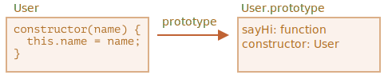

# Класс: базовый синтаксис

```quote author="Википедия"
В объектно-ориентированном программировании *класс* - это расширяемый шаблон кода для создания объектов, который устанавливает в них начальные значения (свойства) и реализацию поведения (методы).
```

На практике нам часто надо создавать много объектов одного вида, например пользователей, товары или что-то ещё.

Как мы уже знаем из главы <info:constructor-new>, с этим может помочь `new function`.

Но в современном JavaScript есть и более продвинутая конструкция "class", которая предоставляет новые возможности, полезные для объектно-ориентированного программирования.

## Синтаксис "class"

Базовый синтаксис выглядит так:
```js
class MyClass {
  // методы класса
  constructor() { ... }
  method1() { ... }
  method2() { ... }
  method3() { ... }
  ...
}
```

<<<<<<< HEAD
Затем используйте вызов `new MyClass()` для создания нового объекта со всеми перечисленными методами.
=======
Then use `new MyClass()` to create a new object with all the listed methods.
>>>>>>> 5cb9760abb8499bf1e99042d866c3c1db8cd61ca

При этом автоматически вызывается метод `constructor()`, в нём мы можем инициализировать объект.   

Например:

```js run
class User {

  constructor(name) {
    this.name = name;
  }

  sayHi() {
    alert(this.name);
  }

}

// Использование:
let user = new User("Иван");
user.sayHi();
```
Когда вызывается `new User("Иван")`:
1. Создаётся новый объект.
2. `constructor` запускается с заданным аргументом и сохраняет его в `this.name`.

...Затем можно вызывать на объекте методы, такие как `user.sayHi()`.

<<<<<<< HEAD
=======
...Then we can call object methods, such as `user.sayHi()`.
>>>>>>> 5cb9760abb8499bf1e99042d866c3c1db8cd61ca

```warn header="Методы в классе не разделяются запятой"
Частая ошибка начинающих разработчиков - ставить запятую между методами класса, что приводит к синтаксической ошибке.

Синтаксис классов отличается от литералов объектов, не путайте их. Внутри классов запятые не требуются.
```

## Что такое класс?

Итак, что же такое `class`?  Это не полностью новая языковая сущность, как может показаться на первый взгляд.

Давайте развеем всю магию и посмотрим, что такое класс на самом деле. Это поможет в понимании многих сложных аспектов.

В JavaScript класс - это разновидность функции.

Взгляните:

```js run
class User {
  constructor(name) { this.name = name; }
  sayHi() { alert(this.name); }
}

// доказательство: User - это функция
*!*
alert(typeof User); // function
*/!*
```

Вот что на самом деле делает конструкция `class User {...}`:

1. Создает функцию с именем `User`, которая становится результатом объявления класса. Код функции берётся из метода `constructor` (она будет пустой, если такого метода нет).
2. Сохраняет все методы, такие как `sayHi`, в `User.prototype`.

Метод, вызываемый на новых объектах `new User`, берётся из прототипа, прямо как описано в главе <info:function-prototype>. Таким образом, объект `new User` имеет доступ к методам класса.

На картинке показан результат объявления `class User`:



Можно посмотреть разные детали и при помощи кода:

```js run
class User {
  constructor(name) { this.name = name; }
  sayHi() { alert(this.name); }
}

// класс - это функция
alert(typeof User); // function

// ...или, если точнее, это метод constructor
alert(User === User.prototype.constructor); // true

// Методы находятся в User.prototype, например:
alert(User.prototype.sayHi); // alert(this.name);

// в прототипе ровно 2 метода
alert(Object.getOwnPropertyNames(User.prototype)); // constructor, sayHi
```

## Не просто синтаксический сахар

Иногда говорят, что `class` - это просто "синтаксический сахар" в JavaScript (синтаксис для улучшения читаемости кода, но не делающий ничего принципиально нового), потому что мы можем сделать всё то же самое без конструкции `class`:

```js run
// перепишем класс User на чистых функциях

// 1. Создаём функцию constructor
function User(name) {
  this.name = name;
}
// каждый прототип функции имеет свойство constructor по умолчанию,
// поэтому нам нет необходимости его создавать

// 2. Добавляем метод в прототип
User.prototype.sayHi = function() {
  alert(this.name);
};

// Использование:
let user = new User("Иван");
user.sayHi();
```
Результат этого кода очень похож. Поэтому, действительно, есть причины, по которым `class` можно считать синтаксическим сахаром для определения конструктора вместе с методами прототипа.

Однако есть важные отличия:

1. Во-первых, функция, созданная с помощью `class`, помечена специальным внутренним свойством `[[FunctionKind]]:"classConstructor"`. Поэтому это не совсем то же самое, что создавать её вручную.

    В отличие от обычных функций, конструктор класса не может быть вызван без `new`:

    ```js run
    class User {
      constructor() {}
    }

    alert(typeof User); // function
    User(); // Error: Class constructor User cannot be invoked without 'new'
    ```
    Кроме того, строковое представление конструктора класса в большинстве движков JavaScript начинается с "class ..."

    ```js run
    class User {
      constructor() {}
    }

    alert(User); // class User { ... }
    ```

2. Методы класса являются неперечислимыми.
    Определение класса устанавливает флаг `enumerable` в` false` для всех методов в `"prototype"`.

    И это хорошо, так как если мы проходимся циклом `for..in` по объекту, то обычно мы не хотим при этом получать методы класса.

3. Классы всегда используют `use strict`.
    Весь код внутри класса автоматически находится в строгом режиме.

Также в дополнение к основному, описанному выше, функционалу, синтаксис `class` даёт ряд других интересных возможностей, с которыми мы познакомимся чуть позже.

## Class Expression

Как и функции, классы можно определять внутри другого выражения, передавать, возвращать, присваивать и т.д.

Пример Class Expression (по аналогии с Function Expression):

```js
let User = class {
  sayHi() {
    alert("Привет");
  }
};
```

<<<<<<< HEAD
Как и Named Function Expressions, классы-выражения могут иметь имя.
=======
Similar to Named Function Expressions, class expressions may have a name.
>>>>>>> 5cb9760abb8499bf1e99042d866c3c1db8cd61ca

Если у Class Expression есть имя, то оно видно только внутри класса:

```js run
// "Named Class Expression"
// (в спецификации нет такого термина, но происходящее похоже на Named Function Expression)
let User = class *!*MyClass*/!* {
  sayHi() {
<<<<<<< HEAD
    alert(MyClass); // имя MyClass видно только внутри класса
=======
    alert(MyClass); // MyClass name is visible only inside the class
>>>>>>> 5cb9760abb8499bf1e99042d866c3c1db8cd61ca
  }
};

new User().sayHi(); // работает, выводит определение MyClass

<<<<<<< HEAD
alert(MyClass); // ошибка, имя MyClass не видно за пределами класса
=======
alert(MyClass); // error, MyClass name isn't visible outside of the class
>>>>>>> 5cb9760abb8499bf1e99042d866c3c1db8cd61ca
```

Мы даже можем динамически создавать классы "по запросу":

```js run
function makeClass(phrase) {
  // объявляем класс и возвращаем его
  return class {
    sayHi() {
      alert(phrase);
    };
  };
}

// Создаём новый класс
let User = makeClass("Привет");

new User().sayHi(); // Привет
```


## Геттеры/сеттеры, другие сокращения

Как и в литеральных объектах, в классах можно объявлять генераторы, вычисляемые свойства, геттеры/сеттеры и т.д.

Вот пример `user.name`, реализованного с использованием `get/set`:

```js run
class User {

  constructor(name) {
    // вызывает сеттер
    this.name = name;
  }

*!*
  get name() {
*/!*
    return this._name;
  }

*!*
  set name(value) {
*/!*
    if (value.length < 4) {
      alert("Имя слишком короткое.");
      return;
    }
    this._name = value;
  }

}

let user = new User("Иван");
alert(user.name); // Иван

user = new User(""); // Имя слишком короткое.
```

При объявлении класса геттеры/сеттеры создаются на `User.prototype`, вот так:

```js
Object.defineProperties(User.prototype, {
  name: {
    get() {
      return this._name
    },
    set(name) {
      // ...
    }
  }
});
```

<<<<<<< HEAD
Пример с вычисляемым свойством в скобках `[...]`:
=======
Here's an example with a computed property in brackets `[...]`:
>>>>>>> 5cb9760abb8499bf1e99042d866c3c1db8cd61ca

```js run
class User {

<<<<<<< HEAD
  ['say' + 'Hi']() {
    alert("Привет");
=======
*!*
  ['say' + 'Hi']() {
*/!*
    alert("Hello");
>>>>>>> 5cb9760abb8499bf1e99042d866c3c1db8cd61ca
  }

}

new User().sayHi();
```

Для методов-генераторов добавьте перед именем `*`.

## Свойства классов

```warn header="Старым браузерам может понадобиться полифил"
Свойства классов добавлены в язык недавно.
```
В приведённом выше примере у класса `User` были только методы. Давайте добавим свойство:

```js run
class User {
*!*
<<<<<<< HEAD
  name = "Аноним";
=======
  name = "Anonymous";
>>>>>>> 5cb9760abb8499bf1e99042d866c3c1db8cd61ca
*/!*

  sayHi() {
    alert(`Привет, ${this.name}!`);
  }
}

new User().sayHi();
```

<<<<<<< HEAD
Свойство `name` не устанавливается в `User.prototype`. Вместо этого оно создаётся оператором `new` перед запуском конструктора, это именно свойство объекта.

## Итого
=======
The property `name` is not placed into `User.prototype`. Instead, it is created by `new` before calling constructor, it's the property of the object itself.
>>>>>>> 5cb9760abb8499bf1e99042d866c3c1db8cd61ca

Базовый синтаксис для классов выглядит так:

```js
class MyClass {
<<<<<<< HEAD
  prop = value; // свойство
  constructor(...) { // конструктор
    // ...
  }
  method(...) {} // метод
  get something(...) {} // геттер
  set something(...) {} // сеттер
  [Symbol.iterator]() {} // метод с вычисляемым именем (здесь - символом)
=======
  prop = value; // property

  constructor(...) { // constructor
    // ...
  }

  method(...) {} // method

  get something(...) {} // getter method
  set something(...) {} // setter method

  [Symbol.iterator]() {} // method with computed name (symbol here)
>>>>>>> 5cb9760abb8499bf1e99042d866c3c1db8cd61ca
  // ...
}
```

`MyClass` технически является функцией (той, которую мы определяем как `constructor`), в то время как методы, геттеры и сеттеры записываются в `MyClass.prototype`.

В следующих главах мы узнаем больше о классах, включая наследование и другие возможности.
