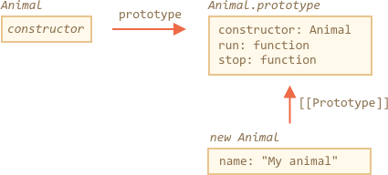
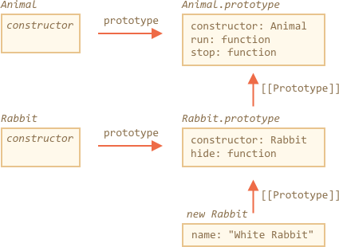

# Наследование классов

Допустим, у нас есть два класса.

`Animal`:

```js
class Animal {
  constructor(name) {
    this.speed = 0;
    this.name = name;
  }
  run(speed) {
    this.speed += speed;
    alert(`${this.name} runs with speed ${this.speed}.`);
  }
  stop() {
    this.speed = 0;
    alert(`${this.name} stopped.`);
  }
}

let animal = new Animal("My animal");
```




...И `Rabbit`:

```js
class Rabbit {
  constructor(name) {
    this.name = name;
  }
  hide() {
    alert(`${this.name} hides!`);
  }
}

let rabbit = new Rabbit("My rabbit");
```


Сейчас они полностью независимы.

Но мы хотим, чтобы `Rabbit` расширял `Animal`. Другими словами, кролики должны происходить от животных, т.е. иметь доступ к методам `Animal` и расширять функциональность `Animal` своими методами.

Для того, чтобы наследовать класс от другого, мы должны использовать ключевое слово `"extends"` и указать название родительского класса перед `{..}`.

Ниже `Rabbit` наследует от `Animal`:

```js run
class Animal {
  constructor(name) {
    this.speed = 0;
    this.name = name;
  }
  run(speed) {
    this.speed += speed;
    alert(`${this.name} runs with speed ${this.speed}.`);
  }
  stop() {
    this.speed = 0;
    alert(`${this.name} stopped.`);
  }
}

// Наследуемся от Animal указывая "extends Animal"
*!*
class Rabbit extends Animal {
*/!*
  hide() {
    alert(`${this.name} hides!`);
  }
}

let rabbit = new Rabbit("White Rabbit");

rabbit.run(5); // White Rabbit runs with speed 5.
rabbit.hide(); // White Rabbit hides!
```
Теперь код `Rabbit` стал короче, так как используется конструктор класса `Animal` по умолчанию и кролик может использовать метод `run` как и все животные.

На самом деле ключевое слово `extends` добавляет ссылку на `[[Prototype]]` из `Rabbit.prototype` в `Animal.prototype`:



Если метод не найден в `Rabbit.prototype`, JavaScript возьмет его из `Animal.prototype`.

Как мы помним из главы <info:native-prototypes>, в JavaScript используется одно и то же наследование на прототипах для встроенных объектов. Например `Date.prototype.[[Prototype]]` это `Object.prototype`, поэтому у дат есть универсальные методы объекта.

````smart header="После `extends` разрешены любые выражения"
Синтаксис создания класса допускает указывать после `extends` не только класс, но любое выражение. 


Пример вызова функции, которая генерирует родительский класс:

```js run
function f(phrase) {
  return class {
    sayHi() { alert(phrase) }
  }
}

*!*
class User extends f("Привет") {}
*/!*

new User().sayHi(); // Привет
```
Здесь `class User` наследуется от результата вызова `f("Привет")`.

Это может быть полезно для петтернов программирования, где мы можем использовать функции для генерации классов в зависимости от многих условий и затем наследовать их.
````

## Переопределение методов

Двигаемся дальше и переопределим метод. Сейчас `Rabbit` наследует от `Animal` метод `stop`, который устанавливает `this.speed = 0`.

Мы определим свой метод `stop` в классе `Rabbit`, который будет использоваться взамен родительского:

```js
class Rabbit extends Animal {
  stop() {
    // ...будет использован для rabbit.stop()
  }
}
```

...Но обычно мы не хотим полностью заменить родительский метод, а скорее хотим сделать новый на его основе, изменяя или расширяя его функциональность. Мы делаем что-то в нашем методе и вызываем родительский метод до/после или в процессе выполнения.

У классов есть ключевое слово `"super"` для таких случаев.
- `super.method(...)` вызывает родительский метод.
- `super(...)` вызывает родительский конструктор (работает только внутри нашего конструктора).

Пусть наш кролик автоматически прячется при остановке:

```js run
class Animal {

  constructor(name) {
    this.speed = 0;
    this.name = name;
  }

  run(speed) {
    this.speed += speed;
    alert(`${this.name} runs with speed ${this.speed}.`);
  }

  stop() {
    this.speed = 0;
    alert(`${this.name} stopped.`);
  }

}

class Rabbit extends Animal {
  hide() {
    alert(`${this.name} hides!`);
  }

*!*
  stop() {
    super.stop(); // вызываем родительский метод stop
    this.hide(); // и затем hide
  }
*/!*
}

let rabbit = new Rabbit("White Rabbit");

rabbit.run(5); // White Rabbit runs with speed 5.
rabbit.stop(); // White Rabbit stopped. White rabbit hides!
```

Теперь у класса `Rabbit` есть метод `stop`, который вызывает родительский `super.stop()` в процессе выполнения.

````smart header="У стрелочных функций нет `super`"
Как упоминалось в главе <info:arrow-functions>, стрелочные функции не имеют `super`.

При обращении к `super` стрелочной функции он берется из внешней функции:
```js
class Rabbit extends Animal {
  stop() {
    setTimeout(() => super.stop(), 1000); // вызывает родительский stop после 1 секунды
  }
}
```

В примере `super` в стрелочной функции тот же самый что и в  `stop()`, поэтому метод отрабатывает как и ожидается. Если бы мы указали здесь "обычную" функцию, была бы ошибка:

```js
// Unexpected super
setTimeout(function() { super.stop() }, 1000);
```
````

## Переопределение конструктора

С конструкторами немного сложнее.

До сих пор у `Rabbit` не было своего конструктора.

Согласно [спецификации](https://tc39.github.io/ecma262/#sec-runtime-semantics-classdefinitionevaluation), если класс расширяет другой класс и не имеет конструктора, то конструктор создается автоматически:

```js
class Rabbit extends Animal {
  // генерируется для классов-потомков, у которых нет своего конструктора
*!*
  constructor(...args) {
    super(...args);
  }
*/!*
}
```

Как мы видим, он просто вызывает конструктор родительского класса. Так будет происходить, пока мы не создадим собственный конструктор.

Давайте добавим конструктор для `Rabbit`. Он будет устанавливать `earLength` в дополнение к `name`:

```js run
class Animal {
  constructor(name) {
    this.speed = 0;
    this.name = name;
  }
  // ...
}

class Rabbit extends Animal {

*!*
  constructor(name, earLength) {
    this.speed = 0;
    this.name = name;
    this.earLength = earLength;
  }
*/!*

  // ...
}

*!*
// Не работает!
let rabbit = new Rabbit("White Rabbit", 10); // Error: this is not defined.
*/!*
```

Упс! При создании кролика - ошибка! Что не так?

Коротко: конструктор в классах-потомках должен вызывать `super(...)` и (!) делать это перед использованием `this`.

...Но почему? Что происходит? Это требование кажется довольно странным.

Конечно, всему есть объяснение. Давайте углубимся в детали, чтобы вы действительно поняли, что происходит.

В JavaScript существует различие между "функцией конструктора наследующего класса" и всеми остальными. В наследующем классе соответствующая функция-конструктор помечена специальным внутренним свойством `[[ConstructorKind]]:"derived"`.

Разница в следующем:

- Когда выполняется обычный конструктор, он создает пустой объект и продолжает работать с ним как с `this` .
- Когда запускается конструктор унаследованного класса, он этого не делает. Вместо этого он ждет, что это сделает конструктор родительского класса.

Поэтому, если мы создаем собственный конструктор, мы должны вызвать `super`, потому что в противном случае объект со ссылкой на `this` не будет создан и мы получим ошибку.

Для `Rabbit` мы должны вызвать `super()` до того, как используем `this`, чтобы не было ошибки:

```js run
class Animal {

  constructor(name) {
    this.speed = 0;
    this.name = name;
  }

  // ...
}

class Rabbit extends Animal {

  constructor(name, earLength) {
*!*
    super(name);
*/!*
    this.earLength = earLength;
  }

  // ...
}

*!*
// теперь работает
let rabbit = new Rabbit("White Rabbit", 10);
alert(rabbit.name); // White Rabbit
alert(rabbit.earLength); // 10
*/!*
```

## Устройство super, [[HomeObject]]

Давайте немного углубимся в `super`. Здесь есть некоторые интересные моменты.

Вообще, из всего что мы узнали до этого момента, `super` не может работать. 

Действительно, давайте спросим себя, как это технически может работать? Когда метод объекта выполняется, он получает текущий объект как `this`. Если мы вызываем `super.method()`, то как получить `method`? Естественно, нам нужно взять `method` из прототипа текущего объекта. Но как мы (или движок JavaScript) можем это сделать?

Может, нам удастся получить метод из `[[Prototype]]` в `this`, используя что-то вроде `this.__proto__.method`? К сожалению, это не сработает.

Давайте попробуем это сделать. Без классов, используя простые объекты для наглядности.

Метод `rabbit.eat()` должен вызывать метод `animal.eat()` родительского класса:
```js run
let animal = {
  name: "Animal",
  eat() {
    alert(`${this.name} eats.`);
  }
};

let rabbit = {
  __proto__: animal,
  name: "Rabbit",
  eat() {
*!*
    // вот как предположительно может работать super.eat()
    this.__proto__.eat.call(this); // (*)
*/!*
  }
};

rabbit.eat(); // Rabbit eats.
```

В строке `(*)` мы берем `eat` из прототипа (`animal`) и вызываем его в контексте текущего объекта. Обратите внимание, что `.call(this)` здесь неспроста: простой вызов `this.__proto__.eat()` будет выполнять родительский `eat` в контексте прототипа, а не текущего объекта.

Приведенный выше код работает так, как задумано: выполняется нужный `alert`.

Теперь давайте добавим еще один объект в цепочку наследования и посмотрим, как все сломается: 

```js run
let animal = {
  name: "Animal",
  eat() {
    alert(`${this.name} eats.`);
  }
};

let rabbit = {
  __proto__: animal,
  eat() {
    // ...делаем что-то специфичное для кролика и вызываем родительский (animal) метод
    this.__proto__.eat.call(this); // (*)
  }
};

let longEar = {
  __proto__: rabbit,
  eat() {
    // ...делаем что-то, связанное с длинными ушами и вызываем родительский (rabbit) метод
    this.__proto__.eat.call(this); // (**)
  }
};

*!*
longEar.eat(); // Error: Maximum call stack size exceeded
*/!*
```

Теперь код не работает! Ошибка возникает при попытке вызова `longEar.eat()`.

На первый взгляд все не так очевидно, но если мы проследим вызов `longEar.eat()`, то сможем понять причину ошибки. В обеих строках `(*)` и `(**)` значение `this` - это текущий объект (`longEar`). Это важно: для всех методов объекта `this` указывает на текущий объект, а не на прототип или что-то еще.

Итак, в обеих линиях `(*)` и `(**)` значение `this.__proto__` одно и то же: `rabbit`. В обоих случаях метод `rabbit.eat` вызывается в бесконечном цикле не поднимаясь по цепочке вызовов.

Картина того, что происходит:


1. Внутри `longEar.eat()` строка `(**)` вызывает `rabbit.eat` со значением `this=longEar`.
    ```js
    // внутри longEar.eat() у нас this = longEar
    this.__proto__.eat.call(this) // (**)
    // становится
    longEar.__proto__.eat.call(this)
    // то же что и
    rabbit.eat.call(this);
    ```
2. В строке `(*)` в `rabbit.eat` мы хотим передать вызов выше по цепочке, но `this=longEar`, поэтому `this.__proto__.eat` снова равен `rabbit.eat`! 

    ```js
    // внутри rabbit.eat() у нас также this = longEar
    this.__proto__.eat.call(this) // (*)
    // становится
    longEar.__proto__.eat.call(this)
    // или (снова)
    rabbit.eat.call(this);
    ```

3. ... `rabbit.eat` вызывает себя в бесконечном цикле, потому что не может подняться дальше по цепочке.

Проблема не может быть решена с помощью одного только `this`.

### `[[HomeObject]]`

Для решения этой проблемы в JavaScript было добавлено специальное внутреннее свойство для функций: `[[HomeObject]]`.

**Когда функция объявлена как метод внутри класса или объекта, ее свойство `[[HomeObject]]` становится равно этому объекту.**

Это фактически нарушает идею «несвязанных» функций, потому что методы помнят свои объекты. `[[HomeObject]]` нельзя изменить, поэтому эта связь навсегда. Это очень важное изменение в языке.

Но это изменение спасает. `[[HomeObject]]` используется только для вызова родительских методов в `super` чтобы разрешить прототип. Так что это не нарушает совместимость

Давайте посмотрим, как это работает для `super` - опять же, используя простые объекты:

```js run
let animal = {
  name: "Animal",
  eat() {         // [[HomeObject]] == animal
    alert(`${this.name} eats.`);
  }
};

let rabbit = {
  __proto__: animal,
  name: "Rabbit",
  eat() {         // [[HomeObject]] == rabbit
    super.eat();
  }
};

let longEar = {
  __proto__: rabbit,
  name: "Long Ear",
  eat() {         // [[HomeObject]] == longEar
    super.eat();
  }
};

*!*
longEar.eat();  // Long Ear eats.
*/!*
```

Каждый метод запоминает его объект во внутреннем свойстве `[[HomeObject]]`. Затем `super` использует его для разрешения родительского прототипа.

`[[HomeObject]]` определен для методов в классах и простых объектах. Но для объектов методы должны быть определены именно как `method()`, а не как  `"method: function()"`.

В приведенном ниже примере метод определен через двоеточие и ключевое слово `function`. Свойство `[[HomeObject]]` не установлено и поэтому наследование не работает:

```js run
let animal = {
  eat: function() { // должен быть короткий синтаксис: eat() {...}
    // ...
  }
};

let rabbit = {
  __proto__: animal,
  eat: function() {
    super.eat();
  }
};

*!*
rabbit.eat();  // Ошибка вызова super (потому что нет [[HomeObject]])
*/!*
```
