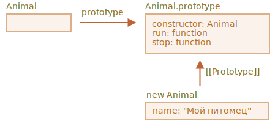
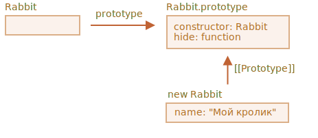

# Наследование классов

Допустим, у нас есть два класса.

`Animal`:

```js
class Animal {
  constructor(name) {
    this.speed = 0;
    this.name = name;
  }
  run(speed) {
    this.speed = speed;
    alert(`${this.name} бежит со скоростью ${this.speed}.`);
  }
  stop() {
    this.speed = 0;
    alert(`${this.name} стоит.`);
  }
}

let animal = new Animal("Мой питомец");
```



...И `Rabbit`:

```js
class Rabbit {
  constructor(name) {
    this.name = name;
  }
  hide() {
    alert(`${this.name} прячется!`);
  }
}

let rabbit = new Rabbit("Мой кролик");
```



Сейчас они полностью независимы.

Но мы хотим, чтобы `Rabbit` расширял `Animal`. Другими словами, кролики должны происходить от животных, т.е. иметь доступ к методам `Animal` и расширять функциональность `Animal` своими методами.

Для того, чтобы наследовать класс от другого, мы должны использовать ключевое слово `"extends"` и указать название родительского класса перед `{..}`.

Ниже `Rabbit` наследует от `Animal`:

```js run
class Animal {
  constructor(name) {
    this.speed = 0;
    this.name = name;
  }
  run(speed) {
    this.speed = speed;
    alert(`${this.name} бежит со скоростью ${this.speed}.`);
  }
  stop() {
    this.speed = 0;
    alert(`${this.name} стоит.`);
  }
}

// Наследуем от Animal указывая "extends Animal"
*!*
class Rabbit extends Animal {
*/!*
  hide() {
    alert(`${this.name} прячется!`);
  }
}

let rabbit = new Rabbit("Белый кролик");

rabbit.run(5); // Белый кролик бежит со скоростью 5.
rabbit.hide(); // Белый кролик прячется!
```
Теперь код `Rabbit` стал короче, так как используется конструктор класса `Animal` по умолчанию и кролик может использовать метод `run` как и все животные.

Ключевое слово `extends` работает, используя прототипы. Оно устанавливает  `Rabbit.prototype.[[Prototype]]` в `Animal.prototype`. Так что если метод не найден в  `Rabbit.prototype`, JavaScript берёт его из `Animal.prototype`.


Если метод не найден в `Rabbit.prototype`, JavaScript возьмёт его из `Animal.prototype`.

Как мы помним из главы <info:native-prototypes>, в JavaScript используется наследование на прототипах для встроенных объектов. Например `Date.prototype.[[Prototype]]` это `Object.prototype`, поэтому у дат есть универсальные методы объекта.

````smart header="После `extends` разрешены любые выражения"
Синтаксис создания класса допускает указывать после `extends` не только класс, но любое выражение.

Пример вызова функции, которая генерирует родительский класс:

```js run
function f(phrase) {
  return class {
    sayHi() { alert(phrase) }
  }
}

*!*
class User extends f("Привет") {}
*/!*

new User().sayHi(); // Привет
```
Здесь `class User` наследует от результата вызова `f("Привет")`.

Это может быть полезно для продвинутых приёмов проектирования, где мы можем использовать функции для генерации классов в зависимости от многих условий и затем наследовать их.
````

## Переопределение методов

Давайте пойдём дальше и переопределим метод. Сейчас `Rabbit` наследует от `Animal` метод `stop`, который устанавливает `this.speed = 0`.

Если мы определим свой метод `stop` в классе `Rabbit`, то он будет использоваться взамен родительского:

```js
class Rabbit extends Animal {
  stop() {
    // ...будет использован для rabbit.stop()
  }
}
```

...Впрочем, обычно мы не хотим полностью заменить родительский метод, а скорее хотим сделать новый на его основе, изменяя или расширяя его функциональность. Мы делаем что-то в нашем методе и вызываем родительский метод до/после или в процессе.

У классов есть ключевое слово `"super"` для таких случаев.
- `super.method(...)` вызывает родительский метод.
- `super(...)` вызывает родительский конструктор (работает только внутри нашего конструктора).

Пусть наш кролик автоматически прячется при остановке:

```js run
class Animal {

  constructor(name) {
    this.speed = 0;
    this.name = name;
  }

  run(speed) {
    this.speed = speed;
    alert(`${this.name} бежит со скоростью ${this.speed}.`);
  }

  stop() {
    this.speed = 0;
    alert(`${this.name} стоит.`);
  }

}

class Rabbit extends Animal {
  hide() {
    alert(`${this.name} прячется!`);
  }

*!*
  stop() {
    super.stop(); // вызываем родительский метод stop
    this.hide(); // и затем hide
  }
*/!*
}

let rabbit = new Rabbit("Белый кролик");

rabbit.run(5); // Белый кролик бежит со скоростью 5.
rabbit.stop(); // Белый кролик стоит. Белый кролик прячется!
```

Теперь у класса `Rabbit` есть метод `stop`, который вызывает родительский `super.stop()` в процессе выполнения.

````smart header="У стрелочных функций нет `super`"
Как упоминалось в главе <info:arrow-functions>, стрелочные функции не имеют `super`.

При обращении к `super` стрелочной функции он берётся из внешней функции:
```js
class Rabbit extends Animal {
  stop() {
    setTimeout(() => super.stop(), 1000); // вызывает родительский stop после 1 секунды
  }
}
```

В примере `super` в стрелочной функции тот же самый, что и в  `stop()`, поэтому метод отрабатывает как и ожидается. Если бы мы указали здесь "обычную" функцию, была бы ошибка:

```js
// Unexpected super
setTimeout(function() { super.stop() }, 1000);
```
````

## Переопределение конструктора

С конструкторами немного сложнее.

До сих пор у `Rabbit` не было своего конструктора.

Согласно [спецификации](https://tc39.github.io/ecma262/#sec-runtime-semantics-classdefinitionevaluation), если класс расширяет другой класс и не имеет конструктора, то автоматически создаётся такой "пустой" конструктор:

```js
class Rabbit extends Animal {
  // генерируется для классов-потомков, у которых нет своего конструктора
*!*
  constructor(...args) {
    super(...args);
  }
*/!*
}
```

Как мы видим, он просто вызывает конструктор родительского класса. Так будет происходить, пока мы не создадим собственный конструктор.

Давайте добавим конструктор для `Rabbit`. Он будет устанавливать `earLength` в дополнение к `name`:

```js run
class Animal {
  constructor(name) {
    this.speed = 0;
    this.name = name;
  }
  // ...
}

class Rabbit extends Animal {

*!*
  constructor(name, earLength) {
    this.speed = 0;
    this.name = name;
    this.earLength = earLength;
  }
*/!*

  // ...
}

*!*
// Не работает!
let rabbit = new Rabbit("Белый кролик", 10); // Error: this is not defined.
*/!*
```

Упс! При создании кролика - ошибка! Что не так?

Если коротко, то в классах-потомках конструктор обязан вызывать `super(...)`, и (!) делать это перед использованием `this`.

...Но почему? Что происходит? Это требование кажется довольно странным.

Конечно, всему есть объяснение. Давайте углубимся в детали, чтобы вы действительно поняли, что происходит.

В JavaScript существует различие между "функцией-конструктором наследующего класса" и всеми остальными. В наследующем классе соответствующая функция-конструктор помечена специальным внутренним свойством `[[ConstructorKind]]:"derived"`.

Разница в следующем:

- Когда выполняется обычный конструктор, он создаёт пустой объект и присваивает его `this` .
- Когда запускается конструктор унаследованного класса, он этого не делает. Вместо этого он ждёт, что это сделает конструктор родительского класса.

Поэтому, если мы создаём собственный конструктор, мы должны вызвать `super`, в противном случае объект для `this` не будет создан, и мы получим ошибку.

Чтобы конструктор `Rabbit` работал, он должен вызвать `super()` до того, как использовать `this`, чтобы не было ошибки:

```js run
class Animal {

  constructor(name) {
    this.speed = 0;
    this.name = name;
  }

  // ...
}

class Rabbit extends Animal {

  constructor(name, earLength) {
*!*
    super(name);
*/!*
    this.earLength = earLength;
  }

  // ...
}

*!*
// теперь работает
let rabbit = new Rabbit("Белый кролик", 10);
alert(rabbit.name); // Белый кролик
alert(rabbit.earLength); // 10
*/!*
```

## Устройство super, [[HomeObject]]

```warn header="Продвинутая информация"
Если вы читаете учебник первый раз - эту секцию можно пропустить.

Она рассказывает о внутреннем устройстве наследования и вызов `super`.
```

Давайте заглянем "под капот" `super`. Здесь есть некоторые интересные моменты.

Вообще, исходя из наших знаний до этого момента, `super` вообще не может работать!

Ну правда, давайте спросим себя - как он должен работать, чисто технически? Когда метод объекта выполняется, он получает текущий объект как `this`. Если мы вызываем `super.method()`, то движку необходимо получить `method` из прототипа текущего объекта. И как ему это сделать?

Задача может показаться простой, но это не так. Движок знает текущий `this` и мог бы попытаться получить родительский метод как `this.__proto__.method`. Однако, увы, такой "наивный" путь не работает.

Продемонстрируем проблему. Без классов, используя простые объекты для наглядности.

Вы можете пропустить эту часть и перейти ниже к подсекции `[[HomeObject]]`, если не хотите знать детали. Вреда не будет. Или читайте далее, если хотите разобраться.

В примере ниже `rabbit.__proto__ = animal`. Попробуем в `rabbit.eat()` вызвать `animal.eat()`, используя `this.__proto__`:
```js run
let animal = {
  name: "Animal",
  eat() {
    alert(`${this.name} ест.`);
  }
};

let rabbit = {
  __proto__: animal,
  name: "Кролик",
  eat() {
*!*
    // вот как предположительно может работать super.eat()
    this.__proto__.eat.call(this); // (*)
*/!*
  }
};

rabbit.eat(); // Кролик ест.
```

В строке `(*)` мы берём `eat` из прототипа (`animal`) и вызываем его в контексте текущего объекта. Обратите внимание, что `.call(this)` здесь неспроста: простой вызов `this.__proto__.eat()` будет выполнять родительский `eat` в контексте прототипа, а не текущего объекта.

Приведённый выше код работает так, как задумано: выполняется нужный `alert`.

Теперь давайте добавим ещё один объект в цепочку наследования и увидим, как все сломается:

```js run
let animal = {
  name: "Животное",
  eat() {
    alert(`${this.name} ест.`);
  }
};

let rabbit = {
  __proto__: animal,
  eat() {
    // ...делаем что-то специфичное для кролика и вызываем родительский (animal) метод
    this.__proto__.eat.call(this); // (*)
  }
};

let longEar = {
  __proto__: rabbit,
  eat() {
    // ...делаем что-то, связанное с длинными ушами и вызываем родительский (rabbit) метод
    this.__proto__.eat.call(this); // (**)
  }
};

*!*
longEar.eat(); // Error: Maximum call stack size exceeded
*/!*
```

Теперь код не работает! Ошибка возникает при попытке вызова `longEar.eat()`.

На первый взгляд все не так очевидно, но если мы проследим вызов `longEar.eat()`, то сможем понять причину ошибки. В обеих строках `(*)` и `(**)` значение `this` - это текущий объект (`longEar`). Это важно: для всех методов объекта `this` указывает на текущий объект, а не на прототип или что-то ещё.

Итак, в обеих линиях `(*)` и `(**)` значение `this.__proto__` одно и то же: `rabbit`. В обоих случаях метод `rabbit.eat` вызывается в бесконечном цикле не поднимаясь по цепочке вызовов.

Картина того, что происходит:


1. Внутри `longEar.eat()` строка `(**)` вызывает `rabbit.eat` со значением `this=longEar`.
    ```js
    // внутри longEar.eat() у нас this = longEar
    this.__proto__.eat.call(this) // (**)
    // становится
    longEar.__proto__.eat.call(this)
    // то же что и
    rabbit.eat.call(this);
    ```
2. В строке `(*)` в `rabbit.eat` мы хотим передать вызов выше по цепочке, но `this=longEar`, поэтому `this.__proto__.eat` снова равен `rabbit.eat`!

    ```js
    // внутри rabbit.eat() у нас также this = longEar
    this.__proto__.eat.call(this) // (*)
    // становится
    longEar.__proto__.eat.call(this)
    // или (снова)
    rabbit.eat.call(this);
    ```

3. ...`rabbit.eat` вызывает себя в бесконечном цикле, потому что не может подняться дальше по цепочке.

Проблема не может быть решена с помощью одного только `this`.

### `[[HomeObject]]`

Для решения этой проблемы в JavaScript было добавлено специальное внутреннее свойство для функций: `[[HomeObject]]`.

Когда функция объявлена как метод внутри класса или объекта, её свойство `[[HomeObject]]` становится равно этому объекту.

Затем `super` использует его, чтобы получить прототип родителя и его методы.

Давайте посмотрим, как это работает - опять же, используя простые объекты:


```js run
let animal = {
  name: "Животное",
  eat() {         // animal.eat.[[HomeObject]] == animal
    alert(`${this.name} ест.`);
  }
};

let rabbit = {
  __proto__: animal,
  name: "Кролик",
  eat() {         // rabbit.eat.[[HomeObject]] == rabbit
    super.eat();
  }
};

let longEar = {
  __proto__: rabbit,
  name: "Длинноух",
  eat() {         // longEar.eat.[[HomeObject]] == longEar
    super.eat();
  }
};

*!*
// работает верно
longEar.eat();  // Длинноух ест.
*/!*
```

Это работает как задумано благодаря `[[HomeObject]]`. Метод, такой как `longEar.eat`, знает свой `[[HomeObject]]` и получает метод родителя из его прототипа. Вообще без использования `this`.

### Методы не "свободны"

До этого мы неоднократно видели, что функции в JavaScript "свободны", не привязаны к объектам. Их можно копировать между объектами и вызывать с любым `this`.

Но само существование `[[HomeObject]]` нарушает этот принцип, так как методы запоминают свои объекты. `[[HomeObject]]` нельзя изменить, эта связь - навсегда.

Единственное место в языке, где используется `[[HomeObject]]` - это `super`. Поэтому если метод не использует `super`, то мы все ещё можем считать его свободным и копировать между объектами. А вот если `super` в коде есть, то возможны побочные эффекты.

Вот пример неверного результата `super` после копирования:

```js run
let animal = {
  sayHi() {
    console.log("Я животное");
  }
};

// rabbit наследует от animal
let rabbit = {
  __proto__: animal,
  sayHi() {
    super.sayHi();
  }
};

let plant = {
  sayHi() {
    console.log("Я растение");
  }
};

// tree наследует от plant
let tree = {
  __proto__: plant,
*!*
  sayHi: rabbit.sayHi // (*)
*/!*
};

*!*
tree.sayHi();  // Я животное (?!?)
*/!*
```

Вызов `tree.sayHi()` показывает "Я животное". Определённо неверно.

Причина проста:
- В строке `(*)`, метод `tree.sayHi` скопирован из `rabbit`. Возможно, мы хотели избежать дублирования кода?
- Его `[[HomeObject]]` - это `rabbit`, ведь он был создан в `rabbit`. Свойство `[[HomeObject]]` никогда не меняется.
- В коде `tree.sayHi()` есть вызов `super.sayHi()`. Он идёт вверх от `rabbit` и берёт метод из `animal`.

Вот диаграмма происходящего:


### Методы, а не свойства-функции

Свойство `[[HomeObject]]` определено для методов как классов, так и обычных объектов. Но для объектов методы должны быть объявлены именно как `method()`, а не `"method: function()"`.

Для нас различий нет, но они есть для JavaScript.

В приведённом ниже примере используется синтаксис не метода, свойства-функции. Поэтому у него нет `[[HomeObject]]`, и наследование не работает:

```js run
let animal = {
  eat: function() { // намеренно пишем так, а не eat() { ...
    // ...
  }
};

let rabbit = {
  __proto__: animal,
  eat: function() {
    super.eat();
  }
};

*!*
rabbit.eat();  // Ошибка вызова super (потому что нет [[HomeObject]])
*/!*
```


## Итого

1. Чтобы унаследовать от класса: `class Child extends Parent`:
    - При этом `Child.prototype.__proto__` будет равен `Parent.prototype`, так что методы будут унаследованы.
2. При переопределении конструктора:
    - Обязателен вызов конструктора родителя `super()` в конструкторе `Child` до обращения к `this`.
3. При переопределении другого метода:
    - Мы можем вызвать `super.method()` в методе `Child` для обращения к методу родителя `Parent`.
4. Внутренние детали:
    - Методы запоминают свой объект во внутреннем свойстве `[[HomeObject]]`. Благодаря этому работает `super`, он в его прототипе ищет родительские методы.
    - Поэтому копировать метод, использующий `super`, между разными объектами небезопасно.

Также:
- У функций-стрелок нет своего `this` и `super`, поэтому они "прозрачно" встраиваются во внешний контекст.
