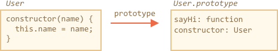

# Классы

Конструкция "class" позволяет определять  классы на основе прототипов через чистый и более приятный синтаксис. Она также добавляет новые возможности, полезные для объектно ориентированного программирования.

## Синтаксис "class"

Синтаксис `class` универсален, поэтому начнем с простого примера.

Класс на основе прототипов `User`:

```js run
function User(name) {
  this.name = name;
}

User.prototype.sayHi = function() {
  alert(this.name);
}

let user = new User("Ваня");
user.sayHi();
```

...А это тот же класс, определенный с помощью `class`:

```js run
class User {

  constructor(name) {
    this.name = name;
  }

  sayHi() {
    alert(this.name);
  }

}

let user = new User("Ваня");
user.sayHi();
```
Несложно заметить, что оба эти примера похожи. Обратите внимание, что методы в классе не разделяются точкой с запятой. Частая ошибка начинающих разработчиков - ставить запятую между методами класса, что приводит к синтаксической ошибке. Не перепутайте определение класса с созданием объекта. Благодаря синтаксическому сахару, запятые в классе не нужны.

## Что такое класс?

Итак, что же такое `class`? Нам может казаться, что это новая сущность на уровне языка, но это не так. 

В JavaScript класс - это своего рода функция.

Конструкция `class User {...}` создает функцию с таким же именем и помещает методы в `User.prototype`. Так что структура схожа.

В этом коде продемострировано поведение класса. Вы можете запустить его сами:

```js run
class User {
  constructor(name) { this.name = name; }
  sayHi() { alert(this.name); }
}

*!*
// доказательство: User это функция
alert(typeof User); // function
*/!*

*!*
// доказательство: User - это функция-конструктор
*/!*
alert(User === User.prototype.constructor); // true

*!*
// доказательство: в прототипе User находится две функции 
*/!*
alert(Object.getOwnPropertyNames(User.prototype)); // constructor, sayHi
```

Мы можем проиллюстрировать результат `class User` картинкой:



`Class` - это специальный синтаксис для определения конструктора вместе с его методами-прототипами. Кроме основного назначения, синтаксис `Class` содержит много других функций, которые мы рассмотрим позже.

## Выражение класса

Как и функции, классы могут быть определены внутри другого выражения, переданы, возвращены и т.д. 

Ниже функция, возвращающая класс - также известная как «фабрика классов»:

```js run
function makeClass(phrase) {
*!*
  // определяем класс и возвращаем его
  return class {
    sayHi() {
      alert(phrase);
    };
  };
*/!*
}

let User = makeClass("Привет");

new User().sayHi(); // Привет
```

Результат легко понять, если мы вспомним, что `class` - это просто особая форма определения функции с прототипом.

Как в выражениях именованных функций, классы также могут иметь имя, которое видно только внутри этого класса:

```js run
// "Выражение именованного класса" (увы, такого термина нет, но вот что происходит)
let User = class MyClass {
  sayHi() {
    alert(MyClass); // MyClass виден только внутри класса
  }
};

new User().sayHi(); // работает, показывает определение MyClass

alert(MyClass); // ошибка, MyClass не виден за пределами класса
```

## Разница между классами и функциями

Между классами и обычными функциями есть разница:

Конструкторы требуют `new`
: в отличие от обычной функции, `constructor` класса не может быть вызван без `new`:


```js run
class User {
  constructor() {}
}

alert(typeof User); // function
User(); // Error: Class constructor User cannot be invoked without 'new'
```

Другой вывод строки
: если мы выводим класс через `alert(User)`, некоторые движки показывают `"class User..."`, в то время как другие показывают `"function User..."`.

Не смущайтесь: строковое представление может изменяться, но это все же функция, в языке JavaScript нет отдельной сущности «класс».

Методы класса не перечисляются
: определение класса устанавливает флаг `enumerable` в` false` для всех методов в `"prototype"`. И это хорошо: если мы используем цикл `for..in` для объекта, то обычно методы класса в нем нам не нужны.

У всех классов есть `constructor() {}` по-умолчанию
: если `constructor` отсутствует в конструкторе класса, тогда будет сформирована пустая функция `constructor() {}`.

Классы всегда используют `use strict`
: весь код внутри класса автоматически находится в строгом режиме.


## Геттеры/сеттеры и другие сокращения 

Классы также содержат геттеры/сеттеры, генераторы, вычисляемые свойства и т.д.

Пример для `user.name`, реализованного с использованием `get/set`:

```js run
class User {

  constructor(name) {
    // вызывает сеттер
    this._name = name;
  }

*!*
  get name() {
*/!*
    return this._name;
  }

*!*
  set name(value) {
*/!*
    if (value.length < 4) {
      alert("Имя слишком короткое.");
      return;
    }
    this._name = value;
  }

}

let user = new User("Иван");
alert(user.name); // Иван

user = new User(""); // Имя слишко коротко.
```

Изнутри геттеры и сеттеры создаются в `User.prototype` следующим образом:

```js
Object.defineProperties(User.prototype, {
  name: {
    get() {
      return this._name
    },
    set(name) {
      // ...
    }
  }
});
```

Пример с вычисляемыми свойствами:

```js run
function f() { return "sayHi"; }

class User {
  [f()]() {
    alert("Привет");
  }

}

new User().sayHi();
```

Для методов-генераторов добавьте перед именем `*`.

## Свойства классов

```warn header="Old browsers may need a polyfill"
Свойства классов добавлены в язык недавно.
```

В приведенном выше примере у класса `User` были только методы. Давайте добавим свойство:

```js run
class User {
  name = "Аноним";

  sayHi() {
    alert(`Привет, ${this.name}!`);
  }
}

new User().sayHi();
```

Свойство не помещается в `User.prototype`. Вместо этого оно создается оператором `new` отдельно для каждого объекта. Поэтому свойство никогда не будет использоваться совместно разными объектами одного и того же класса.


## Резюме

Синтаксис стандартного класса:

```js
class MyClass {
  prop = value;

  constructor(...) {
    // ...
  }

  method(...) {}

  get something(...) {}
  set something(...) {}

  [Symbol.iterator]() {}
  // ...
}
```

`MyClass` технически является функцией, а методы `MyClass` записываются в `MyClass.prototype`.

В следующих главах мы узнаем больше о классах, включая наследование и другие функции.
