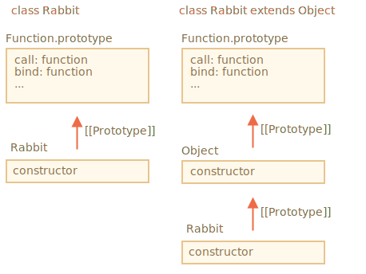

Сперва давайте разберёмся, почему код не работает.

Причина становится очевидна, если мы попытаемся запустить его. Унаследованный конструктор класса должен вызывать `super()`. В противном случае `"this"` будет не определён.

Решение:

```js run
class Rabbit extends Object {
  constructor(name) {
*!*
    super(); // надо вызвать конструктор родителя, когда наследуемся
*/!*
    this.name = name;
  }
}

let rabbit = new Rabbit("Кроль");

alert( rabbit.hasOwnProperty('name') ); // true
```

Но это ещё не все.

Даже после исправления есть важное различие между `"class Rabbit extends Object"` и `class Rabbit`.

Как мы знаем, синтаксис "extends" устанавливает 2 прототипа:

1. Между `"prototype"` функций-конструкторов (для методов)
2. Между самими функциями-конструкторами (для статических методов).

В нашем случае, для `class Rabbit extends Object` это значит:

```js run
class Rabbit extends Object {}

alert( Rabbit.prototype.__proto__ === Object.prototype ); // (1) true
alert( Rabbit.__proto__ === Object ); // (2) true
```

Таким образом, `Rabbit` предоставляет доступ к статическим методам `Object` через `Rabbit`, например:

```js run
class Rabbit extends Object {}

*!*
// обычно мы вызываем Object.getOwnPropertyNames
alert ( Rabbit.getOwnPropertyNames({a: 1, b: 2})); // a,b
*/!*
```

Но если явно не наследуем от объекта, то для `Rabbit.__ proto__` не установлено значение `Object`.

Пример:

```js run
class Rabbit {}

alert( Rabbit.prototype.__proto__ === Object.prototype ); // (1) true
alert( Rabbit.__proto__ === Object ); // (2) false (!)
alert( Rabbit.__proto__ === Function.prototype ); // как у каждой функции по умолчанию

*!*
// ошибка - нет такой функции у Rabbit
alert ( Rabbit.getOwnPropertyNames({a: 1, b: 2})); // Error
*/!*
```

Таким образом, в этом случае у `Rabbit` нет доступа к статическим методам `Object`.

Кстати, у `Function.prototype` есть "общие" методы, такие как `call`, `bind` и т. д. Они в конечном итоге доступны в обоих случаях, потому что для встроенного конструктора `Object` `Object.__proto__ === Function.prototype`.


Пример на картинке:



Короче говоря, есть два отличия:

| class Rabbit | class Rabbit extends Object  |
|--------------|------------------------------|
| --             | необходимо вызвать `super()` в конструкторе |
| `Rabbit.__proto__ === Function.prototype` | `Rabbit.__proto__ === Object` |
