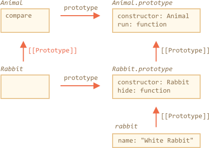

# Статические свойства и методы

Мы также можем присвоить метод функции-классу, а не её прототипу (`"prototype"`). Такие методы называются *статическими*.

Пример:

```js run
class User {
*!*
  static staticMethod() {
*/!*
    alert(this === User);
  }
}

User.staticMethod(); // true
```

Это фактически то же самое, что присвоить метод как свойство функции:

```js
function User() { }

User.staticMethod = function() {
  alert(this === User);
};
```

Значением `this` внутри `User.staticMethod()` является сам конструктор класса `User` (правило "объект до точки").

Обычно статические методы используются для реализации функций, принадлежащих классу, но не к каким-то конкретным его объектам.

Например, есть объекты статей Article и нужна функция для их сравнения. Естественным выбором будет такой метод `Article.compare`:

```js run
class Article {
  constructor(title, date) {
    this.title = title;
    this.date = date;
  }

*!*
  static compare(articleA, articleB) {
    return articleA.date - articleB.date;
  }
*/!*
}

// использование
let articles = [
  new Article("HTML", new Date(2019, 1, 1)),
  new Article("CSS", new Date(2019, 0, 1)),
  new Article("JavaScript", new Date(2019, 11, 1))
];

*!*
articles.sort(Article.compare);
*/!*

alert( articles[0].title ); // CSS
```

Здесь метод Article.compare стоит "над" статьями, как способ их сравнения. Это метод не отдельной статьи, а всего класса.

Другим примером может быть так называемый "фабричный" метод. Представим, что нам нужно создавать статьи различными способами:

1. Создание через заданные параметры (`title`, `date` и т. д.).
2. Создание пустой статьи с сегодняшней датой.
3. ...

Первый способ может быть реализован через конструктор. А для второго можно использовать статический метод класса.

Такой как `Article.createTodays()` в следующем примере:

```js run
class Article {
  constructor(title, date) {
    this.title = title;
    this.date = date;
  }

*!*
  static createTodays() {
    // помним, что this = Article
    return new this("Сегодняшний дайджест", new Date());
  }
*/!*
}

let article = Article.createTodays();

alert( article.title ); // Сегодняшний дайджест
```

Теперь каждый раз, когда нам нужно создать сегодняшний дайджест, нужно вызывать `Article.createTodays()`. Еще раз, это не метод одной статьи, а метод всего класса.

Статические методы также используются в классах, относящихся к базам данных, для поиска/сохранения/удаления вхождений в базу данных, например:

```js
// предположим, что Article - это специальный класс для управления статьями
// статический метод для удаления статьи:
Article.remove({id: 12345});
```

## Статические свойства

[recent browser=Chrome]

Статические свойства также возможны, как и обычные свойства класса:

```js run
class Article {
  static publisher = "Илья Кантор";
}

alert( Article.publisher ); // Илья Кантор
```

Это то же самое, что и прямое присваивание `Article`:

```js
Article.publisher = "Илья Кантор";
```

## Статика и наследование

Статика наследуется, мы можем получить доступ к `Parent.method`, используя `Child.method`.

Например, метод `Animal.compare` в коде ниже наследуется и доступен как `Rabbit.compare`:

```js run
class Animal {

  constructor(name, speed) {
    this.speed = speed;
    this.name = name;
  }

  run(speed = 0) {
    this.speed += speed;
    alert(`${this.name} бежит со скоростью ${this.speed}.`);
  }

*!*
  static compare(animalA, animalB) {
    return animalA.speed - animalB.speed;
  }
*/!*

}

// Наследуется от Animal
class Rabbit extends Animal {
  hide() {
    alert(`${this.name} прячется!`);
  }
}

let rabbits = [
  new Rabbit("Белый кролик", 10),
  new Rabbit("Черный кролик", 5)
];

*!*
rabbits.sort(Rabbit.compare);
*/!*

rabbits[0].run(); // Черный кролик бежит со скоростью 5.
```

Мы можем вызвать `Rabbit.compare`, имея ввиду, что будет вызван унаследованный `Animal.compare`.

Как это работает? Снова с использованием прототипов. Как вы уже могли предположить,`extends` даёт Rabbit ссылку [[Prototype]] на Animal.




Итак, функция `Rabbit` теперь наследуется от функции `Animal`. А функция `Animal` имеет `[[Prototype]]`, равный `Function.prototype`, потому что не расширяет (`extend`) что-либо.

Давайте это проверим:

```js run
class Animal {}
class Rabbit extends Animal {}

// для статических свойств и методов
alert(Rabbit.__proto__ === Animal); // true

// а еще шаг наверх ведет к Function.prototype
alert(Animal.__proto__ === Function.prototype); // true

// обычная цепочка прототипов для методов объектов
alert(Rabbit.prototype.__proto__ === Animal.prototype);
```

Таким образом `Rabbit` имеет доступ ко всем статическим методам `Animal`.

## Итого

Статические методы используются для функциональности, которая относится не к конкретному объекту класса, не требует существования этого объекта, а скорее принадлежит полностью классу, как например `Article.compare` -- универсальный метод для сравнения двух статей.

Статические свойства используются в тех случаях, когда мы хотели бы сохранить данные на уровне класса, а не какого-то одного объекта.

Синтаксис:

```js
class MyClass {
  static property = ...;

  static method() {
    ...
  }
}
```

Технически это то же самое, что и присвоение классу:

```js
MyClass.property = ...
MyClass.method = ...
```

Статические свойства наследуются.

Технически, для `class B extends A` прототип класса `B` указывает на `A`: `B.[[Prototype]] = A`. Таким образом, если поле не найдено в `B`, поиск продолжается в `A`.
