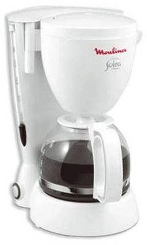

# Приватные и защищённые методы и свойства

Один из важнейших принципов объектно-ориентированного программирования -- разделение внутреннего и внешнего интерфейсов.

Это обязательная практика в разработке чего-либо сложнее, чем "hello world".

Чтобы понять этот принцип, давайте на секунду забудем о программировании и обратим взгляд на реальный мир.

Устройства, которыми мы пользуемся, обычно довольно сложно устроены. Но разделение внутреннего и внешнего интерфейсов позволяет нам пользоваться ими без каких-либо проблем.

## Пример из реальной жизни

Например, кофеварка. Простая снаружи: кнопка, экран, несколько отверстий... И, конечно, результат -- прекрасный кофе! :)



Но внутри... (картинка из инструкции по ремонту)


Множество деталей. Но мы можем пользоваться ею, ничего об этом не зная.

Кофеварки довольно надёжны, не так ли? Мы можем пользоваться ими годами, и если что-то пойдёт не так - отнесём в ремонт.

Секрет надёжности и простоты кофеварки -- все детали хорошо отлажены и *спрятаны* внутри.

Если мы снимем защитный кожух с кофеварки, то пользоваться ею будет гораздо сложнее (куда нажимать?) и опаснее (может привести к поражению электрическим током).

Как мы увидим, в программировании объекты похожи на кофеварки.

Но, чтобы скрыть внутренние детали, мы будем использовать не защитный кожух, а специальный синтаксис языка и соглашения.

## Внутренний и внешний интерфейсы

В объектно-ориентированном программировании свойства и методы разделены на 2 группы:

- *Внутренний интерфейс* -- методы и свойства, доступные из других методов класса, но не снаружи класса.
- *Внешний интерфейс* -- методы и свойства, доступные снаружи класса.

Если мы продолжаем аналогию с кофеваркой -- то, что скрыто внутри: трубка кипятильника, нагревательный элемент и т.д. -- это внутренний интерфейс.

Внутренний интерфейс используется для работы объекта, его детали используют друг друга. Например, трубка кипятильника прикреплена к нагревательному элементу.

Но снаружи кофеварка закрыта защитным кожухом, так что никто не может добраться до сложных частей. Детали скрыты и недоступны. Мы можем использовать их функции через внешний интерфейс.

Итак, всё, что нам нужно для использования объекта, это знать его внешний интерфейс. Мы можем совершенно не знать, как это работает внутри, и это здорово.

Это было общее введение.

В JavaScript есть два типа полей (свойств и методов) объекта:

- Публичные: доступны отовсюду. Они составляют внешний интерфейс. До этого момента мы использовали только публичные свойства и методы.
- Приватные: доступны только внутри класса. Они для внутреннего интерфейса.

Во многих других языках также существуют "защищённые" поля, доступные только внутри класса или для дочерних классов (то есть, как приватные, но разрешён доступ для наследующих классов) и также полезны для внутреннего интерфейса. В некотором смысле они более распространены, чем приватные, потому что мы обычно хотим, чтобы наследующие классы получали доступ к внутренним полям.

Защищённые поля не реализованы в JavaScript на уровне языка, но на практике они очень удобны, поэтому их эмулируют.

А теперь давайте сделаем кофеварку на JavaScript со всеми этими типами свойств. Кофеварка имеет множество деталей, мы не будем их моделировать для простоты примера (хотя могли бы).

## Защищённое свойство "waterAmount"

Давайте для начала создадим простой класс для описания кофеварки:

```js run
class CoffeeMachine {
  waterAmount = 0; // количество воды внутри

  constructor(power) {
    this.power = power;
    alert( `Создана кофеварка, мощность: ${power}` );
  }

}

// создаём кофеварку
let coffeeMachine = new CoffeeMachine(100);

// добавляем воды
coffeeMachine.waterAmount = 200;
```

Прямо сейчас свойства `waterAmount` и `power` публичные. Мы можем легко получать и устанавливать им любое значение извне.

Давайте изменим свойство `waterAmount` на защищённое, чтобы иметь больше контроля над ним. Например, мы не хотим, чтобы кто-либо устанавливал его ниже нуля.

**Защищённые свойства обычно начинаются с префикса `_`.**

Это не синтаксис языка: есть хорошо известное соглашение между программистами, что такие свойства и методы не должны быть доступны извне. Большинство программистов следуют этому соглашению.

Так что наше свойство будет называться `_waterAmount`:

```js run
class CoffeeMachine {
  _waterAmount = 0;

  set waterAmount(value) {
    if (value < 0) throw new Error("Отрицательное количество воды");
    this._waterAmount = value;
  }

  get waterAmount() {
    return this._waterAmount;
  }

  constructor(power) {
    this._power = power;
  }

}

// создаём новую кофеварку
let coffeeMachine = new CoffeeMachine(100);

// устанавливаем количество воды
coffeeMachine.waterAmount = -10; // Error: Отрицательное количество воды
```

Теперь доступ под контролем, поэтому указать воду ниже нуля не удалось.

## Свойство только для чтения "power"

Давайте сделаем свойство `power` доступным только для чтения. Иногда нужно, чтобы свойство устанавливалось только при создании объекта и после этого никогда не изменялось.

Это как раз требуется для кофеварки: мощность никогда не меняется.

Для этого нам нужно создать только геттер, но не сеттер:

```js run
class CoffeeMachine {
  // ...

  constructor(power) {
    this._power = power;
  }

  get power() {
    return this._power;
  }

}

// создаём кофеварку
let coffeeMachine = new CoffeeMachine(100);

alert(`Мощность: ${coffeeMachine.power}W`); // Мощность: 100W

coffeeMachine.power = 25; // Error (no setter)
```

````smart header="Геттеры/сеттеры"
Здесь мы использовали синтаксис геттеров/сеттеров.

Но в большинстве случаев использование функций `get.../set...` предпочтительнее:

```js
class CoffeeMachine {
  _waterAmount = 0;

  *!*setWaterAmount(value)*/!* {
    if (value < 0) throw new Error("Отрицательное количество воды");
    this._waterAmount = value;
  }

  *!*getWaterAmount()*/!* {
    return this._waterAmount;
  }
}

new CoffeeMachine().setWaterAmount(100);
```
Это выглядит немного длиннее, но функции более гибкие. Они могут принимать несколько аргументов (даже если они нам сейчас не нужны). Итак, на будущее, если нам надо что-то отрефакторить, функции -- более безопасный выбор.

С другой стороны, синтаксис get/set короче, решать вам.
````

```smart header="Защищённые поля наследуются"
Если мы унаследуем `class MegaMachine extends CoffeeMachine`, ничто не помешает нам обращаться к `this._waterAmount` или `this._power` из методов нового класса.

Таким образом, защищённые поля, конечно же, наследуются. В отличие от приватных полей, в чём мы убедимся ниже.
```

## Приватное свойство "#waterLimit"

[recent browser=none]

Есть новшество в языке JavaScript, которое почти добавлено в стандарт: оно добавляет поддержку приватных свойств и методов.

Приватные свойства и методы должны начинаться с `#`. Они доступны только внутри класса.

Например, в классе ниже есть приватное свойство `#waterLimit` и приватный метод `#checkWater` для проверки количества воды:

```js run
class CoffeeMachine {
*!*
  #waterLimit = 200;
*/!*

*!*
  #checkWater(value) {
    if (value < 0) throw new Error("Отрицательный уровень воды");
    if (value > this.#waterLimit) throw new Error("Слишком много воды");
  }
*/!*
}

let coffeeMachine = new CoffeeMachine();

*!*
// снаружи нет доступа к приватным методам класса
coffeeMachine.#checkWater(); // Error
coffeeMachine.#waterLimit = 1000; // Error
*/!*
```

На уровне языка `#` является специальным символом, который означает, что поле приватное. Мы не можем получить к нему доступ извне или из наследуемых классов.

Приватные поля не конфликтуют с публичными. У нас может быть два поля одновременно -- приватное `#waterAmount` и публичное `waterAmount`.

Например, давайте сделаем аксессор `waterAmount` для `#waterAmount`:

```js run
class CoffeeMachine {

  #waterAmount = 0;

  get waterAmount() {
    return this.#waterAmount;
  }

  set waterAmount(value) {
    if (value < 0) throw new Error("Отрицательный уровень воды");
    this.#waterAmount = value;
  }
}

let machine = new CoffeeMachine();

machine.waterAmount = 100;
alert(machine.#waterAmount); // Error
```

В отличие от защищённых, функциональность приватных полей обеспечивается самим языком. Это хорошо.

Но если мы унаследуем от `CoffeeMachine`, то мы не получим прямого доступа к `#waterAmount`. Мы будем вынуждены полагаться на геттер/сеттер `waterAmount`:

```js
class MegaCoffeeMachine extends CoffeeMachine {
  method() {
*!*
    alert( this.#waterAmount ); // Error: can only access from CoffeeMachine
*/!*
  }
}
```

Во многих случаях такое ограничение слишком жёсткое. Раз уж мы расширяем `CoffeeMachine`, у нас может быть вполне законная причина для доступа к внутренним методам и свойствам. Поэтому защищённые свойства используются чаще, хоть они и не поддерживаются синтаксисом языка.

````warn
Приватные поля особенные.

Как мы помним, обычно мы можем получить доступ к полям объекта с помощью `this[name]`:

```js
class User {
  ...
  sayHi() {
    let fieldName = "name";
    alert(`Hello, ${*!*this[fieldName]*/!*}`);
  }
}
```
С приватными свойствами такое невозможно: `this['#name']` не работает. Это ограничение синтаксиса сделано для обеспечения приватности.
````

## Итого

В терминах ООП отделение внутреннего интерфейса от внешнего называется [инкапсуляция](https://ru.wikipedia.org/wiki/%D0%98%D0%BD%D0%BA%D0%B0%D0%BF%D1%81%D1%83%D0%BB%D1%8F%D1%86%D0%B8%D1%8F_(%D0%BF%D1%80%D0%BE%D0%B3%D1%80%D0%B0%D0%BC%D0%BC%D0%B8%D1%80%D0%BE%D0%B2%D0%B0%D0%BD%D0%B8%D0%B5)).

Это даёт следующие выгоды:

Защита для пользователей, чтобы они не выстрелили себе в ногу
: Представьте себе, что есть команда разработчиков, использующая кофеварку. Она была изготовлена компанией "Лучшие Кофеварки" и работает нормально, но защитный кожух был снят. Внутренний интерфейс стал доступен извне.

    Все разработчики культурны -- они используют кофеварку по назначению. Но один из них, Джон, решил, что он самый умный, и сделал некоторые изменения во внутренностях кофеварки. После чего кофеварка вышла из строя через два дня.

    Это, конечно, не вина Джона, а скорее человека, который снял защитный кожух и позволил Джону делать свои манипуляции.

    То же самое в программировании. Если пользователь класса изменит вещи, не предназначенные для изменения извне -- последствия непредсказуемы.

Поддерживаемость
: Ситуация в программировании сложнее, чем с реальной кофеваркой, потому что мы не просто покупаем её один раз. Код постоянно подвергается разработке и улучшению.

    **Если мы чётко отделим внутренний интерфейс, то разработчик класса сможет свободно менять его внутренние свойства и методы, даже не информируя пользователей..**

    Если вы разработчик такого класса, то приятно знать, что приватные методы можно безопасно переименовывать, их параметры можно изменять и даже удалять, потому что от них не зависит никакой внешний код.

    В новой версии вы можете полностью всё переписать, но пользователю будет легко обновиться, если внешний интерфейс остался такой же.

Сокрытие сложности
: Люди обожают использовать простые вещи. По крайней мере, снаружи. Что внутри -- это другое дело.

    Программисты не являются исключением.

    **Всегда удобно, когда детали реализации скрыты, и доступен простой, хорошо документированный внешний интерфейс.**

Для сокрытия внутреннего интерфейса мы используем защищённые или приватные свойства:

- Защищённые поля имеют префикс `_`. Это хорошо известное соглашение, не поддерживаемое на уровне языка. Программисты должны обращаться к полю, начинающемуся с `_`, только из его класса и классов, унаследованных от него.
- Приватные поля имеют префикс `#`. JavaScript гарантирует, что мы можем получить доступ к таким полям только внутри класса.

В настоящее время приватные поля не очень хорошо поддерживаются в браузерах, но можно использовать полифил.
