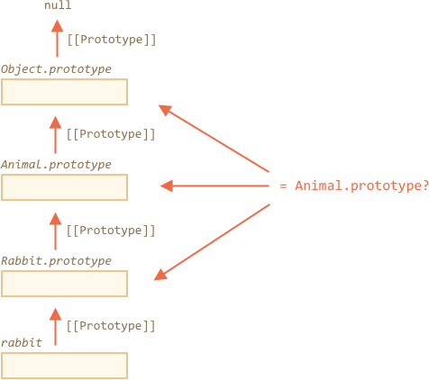

# Проверка класса: "instanceof"

Оператор `instanceof` позволяет проверить, какому классу принадлежит объект, с учетом наследования.

Такая проверка может потребоваться во многих случаях. Здесь мы будем использовать ее для создания *полиморфной* функции, которая использует аргументы по-разному в зависимости от их типа.

## Оператор instanceof [#ref-instanceof]

Синтаксис:
```js
obj instanceof Class
```

Оператор вернет `true`, если `obj` принадлежит классу `Class` (или класс наследует от него).

Например:

```js run
class Rabbit {}
let rabbit = new Rabbit();

// это объект класса Rabbit?
*!*
alert( rabbit instanceof Rabbit ); // true
*/!*
```

Также это работает с функциями-конструкторами:

```js run
*!*
// вместо класса
function Rabbit() {}
*/!*

alert( new Rabbit() instanceof Rabbit ); // true
```

...И для встроенных классов, таких как `Array`:

```js run
let arr = [1, 2, 3];
alert( arr instanceof Array ); // true
alert( arr instanceof Object ); // true
```

Пожалуйста, обратите внимание, что `arr` также принадлежит классу `Object`. Это потому, что `Array` наследуется от `Object`.

Оператор `instanceof` просматривает цепочку прототипов для проверки, и это также свободно настраивается с помощью статичного метода `Symbol.hasInstance`.

Алгоритм работы `obj instanceof Class` работает примерно следующим образом:

1. Если имеется статичный метод `Symbol.hasInstance`, тогда используется он. Таким образом:

    ```js run
    // предполагаем, все что может есть, - это животное
    class Animal {
      static [Symbol.hasInstance](obj) {
        if (obj.canEat) return true;
      }
    }

    let obj = { canEat: true };
    alert(obj instanceof Animal); // true: вызван Animal[Symbol.hasInstance](obj)
    ```

2. Большая часть классов не имеет метода `Symbol.hasInstance`. В этом случае проверяется равен ли `Class.prototype` одному из прототипов в прототипной цепочке `obj`.

    Другими словами, сравнивается:
    ```js
    obj.__proto__ === Class.prototype
    obj.__proto__.__proto__ === Class.prototype
    obj.__proto__.__proto__.__proto__ === Class.prototype
    ...
    ```

    В примере выше `Rabbit.prototype === rabbit.__proto__`, так что результат будет получен немедленно.

    В случае с наследованием, `rabbit` также является экземпляром своего родительского класса:

    ```js run
    class Animal {}
    class Rabbit extends Animal {}

    let rabbit = new Rabbit();
    *!*
    alert(rabbit instanceof Animal); // true
    */!*
    // rabbit.__proto__ === Rabbit.prototype
    // rabbit.__proto__.__proto__ === Animal.prototype (совпадение!)
    ```

Вот иллюстрация того как `rabbit instanceof Animal` сравнивается с `Animal.prototype`:



Кстати, есть метод [objA.isPrototypeOf(objB)], которые возвращает `true`, если объект `objA` есть где-то в прототипной цепочки объекта `objB`. Так что `obj instanceof Class` можно перефразировать как `Class.prototype.isPrototypeOf(obj)`.

Забавно, но сам конструктор `Class` не участвует в процессе проверки! Важна только цепочка прототипов `Class.prototype`.

Это может приводить к интересным последствиям при изменении `prototype`.

Как, например, тут:

```js run
function Rabbit() {}
let rabbit = new Rabbit();

// заменяем прототип
Rabbit.prototype = {};

// ...больше не rabbit!
*!*
alert( rabbit instanceof Rabbit ); // false
*/!*
```

Это одна из причин избегать изменения `prototype`. Просто для безопасности.

## Bonus: Object toString for the type

We already know that plain objects are converted to string as `[object Object]`:

```js run
let obj = {};

alert(obj); // [object Object]
alert(obj.toString()); // the same
```

That's their implementation of `toString`. But there's a hidden feature that makes `toString` actually much more powerful than that. We can use it as an extended `typeof` and an alternative for `instanceof`.

Sounds strange? Indeed. Let's demystify.

By [specification](https://tc39.github.io/ecma262/#sec-object.prototype.tostring), the built-in `toString` can be extracted from the object and executed in the context of any other value. And its result depends on that value.

- For a number, it will be `[object Number]`
- For a boolean, it will be `[object Boolean]`
- For `null`: `[object Null]`
- For `undefined`: `[object Undefined]`
- For arrays: `[object Array]`
- ...etc (customizable).

Let's demonstrate:

```js run
// copy toString method into a variable for convenience
let objectToString = Object.prototype.toString;

// what type is this?
let arr = [];

alert( objectToString.call(arr) ); // [object Array]
```

Here we used [call](mdn:js/function/call) as described in the chapter [](info:call-apply-decorators) to execute the function `objectToString` in the context `this=arr`.

Internally, the `toString` algorithm examines `this` and returns the corresponding result. More examples:

```js run
let s = Object.prototype.toString;

alert( s.call(123) ); // [object Number]
alert( s.call(null) ); // [object Null]
alert( s.call(alert) ); // [object Function]
```

### Symbol.toStringTag

The behavior of Object `toString` can be customized using a special object property `Symbol.toStringTag`.

For instance:

```js run
let user = {
  [Symbol.toStringTag]: "User"
};

alert( {}.toString.call(user) ); // [object User]
```

For most environment-specific objects, there is such a property. Here are few browser specific examples:

```js run
// toStringTag for the envinronment-specific object and class:
alert( window[Symbol.toStringTag]); // window
alert( XMLHttpRequest.prototype[Symbol.toStringTag] ); // XMLHttpRequest

alert( {}.toString.call(window) ); // [object Window]
alert( {}.toString.call(new XMLHttpRequest()) ); // [object XMLHttpRequest]
```

As you can see, the result is exactly `Symbol.toStringTag` (if exists), wrapped into `[object ...]`.

At the end we have "typeof on steroids" that not only works for primitive data types, but also for built-in objects and even can be customized.

It can be used instead of `instanceof` for built-in objects when we want to get the type as a string rather than just to check.

## Summary

Let's recap the type-checking methods that we know:

|               | works for   |  returns      |
|---------------|-------------|---------------|
| `typeof`      | primitives  |  string       |
| `{}.toString` | primitives, built-in objects, objects with `Symbol.toStringTag`   |       string |
| `instanceof`  | objects     |  true/false   |

As we can see, `{}.toString` is technically a "more advanced" `typeof`.

And `instanceof` operator really shines when we are working with a class hierarchy and want to check for the class taking into account inheritance.
