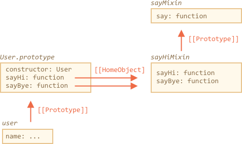

# Примеси

В JavaScript мы можем использовать наследование только от одного объекта. Объект имеет единственный `[[Prototype]]`. И класс может расширить только один другой класс.

Иногда это может ограничивать нас. Например, у нас есть класс `StreetSweeper` и класс `Bicycle`, а мы хотим создать `StreetSweepingBicycle`.

Или, говоря о программировании, у нас есть класс `Renderer`, который реализует шаблон, и класс `EventEmitter`, реализующий событие. Мы хотели бы объединить их функционал в классе `Page`, чтобы создать страницу, которая будет использовать шаблон и запускать событие.

Для таких случаев существуют "примеси".

Как говорится в Википедии, [примесь](https://ru.wikipedia.org/wiki/%D0%9F%D1%80%D0%B8%D0%BC%D0%B5%D1%81%D1%8C_(%D0%BF%D1%80%D0%BE%D0%B3%D1%80%D0%B0%D0%BC%D0%BC%D0%B8%D1%80%D0%BE%D0%B2%D0%B0%D0%BD%D0%B8%D0%B5)) является классом, который имеет методы, и мы можем использовать эти методы в других классах, не будучи родителем тех классов.

Другими словами, *примесь* определяет методы, которые реализуют определённое поведение. Мы не используем примесь саму по себе, она нужна, чтобы добавить другим классам больше функционала.

## Пример примеси

Простой путь создания примеси в JavaScript - это создание объекта с полезными методами, так чтобы мы легко могли добавить их в прототип любого класса.

В примере ниже примесь `sayHiMixin` имеет методы для придания объектам класса `User` возможности вести разговор:

```js run
*!*
// примесь
*/!*
let sayHiMixin = {
  sayHi() {
    alert(`Hello ${this.name}`);
  },
  sayBye() {
    alert(`Bye ${this.name}`);
  }
};

*!*
// использование:
*/!*
class User {
  constructor(name) {
    this.name = name;
  }
}

// копируем методы
Object.assign(User.prototype, sayHiMixin);

// сейчас User может сказать Hello
new User("Dude").sayHi(); // Hello Dude!
```

Это не наследование, а просто скопированные методы. Таким образом, класс `User` может расширять другие классы и также содержать в себе методы от примеси, например:

```js
class User extends Person {
// ...
}

Object.assign(User.prototype, sayHiMixin);
```

Примеси могут использовать наследование между собой.

В примере ниже `sayHiMixin` наследуется от `sayMixin`:

```js run
let sayMixin = {
  say(phrase) {
    alert(phrase);
  }
};

let sayHiMixin = {
  __proto__: sayMixin, // (или мы можем использовать Object.create для определения прототипа)

  sayHi() {
    *!*
    // вызываем метод родителя
    */!*
    super.say(`Hello ${this.name}`);
  },
  sayBye() {
    super.say(`Bye ${this.name}`);
  }
};

class User {
  constructor(name) {
    this.name = name;
  }
}

// копируем методы
Object.assign(User.prototype, sayHiMixin);

// сейчас User может сказать Hello
new User("Dude").sayHi(); // Hello Dude!
```

Обратите внимание, что мы вызвали родительский метод `super.say()` из `sayHiMixin` в прототипе другой примеси, а не в классе.



Это связано с тем, что методы из `sayHiMixin` имеют установленное свойство `[[HomeObject]]`. А `super` на самом деле означает `sayHiMixin.__ proto__`, а не `User.__ proto__`.

## EventMixin

Сейчас давайте создадим примесь для реального случая.

Важная особенность при работе с объектами - это работа с событиями.

То есть, объект должен иметь метод для "генерации события", когда с ним происходит что-то важное, а другие объекты должны иметь возможность "слушать" такие события.

Событие должно иметь имя и, опционально, какие-то дополнительные данные, ассоциированные с ним.

Например, объект `user` может генерировать событие `"login"`, когда посетитель входит. А другой объект `calendar` может захотеть получать событие `"login"`, чтобы загрузить календарь для вошедшего пользователя.

Или `menu` может генерировать событие `"select"`, когда элемент меню выбран, а другие объекты могут захотеть получить эту информацию и тоже отреагировать на это событие.

События — это способ "поделиться информацией" со всеми, кто этого захочет. Они могут быть полезны в любом классе, поэтому давайте сделаем для них пример:

```js run
let eventMixin = {
  /**
   * Подпишемся на событие, используя:
   * menu.on('select', function(item) { ... }
   */
  on(eventName, handler) {
    if (!this._eventHandlers) this._eventHandlers = {};
    if (!this._eventHandlers[eventName]) {
      this._eventHandlers[eventName] = [];
    }
    this._eventHandlers[eventName].push(handler);
  },

  /**
   * Отменим подписку, используя:
   * menu.off('select', handler)
   */
  off(eventName, handler) {
    let handlers = this._eventHandlers && this._eventHandlers[eventName];
    if (!handlers) return;
    for (let i = 0; i < handlers.length; i++) {
      if (handlers[i] === handler) {
        handlers.splice(i--, 1);
      }
    }
  },

  /**
   * Запустим событие и добавим к нему данные
   * this.trigger('select', data1, data2);
   */
  trigger(eventName, ...args) {
    if (!this._eventHandlers || !this._eventHandlers[eventName]) {
      return; // обработчиков для этого события нет
    }

    // вызовем обработчики
    this._eventHandlers[eventName].forEach(handler => handler.apply(this, args));
  }
};
```

Итак, у нас 3 метода:

1. `.on(eventName, handler)` -- назначили функцию `handler`, чтобы обработать событие с заданным именем. Храним обработчики в свойстве  `_eventHandlers`.

2. `.off(eventName, handler)` -- убираем функцию из списка обработчиков.

3. `.trigger(eventName, ...args)` -- генерируем событие: все назначенные обработчики вызываются, и `args` передаётся в обработчики в качестве аргумента.

Использование:

```js run
// Создадим класс
class Menu {
  choose(value) {
    this.trigger("select", value);
  }
}
// Добавим примесь
Object.assign(Menu.prototype, eventMixin);

let menu = new Menu();

// Вызовем обработчик на событие "select":
*!*
menu.on("select", value => alert(`Выбранное значение: ${value}`));
*/!*

// Запустили событие => будет показано "Выбранное значение: 123"
menu.choose("123"); // выбранное значение
```

Если у нас есть код, заинтересованный в событии "select", то мы можем привязать его с помощью `menu.on(...)`.

И `eventMixin` может добавить такое поведение в любой класс без вмешательства в цепочку наследования.

## Итого

*Примесь* -- общий термин в объектно-ориентированном программировании: класс, который содержит в себе методы для других классов.

В других языках (например, Python) разрешается создавать примеси, используя множественное наследование. JavaScript не поддерживает множественное наследование, но с помощью примесей мы можем реализовать нечто похожее, скопировав методы в прототип.

Мы можем использовать примеси для расширения функционала классов, например, для обработки событий, как мы сделали это выше.

С примесями могут возникнуть проблемы, если они перезаписывают нативные методы класса. Стоит помнить об этом и быть внимательнее при выборе имён методов для примеси, чтобы избежать конфликтов и ошибок.
