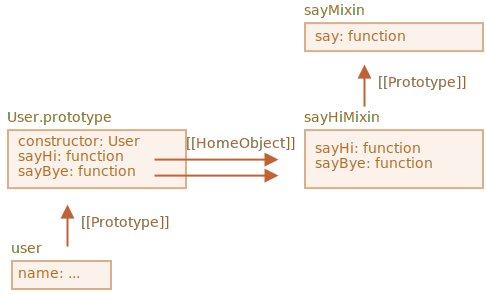

# Примеси

В JavaScript можно наследовать только от одного объекта. Объект имеет единственный `[[Prototype]]`. И класс может расширить только один другой класс.

Иногда это может ограничивать нас. Например, у нас есть класс `StreetSweeper` и класс `Bicycle`, а мы хотим создать их смесь: `StreetSweepingBicycle`.

Или у нас есть класс `User`, который реализует пользователей, и класс `EventEmitter`, реализующий события. Мы хотели бы добавить функциональность класса `EventEmitter` к `User`, чтобы пользователи могли легко генерировать события.

Для таких случаев существуют "примеси".

По определению из Википедии, [примесь](https://ru.wikipedia.org/wiki/%D0%9F%D1%80%D0%B8%D0%BC%D0%B5%D1%81%D1%8C_(%D0%BF%D1%80%D0%BE%D0%B3%D1%80%D0%B0%D0%BC%D0%BC%D0%B8%D1%80%D0%BE%D0%B2%D0%B0%D0%BD%D0%B8%D0%B5)) - это класс, методы которого предназначены для использования в других классах, причём без наследования от примеси.

Другими словами, *примесь* определяет методы, которые реализуют определённое поведение. Мы не используем примесь саму по себе, а используем её, чтобы добавить функциональность другим классам.

## Пример примеси

Простейший способ реализовать примесь в JavaScript - это создать объект с полезными методами, которые затем могут быть легко добавлены в прототип любого класса.

В примере ниже примесь `sayHiMixin` имеет методы, которые придают объектам класса `User` возможность вести разговор:

```js run
*!*
// примесь
*/!*
let sayHiMixin = {
  sayHi() {
    alert(`Привет, ${this.name}`);
  },
  sayBye() {
    alert(`Пока, ${this.name}`);
  }
};

*!*
// использование:
*/!*
class User {
  constructor(name) {
    this.name = name;
  }
}

// копируем методы
Object.assign(User.prototype, sayHiMixin);

// теперь User может сказать Привет
new User("Вася").sayHi(); // Привет, Вася!
```

Это не наследование, а просто копирование методов. Таким образом, класс `User` может наследовать от другого класса, но при этом также включать в себя примеси, "подмешивающие" другие методы, например:

```js
class User extends Person {
// ...
}

Object.assign(User.prototype, sayHiMixin);
```

Примеси могут наследовать друг друга.

В примере ниже `sayHiMixin` наследует от `sayMixin`:

```js run
let sayMixin = {
  say(phrase) {
    alert(phrase);
  }
};

let sayHiMixin = {
  __proto__: sayMixin, // (или мы можем использовать Object.setPrototypeOf для задания прототипа)

  sayHi() {
    *!*
    // вызываем метод родителя
    */!*
    super.say(`Привет, ${this.name}`); // (*)
  },
  sayBye() {
    super.say(`Пока, ${this.name}`); // (*)
  }
};

class User {
  constructor(name) {
    this.name = name;
  }
}

// копируем методы
Object.assign(User.prototype, sayHiMixin);

// теперь User может сказать Привет
new User("Вася").sayHi(); // Привет, Вася!
```

Обратим внимание, что при вызове родительского метода `super.say()` из `sayHiMixin` (строки, помеченные `(*)`) этот метод ищется в прототипе самой примеси, а не класса.

Вот диаграмма (см. правую часть):



Это связано с тем, что методы `sayHi` и `sayBye` были изначально созданы в объекте `sayHiMixin`. Несмотря на то, что они скопированы, их внутреннее свойство `[[HomeObject]]` ссылается на `sayHiMixin`, как показано на картинке выше.

Так как `super` ищет родительские методы в `[[HomeObject]].[[Prototype]]`, это означает, что он ищет `sayHiMixin.[[Prototype]]`.

## EventMixin

Многие объекты в браузерной разработке (и не только) обладают важной способностью - они могут генерировать события. События - отличный способ передачи информации всем, кто в ней заинтересован. Давайте создадим примесь, которая позволит легко добавлять функциональность по работе с событиями любым классам/объектам.

- Примесь добавит метод `.trigger(name, [...data])` для генерации события. Аргумент `name` - это имя события, за которым могут следовать дополнительные аргументы с данными для события.
- Также будет добавлен метод `.on(name, handler)`, который назначает обработчик для события с заданным именем. Обработчик будет вызван, когда произойдёт событие с указанным именем `name`, и получит данные из `.trigger`.
- ...и метод `.off(name, handler)`, который удаляет обработчик указанного события.

После того, как все методы примеси будут добавлены, объект `user` сможет сгенерировать событие `"login"` после входа пользователя в личный кабинет. А другой объект, к примеру, `calendar` сможет использовать это событие, чтобы показывать зашедшему пользователю актуальный для него календарь.

Или `menu` может генерировать событие `"select"`, когда элемент меню выбран, а другие объекты могут назначать обработчики, чтобы реагировать на это событие, и т.п.

Вот код примеси:

```js run
let eventMixin = {
  /**
   * Подписаться на событие, использование:
   * menu.on('select', function(item) { ... }
   */
  on(eventName, handler) {
    if (!this._eventHandlers) this._eventHandlers = {};
    if (!this._eventHandlers[eventName]) {
      this._eventHandlers[eventName] = [];
    }
    this._eventHandlers[eventName].push(handler);
  },

  /**
   * Отменить подписку, использование:
   * menu.off('select', handler)
   */
  off(eventName, handler) {
    let handlers = this._eventHandlers?.[eventName];
    if (!handlers) return;
    for (let i = 0; i < handlers.length; i++) {
      if (handlers[i] === handler) {
        handlers.splice(i--, 1);
      }
    }
  },

  /**
   * Сгенерировать событие с указанным именем и данными
   * this.trigger('select', data1, data2);
   */
  trigger(eventName, ...args) {
    if (!this._eventHandlers?.[eventName]) {
      return; // обработчиков для этого события нет
    }

    // вызовем обработчики
    this._eventHandlers[eventName].forEach(handler => handler.apply(this, args));
  }
};
```

Итак, у нас есть 3 метода:

1. `.on(eventName, handler)` -- назначает функцию `handler`, чтобы обработать событие с заданным именем.

    Технически существует свойство `_eventHandlers`, в котором хранится массив обработчиков для каждого имени события, и оно просто добавляет это событие в список.

3. `.off(eventName, handler)` -- убирает функцию из списка обработчиков.

4. `.trigger(eventName, ...args)` -- генерирует событие: все назначенные обработчики из `_eventHandlers[eventName]` вызываются, и `...args` передаются им в качестве аргументов.

Использование:

```js run
// Создадим класс
class Menu {
  choose(value) {
    this.trigger("select", value);
  }
}
// Добавим примесь с методами для событий
Object.assign(Menu.prototype, eventMixin);

let menu = new Menu();

// Добавим обработчик, который будет вызван при событии "select":
*!*
menu.on("select", value => alert(`Выбранное значение: ${value}`));
*/!*

// Генерирует событие => обработчик выше запускается и выводит:
menu.choose("123"); // Выбранное значение: 123
```

Теперь если у нас есть код, заинтересованный в событии `"select"`, то он может слушать его с помощью `menu.on(...)`.

А `eventMixin` позволяет легко добавить такое поведение в любой класс без вмешательства в цепочку наследования.

## Итого

*Примесь* -- общий термин в объектно-ориентированном программировании: класс, который содержит в себе методы для других классов.

Некоторые другие языки допускают множественное наследование. JavaScript не поддерживает множественное наследование, но с помощью примесей мы можем реализовать нечто похожее, скопировав методы в прототип.

Мы можем использовать примеси для расширения функциональности классов, например, для обработки событий, как мы сделали это выше.

С примесями могут возникнуть конфликты, если они перезаписывают существующие методы класса. Стоит помнить об этом и быть внимательнее при выборе имён для методов примеси, чтобы их избежать.
