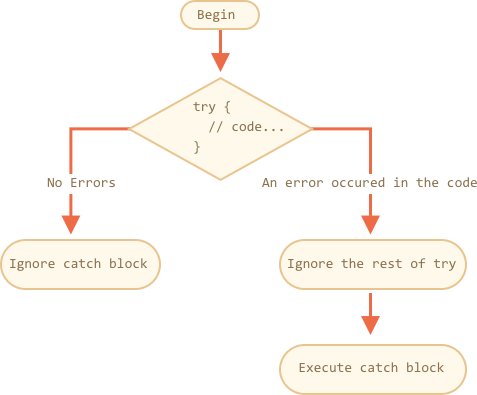

# Обработка ошибок, "try..catch"

Неважно насколько мы хороши в программировании, иногда наши скрипты содержат ошибки. Они могут возникать из-за наших промахов, неожиданного ввода пользователя, неправильного ответа сервера и по тысяче других причин.

Обычно, скрипт "падает" (сразу же останавливается) в случае ошибки, с выводом ошибки в консоль.

Но есть синтаксическая конструкция `try..catch`, которая позволяет "перехватывать" ошибки, и вместо падения, сделать что-то более осмысленное.

## Синтаксис "try..catch"

Конструкция `try..catch` состоит из двух основных блоков: `try`, и затем `catch`:

```js
try {

  // код...

} catch (err) {

  // обработка ошибки

}
```

Работает она так:

1. Сначала выполняется код внутри блока `try {...}`.
2. Если в нём нет ошибок, то блок `catch(err)` игнорируется: выполнение доходит до конца `try` и потом прыгает через `catch`.
3. Если в нем возникает ошибка, то выполнение `try` прерывается, и поток управления переходит в начало `catch(err)`. Переменная `err` (можно использовать любое имя) содержит объект ошибки с подробной информацией о произошедшем.



Таким образом, при ошибке в блоке `try {…}` скрипт не "падает", и мы получаем возможность обработать ошибку внутри `catch`.

Давайте рассмотрим больше примеров.

- Пример без ошибок: выведет  `alert` `(1)` и `(2)`:

    ```js run
    try {

      alert('Начало блока try');  // *!*(1) <--*/!*

      // ...код без ошибок

      alert('Конец блока try');   // *!*(2) <--*/!*

    } catch(err) {

      alert('catch игнорируется, так как нет ошибок'); // (3)

    }

    alert("...Потом код продолжит выполнение");
    ```
- Пример с ошибками: выведет `(1)` и `(3)`:

    ```js run
    try {

      alert('Начало блока try');  // *!*(1) <--*/!*

    *!*
      lalala; // ошибка, переменная не определена!
    */!*

      alert('Конец блока try (никогда не выполнится)');  // (2)

    } catch(err) {

      alert(`Возникла ошибка!`); // *!*(3) <--*/!*

    }

    alert("...Потом код продолжит выполнение");
    ```


````warn header="`try..catch` работает только для ошибок, возникающих во время исполнения кода"
Чтобы `try..catch` работал, код должен быть выполнимым. Другими словами, это должен быть корректный JavaScript код.

Он не сработает, если код синтаксически неверен, например, содержит несовпадающее количество фигурных скобок:

```js run
try {
  {{{{{{{{{{{{
} catch(e) {
  alert("Движок не может понять этот код, он не корректен");
}
```

JavaScript движок сначала читает код, а затем исполняет его. Ошибки, которые возникают во время фазы чтения, называются ошибками парсинга. Их нельзя обработать (изнутри этого кода), потому что движок не понимает код.

Таким образом, `try..catch` может обрабатывать ошибки, которые возникают в корректном коде. Такие ошибки называют "ошибками во время выполнения", а иногда "исключениями".
````


````warn header="`try..catch` работает синхронно"
Ошибку, которая произойдёт в коде, запланированном "на будущее", например в `setTimeout`, `try..catch` не поймает:

```js run
try {
  setTimeout(function() {
    noSuchVariable; // скрипт упадет тут
  }, 1000);
} catch (e) {
  alert( "не сработает" );
}
```

Это потому что `try..catch` на самом деле оборачивает вызов `setTimeout`, которые планирует выполнение функции. Но сама функция выполняется позже, когда движок уже покинул конструкцию `try..catch`.

Чтобы поймать исключение внутри запланированной функции, `try..catch` должен находиться внутри самой этой функции:
```js run
setTimeout(function() {
  try {    
    noSuchVariable; // try..catch обрабатывает ошибку!
  } catch {
    alert( "ошибка поймана тут!" );
  }
}, 1000);
```
````

## Объект ошибки

Когда возникает ошибка, JavaScript генерирует объект, содержащий её детали. Затем объект передается как аргумент в блок `catch`:

```js
try {
  // ...
} catch(err) { // <-- объект ошибки, можно использовать другое название вместо err
  // ...
}
```

Для всех встроенных ошибок, объект ошибки внутри `catch` имеет два основных свойства:

`name`
: Имя ошибки. Для неопределенных переменных это `"ReferenceError"`.

`message`
: Текстовое сообщение о деталях ошибки.

Имеются также другие нестандартные свойства доступные в большинстве окружений. Одно из самых широко используемых и поддерживаемых это:

`stack`
: Текущий стек вызова: строка содержащая информацияю о последовательности вложенных вызовов, которые привели к ошибке. Используется в целях отладки.

Например:

```js run untrusted
try {
*!*
  lalala; // ошибка, перерменная не определена!
*/!*
} catch(err) {
  alert(err.name); // ReferenceError
  alert(err.message); // lalala не определена
  alert(err.stack); // ReferenceError: lalala не определена в ...

  // Может также вывести ошибку как целое
  // Ошибка приводится к строке как "name: message"
  alert(err); // ReferenceError: lalala не определена
}
```

## Необязательное связывание "catch"

[recent browser=new]

Если вам не нужны детали ошибки, `catch` можно пропустить:

```js
try {
  // ...
} catch {
  // объект ошибки пропущен
}
```

## Использование "try..catch"

Давайте рассмотрим реальные случаи использования `try..catch`.

Как мы уже знаем, JavaScript поддерживает метод [JSON.parse(str)](mdn:js/JSON/parse) для чтения закодированных JSON значений.

Обычно он используется для декодирования данных полученных по сети, от сервера или из другого источника.

Мы получаем их и вызываем `JSON.parse`, вот так:

```js run
let json = '{"name":"John", "age": 30}'; // данные с сервера

*!*
let user = JSON.parse(json); // преобразовали текстовое представление в JS объект
*/!*

// теперь user -- это объект со свойствами из строки
alert( user.name ); // John
alert( user.age );  // 30
```

Вы можете найти более детальную информацию о JSON в главе <info:json>.

**Если `json` некорректен, `JSON.parse` генерирует ошибку, то есть скрипт "падает".**

Устроит ли нас такое поведение? Конечно нет!

Получается, что если вдруг что-то не так с данными, то посетитель никогда (если, конечно, не откроет консоль) об этом не узнает. А люди очень не любят, когда что-то "просто падает", без всякого сообщения об ошибке.

Давайте используем `try..catch` для обработки ошибки:

```js run
let json = "{ bad json }";

try {

*!*
  let user = JSON.parse(json); // <-- тут возникает ошибка...
*/!*
  alert( user.name ); // не сработает

} catch (e) {
*!*
  // ...выполнения прыгает сюда
  alert( "Извините, в данных ошибка, мы попробуем получить их ещё раз." );
  alert( e.name );
  alert( e.message );
*/!*
}
```

Здесь мы используем блок `catch` только для вывода сообщения, но мы также можем сделать гораздо больше: отправить новый сетевой запрос, предложить посетителю альтернативный способ, отослать информацию об ошибке на сервер для логгирования, ... Намного лучше, чем просто "падение".

## Генерация своих ошибок

Что если `json` синтаксически корректен, но не содержит необходимого свойства `name`?

Например так:

```js run
let json = '{ "age": 30 }'; // данные неполны

try {

  let user = JSON.parse(json); // <-- выполнится без ошибок
*!*
  alert( user.name ); // нет свойства name!
*/!*

} catch (e) {
  alert( "не выполнится" );
}
```

Здесь `JSON.parse` выполнится без ошибок, но на самом деле отсутствие свойства `name` для нас ошибка.

Для того, чтобы унифицировать обработку ошибок, мы воспользуемся оператором `throw`.

### Оператор "throw"

Оператор "throw" генерирует ошибку.

Синтаксис:

```js
throw <error object>
```

Технически в качестве объекта ошибки можно передать что угодно. Это может быть даже примитив, число или строка, но всё же лучше, чтобы это был объект, желательно со свойствами `name` и `message` (для совместимости со встроенными ошибками).

В JavaScript есть множество встроенных конструкторов для стандартных ошибок: `Error`, `SyntaxError`, `ReferenceError`, `TypeError` и другие. Можно использовать и их для создания объектов ошибки.  

Их синтаксис:

```js
let error = new Error(message);
// или
let error = new SyntaxError(message);
let error = new ReferenceError(message);
// ...
```

Для встроенных ошибок (не для любых объектов, только для ошибок), свойство `name` -- это в точности имя конструктора. И свойство `message` берется из аргумента.  

Например:

```js run
let error = new Error("Такое произошло o_O");

alert(error.name); // Error
alert(error.message); // Такое произошло o_O
```

Давайте посмотрим какую ошибку генерирует `JSON.parse`:

```js run
try {
  JSON.parse("{ bad json o_O }");
} catch(e) {
*!*
  alert(e.name); // SyntaxError
*/!*
  alert(e.message); // Unexpected token o in JSON at position 0
}
```

Как мы видим, это `SyntaxError`.

И в нашем случае отсутствие свойства `name` может рассматриваться как синтаксическая ошибка, предполагая что пользователи должны иметь имена.

Давайте пробросим ее:

```js run
let json = '{ "age": 30 }'; // данные неполны

try {

  let user = JSON.parse(json); // <-- выполнится без ошибок

  if (!user.name) {
*!*
    throw new SyntaxError("Данные неполны: нет имени"); // (*)
*/!*
  }

  alert( user.name );

} catch(e) {
  alert( "JSON Error: " + e.message ); // JSON Error: Данные неполны: нет имени
}
```

В строке `(*)` оператор `throw` генерирует `SyntaxError` с указанным `message`. Таким же образом JavaScript генерирует ошибку сам. Выполнение блока `try` немедленно останавливается и поток управления прыгает в `catch`.

Теперь блок `catch` становится единственным место для обработки всех ошибок: и для `JSON.parse`, и для других случаев.

## Rethrowing

In the example above we use `try..catch` to handle incorrect data. But is it possible that *another unexpected error* occurs within the `try {...}` block? Like a variable is undefined or something else, not just that "incorrect data" thing.

Like this:

```js run
let json = '{ "age": 30 }'; // incomplete data

try {
  user = JSON.parse(json); // <-- forgot to put "let" before user

  // ...
} catch(err) {
  alert("JSON Error: " + err); // JSON Error: ReferenceError: user is not defined
  // (no JSON Error actually)
}
```

Of course, everything's possible! Programmers do make mistakes. Even in open-source utilities used by millions for decades -- suddenly a crazy bug may be discovered that leads to terrible hacks (like it happened with the `ssh` tool).

In our case, `try..catch` is meant to catch "incorrect data" errors. But by its nature, `catch` gets *all* errors from `try`. Here it gets an unexpected error, but still shows the same `"JSON Error"` message. That's wrong and also makes the code more difficult to debug.

Fortunately, we can find out which error we get, for instance from its `name`:

```js run
try {
  user = { /*...*/ };
} catch(e) {
*!*
  alert(e.name); // "ReferenceError" for accessing an undefined variable
*/!*
}
```

The rule is simple:

**Catch should only process errors that it knows and "rethrow" all others.**

The "rethrowing" technique can be explained in more detail as:

1. Catch gets all errors.
2. In `catch(err) {...}` block we analyze the error object `err`.
2. If we don't know how to handle it, then we do `throw err`.

In the code below, we use rethrowing so that `catch` only handles `SyntaxError`:

```js run
let json = '{ "age": 30 }'; // incomplete data
try {

  let user = JSON.parse(json);

  if (!user.name) {
    throw new SyntaxError("Incomplete data: no name");
  }

*!*
  blabla(); // unexpected error
*/!*

  alert( user.name );

} catch(e) {

*!*
  if (e.name == "SyntaxError") {
    alert( "JSON Error: " + e.message );
  } else {
    throw e; // rethrow (*)
  }
*/!*

}
```

The error throwing on line `(*)` from inside `catch` block "falls out" of `try..catch` and can be either caught by an outer `try..catch` construct (if it exists), or it kills the script.

So the `catch` block actually handles only errors that it knows how to deal with and "skips" all others.

The example below demonstrates how such errors can be caught by one more level of `try..catch`:

```js run
function readData() {
  let json = '{ "age": 30 }';

  try {
    // ...
*!*
    blabla(); // error!
*/!*
  } catch (e) {
    // ...
    if (e.name != 'SyntaxError') {
*!*
      throw e; // rethrow (don't know how to deal with it)
*/!*
    }
  }
}

try {
  readData();
} catch (e) {
*!*
  alert( "External catch got: " + e ); // caught it!
*/!*
}
```

Here `readData` only knows how to handle `SyntaxError`, while the outer `try..catch` knows how to handle everything.

## try..catch..finally

Wait, that's not all.

The `try..catch` construct may have one more code clause: `finally`.

If it exists, it runs in all cases:

- after `try`, if there were no errors,
- after `catch`, if there were errors.

The extended syntax looks like this:

```js
*!*try*/!* {
   ... try to execute the code ...
} *!*catch*/!*(e) {
   ... handle errors ...
} *!*finally*/!* {
   ... execute always ...
}
```

Try running this code:

```js run
try {
  alert( 'try' );
  if (confirm('Make an error?')) BAD_CODE();
} catch (e) {
  alert( 'catch' );
} finally {
  alert( 'finally' );
}
```

The code has two ways of execution:

1. If you answer "Yes" to "Make an error?", then `try -> catch -> finally`.
2. If you say "No", then `try -> finally`.

The `finally` clause is often used when we start doing something before `try..catch` and want to finalize it in any case of outcome.

For instance, we want to measure the time that a Fibonacci numbers function `fib(n)` takes. Naturally, we can start measuring before it runs and finish afterwards. But what if there's an error during the function call? In particular, the implementation of `fib(n)` in the code below returns an error for negative or non-integer numbers.

The `finally` clause is a great place to finish the measurements no matter what.

Here `finally` guarantees that the time will be measured correctly in both situations -- in case of a successful execution of `fib` and in case of an error in it:

```js run
let num = +prompt("Enter a positive integer number?", 35)

let diff, result;

function fib(n) {
  if (n < 0 || Math.trunc(n) != n) {
    throw new Error("Must not be negative, and also an integer.");
  }
  return n <= 1 ? n : fib(n - 1) + fib(n - 2);
}

let start = Date.now();

try {
  result = fib(num);
} catch (e) {
  result = 0;
*!*
} finally {
  diff = Date.now() - start;
}
*/!*

alert(result || "error occured");

alert( `execution took ${diff}ms` );
```

You can check by running the code with entering `35` into `prompt` -- it executes normally, `finally` after `try`. And then enter `-1` -- there will be an immediate error, an the execution will take `0ms`. Both measurements are done correctly.

In other words, there may be two ways to exit a function: either a `return` or `throw`. The `finally` clause handles them both.


```smart header="Variables are local inside `try..catch..finally`"
Please note that `result` and `diff` variables in the code above are declared *before* `try..catch`.

Otherwise, if `let` were made inside the `{...}` block, it would only be visible inside of it.
```

````smart header="`finally` and `return`"
The `finally` clause works for *any* exit from `try..catch`. That includes an explicit `return`.

In the example below, there's a `return` in `try`. In this case, `finally` is executed just before the control returns to the outer code.

```js run
function func() {

  try {
*!*
    return 1;
*/!*

  } catch (e) {
    /* ... */
  } finally {
*!*
    alert( 'finally' );
*/!*
  }
}

alert( func() ); // first works alert from finally, and then this one
```
````

````smart header="`try..finally`"

The `try..finally` construct, without `catch` clause, is also useful. We apply it when we don't want to handle errors right here, but want to be sure that processes that we started are finalized.

```js
function func() {
  // start doing something that needs completion (like measurements)
  try {
    // ...
  } finally {
    // complete that thing even if all dies
  }
}
```
In the code above, an error inside `try` always falls out, because there's no `catch`. But `finally` works before the execution flow jumps outside.
````

## Global catch

```warn header="Environment-specific"
The information from this section is not a part of the core JavaScript.
```

Let's imagine we've got a fatal error outside of `try..catch`, and the script died. Like a programming error or something else terrible.

Is there a way to react on such occurrences? We may want to log the error, show something to the user (normally they don't see error messages) etc.

There is none in the specification, but environments usually provide it, because it's really useful. For instance, Node.js has [process.on('uncaughtException')](https://nodejs.org/api/process.html#process_event_uncaughtexception) for that. And in the browser we can assign a function to special [window.onerror](mdn:api/GlobalEventHandlers/onerror) property. It will run in case of an uncaught error.

The syntax:

```js
window.onerror = function(message, url, line, col, error) {
  // ...
};
```

`message`
: Error message.

`url`
: URL of the script where error happened.

`line`, `col`
: Line and column numbers where error happened.

`error`
: Error object.

For instance:

```html run untrusted refresh height=1
<script>
*!*
  window.onerror = function(message, url, line, col, error) {
    alert(`${message}\n At ${line}:${col} of ${url}`);
  };
*/!*

  function readData() {
    badFunc(); // Whoops, something went wrong!
  }

  readData();
</script>
```

The role of the global handler `window.onerror` is usually not to recover the script execution -- that's probably impossible in case of programming errors, but to send the error message to developers.

There are also web-services that provide error-logging for such cases, like <https://errorception.com> or <http://www.muscula.com>.

They work like this:

1. We register at the service and get a piece of JS (or a script URL) from them to insert on pages.
2. That JS script has a custom `window.onerror` function.
3. When an error occurs, it sends a network request about it to the service.
4. We can log in to the service web interface and see errors.

## Summary

The `try..catch` construct allows to handle runtime errors. It literally allows to try running the code and catch errors that may occur in it.

The syntax is:

```js
try {
  // run this code
} catch(err) {
  // if an error happened, then jump here
  // err is the error object
} finally {
  // do in any case after try/catch
}
```

There may be no `catch` section or no `finally`, so `try..catch` and `try..finally` are also valid.

Error objects have following properties:

- `message` -- the human-readable error message.
- `name` -- the string with error name (error constructor name).
- `stack` (non-standard) -- the stack at the moment of error creation.

If error is not needed, we can omit it by using `catch {` instead of `catch(err) {`.

We can also generate our own errors using the `throw` operator. Technically, the argument of `throw` can be anything, but usually it's an error object inheriting from the built-in `Error` class. More on extending errors in the next chapter.

Rethrowing is a basic pattern of error handling: a `catch` block usually expects and knows how to handle the particular error type, so it should rethrow errors it doesn't know.

Even if we don't have `try..catch`, most environments allow to setup a "global" error handler to catch errors that "fall out". In-browser that's `window.onerror`.
