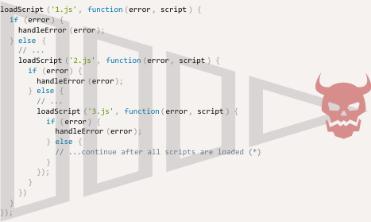

# Введение: обратные вызовы (колбэки)

Многие действия в JavaScript *асинхронные*.

Например, рассмотрим функцию `loadScript(src)`:

```js
function loadScript(src) {
  let script = document.createElement('script');
  script.src = src;
  document.head.append(script);
}
```

Эта функция загружает на страницу новый скрипт. Когда в тело документа добавится конструкция `<script src="…">`, браузер загрузит скрипт и выполнит его.

Вот пример использования этой функции:

```js
// загрузит и выполнит скрипт
loadScript('/my/script.js');
```

Такие функции называют «асинхронными», потому что действие (загрузка скрипта) будет выполнено не сейчас, а потом.

Вызов функции инициирует загрузку скрипта, после исполнение кода продолжается. Пока скрипт загружается, код, описанный ниже, может выполниться до конца. А если загрузка занимает много времени, могут быть запущены и другие скрипты.

```js
loadScript('/my/script.js');
// код, описанный после вызова функции loadScript, не будет дожидаться полной загрузки скрипта
// ...
```

Теперь давайте представим, что мы хотим использовать новый скрипт, как только он будет загружен. Скажем, он объявляет новую функцию, которую мы хотим выполнить.

Но если мы просто вызовем эту функцию после `loadScript(…)`, у нас ничего не выйдет:

```js
loadScript('/my/script.js'); // содержимое файла "function newFunction() {…}"

*!*
newFunction(); // такой функции не существует!
*/!*
```

Действительно, ведь у браузера не было времени загрузить скрипт. Поэтому не получилось немедленно вызвать новую функцию. Сейчас функция `loadScript` никак не позволяет отследить момент загрузки. Скрипт загружается, а потом выполняется. Но нам нужно точно знать, когда это произойдет, чтобы использовать функции и переменные из этого скрипта.

Давайте передадим функцию `callback` вторым аргументом в `loadScript`, чтобы вызвать ее, когда скрипт загрузится:

```js
function loadScript(src, *!*callback*/!*) {
  let script = document.createElement('script');
  script.src = src;

*!*
  script.onload = () => callback(script);
*/!*

  document.head.append(script);
}
```

Теперь, если мы хотим вызвать функцию из скрипта, нужно делать это в функции обратного вызова (колбэке):

```js
loadScript('/my/script.js', function() {
  // эта функция вызовется после того, когда загрузится скрипт
  newFunction(); // теперь всё работает
  ...
});
```

Смысл такой: вторым аргументом передается функция (обычно анонимная), которая выполняется по завершению действия.

Возьмем пример из реальной жизни:

```js run
function loadScript(src, callback) {
  let script = document.createElement('script');
  script.src = src;
  script.onload = () => callback(script);
  document.head.append(script);
}

*!*
loadScript('https://cdnjs.cloudflare.com/ajax/libs/lodash.js/3.2.0/lodash.js', script => {
  alert(`Круто, скрипт ${script.src} загрузился`);
  alert( _ ); // функция, объявленная в загруженном скрипте
});
*/!*
```

Такое написание называют асинхронным программированием с использованием колбэков. В функции, которые выполняют какие-либо асинхронные операции, передается аргумент `callback` — функция, которая будет вызвана по завершению асинхронного действия.

Мы поступили похожим образом в `loadScript`, но это, конечно, распространенный подход.

## Колбэк в колбэке

Как нам загрузить два скрипта один за другим: сначала первый, а за ним второй?

Первое, что приходит в голову, вызвать `loadScript` еще раз уже внутри колбэка, вот так:

```js
loadScript('/my/script.js', function(script) {

  alert(`Круто, скрипт ${script.src} загрузился, загрузим еще один`);

*!*
  loadScript('/my/script2.js', function(script) {
    alert(`Круто, второй скрипт загрузился`);
  });
*/!*

});
```

Когда внешняя функция `loadScript` выполнится, вызовется та, что внутри колбэка.

А что если нам нужно загрузить еще один скрипт?..

```js
loadScript('/my/script.js', function(script) {

  loadScript('/my/script2.js', function(script) {

*!*
    loadScript('/my/script3.js', function(script) {
      // ...и так далее, пока все скрипты не будут загружены
    });
*/!*

  })

});
```

Каждое новое действие мы вынуждены вызывать внутри колбэка. Этот вариант подойдет, когда у нас одно-два действия, но для большего количества это уже не вариант. Что делать в этом случае, мы рассмотрим чуть позже.

## Перехват ошибок

В примерах выше мы не думали об ошибках. А что если наш скрипт не загрузится? Мы должны обработать эту ситуацию в колбэке.

Ниже улучшенная версия `loadScript`, которая умеет отслеживать ошибки загрузки:

```js run
function loadScript(src, callback) {
  let script = document.createElement('script');
  script.src = src;

*!*
  script.onload = () => callback(null, script);
  script.onerror = () => callback(new Error(`Не удалось загрузить скрипт ${src}`));
*/!*

  document.head.append(script);
}
```

Мы вызываем `callback(null, script)` в случае успешной загрузки и `callback(error)`, если загрузить скрипт не удалось.

Живой пример:
```js
loadScript('/my/script.js', function(error, script) {
  if (error) {
    // обрабатываем ошибку
  } else {
    // скрипт успешно загружен
  }
});
```

Опять же, подход, который мы использовали в `loadScript`, также распространен и называется «колбэк, где первый аргумент — ошибка».

Правила таковы:
1. Первый аргумент функции `callback` зарезервирован для ошибки. В этом случае вызов выглядит вот так: `callback(err)`.
2. Второй и последующие аргументы для результата выполнения. В этом случае вызов выглядит вот так: `callback(null, result1, result2…)`.

Одна и та же функция `callback` используется и для информирования об ошибке, и для передачи результатов.

## Адская пирамида вызовов

На первый взгляд это рабочий способ написания асинхронного кода. Так и есть. Для одного или двух вложенных вызовов всё выглядит нормально.

Но для нескольких асинхронных действий, которые нужно выполнить друг за другом, код выглядит вот так:

```js
loadScript('1.js', function(error, script) {

  if (error) {
    handleError(error);
  } else {
    // ...
    loadScript('2.js', function(error, script) {
      if (error) {
        handleError(error);
      } else {
        // ...
        loadScript('3.js', function(error, script) {
          if (error) {
            handleError(error);
          } else {
  *!*
            // ...и так далее, пока все скрипты не будут загружены (*)
  */!*
          }
        });

      }
    })
  }
});
```

В примере выше:
1. Мы загружаем `1.js`. Продолжаем, если нет ошибок.
2. Мы загружаем `2.js`. Продолжаем, если нет ошибок.
3. Мы загружаем `3.js`. Продолжаем, если нет ошибок. И так далее `(*)`.

Чем больше вложенных вызовов, тем наш код будет иметь всё большую вложенность, которую сложно поддерживать, особенно если вместо `...` у нас код, содержащий другие цепочки вызовов, условия и т.п. вещи.

Иногда это называют «адом обратных вызовов» или «адской пирамидой вызовов».



Пирамида вложенных вызовов растет вправо с каждым асинхронным действием. В итоге вы сами будете путаться, где что есть.

Такой подход к написанию кода не приветствуется.

Мы можем попытаться решить эту проблему, изолируя каждое действие в отдельную функцию, вот так:

```js
loadScript('1.js', step1);

function step1(error, script) {
  if (error) {
    handleError(error);
  } else {
    // ...
    loadScript('2.js', step2);
  }
}

function step2(error, script) {
  if (error) {
    handleError(error);
  } else {
    // ...
    loadScript('3.js', step3);
  }
}

function step3(error, script) {
  if (error) {
    handleError(error);
  } else {
    // ...и так далее, пока все скрипты не будут загружены (*)
  }
};
```

Заметили? Этот код делает всё то же самое, но вложенность отсутствует, потому что все действия вынесены в отдельные функции.

Код абсолютно рабочий, но кажется разованным на куски. Его трудно читать, вы наверняка заметили это. Приходится прыгать глазами между кусками кода, когда пытаешься его прочесть. Это неудобно, особенно, если читатель не знаком с кодом и не знает, что за чем следует.

Кроме того, все функции `step*` одноразовые, и созданы лишь с той целью, чтобы избавиться от «адской пирамиды вызовов». Никто не будет их переиспользовать где-либо еще. Таким образом мы, кроме прочего, засоряем пространство имен.

Нужно найти способ получше.

К счастью, такие способы существуют. Один из лучших — использовать промисы, о которых рассказано в следующей главе.
