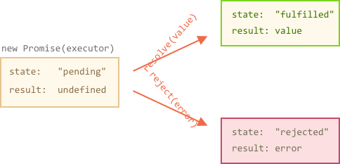
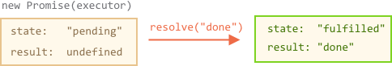
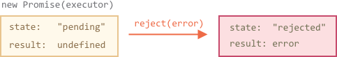

# Promise

Представьте, что вы известный певец, которого фанаты постоянно донимают расспросами о предстоящем сингле.

Чтобы получить передышку, вы обещаете разослать им сингл, когда он будет выпущен. Вы даете фанатам список, в который они могут записаться, чтобы получать новости. Они могут оставить свой e-mail, чтобы когда песня выйдет сразу получить её. И даже больше, если, например, вы передумаете выпускать песню, они также получат уведомление об этом.

Все счастливы! Вы счастливы, потому что вас больше не донимают фанаты, а фанаты - могут больше не беспокоится, что пропустят новый сингл.

Это аналогия из реальной жизни для ситуаций, с которыми мы часто сталкиваемся в программировании:

1. "Певец" - это "создающий" код, который делает что-то, что занимает время. Например, скачивает новый скрипт.
2. "Фанаты" - это "потребляющий" код, который хочет получить результат "создающего" кода, когда он будет готов. Этот результат может быть необходим большому количеству функций.
3. *Promise* (обещание) - это специальный объект в JavaScript, который связывает "создающий" и "потребляющий" коды вместе. В терминах нашей аналогии - это "список подписок". "Создающий" код может выполнятся любое необходимое ему время, чтобы получить обещанный результат, а *промис* делает результат доступным для всего кода, который подписан на него, когда результат готов.

Аналогия не совсем точна, потому что объект Promise в JavaScript гораздо сложнее простого списка подписок: он обладает дополнительными возможностями и ограничениями. Но для начала и она хороша.

Синтаксис создания `Promise`:

```js
let promise = new Promise(function(resolve, reject) {
  // исполнитель ("создающий код", "певец")
});
```

Функция, переданная в конструкцию `new Promise` называется *исполнитель*. Когда `Promise` создан, функция-исполнитель запускается автоматически. Она содержит "создающий" код, который когда-нибудь создаст результат. В терминах нашей аналогии: *исполнитель* - это "певец".

Объект `Promise`, полученный в результате выполнения конструктора, имеет внутренние свойства:

- `state` ("состояние") — вначале `pending` ("ожидание"), потом может измениться на `fulfilled` ("выполнено успешно") или `rejected` ("выполнено с ошибкой"),
- `result` ("результат") — имеет произвольное значение, по вашему выбору, изначально `undefined`.

Когда функция-исполнитель завершает своё выполнение, она должна вызвать одну из функций, полученных в качестве аргументов:

- `resolve(value)` — сообщает, что работа выполнена успешно:
    - устанавливает в `state` значение `"fulfilled"`,
    - устанавливает в  `result` значение `value`.
- `reject(error)` — сообщает, что произошла ошибка:
    - устанавливает в `state` значение `"rejected"`,
    - устанавливает в `result` значение `error`.



Позже мы рассмотрим, как "фанаты" узнают об этих изменениях.

Ниже пример конструктора `Promise` и простого исполнителя с "создающим" кодом (`setTimeout`):

```js run
let promise = new Promise(function(resolve, reject) {
  // функция выполнится автоматически, когда Promise будет создан

  // через 1 секунду появится сигнал, что задача выполнена с результатом "done"
  setTimeout(() => *!*resolve("done")*/!*, 1000);
});
```

Мы можем наблюдать две вещи, запустив код выше:

1. Исполнитель будет вызван автоматически без задержек (с помощью `new Promise`).
2. Исполнитель получает два аргумента: `resolve` и `reject` — это функции встроенные в JavaScript, поэтому нам не нужно их писать. Вместо этого мы должны написать функцию-исполнитель, которая вызовет одну из них по готовности.

Спустя одну секунду "обработки" исполнитель вызовет `resolve("done")`, чтобы передать результат:



Это был пример успешно выполненной задачи, "выполненный успешно" `Promise`.

А теперь пример, в котором исполнитель сообщит, что задача выполнена с ошибкой:

```js
let promise = new Promise(function(resolve, reject) {
  // спустя одну секунду будет сообщено, что задача выполнена с ошибкой
  setTimeout(() => *!*reject(new Error("Whoops!"))*/!*, 1000);
});
```



Подведём промежуточные итоги: исполнитель выполняет задачу (что-то, что обычно требует времени), затем вызывает `resolve` или `reject`, чтобы изменить состояние соответствующего `Promise`.

`Promise` - и успешный, и отклонённый называется "установленным", в отличие от `Promise` "в ожидании".

````smart header="Может быть что-то одно, либо результат, либо ошибка"
Исполнитель должен вызвать что-то одно: `resolve` или `reject`. Состояние промиса может быть изменено только один раз.

Все последующие вызовы `resolve` и `reject` будут проигнорированы:

```js
let promise = new Promise(function(resolve, reject) {
  resolve("done");

  reject(new Error("…")); // игнорируется
  setTimeout(() => resolve("…")); // игнорируется
});
```

Идея в том, что задача выполняемая исполнителем может иметь только один итог: результат или ошибку.

Также, `resolve`/`reject` ожидает только один аргумент (или ни одного), а все дополнительные аргументы будут проигнорированы.
````

```smart header="`Reject` с объектом `Error`"
На случай, когда что-то пойдёт неправильно, `reject` может быть вызван аргументом любого типа (как и `resolve`). Но рекомендуется использовать объект `Error` (или унаследованный от него). "Почему так?" Скоро нам станет понятно.
```

````smart header="Вызов `resolve`/`reject` сразу"
Обычно, исполнитель делает что-то асинхронное и после этого вызывает `resolve`/`reject` через какое-то время, но это не обязательно. `resolve` или `reject` могут быть вызваны сразу:

```js
let promise = new Promise(function(resolve, reject) {
  // задача, не требующая времени
  resolve(123); // мгновенно выдаст результат: 123
});
```

Это может случится, когда задача началась, но в процессе её выполнения стало понятно, что всё уже выполнено.

Всё в порядке, мы сразу получим успешно завершенный `Promise`, в этом нет чего-то неправильного.
````

```smart header="Свойства `state` и `result` - внутренние"
Свойства `state` и `result` - это внутренние свойства объекта `Promise` и мы не имеем к ним прямого доступа из "потребляющего" кода. Для обработки результата следует использовать методы `.then`/`.catch`/`.finally`, про них речь пойдет дальше.
```

## Потребители: then, catch, finally

Объект `Promise` служит связующем звеном между исполнителем ("создающим" кодом или "певцом") и функциями-потребителями ("фанатами"), которые получат, либо результат, либо ошибку. Функции-потребители могут быть зарегистрированы (подписаны) с помощью методов `.then`, `.catch` и `.finally`.

### Метод then (после)

Наиболее важный и фундаментальный метод - `.then`.

Синтаксис:

```js
promise.then(
  function(result) { *!*/* обработает успешное выполнение исполнителя */*/!* },
  function(error) { *!*/* обработает ошибку */*/!* }
);
```

Первый аргумент метода `.then` - функция, которая:

1. выполняется, когда `Promise` переходит в состояние `fulfilled`, и
2. получает результат.

Второй аргумент `.then`  - функция, которая:

1. выполняется, когда `Promise` переходит в состояние `rejected`, и
2. получает ошибку.

Например, ниже реакции на успешно выполненный промис:

```js run
let promise = new Promise(function(resolve, reject) {
  setTimeout(() => resolve("done!"), 1000);
});

// resolve запустит первую функцию, переданную в .then
promise.then(
*!*
  result => alert(result), // выведет "done!" через одну секунду
*/!*
  error => alert(error) // не будет запущена
);
```

Выполнилась первая функция.

А в случае `rejected` -- выполнится вторая:

```js run
let promise = new Promise(function(resolve, reject) {
  setTimeout(() => reject(new Error("Whoops!")), 1000);
});

// reject запустит вторую функцию, переданную в .then
promise.then(
  result => alert(result), // не будет запущена
*!*
  error => alert(error) // выведет "Error: Whoops!" спустя одну секунду
*/!*
);
```

Если нам важен только результат успешного выполнения задачи, тогда в `then` можно передать только одну функцию:

```js run
let promise = new Promise(resolve => {
  setTimeout(() => resolve("done!"), 1000);
});

*!*
promise.then(alert); // выведет "done!" спустя одну секунду
*/!*
```

### Метод catch (поймать)

Если нам важно обработать только ошибку, тогда мы можем использовать `null` в качестве первого аргумента: `.then(null, errorHandlingFunction)`. Или можно воспользоваться методом `.catch(errorHandlingFunction)`, который сделает тоже самое:

```js run
let promise = new Promise((resolve, reject) => {
  setTimeout(() => reject(new Error("Whoops!")), 1000);
});

*!*
// .catch(f) это тоже самое promise.then(null, f)
promise.catch(alert); // выведет "Error: Whoops!" спустя одну секунду
*/!*
```

Вызов `.catch(f)` - это сокращенный вариант `.then(null, f)`, внутри они полностью одинаковые.

### Метод finally (в конце)

По аналогии с блоком `finally` из обычного `try {...} catch {...}`, в `promise`, также есть метод `finally`.

Вызов `.finally(f)` это тоже самое, что передать в `.then(f, f)`, в том смысле, что "потребляющий" код выполниться в любом случае, когда промис станет решённым: успешно или с ошибкой.

`finally` хорошо подходит для очистки, например остановки индикаторов загрузки, поскольку они будут не нужны в независимости от результата.

Например:

```js
new Promise((resolve, reject) => {
  /* сделать что-то, что займет время, и после вызвать resolve/reject */
})
*!*
  // выполнится, когда `promise` завершиться, независимо от того, успешно или нет
  .finally(() => stop loading indicator)
*/!*
  .then(result => show result, err => show error)
```

Это не совсем псевдоним, как можно было подумать. Существует несколько важных отличий:

1. Обработчик, вызываемый из `finally` не имеет аргументов. В `finally` мы не знаем, как  был завершён `Promise`. И это нормально, потому что обычно, наша задача - выполнить "основные" завершающие процедуры.
2. `Finally` пропустит результат или ошибку к следующим обработчикам.

    Например, здесь результат проходит через `finally` к `then`:
    ```js run
    new Promise((resolve, reject) => {
      setTimeout(() => resolve("result"), 2000)
    })
      .finally(() => alert("Promise ready"))
      .then(result => alert(result)); // <-- .then обработает результат
    ```

    А здесь, ошибка из `promise`, пройдет через `finally` к `catch`:

    ```js run
    new Promise((resolve, reject) => {
      throw new Error("error");
    })
      .finally(() => alert("Promise ready"))
      .catch(err => alert(err));  // <-- .catch обработает объект ошибки
    ```  

    Это очень удобно, потому что `finaly` не предназначен для обработки результата `Promise`. Он просто пропускает их через себя.

    Мы поговорим о создании цепочек промисов и передаче результатов между обработчиками в следующей главе.

3. Последнее, но не менее значимое, у метода `.finally(f)` более удобный синтаксис, чем у`.then(f, f)`: не надо дублировать функции.

````smart header="На завершенных промисах обработчики запускаются сразу"
Если промис в состоянии ожидания, обработчики в `.then/catch/finally` будут ждать его окончания. Однако, если `promise` уже решён, тогда обработчики выполнятся сразу:

```js run
// мгновенный перевод `promise` в состояние решён
let promise = new Promise(resolve => resolve("done!"));

promise.then(alert); // done! (выведется сразу)
```
Хорошо то, что обработчик `.then` гарантированно будет запущен независимо от того, был ли `Promise` выполнен мгновенно, или находится в состоянии ожидания.
````

Теперь, рассмотрим несколько практических примеров того, как `Promise` может облегчить нам написание асинхронного кода.

## Пример: loadScript

У нас есть функция `loadScript` для загрузки скрипта из предыдущей главы.

Давайте вспомним, как выглядел вариант с колбэками:

```js
function loadScript(src, callback) {
  let script = document.createElement('script');
  script.src = src;

  script.onload = () => callback(null, script);
  script.onerror = () => callback(new Error(`Script load error for ${src}`));

  document.head.append(script);
}
```

Теперь перепишем её используя `Promise`.

Новой функции `loadScript` будет не нужен аргумент callback. Вместо этого она будет создавать и возвращать объект `Promise`, который будет переходить в состояние решён, когда загрузка закончится. Внешний код может добавлять обработчики (функции-подписчиков) используя для этого метод `.then`:

```js run
function loadScript(src) {  
  return new Promise(function(resolve, reject) {
    let script = document.createElement('script');
    script.src = src;

    script.onload = () => resolve(script);
    script.onerror = () => reject(new Error(`Script load error for ${src}`));

    document.head.append(script);
  });
}
```

Применение:

```js run
let promise = loadScript("https://cdnjs.cloudflare.com/ajax/libs/lodash.js/4.17.11/lodash.js");

promise.then(
  script => alert(`${script.src} is loaded!`),
  error => alert(`Error: ${error.message}`)
);

promise.then(script => alert('One more handler to do something else!'));
```

Сразу заметно несколько преимуществ над подходом с использованием колбэков:


| Promises | Callbacks |
|----------|-----------|
| Промисы позволяют делать вещи в естественном порядке. Сперва мы запускаем `loadScript(script)`, и затем (`.then`) мы пишем, что делать с результатом. | У нас должна быть функция`callback` на момент вызова `loadScript(script, callback)`. Другими словами, нам нужно знать что делать с результатом, *до того*, как вызвать `loadScript`. |
| Мы можем вызывать `.then` у `Promise` столько раз, сколько захотим. Каждый раз, мы добавляем нового "фаната", новую функцию-подписчика, в "список подписок". Больше об этом в следующей главе: [](info:promise-chaining). | Колбэк может быть только один. |

Таким образом, промисы позволяют улучшить порядок кода и дают нам гибкость. Но это ещё не всё. Мы увидим это в следующих главах.
