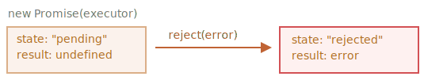

# Промисы

Представьте, что вы известный певец, которого фанаты постоянно донимают распросами о предстоящем сингле.

<<<<<<< HEAD
Чтобы получить передышку, вы обещаете разослать им сингл, когда он будет выпущен. Вы даете фанатам список, в который они могут записаться. Они могут оставить там свой e-mail, чтобы получить песню, как только она выйдет. И даже больше: если что-то пойдёт не так, например, в студии будет пожар и песню выпустить не выйдет, они также получат уведомление об этом.
=======
To get some relief, you promise to send it to them when it's published. You give your fans a list. They can fill in their email addresses, so that when the song becomes available, all subscribed parties instantly receive it. And even if something goes very wrong, say, fire in the studio, so that you can't publish the song, they will still be notified.
>>>>>>> 5cb9760abb8499bf1e99042d866c3c1db8cd61ca

Все счастливы! Вы счастливы, потому что вас больше не донимают фанаты, а фанаты могут больше не беспокоится, что пропустят новый сингл.

Это аналогия из реальной жизни для ситуаций, с которыми мы часто сталкиваемся в программировании:

1. Есть "создающий" код, который делает что-то, что занимает время. Например, загружает данные по сети. В нашей аналогии это - "певец".
2. Есть "потребляющий" код, который хочет получить результат "создающего" кода, когда он будет готов. Он может быть необходим более чем одной функции. Это - "фанаты".
3. `Promise` (по англ. `promise`, будем называть такой объект "промис") - это специальный объект в JavaScript, который связывает "создающий" и "потребляющий" коды вместе. В терминах нашей аналогии - это "список для подписки". "Создающий" код может выполняться сколько потребуется, чтобы получить результат, а *промис* делает результат доступным для кода, который подписан на него, когда результат готов.

Аналогия не совсем точна, потому что объект `Promise` в JavaScript гораздо сложнее простого списка подписок: он обладает дополнительными возможностями и ограничениями. Но для начала и такая аналогия хороша.

Синтаксис создания `Promise`:

```js
let promise = new Promise(function(resolve, reject) {
  // функция-исполнитель (executor)
  // "певец"
});
```

<<<<<<< HEAD
Функция, переданная в конструкцию `new Promise`, называется *исполнитель* (executor). Когда `Promise` создаётся, она запускается автоматически. Она должна содержать "создающий" код, который когда-нибудь создаст результат. В терминах нашей аналогии: *исполнитель* - это "певец".

Её аргументы `resolve` и `reject` - это колбэки, которые предоставляет сам JavaScript. Наш код - только внутри исполнителя.

Когда он получает результат, сейчас или позже - не важно, он должен вызвать один из этих колбэков:

- `resolve(value)` — если работа завершилась успешно, с результатом `value`.
- `reject(error)` — если произошла ошибка, `error` - объект ошибки.

Итак, исполнитель запускается автоматически, он должен выполнить работу, а затем вызвать `resolve` или `reject`.

У объекта `promise`, возвращаемого конструктором `new Promise`, есть внутренние свойства:

- `state` ("состояние") — вначале `"pending"` ("ожидание"), потом меняется на  `"fulfilled"` ("выполнено успешно") при вызове `resolve` или на `"rejected"` ("выполнено с ошибкой") при вызове `reject`.
- `result` ("результат") — вначале `undefined`, далее изменяется на `value` при вызове `resolve(value)` или на `error` при вызове `reject(error)`.

Так что исполнитель по итогу переводит `promise` одно из двух состояний:


Позже мы рассмотрим, как "фанаты" узнают об этих изменениях.

Ниже пример конструктора `Promise` и простого исполнителя с кодом, дающим результат с задержкой (через `setTimeout`):
=======
The function passed to `new Promise` is called the *executor*. When the promise is created, it runs automatically. It contains the producing code, that should eventually produce a result. In terms of the analogy above: the executor is the "singer".

Its arguments `resolve` and `reject` are callbacks provided by JavaScript itself. Our code is only inside executor.

When the executor obtains the result, be it soon or late - doesn't matter, it should call one of these callbacks:

- `resolve(value)` — if the job finished successfully, with result `value`.
- `reject(error)` — if an error occurred, `error` is the error object.

So to summarize: the executor runs automatically, it should do a job and then call either `resolve` or `reject`.

The `promise` object returned by `new Promise` constructor has internal properties:

- `state` — initially `"pending"`, then changes to either `"fulfilled"` when `resolve` is called or `"rejected"` when `reject` is called.
- `result` — initially `undefined`, then changes to `value` when `resolve(value)` called or `error` when `reject(error)` is called.

So the executor moves `promise` to one of these states:


Later we'll see how "fans" can subscribe to these changes.

Here's an example of a Promise constructor and a simple executor function with delayed "producing code" (via `setTimeout`):
>>>>>>> 5cb9760abb8499bf1e99042d866c3c1db8cd61ca

```js run
let promise = new Promise(function(resolve, reject) {
  // эта функция выполнится автоматически, при вызове new Promise

  // через 1 секунду сигнализировать, что задача выполнена с результатом "done"
  setTimeout(() => *!*resolve("done")*/!*, 1000);
});
```

Мы можем наблюдать две вещи, запустив код выше:

1. Функция-исполнитель запускается сразу же при вызове `new Promise`.
2. Исполнитель получает два аргумента: `resolve` и `reject` — это функции, встроенные в JavaScript, поэтому нам не нужно их писать. Нам нужно лишь позаботиться, чтобы исполнитель вызвал одну из них по готовности.

Спустя одну секунду "обработки" исполнитель вызовет `resolve("done")`, чтобы передать результат:


Это был пример успешно выполненной задачи, в результате мы получили "успешно выполненный" промис.

А теперь пример, в котором исполнитель сообщит, что задача выполнена с ошибкой:

```js
let promise = new Promise(function(resolve, reject) {
  // спустя одну секунду будет сообщено, что задача выполнена с ошибкой
  setTimeout(() => *!*reject(new Error("Whoops!"))*/!*, 1000);
});
```



Подведём промежуточные итоги: исполнитель выполняет задачу (что-то, что обычно требует времени), затем вызывает `resolve` или `reject`, чтобы изменить состояние соответствующего `Promise`.

Промис - и успешный, и отклонённый будем называть "завершённым", в отличие изначального промиса "в ожидании".

````smart header="Может быть что-то одно: либо результат, либо ошибка"
Исполнитель должен вызвать что-то одно: `resolve` или `reject`. Состояние промиса может быть изменено только один раз.

Все последующие вызовы `resolve` и `reject` будут проигнорированы:

```js
let promise = new Promise(function(resolve, reject) {
*!*
  resolve("done");
*/!*

  reject(new Error("…")); // игнорируется
  setTimeout(() => resolve("…")); // игнорируется
});
```

Идея в том, что задача, выполняемая исполнителем, может иметь только один итог: результат или ошибку.

Также заметим, что функция `resolve`/`reject` ожидает только один аргумент (или ни одного). Все дополнительные аргументы будут проигнорированы.
````

<<<<<<< HEAD
```smart header="Вызывайте `reject` с объектом `Error`"
В случае, если что-то пошло не так, мы должны вызвать `reject`. Это можно сделать с аргументом любого типа (как и `resolve`), но рекомендуется использовать объект `Error` (или унаследованный от него). Почему так? Скоро нам станет понятно.
=======
```smart header="Reject with `Error` objects"
In case something goes wrong, we must call `reject`. That can be done with any type of argument (just like `resolve`). But it is recommended to use `Error` objects (or objects that inherit from `Error`). The reasoning for that will soon become apparent.
>>>>>>> 5cb9760abb8499bf1e99042d866c3c1db8cd61ca
```

````smart header="Вызов `resolve`/`reject` сразу"
Обычно исполнитель делает что-то асинхронное и после этого вызывает `resolve`/`reject`, то есть через какое-то время. Но это не обязательно, `resolve` или `reject` могут быть вызваны сразу:

```js
let promise = new Promise(function(resolve, reject) {
  // задача, не требующая времени
  resolve(123); // мгновенно выдаст результат: 123
});
```

<<<<<<< HEAD
Это может случиться, например, когда мы начали выполнять какую-то задачу, но тут же увидели, что ранее ее уже выполняли, и результат закеширован.
=======
For instance, this might happen when we start to do a job but then see that everything has already been completed and cached.
>>>>>>> 5cb9760abb8499bf1e99042d866c3c1db8cd61ca

Такая ситуация нормальна. Мы сразу получим успешно завершенный `Promise`.
````

<<<<<<< HEAD
```smart header="Свойства `state` и `result` - внутренние"
Свойства `state` и `result` - это внутренние свойства объекта `Promise` и мы не имеем к ним прямого доступа. Для обработки результата следует использовать методы `.then`/`.catch`/`.finally`, про них речь пойдет дальше.
=======
```smart header="The `state` and `result` are internal"
The properties `state` and `result` of the Promise object are internal. We can't directly access them. We can use the methods `.then`/`.catch`/`.finally` for that. They are described below.
>>>>>>> 5cb9760abb8499bf1e99042d866c3c1db8cd61ca
```

## Потребители: then, catch, finally

Объект `Promise` служит связующим звеном между исполнителем ("создающим" кодом или "певцом") и функциями-потребителями ("фанатами"), которые получат либо результат, либо ошибку. Функции-потребители могут быть зарегистрированы (подписаны) с помощью методов `.then`, `.catch` и `.finally`.

### then

Наиболее важный и фундаментальный метод - `.then`.

Синтаксис:

```js
promise.then(
  function(result) { *!*/* обработает успешное выполнение */*/!* },
  function(error) { *!*/* обработает ошибку */*/!* }
);
```

<<<<<<< HEAD
Первый аргумент метода `.then` - функция, которая выполняется, когда промис переходит в состояние "выполнен успешно", и получает результат.

Второй аргумент `.then`  - функция, которая выполняется, когда промис переходит в состояние "выполнен с ошибкой", и получает ошибку.

Например, вот реакция на успешно выполненный промис:
=======
The first argument of `.then` is a function that runs when the promise is resolved, and receives the result.

The second argument of `.then` is a function that runs when the promise is rejected, and receives the error.

For instance, here's a reaction to a successfully resolved promise:
>>>>>>> 5cb9760abb8499bf1e99042d866c3c1db8cd61ca

```js run
let promise = new Promise(function(resolve, reject) {
  setTimeout(() => resolve("done!"), 1000);
});

// resolve запустит первую функцию, переданную в .then
promise.then(
*!*
  result => alert(result), // выведет "done!" через одну секунду
*/!*
  error => alert(error) // не будет запущена
);
```

Выполнилась первая функция.

А в случае ошибки в промисе -- выполнится вторая:

```js run
let promise = new Promise(function(resolve, reject) {
  setTimeout(() => reject(new Error("Whoops!")), 1000);
});

// reject запустит вторую функцию, переданную в .then
promise.then(
  result => alert(result), // не будет запущена
*!*
  error => alert(error) // выведет "Error: Whoops!" спустя одну секунду
*/!*
);
```

Если мы заинтересованы только в результате успешного выполнения задачи, то в `then` можно передать только одну функцию:

```js run
let promise = new Promise(resolve => {
  setTimeout(() => resolve("done!"), 1000);
});

*!*
promise.then(alert); // выведет "done!" спустя одну секунду
*/!*
```

### catch

Если мы хотели бы только обработать ошибку, то можно использовать `null` в качестве первого аргумента: `.then(null, errorHandlingFunction)`. Или можно воспользоваться методом `.catch(errorHandlingFunction)`, который сделает тоже самое:

```js run
let promise = new Promise((resolve, reject) => {
  setTimeout(() => reject(new Error("Ошибка!")), 1000);
});

*!*
// .catch(f) это тоже самое promise.then(null, f)
promise.catch(alert); // выведет "Error: Ошибка!" спустя одну секунду
*/!*
```

Вызов `.catch(f)` - это сокращенный, "укороченный" вариант  `.then(null, f)`.

### finally

По аналогии с блоком `finally` из обычного `try {...} catch {...}`, у промисов также есть метод `finally`.

<<<<<<< HEAD
Вызов `.finally(f)` похож на `.then(f, f)`, в том смысле, что `f` выполнится в любом случае, когда промис завершится: успешно или с ошибкой.
=======
The call `.finally(f)` is similar to `.then(f, f)` in the sense that `f` always runs when the promise is settled: be it resolve or reject.
>>>>>>> 5cb9760abb8499bf1e99042d866c3c1db8cd61ca

`finally` хорошо подходит для очистки, например остановки индикатора загрузки, его ведь нужно остановить вне зависимости от результата.

Например:

```js
new Promise((resolve, reject) => {
  /* сделать что-то, что займет время, и после вызвать resolve/reject */
})
*!*
  // выполнится, когда промис завершится, независимо от того, успешно или нет
  .finally(() => остановить индикатор загрузки)
*/!*
  .then(result => показать результат, err => показать ошибку)
```

Но это не совсем псевдоним `then(f,f)`, как можно было подумать. Существует несколько важных отличий:

1. Обработчик, вызываемый из `finally`, не имеет аргументов. В `finally` мы не знаем, как был завершён промис. И это нормально, потому что обычно наша задача - выполнить "общие" завершающие процедуры.
2. Обработчик `finally` "пропускает" результат или ошибку дальше, к последующим обработчикам.

    Например, здесь результат проходит через `finally` к `then`:
    ```js run
    new Promise((resolve, reject) => {
      setTimeout(() => resolve("result"), 2000)
    })
      .finally(() => alert("Промис завершён"))
      .then(result => alert(result)); // <-- .then обработает результат
    ```

    А здесь ошибка из промиса проходит через `finally` к `catch`:

    ```js run
    new Promise((resolve, reject) => {
      throw new Error("error");
    })
      .finally(() => alert("Промис завершён"))
      .catch(err => alert(err));  // <-- .catch обработает объект ошибки
    ```  

    Это очень удобно, потому что `finaly` не предназначен для обработки результата промиса. Так что он просто пропускает его через себя дальше.

    Мы более подробно поговорим о создании цепочек промисов и передаче результатов между обработчиками в следующей главе.

3. Последнее, но не менее значимое: вызов `.finally(f)` удобнее, чем.`then(f, f)` - не надо дублировать функции f.

<<<<<<< HEAD
````smart header="На завершенных промисах обработчики запускаются сразу"
Если промис в состоянии ожидания, обработчики в `.then/catch/finally` будут ждать его. Однако, если промис уже завершён, то обработчики выполнятся сразу:
=======
````smart header="On settled promises handlers runs immediately"
If a promise is pending, `.then/catch/finally` handlers wait for it. Otherwise, if a promise has already settled, they execute immediately:
>>>>>>> 5cb9760abb8499bf1e99042d866c3c1db8cd61ca

```js run
// мгновенный перевод промиса в состояние "успешно завершён"
let promise = new Promise(resolve => resolve("готово!"));

promise.then(alert); // готово! (выведется сразу)
```
````

Теперь рассмотрим несколько практических примеров того, как промисы могут облегчить нам написание асинхронного кода.

## Пример: loadScript [#loadscript]

У нас есть функция `loadScript` для загрузки скрипта из предыдущей главы.

Давайте вспомним, как выглядел вариант с колбэками:

```js
function loadScript(src, callback) {
  let script = document.createElement('script');
  script.src = src;

  script.onload = () => callback(null, script);
  script.onerror = () => callback(new Error(`Ошибка загрузки скрипта ${src}`));

  document.head.append(script);
}
```

Теперь перепишем её, используя `Promise`.

Новой функции `loadScript` будет не нужен аргумент `callback`. Вместо этого она будет создавать и возвращать объект `Promise`, который будет переходить в состояние "успешно завершён", когда загрузка закончится. Внешний код может добавлять обработчики ("подписчиков"), используя `.then`:

```js run
function loadScript(src) {  
  return new Promise(function(resolve, reject) {
    let script = document.createElement('script');
    script.src = src;

    script.onload = () => resolve(script);
    script.onerror = () => reject(new Error(`Ошибка загрузки скрипта ${src}`));

    document.head.append(script);
  });
}
```

Применение:

```js run
let promise = loadScript("https://cdnjs.cloudflare.com/ajax/libs/lodash.js/4.17.11/lodash.js");

promise.then(
  script => alert(`${script.src} загружен!`),
  error => alert(`Ошибка: ${error.message}`)
);

<<<<<<< HEAD
promise.then(script => alert('Ещё один обработчик...'));
=======
promise.then(script => alert('Another handler...'));
>>>>>>> 5cb9760abb8499bf1e99042d866c3c1db8cd61ca
```

Сразу заметно несколько преимуществ перед подходом с использованием колбэков:


| Промисы | Колбэки |
|----------|-----------|
| Промисы позволяют делать вещи в естественном порядке. Сперва мы запускаем `loadScript(script)`, и затем (`.then`) мы пишем, что делать с результатом. | У нас должна быть функция`callback` на момент вызова `loadScript(script, callback)`. Другими словами, нам нужно знать что делать с результатом *до того*, как вызовется `loadScript`. |
| Мы можем вызывать `.then` у `Promise` столько раз, сколько захотим. Каждый раз мы добавляем нового "фаната", новую функцию-подписчика в "список подписок". Больше об этом в следующей главе: [](info:promise-chaining). | Колбэк может быть только один. |

<<<<<<< HEAD
Таким образом, промисы позволяют улучшить порядок кода и дают нам гибкость. Но это далеко не всё. Мы узнаем ещё много полезного в последующих главах.
=======
So promises give us better code flow and flexibility. But there's more. We'll see that in the next chapters.
>>>>>>> 5cb9760abb8499bf1e99042d866c3c1db8cd61ca
