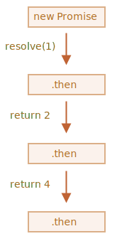

# Цепочка промисов

Давайте вернёмся к ситуации из главы <info:callbacks>: у нас есть последовательность асинхронных задач, которые должны быть выполнены одна за другой. Например, речь может идти о загрузке скриптов. Как же грамотно реализовать это в коде?

Промисы предоставляют несколько способов решения подобной задачи.

В этой главе мы разберём цепочку промисов.

Она выглядит вот так:

```js run
new Promise(function(resolve, reject) {

  setTimeout(() => resolve(1), 1000); // (*)

}).then(function(result) { // (**)

  alert(result); // 1
  return result * 2;

}).then(function(result) { // (***)

  alert(result); // 2
  return result * 2;

}).then(function(result) {

  alert(result); // 4
  return result * 2;

});
```

Идея состоит в том, что результат первого промиса передаётся по цепочке обработчиков `.then`.

Поток выполнения такой:
1. Начальный промис успешно выполняется через 1 секунду `(*)`,
2. Затем вызывается обработчик в `.then` `(**)`.
3. Возвращаемое им значение передаётся дальше в следующий обработчик `.then` `(***)`
4. ...и так далее.

В итоге результат передаётся по цепочке обработчиков, и мы видим несколько `alert` подряд, которые выводят: `1` -> `2` -> `4`.



Всё это работает, потому что вызов `promise.then` тоже возвращает промис, так что мы можем вызвать на нём следующий `.then`.

Когда обработчик возвращает какое-то значение, то оно становится результатом выполнения соответствующего промиса и передаётся в следующий `.then`.

**Классическая ошибка новичков: технически возможно добавить много обработчиков `.then` к единственному промису. Но это не цепочка.**

Например:
```js run
let promise = new Promise(function(resolve, reject) {
  setTimeout(() => resolve(1), 1000);
});

promise.then(function(result) {
  alert(result); // 1
  return result * 2;
});

promise.then(function(result) {
  alert(result); // 1
  return result * 2;
});

promise.then(function(result) {
  alert(result); // 1
  return result * 2;
});
```

Мы добавили несколько обработчиков к одному промису. Они не передают друг другу результаты своего выполнения, а действуют независимо.

Вот картина происходящего (сравните это с изображением цепочки промисов выше):


Все обработчики `.then` на одном и том же промисе получают одно и то же значение -- результат выполнения того же самого промиса. Таким образом, в коде выше все `alert` показывают одно и то же: `1`.

На практике весьма редко требуется назначать несколько обработчиков одному промису. А вот цепочка промисов используется куда чаще.

## Возвращаем промисы

Обработчик `handler`, переданный в `.then(handler)`, может вернуть промис.

В этом случае дальнейшие обработчики ожидают, пока он выполнится, и затем получают его результат.

Например:

```js run
new Promise(function(resolve, reject) {

  setTimeout(() => resolve(1), 1000);

}).then(function(result) {

  alert(result); // 1

*!*
  return new Promise((resolve, reject) => { // (*)
    setTimeout(() => resolve(result * 2), 1000);
  });
*/!*

}).then(function(result) { // (**)

  alert(result); // 2

  return new Promise((resolve, reject) => {
    setTimeout(() => resolve(result * 2), 1000);
  });

}).then(function(result) {

  alert(result); // 4

});
```

Здесь первый `.then` показывает `1` и возвращает новый промис `new Promise(…)` в строке `(*)`. Через одну секунду этот промис успешно выполняется, и его результат (аргумент в `resolve`, то есть `result * 2`) передаётся обработчику в следующем `.then`. Он находится в строке `(**)`, показывает`2` и делает то же самое.

Таким образом, как и в предыдущем примере, выводятся 1 -> 2 -> 4, но сейчас между вызовами `alert` существует пауза в 1 секунду.

Возвращая промисы, мы можем строить цепочки из асинхронных действий.

## Пример: loadScript

Давайте используем эту возможность вместе с промисифицированной функцией `loadScript`, созданной нами в [предыдущей главе](info:promise-basics#loadscript), чтобы загружать скрипты по очереди, последовательно:

```js run
loadScript("/article/promise-chaining/one.js")
  .then(function(script) {
    return loadScript("/article/promise-chaining/two.js");
  })
  .then(function(script) {
    return loadScript("/article/promise-chaining/three.js");
  })
  .then(function(script) {
    // вызовем функции, объявленные в загружаемых скриптах,
    // чтобы показать, что они действительно загрузились
    one();
    two();
    three();
  });
```

Этот же код можно переписать немного компактнее, используя стрелочные функции:

```js run
loadScript("/article/promise-chaining/one.js")
  .then(script => loadScript("/article/promise-chaining/two.js"))
  .then(script => loadScript("/article/promise-chaining/three.js"))
  .then(script => {
    // скрипты загружены, мы можем использовать объявленные в них функции
    one();
    two();
    three();
  });
```


Здесь каждый вызов `loadScript` возвращает промис, и следующий обработчик в `.then` срабатывает, только когда этот промис завершается. Затем инициируется загрузка следующего скрипта и так далее. Таким образом, скрипты загружаются один за другим.

Мы можем добавить и другие асинхронные действия в цепочку. Обратите внимание, что наш код всё ещё "плоский", он "растёт" вниз, а не вправо. Нет никаких признаков "адской пирамиды вызовов".

Технически мы бы могли добавлять `.then` напрямую к каждому вызову `loadScript`, вот так:

```js run
loadScript("/article/promise-chaining/one.js").then(script1 => {
  loadScript("/article/promise-chaining/two.js").then(script2 => {
    loadScript("/article/promise-chaining/three.js").then(script3 => {
      // эта функция имеет доступ к переменным script1, script2 и script3
      one();
      two();
      three();
    });
  });
});
```

Этот код делает то же самое: последовательно загружает 3 скрипта. Но он "растёт вправо", так что возникает такая же проблема, как и с колбэками.

Разработчики, которые не так давно начали использовать промисы, иногда не знают про цепочки и пишут код именно так, как показано выше. В целом, использование цепочек промисов предпочтительнее.

Иногда всё же приемлемо добавлять `.then` напрямую, чтобы вложенная в него функция имела доступ к внешней области видимости. В примере выше самая глубоко вложенная функция обратного вызова имеет доступ ко всем переменным `script1`, `script2`, `script3`. Но это скорее исключение, чем правило.


````smart header="Thenable"
Если быть более точными, обработчик может возвращать не именно промис, а любой объект, содержащий метод `.then`, такие объекты называют "thenable", и этот объект будет обработан как промис.

Смысл в том, что сторонние библиотеки могут создавать свои собственные совместимые с промисами объекты. Они могут иметь свои наборы методов и при этом быть совместимыми со встроенными промисами, так как реализуют метод `.then`.

Вот пример такого объекта:

```js run
class Thenable {
  constructor(num) {
    this.num = num;
  }
  then(resolve, reject) {
    alert(resolve); // function() { native code }
    // будет успешно выполнено с аргументом this.num*2 через 1 секунду
    setTimeout(() => resolve(this.num * 2), 1000); // (**)
  }
}

new Promise(resolve => resolve(1))
  .then(result => {
*!*
    return new Thenable(result); // (*)
*/!*
  })
  .then(alert); // показывает 2 через 1000мс
```

JavaScript проверяет объект, возвращаемый из обработчика `.then` в строке `(*)`: если у него имеется метод `then`, который можно вызвать, то этот метод вызывается, и в него передаются как аргументы встроенные функции `resolve` и `reject`, вызов одной из которых потом ожидается. В примере выше происходит вызов `resolve(2)` через 1 секунду `(**)`. Затем результат передаётся дальше по цепочке.

Это позволяет добавлять в цепочки промисов пользовательские объекты, не заставляя их наследовать от `Promise`.
````


## Более сложный пример: fetch

Во фронтенд-разработке промисы часто используются, чтобы делать запросы по сети. Давайте рассмотрим один такой пример.

Мы будем использовать метод [fetch](info:fetch), чтобы подгрузить информацию о пользователях с удалённого сервера. Этот метод имеет много опциональных параметров, разобранных в [соответствующих разделах](info:fetch), но базовый синтаксис весьма прост:

```js
let promise = fetch(url);
```

Этот код запрашивает по сети `url` и возвращает промис. Промис успешно выполняется и в свою очередь возвращает объект `response` после того, как удалённый сервер присылает заголовки ответа, но *до того, как весь ответ сервера полностью загружен*.

Чтобы прочитать полный ответ, надо вызвать метод `response.text()`: он тоже возвращает промис, который выполняется, когда данные полностью загружены с удалённого сервера, и возвращает эти данные.

Код ниже запрашивает файл `user.json` и загружает его содержимое с сервера:

```js run
fetch('/article/promise-chaining/user.json')
  // .then в коде ниже выполняется, когда удалённый сервер отвечает
  .then(function(response) {
    // response.text() возвращает новый промис,
    // который выполняется и возвращает полный ответ сервера,
    // когда он загрузится
    return response.text();
  })
  .then(function(text) {
    // ...и здесь содержимое полученного файла
    alert(text); // {"name": "iliakan", isAdmin: true}
  });
```

Есть также метод `response.json()`, который читает данные в формате JSON. Он больше подходит для нашего примера, так что давайте использовать его.

Мы также применим стрелочные функции для более компактной записи кода:

```js run
// то же самое, что и раньше, только теперь response.json() читает данные в формате JSON
fetch('/article/promise-chaining/user.json')
  .then(response => response.json())
  .then(user => alert(user.name)); // iliakan, получили имя пользователя
```

Теперь давайте что-нибудь сделаем с полученными данными о пользователе.

Например, мы можем послать запрос на GitHub, чтобы загрузить данные из профиля пользователя и показать его аватар:

```js run
// Запрашиваем user.json
fetch('/article/promise-chaining/user.json')
  // Загружаем данные в формате json
  .then(response => response.json())
  // Делаем запрос к GitHub
  .then(user => fetch(`https://api.github.com/users/${user.name}`))
  // Загружаем ответ в формате json
  .then(response => response.json())
  // Показываем аватар (githubUser.avatar_url) в течение 3 секунд (возможно, с анимацией)
  .then(githubUser => {
    let img = document.createElement('img');
    img.src = githubUser.avatar_url;
    img.className = "promise-avatar-example";
    document.body.append(img);

    setTimeout(() => img.remove(), 3000); // (*)
  });
```

Код работает, детали реализации отражены в комментариях. Однако в нём есть одна потенциальная проблема, с которой часто сталкиваются новички.

Посмотрите на строку `(*)`: как мы можем предпринять какие-то действия *после* того, как аватар был показан и удалён? Например, мы бы хотели показывать форму редактирования пользователя или что-то ещё. Сейчас это невозможно.

Чтобы сделать наш код расширяемым, нам нужно возвращать ещё один промис, который выполняется после того, как завершается показ аватара.

Примерно так:

```js run
fetch('/article/promise-chaining/user.json')
  .then(response => response.json())
  .then(user => fetch(`https://api.github.com/users/${user.name}`))
  .then(response => response.json())
*!*
  .then(githubUser => new Promise(function(resolve, reject) { // (*)
*/!*
    let img = document.createElement('img');
    img.src = githubUser.avatar_url;
    img.className = "promise-avatar-example";
    document.body.append(img);

    setTimeout(() => {
      img.remove();
*!*
      resolve(githubUser); // (**)
*/!*
    }, 3000);
  }))
  // срабатывает через 3 секунды
  .then(githubUser => alert(`Закончили показ ${githubUser.name}`));
```

То есть, обработчик `.then` в строке `(*)` будет возвращать `new Promise`, который перейдёт в состояние "выполнен" только после того, как в `setTimeout` `(**)` будет вызвана `resolve(githubUser)`.

Соответственно, следующий по цепочке `.then` будет ждать этого.

Как правило, все асинхронные действия должны возвращать промис.

Это позволяет планировать после него какие-то дополнительные действия. Даже если эта возможность не нужна прямо сейчас, она может понадобиться в будущем.

И, наконец, давайте разобьём написанный код на отдельные функции, пригодные для повторного использования:

```js run
function loadJson(url) {
  return fetch(url)
    .then(response => response.json());
}

function loadGithubUser(name) {
  return fetch(`https://api.github.com/users/${name}`)
    .then(response => response.json());
}

function showAvatar(githubUser) {
  return new Promise(function(resolve, reject) {
    let img = document.createElement('img');
    img.src = githubUser.avatar_url;
    img.className = "promise-avatar-example";
    document.body.append(img);

    setTimeout(() => {
      img.remove();
      resolve(githubUser);
    }, 3000);
  });
}

// Используем их:
loadJson('/article/promise-chaining/user.json')
  .then(user => loadGithubUser(user.name))
  .then(showAvatar)
  .then(githubUser => alert(`Показ аватара ${githubUser.name} завершён`));
  // ...
```

## Итого

Если обработчик в `.then` (или в `catch/finally`, без разницы) возвращает промис, последующие элементы цепочки ждут, пока этот промис выполнится. Когда это происходит, результат его выполнения (или ошибка) передаётся дальше.

Вот полная картина происходящего:


