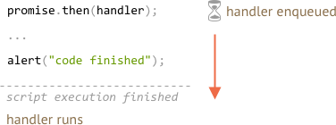
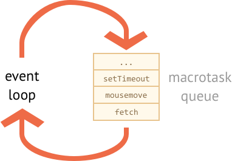

# Микрозадачи (microtasks) и цикл событий (event loop)

Обработчики промисов `.then`/`.catch`/`.finally` всегда асинхронны.

Даже когда промис сразу же выполнен, код в строках *ниже* вашего `.then`/`.catch`/`.finally` будет по-прежнему выполнен первым.

Вот код, который демонстрирует это:

```js run
let promise = Promise.resolve();

promise.then(() => alert("промис выполнен"));

alert("код выполнен"); // этот alert показывается первым
```

Если вы запустите его, сначала вы  увидите `код выполнен`, а потом `промис выполнен`.

Это странно, потому что промис определенно был выполнен с самого начала.

Почему `.then` срабатывает позже? Что происходит?

# Микрозадачи (microtasks)

Асинхронные задачи требуют правильного управления. Для этого стандарт предусматривает внутреннюю очередь `PromiseJobs`, более известную как "очередь микрозадач (microtask queue)" (термин V8).

Как сказано в [спецификации](https://tc39.github.io/ecma262/#sec-jobs-and-job-queues):

- Очередь определяется как первым-зашел-первым-вышел (FIFO): задачи, попавшие в очередь первыми, выполняются тоже первыми.
- Выполнение задачи происходит только в том случае, если ничего больше не запущено.

Или, проще говоря, когда промис выполнен, его обработчики `.then/catch/finally` попадают в очередь. Они пока не выполняются. Движок JavaScript берёт задачу из очереди и выполняет ее, когда он освободится от выполнения текущего кода.

Вот почему сообщение "код выполнен" в примере выше будет показано первым.



Обработчики промисов всегда проходят через эту внутреннюю очередь.

Если есть цепочка с несколькими `.then/catch/finally`, то каждый из них выполняется асинхронно. То есть сначала ставится в очередь, а потом выполняется, когда выполнение текущего кода завершено и добавленные ранее в очередь обработчики выполнены.

**Но что если порядок имеет значение для нас? Как мы можем вывести `код выполнен` после `промис завершен`?**

Легко, используя `.then`:

```js run
Promise.resolve()
  .then(() => alert("промис выполнен!"))
  .then(() => alert("код выполнен"));
```

Теперь порядок стал таким, как было задумано.

## Цикл событий (event loop)

Браузерный JavaScript, также как Node.js, основывается на *цикле событий (event loop)*. 

"Цикл событий" - это процесс, при котором движок спит и ждёт очереди, а потом реагирует на неё и снова засыпает.

Примеры событий:
- `mousemove`, пользователь двигает указатель мыши.
- `setTimeout`, запланированный вызов обработчика.
- внешний `<script src="...">` загружен, готов к выполнению.
- сетевая операция, например, `fetch` завершена.
- ... и т.д.

Что-то происходит -- движок это обрабатывает -- и снова ждёт наступления события (пока он находится в спящем режиме, потребление ресурсов CPU близко к нулю).



Как вы можете видеть, здесь также есть очередь. Так называемая "макроочередь задач (macrotask queue)" (термин v8).

В случае, если событие наступает, когда движок занят, его обработка добавляется в очередь. 

Например, когда движок занят обработкой сетевого запроса `fetch`, пользователь может перемещать указатель мыши, вызывая событие `mousemove`, может сработать `setTimeout` и т.д., как показано на картинке выше.

События из очереди макрособытий обрабатываются по принципу первый зашел - первый обслужен. Когда движок браузера заканчивает с выполнением `fetch`, он обрабатывает событие `mousemove`, потом вызывает обработчик `setTimeout` и т.д.

Пока всё довольно понятно, не так ли? Движок занят, соответственно другие задачи ждут в очереди.

Сейчас важный момент.

**Очередь микрозадач имеет более высокий приоритет, чем очередь макрозадач.**

Другими словами, движок сначала выполняет все микрозадачи, а потом макрозадачи. Обработка промисов всегда имеет более высокий приоритет.

Например, посмотрим на следующий код:

```js run
setTimeout(() => alert("timeout"));

Promise.resolve()
  .then(() => alert("promise"));

alert("code");
```

Каков тут порядок исполнения? 

1. `code` показывается первым, т.к. это обычный синхронный вызов.
2. `promise` отображается вторым, т.к. `.then` проходит через очередь микрозадач и запускается после текущего кода.
3. `timeout`- показывается последним, т.к. это макрозадача.

Может случиться так, что в процессе выполнения макрозадачи будет создан новый промис.

Или наоборот, в микрозадаче будет запланирована макрозадача (например `setTimeout`).

Например, здесь в `.then` запланирован `setTimeout`:

```js run
Promise.resolve()
  .then(() => {
    setTimeout(() => alert("timeout"), 0);
  })
  .then(() => {
    alert("promise");
  });
```

Естественно, `promise` отображается первым, т.к. макрозадача `setTimeout` ожидает в менее приоритетной очереди макрозадач. 

В качестве логического cледствия, макрозадачи выполняются, только когда промисы дают движку "свободное время". Так, если у нас есть цепочка промисов, не ожидающая ничего, как `setTimeout` или обработчики событий могут никогда не попасть в середину (между промисами).


## Необработанный rejection

Помните "необработанные rejection" из главы <info:promise-error-handling>?

Сейчас, с пониманием микрозадач, мы можем это формализовать.

**"Необработанный rejection" возникает в случае, если ошибка промиса не обрабатывается в конце очереди микрозадач.**

Например, рассмотрим этот код:

```js run
let promise = Promise.reject(new Error("Promise Failed!"));

window.addEventListener('unhandledrejection', event => {
  alert(event.reason); // Промис выполнен с ошибкой!
});
```

Мы создаем отклонённый (rejected) `промис` и не обрабатываем ошибку. Таким образом, мы видим событие "unhandled rejection" (также будет выведено в консоли).

Мы не получим его, если мы добавим `.catch`, например так:

```js run
let promise = Promise.reject(new Error("Promise Failed!"));
*!*
promise.catch(err => alert('поймана'));
*/!*

// ошибки нет, всё тихо
window.addEventListener('unhandledrejection', event => alert(event.reason));
```

Сейчас попробуем поймать ошибку, но после `setTimeout`:

```js run
let promise = Promise.reject(new Error("Promise Failed!"));
*!*
setTimeout(() => promise.catch(err => alert('поймана')));
*/!*

// Error: Promise Failed!
window.addEventListener('unhandledrejection', event => alert(event.reason));
```

Сейчас снова возник необработанный rejection. Почему? Потому что `unhandledrejection` срабатывает, когда очередь микрозадач выполнена. Движок проверяет промисы и, если если какой-либо из них в состоянии "rejected", то генерируется событие.

В примере `.catch`, добавленный в `setTimeout`, также срабатывает, но позже, после возникновения `unhandledrejection`.

## Итого

- Обработка промисов всегда асинхронная, т.к. все действия промисов проходят через внутреннюю очередь "promise jobs", так называемая "очередь микрозадач (microtask queue)" (термин v8).

    **Таким образом, `.then/catch/finally` вызывается после выполнения текущего кода.**

    Если нам нужно гарантировать выполнение части кода после `.then/catch/finally`, то лучше всего добавить его вызов в цепочку `.then`.

- Существует также "очередь макрозадач (macrotask queue)", которая содержит различные события, результаты сетевых операций, запланированные вызовы `setTimeout` и т.д. Они также называются "макрозадачами" (macrotasks) (термин v8).

    Движок использует очередь макрозадач для их выполнения в порядке появления.

    **Макрозадачи запускаются после выполнения кода *и* после того, как очередь микрозадач будет пуста.**

    Другими словами, они имеют более низкий приоритет.

Таким образом, порядок выполнения следующий: обычный код, потом обработка промисов, потом всё остальное (события и т.д.).
